# C++专题笔记


> **`注意：`**
>
> > 这里的内容是标准答案
>
> *(括号中的内容是答题思路)*
>
> <u>其他部分是扩展内容</u>


# C++重点题目

## 1. (高频)如何看待c++和c的关系

***考点解析***

考察宏观上对c语言和c++特性的了解，回答中要讲清楚c++和c的关系。在宏观上答完区别和联系*（展示自己知识的广度）*，后可以在具体点上进行展开*（展示自己的知识点的深度）*。


>  *(首先从宏观回答优缺点，先 1.历史发展，然后 2.和 3.一起说明)*
>
> - C++ 和 C 之间的关系可以从几个不同的角度来理解：
>
> 1. **历史发展**：C++ 最初是作为 **C 语言的一个扩展**被设计的。1979 年开始开发一种名为 "C with Classes" 的新语言，其目的是在 C 语言的基础上增**加对面向对象编程的支持。**随后，这种语言发展成为今天我们所知的 C++。因此，C++ 在很大程度上是基于 C 语言，并保留了 C 语言的许多特性。如：区块，语句，预处理器，内置数据类型，数组，指针等特性都是来自于C。
>
> 2. **语法和兼容性**：C++ 保留了 C 语言的大部分语法，并增加了**类、异常处理、重载运算符和模板等特性**。C++ 是向后兼容 C 语言的，这意味着大多数合法的 C 程序也是合法的 C++ 程序，尽管有一些例外。
> 3. **设计哲学**：虽然 C++ 保留了 C 的许多特性，但它引入了**面向对象编程**和**泛型编程**的概念，这是 C 所没有的。**C++ 提供了更多的抽象层次，允许开发者以更加模块化和可重用的方式来构建复杂的系统**。
> 4. **使用场景**：**C 语言通常用于系统编程、嵌入式系统和其他需要直接硬件访问的领域**。而 C++，凭借其面向对象的特性，**更适合用于需要高级抽象的大型软件项目，如桌面应用程序、游戏开发和复杂的计算系统。**
> 5. **性能和效率**：C 和 C++ 都是高效率的语言，它们提供了对底层资源的直接控制。但由于 C++ 提供了更多的特性和抽象，它的编译器可能更加复杂，有时可能会对性能产生轻微的影响。
>
> 总的来说，C++ 是在 C 的基础上发展起来的一种更为复杂和强大的语言，它扩展了 C 的功能，同时保留了与 C 的兼容性。尽管两者有很多共同点，但 C++ 提供了更多的编程范式和特性，使得它更适合于大型和复杂的软件项目。


<u>对 2. 语法兼容性的进一步阐述</u>

C++ 保留了 C 语言的语法并且通常是向后兼容的，这意味着大多数合法的 C 代码都可以在 C++ 环境中编译和运行。这包括像 OpenGL 这样的库，它们的接口通常是用 C 语言编写的，但可以无缝地在 C++ 项目中使用。

在 OpenGL 的情况下，当您使用像 `glad.c` 这样的扩展加载库时，尽管它是用 C 语言编写的，但它也可以**被 C++ 编译器正常编译和链接**。这是因为 C++ 具有处理 C 语言代码的能力，特别是当它涉及到像 OpenGL 这样的库时，这些库被设计为与 C 和 C++ 兼容。

在实际应用中，C++ 项目经常会使用纯 C 语言编写的库，这是完全可行的。不过，需要注意的是，尽管 C++ 与 C 在很大程度上兼容，但在某些特定情况下可能会出现不兼容的情况。例如，某些特定的**语言特性或编程模式**在 C 中是合法的，但在 C++ 中可能不是，或者反之。因此，在混合使用 C 和 C++ 代码时，仍需注意这些潜在的不兼容性的问题。

在混合使用 C 和 C++ 代码时，确实需要注意某些潜在的不兼容性问题。尽管 C++ 设计上是 C 的一个超集，但在实践中，有一些特定的区别和不兼容性需要考虑：

1. **关键字和名称空间**：
   - C++ 引入了一些新的关键字（如 `class`、`new`、`delete`、`this` 等），这些在 C 中不是保留字。如果 C 代码中恰巧使用了这些作为标识符，它在 C++ 中将不再合法。
   - C++ 使用名称空间（`namespace`），而 C 没有这个概念。

2. **类型检查更加严格**：
   - C++ 对类型的检查更加严格。例如，C 中可以隐式地将 `void*` 转换为其他类型的指针，而在 C++ 中这需要显式转换。
   - 函数重载在 C++ 中是合法的，但 C 中没有函数重载的概念。

3. **结构体和类的差异**：
   - 在 C 中，使用结构体时不需要 `struct` 关键字，而在 C++ 中则必须使用 `class` 或 `struct` 关键字。
   - C++ 中的结构体可以包含函数和访问修饰符（如 `public`、`private`），而 C 中的结构体不支持这些功能。

4. **默认函数参数**：
   - C++ 支持默认函数参数，而 C 不支持。

5. **变量声明**：
   - 在 C 中，变量必须在代码块（如函数）的开始部分声明，而在 C++ 中，变量可以在代码块中的任何地方声明。

6. **==链接规范（Linkage）：==**
   - C 和 C++ 的链接（名字改编或名称修饰）规则不同。这意味着由 C 编写的函数和由 C++ 编写的函数在编译后的二进制层面上可能有不同的表示。为了在 C++ 中调用 C 代码，通常需要在 C++ 代码中使用 `extern "C"` 声明来防止名称修饰。

这些差异可能导致在将 C 代码直接用于 C++ 项目时出现编译错误或行为上的差异。因此，在混合使用 C 和 C++ 时，开发者需要对这些潜在的不兼容点有所了解和注意。通常，对于大型项目或库，最佳实践是明确区分 C 和 C++ 代码，并确保在接口层面上正确处理这些差异。


### 1.1 （扩展）如何在C++代码中使用c语言的代码

> 在 C++ 中使用 C 语言代码是一种常见的做法，尤其是在需要利用现有的 C 语言库或代码时。C++ 与 C 兼容，但有一些规则需要遵守，以确保 C 代码能够正确地在 C++ 程序中编译和运行。
>
> ### 使用 C 代码的方法
>
> 1. **外部链接声明（extern "C"）**：
>    - C++ 提供了 `extern "C"` 来指示编译器这部分代码是 C 语言编写的。这是因为 C++ 对函数名进行了修饰（name mangling），而 C 语言没有。
>    - 通过使用 `extern "C"`，可以告诉 C++ 编译器不要对这部分代码进行名字修饰，从而使得 C++ 代码能够调用 C 语言编写的函数。
>    - 通常，您可以将 C 代码的函数原型放在 `extern "C"` 块中。
>
>     ```cpp
>     extern "C" {
>         #include "some_c_library.h"
>     }
>     ```
>
>    - 如果你在 C++ 中定义了一个函数，希望它能够被 C 代码调用，也可以使用 `extern "C"`。
>
>     ```cpp
>     extern "C" void myFunction() {
>         // C++ 中定义的函数
>     }
>     ```
>
> 2. **包含 C 头文件**：
>    
>    - 当包含一个纯 C 语言编写的头文件时，应使用 `extern "C"` 来防止名字修饰。
>    - 对于既能被 C 又能被 C++ 包含的头文件，通常在头文件中使用宏来判断是否需要 `extern "C"`。
>    
>     ```c
>     // 在 C 头文件中
>     #ifdef __cplusplus
>     extern "C" {
>     #endif
>          
>     // C 语言的函数声明
>          
>     #ifdef __cplusplus
>     }
>     #endif
>     ```
>
> ### 注意事项
>
> - **类型兼容**：虽然 C 和 C++ 在许多基本类型上是兼容的，但在结构体、类和模板等方面存在差异。确保在 C++ 中使用的 C 类型是兼容的。
>
> - **内存管理**：C++ 的内存管理（如使用 `new` 和 `delete`）和 C 的内存管理（使用 `malloc` 和 `free`）是不同的。不要混用这两种内存管理方式。
>
> - **异常处理**：C 语言没有异常处理机制。如果 C 函数通过指针参数返回错误状态，在 C++ 中调用这些函数时需要注意异常安全性。
>
> - **命名冲突**：由于 C++ 支持函数重载，而 C 不支持，所以在混合使用时要注意避免潜在的命名冲突。
>
> ### 总结
>
> 在 C++ 代码中使用 C 语言代码主要涉及到**对外部链接的处理**（`extern "C"`）和对类型兼容性的考虑。正确地混合使用 C 和 C++ 可以让你充分利用两种语言的优势，但需要注意它们在内存管理、异常处理和类型系统方面的不同。


## 2. (高频)智能指针相关内容

[大丙 智能指针](https://subingwen.cn/cpp/shared_ptr/)

> 课程内容：
>
> - ` shared_ptr,`指定删除器，在C++11中使用`shared_ptr`管理动态数组时，需要指定删除器，C++14之后支持不写删除器
> - 独占的智能指针，可以管理数组类型的地址，能够自动释放。将[]写到模板参数里面
>
> 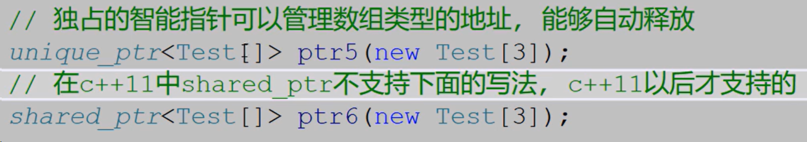
>
> - 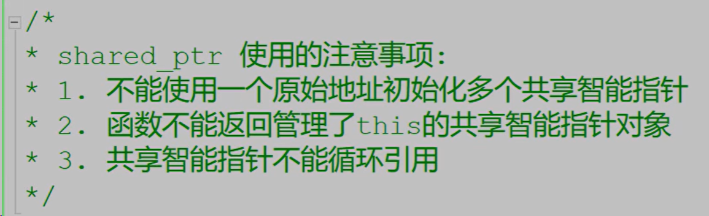

*在C++中没有垃圾回收机制，必须自己释放分配的内存，否则就会造成**内存泄露**。*

“ *C++里边呢我们动态的去申请内存，比如说通过new去申请一块内存，就必须通过delete去销毁。如果说呢咱们通过malloc去申请了内存，那么就需要通过这个free去释放内存。这两种方式之间的区别呢，**是使用new它能够调用构造函数，使用delete呢能自动的调用结构函数**。如果使用malloc和free呢，这个构造和析构呢都不会自动调用。* ”


解决这个问题最有效的方法是使用**智能指针**（smart pointer）。智能指针是**存储指向动态分配（堆）对象指针**的类，用于生存期的控制，**能够确保在离开指针所在作用域时，自动地销毁动态分配的对象，防止内存泄露**。


智能指针的核心实现技术是引用计数，记录了当前的这块内存被多少个智能指针共同管理着，每使用它一次，内部引用计数加1，每析构一次内部的引用计数减1，减为0时，删除所指向的堆内存。如果引用计数为1，也就是说只有自己管理了这块内存吧，这种情况下，当当前的指针被析构的时候，它会先析构掉管理的这块内存，然后呢自己再析构，这就是智能指针它帮助我们去释放内存的工作原理。


关于这些智能指针类，它们都是模板类型，因为我们实际在操作的时候，也不知道他要管理的指针到底是什么类型，我们只能够在使用的时候，通过这个模板参数，把实际的指针的类型传进去，然后他就可以在内部帮助我们进行管理了。


### 2.1 （高频）讲一下什么是智能指针/智能指针有哪几种

> 相比于裸指针，智能指针是对裸指针的一种封装，初衷是让程序员无需手动释放内存，来避免内存泄漏。常见的智能指针有`auto_ptr（已废弃）,  unique_ptr,  shared_ptr, weak_ptr`。


### 2.2 （高频）讲一下这几种智能指针的区别和优缺点

> 1. `auto_ptr`的在c++11中就已经标为废弃了，取而代之的是`unique_ptr`, 相比之下，`unique_ptr`语义更加清晰，更加安全，不允许复制，更加高效，并且更好地支持数组，以及c++11的特性等，因此`auto_ptr`就已经被废除。
>
> 2. `Weak_ptr`本身不具备内存管理地能力，它主要是为了解决`shared_ptr`可能导致的循环引用的问题。`Weak_ptr`的原理就是指向某个资源时，但它不会增加这个资源的引用计数。
>
> #####   因此，实际上真正意义上的智能指针就是`unique_ptr`和`shared_ptr`
>
> 3. `unique_ptr`是独占的智能指针,最主要的特点就是对资源是**独占的**, 它不可以复制。它通过**在析构函数中释放资源**来管理对象的生命周期，来自动管理资源。可以防止多个智能指针指向同一个对象，更加方便于管理。相比`shared_ptr`它的优点是高效，避免了循环引用的问题。
> 4. `shared_ptr`是共享的智能指针，当一个资源需要在多个对象之间共享时，就无法使用`unique_ptr`了。这是就需要使用到`shared_ptr`，它通过引用计数的方式来对资源进行控制，但是它存在**循环引用**的问题，需要结合`weak_ptr`来避免。


### 2.3 （中频）具体讲一下`shared_ptr`自动管理内存的原理 

/ （中频）*引用计数的具体原理*

/ （中频）*智能指针是如何自动管理资源的？智能指针的核心原理是什么？*

/ （中频）*`shared_ptr`引用计数什么时候会增加，什么时候会减少？*

> ***引用计数的核心原理：***
>
> 在`shared_ptr`的内部维护了一个计数器，来跟踪有多少个`shared_ptr`对象指向了某一个资源。当计数器的值减少到0的时候，`shared_ptr`就会调用`delete`(或者用户自定义的方法)来释放资源。
>
> 
>
> ***引用计数器何时增加：***
>
> 1. 新建一个`shared_ptr`并指向了一个资源时。
>
> 2. 复制构造函数创建一个新的`shared_ptr`时。
>
> 3. 用复制运算符将一个`shared_ptr`给另一个`shared_ptr`对象赋值时。
>
> ***引用计数器何时减少：***
>
> 1. 当一个`shared_ptr`对象被销毁时，比如局部变量离开作用域，或者类成员变量析构时。
>
> 2. 当一个`shared_ptr`对象不再指向一个资源时，例如通过`reset`方法或者赋值运算符指向另一个资源时。


**<u>引用计数实现机制</u>**

1. **控制块（Control Block）**：
   
   - 智能指针（如 C++ 标准库中的 `std::shared_ptr`）使用一个称为**控制块**的结构来跟踪指针所指向对象的引用计数。**这个控制块通常包含两个主要元素：引用计数器和资源（比如动态分配的对象）。**
   
2. **引用计数**：
   
   - 当一个新的智能指针被创建并指向某个资源时，**控制块**被创建，引用计数被初始化为 1。
   - 当有另一个智能指针复制或赋值指向同一个资源时，控制块的引用计数增加。
   - 当一个智能指针离开其作用域或被赋予新的资源时，控制块的引用计数减少。
   - 如果引用计数变为 0，意味着没有智能指针指向该资源，资源将被释放，控制块也随之被销毁。
   
3. **成员函数而非静态函数**：
   
   - **智能指针的成员函数用于管理这些操作**，比如构造函数、拷贝构造函数、赋值运算符、析构函数等。**这些成员函数操作控制块**来**更新引用计数和管理资源，但它们不是静态成员函数。**
   
   - 静态成员函数是与类本身而不是特定实例关联的函数。在智能指针的上下文中，**每个实例都需要独立地跟踪其引用的资源**，因此使用静态成员函数来管理这种状态是不合适的
   
     

### 2.3.1 （扩展）为什么不能使用一个原始地址初始化多个智能指针

> 在 C++ 中，智能指针（如 `std::shared_ptr` 和 `std::unique_ptr`）被设计为对动态分配的内存进行管理，确保内存的正确释放。**使用原始地址（原始指针）初始化多个智能指针是不安全的，主要原因是这可能导致多次释放同一块内存**，进而引起未定义行为，如内存泄漏、程序崩溃等问题。让我们具体分析一下：
>
> ### 为什么不能使用一个原始地址初始化多个智能指针
>
> 1. **独占性质**：`std::unique_ptr` 持有对一个对象的独占所有权。如果使用同一个原始指针初始化多个 `std::unique_ptr`，当其中一个 `std::unique_ptr` 被销毁（或离开其作用域）时，它会释放所指向的内存。此时，其他 `std::unique_ptr` 还持有已被释放的内存的地址，这会导致悬挂指针（dangling pointer）和可能的重复释放。
>
> 2. **引用计数问题**：`std::shared_ptr` 通过引用计数机制管理内存，当最后一个指向特定资源的 `std::shared_ptr` 被销毁时，该资源会被释放。如果使用同一个原始指针初始化多个 `std::shared_ptr`，每个 `std::shared_ptr` **会认为自己是唯一的持有者，并独立管理引用计数**。这会导致每个 `std::shared_ptr` 都试图释放同一资源，从而引起重复释放。
>
> ### 正确的做法
>
> - 对于 `std::unique_ptr`，应确保每个 `std::unique_ptr` 管理一个独立的资源。不应该使用同一个原始指针初始化多个 `std::unique_ptr`。
>   
> - 对于 `std::shared_ptr`，如果需要多个智能指针共享同一资源，应从一个已存在的 `std::shared_ptr` 创建新的 `std::shared_ptr`，而不是直接使用原始指针。这样可以确保引用计数的正确维护。
>
> ```cpp
> std::shared_ptr<int> original = std::make_shared<int>(10);
> std::shared_ptr<int> shared = original;  // 正确，共享同一资源
> ```
>
> ### 总结
>
> 不能使用一个原始地址初始化多个智能指针，因为这可能导致多次释放同一块内存。正确的做法是确保每个 `std::unique_ptr` 拥有唯一的资源，而 `std::shared_ptr` 则应通过复制构造函数或赋值操作来共享资源。这种做法有助于避免内存管理中的常见错误，如重复释放或悬挂指针。

###  2.4 （高频）循环引用如何发生的，以及如何解决？

> 循环引用在智能指针的使用中是一个常见问题，特别是使用 `std::shared_ptr`。它发生在两个或多个智能指针互相持有对方的引用时，导致引用计数永远不会达到零，从而引发内存泄漏。
>
> 
>
> - **循环引用通常发生在如下情形：**
>
> 1. **互相引用的对象**：两个对象通过 `std::shared_ptr` 相互引用。例如，对象 A 持有一个指向对象 B 的 `std::shared_ptr`，同时对象 B 也持有一个指向对象 A 的 `std::shared_ptr`。
> 2. **复杂的引用链**：循环引用不仅限于两个对象之间。在更复杂的对象网络中，如图，双向链表中，存在多个引用路径等情况下，可能会存在循环引用问题。如果存在一个闭合的引用链（即一系列对象通过 `shared_ptr` 相互引用并最终回到起点），也会导致循环引用。
>
> 这样的循环引用**会阻止涉及的对象的析构函数被调**用，因为 `std::shared_ptr` 认为仍然存在对这些对象的有效引用。这最终会导致内存泄漏，因为这些对象永远不会被释放。
>
> - **解决循环引用**
>
> 解决循环引用的问题通常涉及重新设计对象之间的关系，使用不同类型的智能指针，如 `std::weak_ptr`：
>
> 1. **使用 `std::weak_ptr`**：
>    - `std::weak_ptr` 是一种智能指针，**它不增加对象的引用计数**。这意味着它可以引用由 `std::shared_ptr` 管理的对象，而不阻止该对象被销毁。
>    - 在上述的循环引用场景中，可以将其中一个 `std::shared_ptr` 替换为 `std::weak_ptr`。这样，**其中一个对象可以在另一个对象仍然存在时访问它，但不会阻止其析构。**
> 2. **重新设计对象关系**：
>    - 另一种方法是重新考虑对象之间的关系。在某些情况下，循环引用可能表明设计上的问题。可能需要重新思考对象之间的所有权和依赖关系，以避免不必要的相互引用。
> 3. **显式断开引用**：
>    - 在某些情况下，您可以在适当的时候显式地断开引用链。例如，在对象不再需要时，可以将其中一个 `std::shared_ptr` 设置为 `nullptr`，从而打破循环。
> 4. **避免过度使用 `shared_ptr`**：
>    - 在某些情况下，使用 `std::unique_ptr` 或原始指针（如果可以安全地管理生命周期）可能是更好的选择，尤其是在表达“非共享”所有权时。
>
> 通过这些方法，可以有效地解决循环引用的问题，避免内存泄漏，并保持良好的资源管理和程序设计实践。


### 2.5 （中频）`weak_ptr`是弱引用，它弱在哪里？

<u>`weak_ptr`</u>是辅助`shared_ptr`来工作的，它首先是要通过一个共享的智能指针对象呢进行实例化，那么实例化了之后，共享的智能指针对象还监测哪一块资源，这个<u>`weak_ptr`</u>呢它就也能够监测到哪一块资源，其实呢它就是配合着或者说帮助这个`shared_ptr`呢共同管理这块资源的。

`shared_ptr`是用来管理并且监测某一块内存的，因此呢这个`weak_ptr`呢它也能够**监测**到这块内存。


<u>“ 课程补充：返回管理this的`shared_ptr` ”</u>

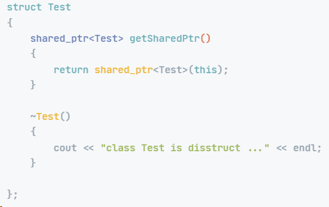

这段代码中的 `return shared_ptr<Test>(this);` 行确实使用了 `this` 指针来初始化一个新的 `std::shared_ptr`。这种做法是不安全的，因为它违反了 `std::shared_ptr` 管理资源生命周期的基本原则。具体来说，存在以下几个问题：

1. **多重所有权问题**：
   - 当 `new Test` 被创建时，`sp1` 成为了这个 `Test` 实例的唯一所有者。
   - 在 `getSharedPtr` 方法中，通过 `this` 指针又创建了一个新的 `shared_ptr<Test>`（即 `sp2`），这使得现在有**两个独立的** `shared_ptr` 对象认为它们各自拥有对同一个 `Test` 实例的所有权。
   - 这导致了资源（`Test` 实例）的多重所有权，这是 `std::shared_ptr` 所设计要避免的。
2. **双重删除问题**：
   - 当 `main` 函数结束时，`sp1` 和 `sp2` 都会试图删除它们所指向的 `Test` 对象。
   - 这将导致对同一个对象的两次删除操作，从而触发未定义行为，可能会导致程序崩溃或其他异常。
3. **引用计数失效**：
   - 正确使用 `std::shared_ptr` 的情况下，所有指向同一个对象的 `shared_ptr` 实例应该共享相同的引用计数。
   - 在这个例子中，`sp1` 和 `sp2` 的引用计数是分离的，因此它们不能正确地管理资源的生命周期。


> `std::weak_ptr` 是 C++ 标准库中的一种智能指针，被称为“弱引用”（ weak reference ），它的“弱”在于几个关键方面：
>
> 1. **不拥有对象**：`std::weak_ptr` 不拥有它所指向的对象。这意味着它的存在不会影响该对象的生命周期。它只是提供了一种访问由 `std::shared_ptr` 管理的对象的方式，但不会增加对象的引用计数。
>
> 2. **无法防止对象被销毁**：由于 `std::weak_ptr` 不增加引用计数，因此它指向的对象可能在其存在期间被销毁（如果所有的 `std::shared_ptr` 都被销毁或重置）。
>
> 3. **需要转换为 `std::shared_ptr` 才能使用**：为了使用 `std::weak_ptr` 指向的对象，你需要将其转换为 `std::shared_ptr`。这通常通过调用 `std::weak_ptr` 的 `lock` 方法完成，这个方法会检查所指向的对象是否仍然存在（即是否没有被销毁）。如果对象仍然存在，`lock` 方法会返回一个有效的 `std::shared_ptr`，否则返回一个空的 `std::shared_ptr`。
>
> 4. **不保证对象的可用性**：由于 `std::weak_ptr` 不控制其指向对象的生命周期，因此不能保证在其生命周期内对象始终可用。这与 `std::shared_ptr` 形成对比，后者通过引用计数确保对象在被引用时不被销毁。
>
> 5. **用于解决循环引用问题**：`std::weak_ptr` 的这些特性使其成为解决循环引用问题的理想选择。在使用 `std::shared_ptr` 时，循环引用可能导致内存泄漏，因为涉及的对象无法被正确销毁。使用 `std::weak_ptr` 可以打破这种循环，因为它不会增加引用计数。
>
> 总的来说，`std::weak_ptr` 的“弱”体现在它**对对象的非拥有性质，以及它提供的对对象的有条件访问**。这使得它在处理某些智能指针问题时非常有用，尤其是在需要避免循环引用时。


### 2.6 （低频）智能指针是线程安全的吗？多线程中使用智能指针要注意什么？


> 智能指针本身在多线程环境中的线程安全性取决于其类型和使用方式。C++ 标准库提供了几种智能指针，主要包括 `std::shared_ptr`、`std::unique_ptr` 和 `std::weak_ptr`。下面分别讨论它们在多线程中的使用和注意事项：
>
> ### `std::shared_ptr`
>
> 1. **引用计数的线程安全性**：
>    - `std::shared_ptr` 在**修改引用计数时**是线程安全的。**这意味着可以在多个线程中同时创建和销毁** `std::shared_ptr` 的副本，而不会导致数据竞争或未定义行为。
>    - 但是，这种线程安全性仅限于对 `std::shared_ptr` 对象本身的操作，而不是它指向的对象。如果多个线程需要访问共享指针所指向的数据，那么对数据的访问需要另外同步。
>
> 2. **示例**：
>    - 安全示例：在两个线程中同时拷贝同一个 `std::shared_ptr` 对象是安全的。
>    - 不安全示例：如果两个线程都试图通过同一个 `std::shared_ptr` **修改其指向的对象**，除非对对象的访问进行适当的同步（如使用互斥锁），否则这是不安全的。
>
> ### `std::unique_ptr`
>
> 1. **线程安全性**：
>    - `std::unique_ptr` 不是线程安全的。由于 `std::unique_ptr` 的设计是为了单一所有权，因此不应该在多线程中共享。
>    - 如果需要在多个线程之间传递 `std::unique_ptr` 的所有权，应该使用明确的移动语义（如 `std::move`）在线程之间传递所有权，并确保在任何时刻只有一个线程可以访问它。
>
> 2. **示例**：
>    - 不安全示例：两个线程试图访问或修改由同一个 `std::unique_ptr` 管理的对象是不安全的。
>    - 安全示例：使用 `std::move` 将 `std::unique_ptr` 从一个线程传递到另一个线程，传递后原线程不再访问该指针。
>
> ### `std::weak_ptr`
>
> 1. **线程安全性**：
>    - `std::weak_ptr` 在操作引用计数方面与 `std::shared_ptr` 类似，是线程安全的。但同样，这仅适用于对 `std::weak_ptr` 对象本身的操作。
>    - 当通过 `std::weak_ptr` 创建一个 `std::shared_ptr` 时（使用 `lock` 方法），需要确保在使用返回的 `std::shared_ptr` 访问对象时的线程安全性。
>
> ### 多线程使用智能指针的注意事项
>
> 1. **保护共享数据**：
>    - 当通过智能指针访问共享数据时，应使用互斥锁或其他同步机制来保护数据的访问。
>
> 2. **避免死锁**：
>    - 在使用互斥锁保护智能指针所指对象时，需注意避免死锁。
>
> 3. **小心循环引用**：
>    - 在多线程程序中使用 `std::shared_ptr` 时，也要注意避免循环引用，这可能导致内存泄漏。
>
> 4. **考虑使用原子操作**：
>    - 对于 `std::shared_ptr`，C++11 还提供了一些原子操作函数（如 `std::atomic_load` 和 `std::atomic_store`），可以在不使用互斥锁的情况下安全地在多个线程之间共享和修改 `std::shared_ptr`。
>
> 总的来说，智能指针的线程安全性主要关注于指针本身的操作。当涉及到指针所指向的共享数据时，需要采取额外的同步措施来确保线程安全。
>


### 2.7 手写智能指针

（见 *learn C++*）


## 3. (高频)C++ 内存模型相关

[大丙：虚拟地址空间](https://subingwen.cn/linux/file-descriptor/)


> C++程序在执行时，将**内存大方向**划分为**4个区域**
>
> - 代码区：存放**函数体的二进制代码**，由操作系统进行管理的
> - 全局区：存放**全局变量**和**静态变量**以及**常量**
> - 栈区：由**编译器自动**分配释放, 存放函数的参数值,局部变量等
> - 堆区：由**程序员**分配和释放,若程序员不释放,程序结束时由操作系统回收
>
> **内存四区意义：**
>
> 不同区域存放的数据，赋予不同的生命周期, 给我们更大的灵活编程
>
> ### 程序运行前
>
> ​	在程序编译后，生成了exe可执行程序，**未执行该程序前**分为两个区域
>
> ​	**代码区：**
>
> ​		存放 CPU 执行的机器指令
>
> ​		代码区是**共享**的，共享的目的是对于频繁被执行的程序，只需要在内存中有一份代码
>
> ​		代码区是**只读**的，使其只读的原因是防止程序意外地修改了它的指令
>
> ​	**全局区：**
>
> ​		**全局变量和静态变量**存放在此.
>
> ​		全局区还包含了**常量区**, **字符串常量和其他常量**也存放在此.
>
> ​		==该区域的数据在程序结束后由操作系统释放==
>
> ### 程序运行后
>
> ​	**栈区：**
>
> ​		由**编译器自动分配释放**, **存放函数的参数值,局部变量**等
>
> ​		注意事项：不要返回局部变量的地址，栈区开辟的数据由编译器自动释放
>
> ​	**堆区：**
>
> ​		由程序员分配释放,若程序员不释放,程序结束时由操作系统回收
>
> ​		**在C++中主要利用new在堆区开辟内存**
>
> 
>
> 全局区细分包括 `.data .bss`
>
> 代码区细分包括 `.txt .radata`
>
> 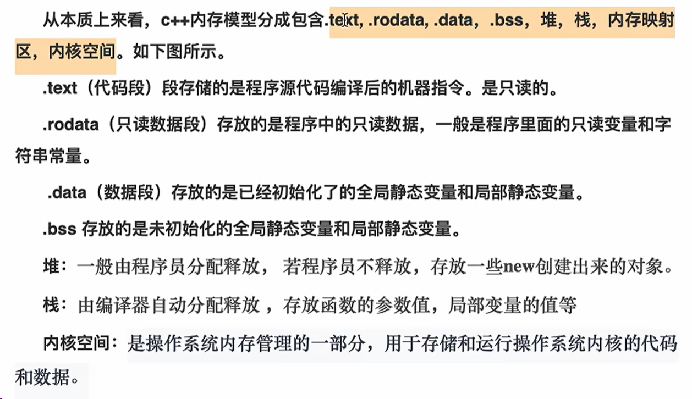
>
> 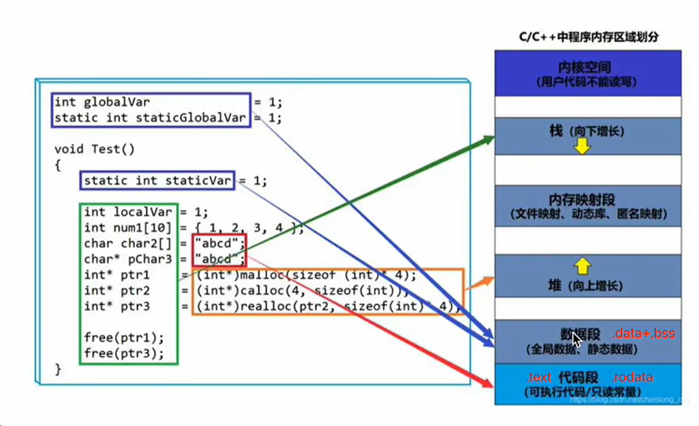
>
> 
>
> 在程序编译成可执行文件（如 `.exe` 0000文件）之后，但在程序执行之前，与程序运行时的内存分区确实存在不同。这些差异主要涉及到**如何和何时将程序的不同部分加载到内存中**。
>
> ### 编译后、执行前
>
> 当程序被编译成可执行文件后，但尚未执行时：
>
> 1. **存储在磁盘上**：可执行文件存储在磁盘上，它包含程序的代码段（文本段）、已初始化的数据段、BSS段（未初始化的数据）、常量数据等。
>
> 2. **静态结构**：这个阶段的文件是静态的，意味着它还没有被操作系统加载到内存中，所有的地址都是**相对地址**或者虚拟地址。
>
> 3. **资源未分配**：堆和栈等动态内存区域还未被分配。**全局变量和静态变量尚未被初始化**。
>
> ### 程序执行时
>
> 一旦程序开始执行：
>
> 1. **加载到内存中**：操作系统将可执行文件的内容加载到内存中。这包括代码段、已初始化数据、BSS段等。
>
> 2. **动态内存分配**：
>    - **栈**：为程序的运行提供栈空间，用于存储局部变量、函数参数等。
>    - **堆**：堆内存空间被初始化，可供程序动态分配使用。
>
> 3. **地址绑定**：程序中的相对地址或虚拟地址被转换为实际的物理地址。
>
> 4. **全局和静态变量初始化**：全局变量和静态变量在程序启动时进行初始化。
>
> 5. **文字常量区和代码段**：常量数据和程序代码被加载到它们各自的内存区域，通常是只读的。
>
> ### 总结
>
> - **编译后、执行前**：程序以静态文件形式存在，内存尚未分配，程序的各个段是以虚拟地址形式存在于可执行文件中。
> - **程序执行时**：操作系统加载程序到内存，进行动态内存分配和地址绑定，程序的各个段在内存中拥有具体的物理位置，堆和栈等动态区域开始活动。
>
> 这种从静态可执行文件到动态执行过程的转换是操作系统和程序加载器（如 Windows 中的 Loader）的职责。理解这一过程对于深入理解程序的运行机制以及性能优化非常重要。
>
> 
>
> 
>
> 
>
> 虚拟地址空间是理解程序编译、加载、执行过程中发生的变化的关键概念。在现代操作系统中，每个运行的程序都有自己的虚拟地址空间，这与物理内存地址相区分。下面是与虚拟地址空间相关的一些主要概念和它们在程序执行中的作用：
>
> ### 虚拟地址空间
>
> - **定义**：虚拟地址空间是操作系统为每个进程提供的一段连续的地址区间。**这些地址对进程来说看起来就像是它独自占用整个系统的内存。**
>
> - **作用**：通过虚拟地址空间，操作系统为每个进程创建了一种假象，即它们各自拥有一整块未被其他进程使用的内存。这提高了内存的利用效率，同时也隔离了不同进程，保证了系统的稳定性和安全性。
>
> ### 编译后、执行前
>
> - **相对地址**：编译后的程序（比如 `.exe` 文件）包含了代码、数据和其他资源，这些都是以相对地址形式存储的。这些地址是相对于程序开始地址的偏移量，而不是实际的物理内存地址。
>
> - **未映射到物理内存**：此时程序尚未加载到内存，因此它的虚拟地址空间尚未映射到物理内存。
>
> ### 程序执行时
>
> - **加载到虚拟地址空间**：当程序开始执行时，操作系统将其加载到进程的虚拟地址空间。这时，程序中的相对地址被转换成虚拟地址。
>
> - **地址映射**：操作系统通过页表（page table）将程序的虚拟地址映射到物理内存地址。这个映射过程对程序是透明的，程序认为它直接访问的是虚拟地址。
>
> - **动态内存管理**：程序运行时的动态内存分配（如堆分配）也发生在虚拟地址空间内。操作系统负责映射这些动态分配的内存到物理内存。
>
> ### 保护和隔离
>
> - **进程隔离**：每个进程有自己独立的虚拟地址空间，这意味着一个进程不能直接访问或修改另一个进程的内存。这提供了很好的安全性和稳定性。
>
> - **内存保护**：操作系统还可以设置虚拟地址空间中不同区域的访问权限（如只读、可写），从而实现内存保护。
>
> ### 总结
>
> 虚拟地址空间是操作系统提供的一个抽象，使得每个进程看起来都好像有一整块独立的内存。这个机制简化了程序的内存管理，同时提供了安全和隔离的保障。程序从编译到执行的过程，实际上是它的代码和数据从静态的磁盘文件转换到动态的虚拟地址空间，并最终映射到物理内存的过程。
>
> 


### 3.1 （高频）不同段上的对象的生命周期

> 在 C++ 中，对象的生命周期与它们存储在内存的哪个部分密切相关。根据对象是如何创建的，C++ 的内存**可以分为几个区域**，每个区域管理的对象生命周期有所不同：
>
> 
>
> ### **代码区（也称为文本段或代码段）**
>
> 在 C++ 程序中，代码区（也称为文本段或代码段）是一个特殊的内存区域，用于存储程序的可执行代码。它的生命周期与程序的整个运行周期紧密相关：
>
> **生命周期**
>
> 1. **加载时**：当程序启动时，操作系统将可执行文件（如 `.exe` 文件）中的代码加载到内存的代码区。**这通常发生在程序的主函数（`main`）执行之前。**
>
> 2. **执行期间**：在整个程序运行期间，代码区一直存在于内存中。操作系统和 CPU 确保程序代码可以被适时访问和执行。
>
> 3. **程序结束时**：当程序正常结束或异常终止时，操作系统负责清理内存，包括代码区。此时，代码区中的内容被卸载或回收。
>
> **特点**
>
> - **只读**：为了防止程序运行时意外或恶意地修改其自身代码，代码区通常是只读的。试图修改代码区中的内容可能导致程序崩溃。
>
> - **共享**：在多个运行实例（进程）中，同一程序的代码区可以被共享。这有助于减少总体内存占用。
>
> - **效率**：将代码和数据分离可以提高缓存的效率，因为代码区是只读的，可以在多个上下文中安全地共享。
>
> **与其他内存区域的比较**
>
> - **全局区**：包含全局变量、静态变量和常量。**与代码区一样，全局区在程序的整个生命周期中都存在。**
>
> - **栈区**：用于存储局部变量和函数参数。栈区的内存管理是自动的，随着函数调用的进行而分配，随着函数调用的结束而释放。
>
> - **堆区**：用于动态内存分配。程序员负责分配和释放。如果不被释放，将在程序结束时由操作系统回收。
>
> 总的来说，代码区的生命周期始于程序的启动，终于程序的结束，是操作系统管理的一个持续存在、只读的内存区域。
>
> 
>
> ### **全局区**()
>
> - **全局变量和静态变量**：包括全局变量、文件范围内的静态变量以及类的静态成员变量。
>
> - **生命周期**：**这些变量在程序开始时（在 `main` 函数执行前）初始化**，直到程序结束时才被销毁。程序结束后，由操作系统释放
>
> - **静态存储期**：它们在整个程序运行期间都存在，不论它们的定义在程序中的具体位置。
>
> - **常量字符串和文字**：如字符串字面值（例如 `"hello"`）存储在文字常量区。
>
> - **生命周期**：这些常量的生命周期与程序相同，从程序开始直到程序结束。
>
>   
>
> 
>
> ### **栈（Stack）**
>
> - **局部变量**：在函数内定义的局部变量存储在栈上。
> - **生命周期**：局部变量的生命周期与函数调用相关。当函数被调用时，这些变量被创建；当函数返回时，这些变量被销毁。离开作用域之后，由操作系统释放。
> - **自动存储期**：这些变量的创建和销毁是自动进行的，程序员无需（也不能）手动管理。
>
> ### **堆（Heap）**
>
> - **动态分配对象**：通过 `new` 操作符动态创建的对象存储在堆上。
> - **生命周期**：这些对象的生命周期由程序员控制。它们在使用 `new` 创建时开始，使用 `delete` 销毁时结束。
> - **动态存储期**：这要求程序员负责确保合适的时机调用 `delete`，否则会导致内存泄漏。
>
> 
>
> ### **线程局部存储区（Thread Local Storage, TLS）**
>
> - **线程局部变量**：用 `thread_local` 关键字标记的变量**具有线程局部存储期**。
> - **生命周期**：这些变量在线程开始时创建，在线程结束时销毁。
>
> 
>
> ### **注意事项**
>
> - **自动和动态存储期**：自动存储期的对象（如栈上的局部变量）无需手动管理，而动态存储期的对象（如堆上的对象）需要明确的创建和销毁。
> - **静态初始化顺序问题**：静态变量的初始化顺序在不同编译单元（translation unit）之间未定义，可能导致“静态初始化顺序问题”。
> - **对象销毁顺序**：通常是与创建顺序相反的，特别是对于栈和静态/全局存储区的对象。但堆上的对象完全依赖于 `delete` 的调用时机。
>
> 理解这些内存区域上的对象生命周期对于避免内存泄漏、适当管理资源以及编写可靠的程序非常重要。
>
> 


### 3.2 （高频）堆和栈的区别

> 堆（Heap）和栈（Stack）是计算机内存中用于存储数据的两个关键概念，它们在 C++ 程序中扮演着重要的角色。理解它们的区别对于编写有效且高效的程序至关重要。
>
> ### 堆（Heap）
>
> 1. **动态内存分配**：
>    - 堆用于动态内存分配，可以在运行时分配任意大小的内存块。
>    - 内存的分配和释放由程序员控制，通常通过 `new`、`delete`、`malloc`、`free` 等函数进行。
>
> 2. **生命周期**：
>    - 堆上分配的内存直到显式释放或程序结束才会被回收。
>    - 管理不善会导致内存泄漏。
>
> 3. **访问效率**：
>    - 相对于栈，**堆的内存分配和访问效率较低。**
>    - 分配的内存不是连续的，可能导致更多的缓存未命中和页面错误。
>
> 4. **内存大小**：
>    - **堆的大小通常远大于栈，受限于系统的可用内存和操作系统的限制。**
>
> 5. **用途**：
>    - **适用于生命周期不确定或需要大量内存的对象。**
>
> ### 栈（Stack）
>
> 1. **自动内存管理**：
>    - 栈用于自动存储局部变量和函数调用的上下文。
>    - 栈的内存管理是自动的，由编译器控制。
>
> 2. **生命周期**：
>    - 栈上的内存随着函数调用的结束而自动释放。
>    - 适用于生命周期随函数调用的局部变量。
>
> 3. **访问效率**：
>    - 栈的内存分配和访问速度非常快。
>    - 内存是连续分配的，有助于优化缓存的使用。
>
> 4. **内存大小**：
>    - 栈的大小相对较小，通常由操作系统预先定义。
>    - 大量的内存分配或深层的递归调用可能导致栈溢出。
>
> 5. **用途**：
>    - 适用于生命周期短暂、大小已知的局部变量。
>
> ### 堆和栈的主要区别
>
> - **内存管理**：堆是动态管理的，栈是自动管理的。
> - **生命周期控制**：堆上的内存需要程序员管理，栈上的内存由编译器管理。
> - **内存大小和效率**：堆更大但效率较低，栈较小但效率高。
> - **用途**：堆适用于大型或复杂的数据结构，栈适用于局部变量和函数调用。
> - **内存分配方式**：堆内存是非连续的，栈内存是连续的。
> - **安全性**：栈通常比堆更安全，因为栈上的内存自动释放，而堆可能导致内存泄漏。
>
> 理解这些区别有助于在 C++ 编程中做出合适的内存管理决策，避免常见的错误，如内存泄漏和栈溢出。


### 3.3 （扩展）使用STL创建的数据结构

> 在 C++ 中，使用标准模板库（STL）创建的数据结构（如 `std::vector`、`std::unordered_map` 等）的存储位置取决于数据结构对象本身和其包含的元素的存储位置。
>
> ### 数据结构对象的存储位置
>
> - **栈上**：如果你在函数内部声明了一个 STL 容器（如 `std::vector`），那么这个容器对象本身（即其元数据，如大小、容量等信息）通常存储在栈上。
>   
>   ```cpp
>   void function() {
>       std::vector<int> myVector; // myVector 对象本身存储在栈上
>   }
>   ```
> - **堆上**：如果你通过 `new` 关键字动态创建了一个 STL 容器，容器对象本身则存储在堆上。
>   ```cpp
>   std::vector<int>* myVector = new std::vector<int>(); // myVector 对象本身存储在堆上
>   ```
>
> ### 容器中的元素
>
> - **堆上**：对于大多数 STL 容器（包括 `std::vector`、`std::unordered_map` 等），即使容器对象本身可能存储在栈上，它们容纳的元素通常都是存储在堆上的。这是因为 STL 容器需要能够动态地调整其大小，而堆提供了这种灵活性。
>   ```cpp
>   void function() {
>       std::vector<int> myVector;
>       myVector.push_back(10); // 这个元素存储在堆上
>   }
>   ```
> - **动态分配**：当向这些容器添加元素时，容器可能需要重新分配其底层的存储空间以适应新元素。这种重新分配也是在堆上进行的。
>
> ### 总结
>
> - 容器对象本身的存储位置取决于它是如何声明的（在栈上还是在堆上）。
> - 容器中的元素通常存储在堆上，以支持动态大小调整和灵活的内存管理。
>
> 这种设计使得 STL 容器非常灵活和强大，但也意味着程序员需要理解如何管理和优化这些容器的使用，特别是在涉及大量数据和性能关键的应用中。


### 3.4 （扩展）在 C++ 生成的可执行程序里面存在什么东西

> 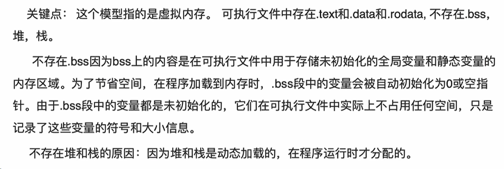
>
> 在 C++ 生成的可执行程序（如 `.exe` 文件）中，**堆和栈这些内存区域**并不是程序文件的一部分，而是**在程序运行时由操作系统在内存中分配和管理的**。
>
> ##### 可执行文件内容
>
> 一个 C++ 编译后生成的 `.exe` 可执行文件主要包含以下内容：
>
> 1. **代码段（Text Segment）**：存储编译后的程序代码，即函数和方法的二进制指令。
>
> 2. **数据段**：存储全局变量和静态变量，包括已初始化**和未初始化的部分**（逻辑上）。
>
> 3. **资源和元数据**：程序的其他资源（如图标、图像等）以及用于描述程序的元数据。
>
> ##### 运行时内存布局
>
> 当您运行一个 `.exe` 文件时，操作系统会为该程序创建一个进程，并在内存中为其分配以下区域：
>
> 1. **代码区**：将 `.exe` 文件中的代码段加载到内存的代码区。
>
> 2. **全局/静态区**：将全局变量和静态变量加载到内存的全局/静态区。
>
> 3. **堆区**：在**内存中分配一个区域**供程序**动态分配内存**（如通过 `new` 或 `malloc`）。
>
> 4. **栈区**：**为程序的函数调用提供栈**，用于存储局部变量、函数参数等。
>
> ##### 总结
>
> - C++ 生成的 `.exe` 文件本身不包含堆和栈，这些是在程序运行时由操作系统在内存中动态创建和管理的。
>
> - `.exe` 文件包含了程序运行所需的代码和数据，但堆和栈的具体内容是在程序执行过程中确定的。
>
> 因此，**堆和栈是运行时的概念，与可执行文件本身是分开的**。了解这一点有助于理解程序的编译与执行过程，以及操作系统如何管理运行中的程序。
>
> 
>
> ### 在 C++ 编译后生成的 .exe 可执行文件中，存在bss段吗？
>
> 在 C++ 编译后生成的 `.exe` 可执行文件中，**实际上不直接包含一个物理的 BSS 段**。在传统的 Unix-like 系统的可执行文件格式（比如 ELF）中，BSS 殔（Block Started by Symbol）是一个明确定义的段，用于存储**未初始化的数据**。然而，在 Windows 系统中，`.exe` 文件的格式（即 PE，Portable Executable）并不以相同的方式定义 BSS 段。
>
> ##### Windows PE 格式和 BSS
>
> 在 Windows PE 格式中：
>
> 1. **未初始化的数据**：未初始化的全局变量和静态变量通常会被放置在可执行文件的数据段中。然而，这些变量并不占用文件的实际磁盘空间。相反，它们在 PE 文件的头信息中只是有所记录。
>
> 2. **运行时初始化**：当可执行文件被加载到内存时，操作系统根据这些头信息分配相应的内存空间，并将其初始化为零。这相当于传统意义上的 BSS 段的功能，但是这种初始化是在程序加载到内存时进行的，而不是在磁盘上的可执行文件中直接体现。
>
> ##### 总结
>
> 虽然 Windows PE 格式的 `.exe` 文件**没有一个单独定义的 BSS 段**，但它通过**在数据段记录未初始化变量的信息，并在程序加载时分配并初始化这些变量的内存，实现了类似 BSS 段的功能**。因此，**虽然物理上不存在，但逻辑上 `.exe` 文件支持未初始化数据的存储和初始化，其行为与 BSS 段类似。**


### 3.5 （扩展）为什么要把程序的指令和数据分开，分成这么多段呢

> 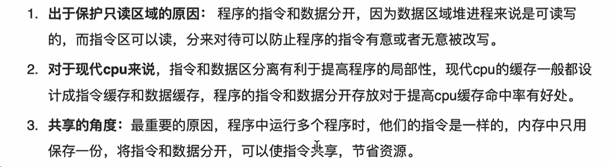
>
> 将程序的指令和数据分开，分成不同的内存区域（如代码区、数据区、堆区和栈区），是出于几个重要的考虑和优势：
>
> ### 1. 安全性和保护
>
> - **防止意外修改**：将代码区设为只读可以防止程序在运行时意外或恶意修改其指令。这是一种重要的安全措施，有助于防止程序错误和安全漏洞。
>
> - **内存访问控制**：不同的内存区域可以有不同的访问权限（如只读、可写、可执行），这有助于操作系统实施安全策略，防止例如缓冲区溢出攻击导致的潜在危险。
>
> ### 2. 组织和管理效率
>
> - **提高内存管理效率**：不同类型的数据和指令有不同的生命周期和大小需求。将它们分开可以更有效地管理内存，例如，栈区的自动管理机制非常适合临时局部变量，而堆区则适合生命周期不确定的动态分配数据。
>
> - **优化性能**：由于代码通常是静态的且频繁访问，单独的代码区可以优化指令的缓存和执行。数据区和堆区的分离也有助于数据的缓存和访问优化。
>
> ### 3. 灵活性和扩展性
>
> - **动态内存分配**：将堆区用于动态内存分配允许程序在运行时根据需要分配和释放内存，这提供了极大的灵活性，使得程序可以处理不同大小的数据和复杂的数据结构。
>
> - **支持高级语言特性**：例如，栈区使得函数调用和局部变量的使用更加方便和高效，而堆区则支持动态内存管理，这些都是高级语言中不可或缺的特性。
>
> ### 4. 进程隔离和多任务
>
> - **方便进程隔离**：不同的程序或进程拥有自己的内存空间，这有助于操作系统实现进程间的隔离，保证一个进程的错误不会直接影响到其他进程。
>
> - **支持多任务处理**：现代操作系统通常支持多任务处理，不同的内存区域有助于操作系统在切换进程或线程时高效管理和保存状态。
>
> ### 总结
>
> 总之，程序的指令和数据分开存储的内存模型提高了程序的安全性、效率、灵活性，并且是现代操作系统进行高效内存管理和多任务处理的基础。这种模型是现代计算机架构和操作系统设计的关键部分。
>
> 
>
> ### --程序中运行多个程序时，他们的指令时一样的，内存中只用保存一份 这个怎么理解
>
> 您提到的这个概念涉及到操作系统中的程序代码共享机制。当多个程序或多个运行实例（进程）执行同一程序时，它们的代码（即指令集）可以在**内存中共享同一份拷贝**。这种做法的目的是提高内存使用效率和系统性能。以下是详细解释：
>
> ### 代码共享的原理
>
> 1. **只读代码段**：程序的指令通常存储在代码段（或文本段），并且这个段是只读的。因为代码不会在程序运行时被修改，所以同一份代码可以被多个进程安全共享。
>
> 2. **内存映射**：操作系统通过内存映射的方式，将同一个可执行文件的代码段映射到不同进程的地址空间。尽管每个进程拥有独立的虚拟地址空间，但这些空间中的代码段可以指向物理内存中的同一位置。
>
> ### 共享代码的优势
>
> 1. **节约内存资源**：共享代码减少了对物理内存的需求。如果有多个进程运行同一程序，不需要为每个进程的代码都分配独立的内存。
>
> 2. **提高缓存效率**：由于代码是只读的，共享代码不会引起缓存一致性问题，可以提高 CPU 缓存的效率。
>
> ### 示例
>
> 假设有一个可执行程序 `A.exe`，现在有两个进程（比如 `A1` 和 `A2`）都在运行这个程序。在这种情况下：
>
> - 操作系统会将 `A.exe` 的代码段加载到物理内存中的某个位置。
> - 这个代码段会被映射到 `A1` 和 `A2` 的虚拟地址空间中，但它们都指向同一物理内存位置。
>
> ### 数据的独立性
>
> 尽管代码可以共享，但每个进程的数据（如全局变量、堆、栈）都是独立的。这意味着一个进程对数据的修改不会影响到其他进程。
>
> ### 总结
>
> 多个运行相同程序的进程可以共享内存中的一份代码拷贝，这是操作系统设计中的一个常见策略，用于优化内存使用和提高性能。代码共享是可能的，因为代码通常是只读的，不会在运行时被任何一个进程修改。


### 3.6 （扩展）全局变量/静态变量 是如何销毁的，销毁的时机是什么

main（）函数结束以后，由运行库执行代码去释放的，或当调用 `exit()` 函数时，这些变量被销毁。


### 3.7 （扩展）为什么要在堆区开辟数据

在编程中，我们通常会在**堆区（也称为动态内存或自由存储区）开辟数据**，因为堆区具有以下几个主要优点：

1. **动态大小**：堆区的内存空间是动态分配的，这意味着我们可以在程序运行时决定需要多少内存，而不是在编译时固定大小。这对于处理不确定大小的数据结构非常有用，比如链表、树或动态数组。

2. **生命周期灵活**：堆区中的数据的生命周期可以由程序员控制。一旦在堆上分配了内存，它将一直保留，直到程序显式地释放该内存。这允许我们在需要时分配内存，并在不再需要时释放它，避免了静态内存分配所带来的固定资源占用问题。

3. **跨函数访问**：在堆区分配的内存可以**被不同函数共享和访问**。这对于在一个函数中分配内存，然后在另一个函数中使用这块内存非常有用。

4. **避免栈溢出**：栈区的大小通常有限制，并且较小。**如果需要大量的内存或者非常大的数据结构，使用堆区可以避免栈溢出的问题。**

然而，需要注意的是，在堆区分配内存后，必须负责手动释放这些内存，否则会导致内存泄漏。**内存泄漏是指分配的内存没有被释放，导致程序在运行时占用了越来越多的内存，最终可能耗尽系统的可用内存。**

在一些编程语言中（例如C和C++），需要显式地调用malloc、calloc或new等函数来在堆区分配内存，并使用free或delete等函数来手动释放分配的内存。在其他高级编程语言中，如Java和Python，内存管理由垃圾收集器自动处理，更容易避免内存泄漏问题。


### 3.8（扩展）不同区域数据的跨函数访问

- #### 不要返回局部变量的地址、局部变量的引用

> 在 C++ 中，不同内存区域的数据具有不同的生命周期和访问特性。这些特性决定了数据是否可以跨函数访问。让我们来详细了解一下：
>
> ### 堆区（Heap）
>
> 1. **特性**：堆区用于动态内存分配，如通过 `new` 或 `malloc` 分配的内存。堆上的数据只有在显式释放时（使用 `delete` 或 `free`）才会被销毁。
>
> 2. **跨函数访问**：堆上的数据可以跨函数访问。您可以在一个函数中分配内存，**并将指向该内存的指针传递给其他函数以进行进一步操作。**
>
> 3. **示例**：
>     ```cpp
>     int* createArray() {
>         int* arr = new int[10]; // 在堆上分配内存
>         return arr; // 返回指向堆内存的指针
>     }
>                 
>     void someFunction() {
>         int* arr = createArray(); // 跨函数访问堆上的数据
>         // ... 使用 arr
>         delete[] arr; // 最终释放内存
>     }
>     ```
>
> ### 栈区（Stack）
>
> 1. **特性**：栈区用于存储局部变量和函数参数。栈上的数据在其所属函数结束时自动销毁。
>
> 2. **跨函数访问**：栈上的数据不能安全地跨函数访问。一旦函数执行完毕，分配给它的栈帧就会被销毁，局部变量也随之失效。
>
> ### 全局/静态存储区
>
> 1. **特性**：包含全局变量、静态变量和常量。这些数据在程序启动时初始化，在程序结束时销毁。
>
> 2. **跨函数访问**：全局变量和静态变量可以在不同函数之间安全地访问，因为它们的生命周期贯穿整个程序运行期。
>
> 3. **示例**：
>     ```cpp
>     int globalVar; // 全局变量
>                 
>     void setVar(int x) {
>         globalVar = x; // 设置全局变量的值
>     }
>                 
>     int getVar() {
>         return globalVar; // 访问全局变量的值
>     }
>     ```
>
> ### 文字常量区
>
> 1. **特性**：用于存储字符串字面量和其他常量数据。这些数据通常是只读的。
>
> 2. **跨函数访问**：文字常量可以在多个函数之间共享和访问。
>
> ### 总结
>
> - **堆区数据**：可以跨函数访问，需要手动管理内存。
> - **栈区数据**：不能安全地跨函数访问，自动管理内存。
> - **全局/静态存储区数据**：可以跨函数访问，生命周期贯穿整个程序。
> - **文字常量区数据**：可以跨函数访问，通常是只读的。
>
> 正确理解不同内存区域的特性对于编写高效、可靠和安全的 C++ 程序非常重要。


## 4. (高频)介绍一下`static`和`const`

> 在 C++ 中，`static` 和 `const` 是两个重要的关键字，它们分别用于声明静态存储期的变量和常量。尽管它们在功能上有所不同，但都对变量的作用域、生命周期和可变性有重要影响。
>
> ### `static`
>
> `static` 关键字在 C++ 中有多种用途：
>
> 1. **静态局部变量**：
>    - 在函数内部定义时，`static` 使得局部变量的生命周期贯穿整个程序运行期，而不是仅在函数调用期间。
>    - 这意味着静态局部变量在第一次调用函数时初始化，并在程序结束时销毁。
>
> 2. **静态类成员**：
>    - 在类定义中，`static` 可用于声明静态成员变量和成员函数。
>    - 静态成员属于类本身，而不是类的任何特定对象。因此，**它们即使在没有创建类的实例时也存在**。
>
> 3. **静态全局变量**：
>    - 在函数外部定义时，`static` 限制变量的作用域，**使得变量只在定义它的文件内可见。**
>    - 这有助于避免名称冲突，并提供了一种**模块内部共享数据**的方式。
>
> ### `const`
>
> `const` 关键字用于声明常量，表示一旦被初始化后，其值就不能被修改。
>
> 1. **常量变量**：
>    
>    - `const` 可以修饰变量，表示变量的值不可改变。
>    - 试图修改 `const` 变量的值会导致编译错误。
>    
> 2. **==常量指针和指针常量（指向常量的指针）==**：
>    
>    - `const` 用于指针时有两种不同的含义，取决于它的位置：
>      
>      - `int* const ptr`：指向 `int` 的**常量指针**，指针的**指向不能被修改，**但指针指向的数据可以修改。**指针本身是常量**，不能指向其他地址，但可以通过它修改所指向的数据（除非所指数据本身是 `const`）
>      
>      - `const int* ptr`：指向 `const int` 的指针，不能通过指针修改所指向的值，但指针本身可以修改，可以指向不同的地址。     只限制不能通过该指针进行更改，可以将原数据的地址重新初始化一个新指针，然后进行更改。
>      
>        
>    
> 3. `const`与引用结合使用
>    
>    - `const int& ref = var;` 引用 `ref` 引用了 `int` 类型的变量 `var`，但不能通过 `ref` 修改 `var` 的值。
>    
>    - 含义：`const` 引用一个**常量对象，不能通过引用修改所引用的值。**
>    
> 4. **类成员函数**：
>
>    - 在类成员函数声明后使用 `const`，表示**该函数不会修改类的任何成员变量**（除了那些用 `mutable` 声明的成员）。
>
> ### 两者的组合
>
> `static` 和 `const` 可以组合使用，例如**在类中声明一个** `static const` 成员变量，表示这是一个**属于类的、不可修改的常量。**
>
> 
>
> ### 总结
>
> - `static` 主要影响变量的存储期和作用域。它使变量在程序运行期间保持存在，并可以限制变量的作用域范围。
> - `const` 用于声明不可修改的常量，确保变量的值在初始化后不会被改变，增加程序的可读性和健壮性。
> - 在实际使用中，合理运用 `static` 和 `const` 可以提高程序的效率、可读性和安全性。


### 4.1.1 （扩展）使用 `static const` 修饰类成员变量

> 在 C++ 中，使用 `static const` 修饰类成员变量有一些特定的特点和优势：
>
> ### 1. 静态（Static）
>
> - **类级别**：`static` 成员变量属于整个类而不是类的某个特定对象。这意味着无论创建了多少对象，所有对象都共享同一个 `static` 成员变量。
> - **内存分配**：对于 `static` 成员变量，内存只分配一次，通常在程序的生命周期内持续存在。
> - **访问方式**：可以通过类名直接访问，不需要创建类的对象。例如 `ClassName::staticMember`。
>
> ### 2. 常量（Const）
>
> - **不可修改**：`const` 修饰的成员变量意味着它的值在初始化后不能被修改。
> - **初始化要求**：由于 `const` 成员必须在声明时或在构造函数初始化列表中初始化，`static const` 成员通常在类定义外部初始化（特别是对于非整型常量）。
> - **优化**：编译器可以对 `const` 成员进行优化，因为它知道这些成员的值在运行时不会改变。
>
> ### 3. 静态常量成员变量的初始化
>
> - **整型常量**：对于**整型**和**枚举类型**的 `static const` 成员，可以在**类定义内部直接初始化**。
> - **其他类型**：对于非整型的 `static const` 成员，通常需要在**类定义外部进行初始化**。
>
> ### 示例
>
> ```cpp
> class MyClass {
> public:
>     static const int myConst = 42;  // 整型常量直接初始化
> 
>     static const double myDouble;   // 非整型常量，需要在类外初始化
> };
> 
> const double MyClass::myDouble = 3.14;  // 类外初始化
> ```
>
> ### 使用场景
>
> - **共享常量**：当你需要在类的所有实例之间共享一个不变的值时，使用 `static const` 成员是一个好选择。
> - **替代宏**：用于替代传统的预处理器宏 (#define) 来定义常量，因为 `static const` 成员在类型安全和作用域控制方面更加可靠。
>
> ### 总结
>
> `static const` 成员变量在类中定义了共享的、不可变的值。它们是类级别的，可以通过类名直接访问，并且只占用一份内存空间，不管创建了多少类的实例。这些特点使得 `static const` 成员成为定义类中常量的理想选择。
>
> 
>
> 
>
> 在 C++ 中，对于 `static const` 成员变量的初始化规则之所以区分整型/枚举类型和非整型类型，主要是由于编译器对这两类类型的处理方式不同。
>
> ### 整型和枚举类型
>
> 对于整型和枚举类型的 `static const` 成员，它们可以在类定义内部直接初始化。这种行为是允许的，因为：
>
> 1. **编译时求值**：**整型和枚举类型的常量值在编译时就可以完全确定**，因此可以在编译期间进行初始化。
> 2. **无需存储空间**：由于它们是编译时常量，编译器通常不会为这些静态常量分配存储空间。**相反，它们的值通常在编译时就内联到代码中。**
> 3. **简化链接**：由于不需要为这些常量分配存储空间，因此也就避免了链接时的复杂性。
>
> ### 非整型类型
>
> 对于非整型的 `static const` 成员，通常需要在类定义外部进行初始化。这是因为：
>
> 1. **运行时初始化**：非整型类型（如浮点数或自定义类类型）可能无法在编译时完全确定其值，因此它们可能需要在运行时进行初始化。
> 2. **存储空间分配**：这些类型的静态常量通常需要在程序的数据段中分配存储空间，这通常发生在程序的链接阶段。
> 3. **避免重复定义**：在类定义外初始化确保了对于在多个源文件中包含的类定义，其静态常量只在一个地方进行定义和初始化，从而避免了多重定义的问题。
>
> ### 总结
>
> 整型和枚举类型的 `static const` 成员可以在类内部初始化的原因是它们的值在编译时就已经确定，并且不需要为它们分配存储空间。而非整型类型的 `static const` 成员则需要在类外部初始化，因为它们可能需要运行时初始化，并且需要分配存储空间。这种设计反映了 C++ 在编译时常量优化和运行时行为之间的平衡。


### 4.1.2 （扩展）`static` 修饰的变量或常量的初始化时机

> 在 C++ 中，`static` 修饰的变量或常量的初始化时机取决于它们是局部静态变量还是全局（或类静态）静态变量：
>
> ### 局部静态变量（Local Static）
>
> 局部静态变量是在函数内部声明的静态变量。它们的初始化发生在第一次执行到该变量声明的时刻。
>
> - **初始化时机**：运行时。当程序执行流程第一次到达变量声明时进行初始化。
> - **生命周期**：局部静态变量一旦被初始化，它们在程序的剩余生命周期中一直存在。
>
> #### 示例
>
> ```cpp
> void function() {
>     static int count = 0;  // 这里在第一次调用 function 时初始化
>     count++;
> }
> ```
>
> 在这个例子中，`count` 变量在 `function()` 第一次被调用时初始化。
>
> ### 全局静态变量（Global Static）和类静态成员
>
> 全局静态变量和类静态成员变量是在程序的全局作用域或类作用域中声明的静态变量。
>
> - **整型常量和枚举**：如果是类中的 `static const` 整型或枚举类型，它们可以在类内部进行初始化，并且这种初始化是在编译时进行的。
> - **其他类型**：非整型常量、全局静态变量、以及类静态成员（非整型或非常量）通常在程序开始执行之前（运行时的初始化阶段，但在 `main` 函数执行之前）进行初始化。
>
> #### 示例
>
> ```cpp
> class MyClass {
> public:
>     static const int value = 42;  // 编译时初始化
>     static std::vector<int> vec;  // 运行时初始化（在 main 函数执行前）
> };
> 
> std::vector<int> MyClass::vec = {1, 2, 3};
> ```
>
> 在这个例子中，`value` 在编译时就已经确定其值，而 `vec` 则在程序启动阶段（运行时）初始化。
>
> ### 总结
>
> - 局部静态变量在运行时初始化，**即在第一次执行到它们的声明时**。
> - 类中的 `static const` 整型或枚举成员**可以在编译时初始化**，如果在类定义中直接赋值。
> - 其他全局静态变量和类静态成员变量（包括非整型的 `static const` 成员）通常在程序启动阶段（运行时，但在 `main` 函数执行前）初始化。


### 4.1.3 （扩展）`const` 关键字

> `const`关键字，从功能上来说这个关键字有双重语义：`变量只读，修饰常量`
>
> ```c++
> void func(const int num)
> {
>     const int count = 24;
>     int array[num];            // error，num是一个只读变量，不是常量
>     int array1[count];         // ok，count是一个常量
> 
>     int a1 = 520;
>     int a2 = 250;
>     const int& b = a1;
>     b = a2;                         // error
>     a1 = 1314;
>     cout << "b: " << b << endl;     // 输出结果为1314
> }
> ```
>
> - 函数`void func(const int num)`的参数`num`表示这个变量是只读的，但不是常量，因此使用`int array[num]; `这种方式定义一个数组，编译器是会报错的，提示`num`不可用作为常量来使用。
> - `const int count = 24;`中的`count`却是一个常量，因此可以使用这个常量来定义一个静态数组。
> - 另外，**变量只读并不等价于常量**，二者是两个概念不能混为一谈，分析一下这句测试代码`const int& b = a1;：`
>
> - b是一个常量的引用，所以b引用的变量是不能被修改的，也就是说b = a2; 这句代码语法是错误的。
>
> - 在const对于变量a1是没有任何约束的，a1的值变了b的值也就变了
>
> - 引用b是只读的，但是并不能保证它的值是不可改变的，也就是说它不是常量。
>
>   
>
> 
>
> 在 C++ 中，`const` 关键字用于定义常量值，即一旦被初始化后，其值就不能被修改。`const` 可以用于不同的上下文中，包括变量、指针、引用、成员函数等，它提供了强大的方式来增加程序的可读性和安全性。
>
> 
>
> - **必须初始化**：在声明 `const` 对象时，必须立即初始化。`const` 对象声明后不允许延迟初始化。
>
>   ```c++
>   cppCopy code
>   const int b; // 错误：const 对象必须在声明时初始化
>   ```
>
> 
>
> ### `const` 变量
>
> `const` 变量表示其值在初始化之后不能更改。
>
> ```cpp
> const int maxVal = 100;
> // maxVal = 200; // 错误：不能修改 const 变量的值
> ```
>
> ### `const` 指针
>
> `const` 关键字可以与指针结合使用，有两种主要用法：
>
> 1. **指针指向常量**：这意味着不能通过指针修改所指向的值，但指针本身可以改变。
>
>     ```cpp
>     const int* ptr = &maxVal;
>     // *ptr = 200; // 错误：不能修改 const 指向的值
>     ```
>
> 2. **常量指针**：**指针本身是常量，不能改变指向**，但所指向的数据可以修改（如果数据本身不是 `const`）。
>
>     ```cpp
>     int val = 100;
>     int* const ptr = &val;
>     // ptr = &maxVal; // 错误：不能改变 const 指针的指向
>     ```
>
> ### `const` 引用
>
> **引用常量意味着不能通过引用来修改其所绑定的对象**。引用初始化后，本身就不能修改指向。
>
> ```cpp
> const int& ref = maxVal;
> // ref = 200; // 错误：不能通过 const 引用修改值
> ```
>
> ### `const` 成员函数
>
> 在类中，`const` 后缀表示该成员函数不会修改对象的状态。
>
> ```cpp
> class MyClass {
> public:
>     int getValue() const {
>         return value;
>     }
>     // ...
> private:
>     int value;
> };
> ```
>
> ### `const` 与对象
>
> 当对象被声明为 `const` 时，只能调用该对象的 `const` 成员函数。
>
> ```cpp
> const MyClass obj;
> // obj.setValue(5); // 错误：setValue 需要是 const 成员函数
> ```
>
> 声明一个类对象为 `const` 会使该对象成为只读的，限制了对它的操作，但不会改变其底层的对象模型。`const` 关键字为编译器提供了关于对象如何被使用的信息，帮助确保编写的代码更加安全和可靠。尽管 `const` 对象在行为上与普通对象有所不同，但在内部结构上它们是相同的。
>
> 
>
> 
>
> ### `const` 与函数重载
>
> `const` 可以用于区分重载的成员函数，其中一个版本处理 `const` 对象，另一个处理非 `const` 对象。
>
> ```cpp
> class MyClass {
> public:
>     void inspect() const { /* 对 const 对象的处理 */ }
>     void inspect() { /* 对非 const 对象的处理 */ }
> };
> ```
>
> ### `const` 与多线程
>
> 在多线程编程中，`const` 对象和 `const` 成员函数通常是线程安全的，因为它们不会修改对象的状态。
>
> ### `const_cast`
>
> `const_cast` 可以用来移除对象的 `const` 属性。这通常用于与不接受 `const` 参数的旧 C 风格函数接口交互。但是，对原本就是 `const` 的对象使用 `const_cast` 来修改它的值是未定义行为。
>
> ### 总结
>
> `const` 关键字在 C++ 中是一种强大的工具，它有助于创建更安全、更易于维护的代码。它确保了变量、对象、指针或引用的不可变性，并使编译器能够进行更好的优化。恰当地使用 `const` 可以提高代码质量，减少意外修改数据的风险。


## 5. 各种数据类型占用内存的大小

> 
>
> ### ❗️指针所占内存空间
>
> 指针所占内存空间的大小取决于计算机体系结构和编程语言的规范。在大多数现代计算机体系结构中，指针的大小通常与计算机的寻址能力有关。以下是一些常见情况：
>
> 1. 32位体系结构：在32位体系结构中，指针通常占用4个字节（32位），因为它们可以寻址的内存范围最大为2^32个字节（4GB）。
>
> 2. 64位体系结构：在64位体系结构中，指针通常占用**8个字节（64位）**，因为它们可以寻址的内存范围最大为2^64个字节（16 exabytes）。
>
> C语言是一种常见的编程语言，我们可以以其为例说明为什么指针的大小是固定的。在C语言中，指针的大小由编译器在编译时确定，并且与机器的体系结构有关。
>
> 编译器需要知道指针的大小，以便正确地计算指针运算和内存偏移。在不同的体系结构中，处理器的寻址能力和数据总线宽度不同，因此指针的大小也会相应地调整。
>
> 需要注意的是，对于某些特殊的嵌入式系统或其他特殊用途的计算机体系结构，指针的大小可能会有所不同。但是，在大多数通用计算机上，上述32位和64位的情况是较为普遍的。
>
> 


## 6.（高频）深拷贝 与 浅拷贝

> 深浅拷贝是面试经典问题，也是常见的一个坑
>
> 浅拷贝：简单的**赋值拷贝**操作
>
> **深拷贝：在堆区重新申请空间，进行拷贝操作**
>
> 
>
> ```c++
> class Person {
> public:
> 	//无参（默认）构造函数
> 	Person() {
> 		cout << "无参构造函数!" << endl;
> 	}
>     
> 	//有参构造函数
> 	Person(int age ,int height) {
> 		
> 		cout << "有参构造函数!" << endl;
> 
> 		m_age = age;
> 		m_height = new int(height);
> 		  
> 	}
>     
> 	//自己写 拷贝构造函数  
> 	Person(const Person& p) {
> 		cout << "拷贝构造函数!" << endl;
> 		//如果不利用深拷贝在堆区创建新内存，会导致浅拷贝带来的重复释放堆区问题
> 		m_age = p.m_age;
>    // m_height = p.m_height 编译器默认的是这行代码，是浅拷贝
> 		m_height = new int(*p.m_height);  //进行深拷贝
> 		
> 	}
> 
> 	//析构函数
> 	~Person() {
> 	cout << "析构函数!" << endl;
>     // 将堆区开辟的内存做释放
> 		if (m_height != NULL)
> 		{
> 			delete m_height;
>             m_height = NULL;
> 		}
> 	}
> public:
> 	int m_age;
> 	int* m_height;
> };
> 
> void test01()
> {
> 	Person p1(18, 180);
> 
> 	Person p2(p1);
> 
> 	cout << "p1的年龄： " << p1.m_age << " 身高： " << *p1.m_height << endl;
> 
> 	cout << "p2的年龄： " << p2.m_age << " 身高： " << *p2.m_height << endl;
> }
> 
> int main() {
> 
> 	test01();
> 
> 	system("pause");
> 
> 	return 0;
> }
> ```
>
> 浅拷贝时，拷贝构造函数仅复制指针，导致 `p1` 和 `p2` 共享同一块内存。而深拷贝时，拷贝构造函数会为 `p2` 分配一块独立的内存来存储 
>
> **总结：**如果属性有在堆区开辟的，一定要**自己提供拷贝构造函数**，防止浅拷贝带来的问题
>
> 
>
> 
>
> 在 C++ 中，深拷贝和浅拷贝是处理对象复制时的两种不同方式，它们在资源管理和对象复制的行为上有着本质的区别。
>
> ##### 浅拷贝（Shallow Copy）
>
> 浅拷贝是指在复制对象时，**仅复制对象的各个成员的值**。**对于指针类型的成员**，**浅拷贝只复制指针的值（即内存地址），而不复制指针所指向的数据**。
>
> 1. **特点**：
>    - 快速且简单。
>    - 默认的复制构造函数和赋值操作符实现的就是浅拷贝。
>
> 2. **问题**：
>    - 当对象包含指针指向动态分配的内存时，浅拷贝可能导致多个对象指向同一块内存。
>    - 这可能会导致诸如双重释放（double free）等问题，尤其是当一个对象被销毁时，它所指向的内存被释放，而其他对象仍然保留了指向该内存的指针。
>
> ##### 深拷贝（Deep Copy）
>
> 深拷贝不仅复制对象的各个成员的值，**对于指针类型的成员，还会复制指针所指向的数据到新的内存地址。**
>
> 1. **特点**：
>    
>    - 完整复制对象的数据，包括指针指向的数据。
>    - 需要显式地在复制构造函数和赋值操作符中实现。
>    
> 2. **使用场景**：
>    - 当类中包含指向动态分配内存的指针成员时，通常需要实现深拷贝以避免共享指针导致的问题。
>
> 3. **示例**：
>     ```cpp
>     class MyClass {
>     public:
>         MyClass(const MyClass& other) { // 复制构造函数
>             data = new int(*other.data);
>         }
>                 
>         ~MyClass() {
>             delete data;
>         }
>                 
>         // ... 其他成员 ...
>                 
>     private:
>         int* data;
>     };
>     ```
>
> ##### 深拷贝与浅拷贝的选择
>
> - **浅拷贝**：适用于简单的对象，或对象内部没有动态分配的资源。
> - **深拷贝**：适用于对象包含动态分配资源或需要独立管理其数据的情况。
>
> ##### 规则三：拷贝构造函数、赋值操作符和析构函数
>
> 在涉及深拷贝时，通常需要遵循“规则三”（或 C++11 后的“规则五”）：**如果你定义了任何一个拷贝构造函数、拷贝赋值操作符或析构函数，那么你通常应该定义所有这些，以确保对象的复制和资源管理正确无误。**
>
> ##### 总结
>
> 深拷贝和浅拷贝是 C++ 中处理对象复制的两种基本方式，它们在资源管理上有着根本的区别。正确选择和实现深拷贝或浅拷贝对于编写可靠和高效的 C++ 程序至关重要。


## 7.（高频）指针 与 引用 的区别

> 在C++中，指针和引用都是用于间接访问其他变量的工具，但它们在语法和使用上有重要的差别。了解这些差别对于编写高效、易读且安全的C++代码非常重要。
>
> ### 指针
>
> 1. **定义**：指针是一个变量，其值为另一个变量的地址。指针可以被重新赋值以指向其他变量。
> 2. **语法**：
>    - 声明：`int* ptr;`
>    - 赋值：`ptr = &var;`
>    - 访问指向的值：`*ptr = 5;`
> 3. **特性**：
>    - 指针可以被初始化为 `nullptr`，表示它不指向任何有效的内存地址。
>    - 指针的大小依赖于系统架构（例如，在32位系统上通常为4字节，在64位系统上为8字节）。
>    - 指针可以进行算术运算，如指针增加（指向数组中的下一个元素）。
>
> ### 引用
>
> 1. **定义**：引用是一个已存在变量的别名。一旦一个引用被初始化为指向一个变量，它就不能改变为引用另一个变量。
> 2. **语法**：
>    - 声明：`int& ref = var;`
>    - 使用：`ref = 5;`（这将改变 `var` 的值）
> 3. **特性**：
>    - 引用在声明时必须被初始化，并且一旦指向一个变量，就不能再改变指向。
>    - 引用本身不是一个独立的对象，它只是它所引用的变量的另一个名称。
>    - 引用不占用任何内存空间（虽然这在不同的编译器实现中可能有所不同）。
>    - 引用不能为 `nullptr`，总是指向一个有效的内存地址。
>
> ### 指针与引用的主要区别
>
> - **可变性**：指针可以重新指向另一个地址，而引用一旦初始化后就不能改变指向。
> - **空值**：指针可以是 `nullptr` 或指向任何地址，而引用必须绑定到合法的内存地址。
> - **内存占用**：指针本身是变量，占用内存空间；引用通常不占用内存空间，但这取决于编译器的实现。
> - **语法**：指针使用 `*` 和 `&` 进行解引用和取地址操作；引用则像正常变量一样使用。
>
> ### 使用场景
>
> - **指针**：
>   - 需要能指向“无对象”（通过 `nullptr`）的情况。
>   - 需要能改变指向的情况。
>   - 当使用动态内存分配（如使用 `new` 关键字）时。
> - **引用**：
>   - 当你需要一个别名，且不需要重新指向其他对象时。
>   - 在函数参数传递中，尤其是需要修改传入对象的情况下。
>
> 理解指针和引用的区别对于写出安全、高效的C++代码非常重要，因为它们影响着代码的可读性、灵活性以及潜在的错误风险。


### 7.1 `* ` 与 `&`

> 在C++中，`*` 和 `&` 是两个非常基础且重要的符号，分别用于指针操作和引用声明。以下是它们的详细解释：
>
> ### `*` 操作符：指针相关操作
>
> 1. **声明指针**：
>    - 在声明变量时，`*` 用于创建指针类型的变量。例如，`int* ptr;` 声明了一个名为 `ptr` 的指针，它可以指向 `int` 类型的数据。
>
> 2. **解引用指针**：
>    - 当 `*` 用于已经声明的指针变量时，它表示解引用操作，即访问指针所指向的值。例如，`*ptr` 表示获取 `ptr` 指向的 `int` 类型的值。
>
> ### `&` 操作符：地址和引用相关操作
>
> 1. **取地址**：
>    - 在表达式中，`&` 用于获取变量的地址。例如，`&var` 表示获取变量 `var` 的内存地址。
>
> 2. **声明引用**：
>    - 在声明变量时，`&` 用于创建引用类型的变量。引用是对另一个变量的别名。例如，`int& ref = var;` 创建了一个名为 `ref` 的引用，它引用了变量 `var`。
>
> ### 使用示例
>
> ```cpp
> int var = 10;   // 一个普通的整型变量
> int* ptr = &var;  // ptr 是一个指针，指向 var 的地址
> int& ref = var;  // ref 是一个引用，引用 var
> 
> *ptr = 20;  // 解引用 ptr 并赋新值，var 的值现在是 20
> ref = 30;   // 通过引用 ref 修改 var 的值，var 的值现在是 30
> ```
>
> ### 指针与引用的区别
>
> - **指针**是一个变量，存储的是另一个变量的内存地址。指针可以被重新赋值以指向另一个变量，也可以指向 `nullptr`（表示空指针，即不指向任何内容）。
> - **引用**是另一个变量的别名，一旦被初始化后，就不能改变它引用的变量。引用在内部通常由指针实现，但它们的使用更安全，因为引用必须被初始化，并且不能为 `nullptr`。
>
> ### 总结
>
> 在C++中，`*` 和 `&` 用于处理指针和引用，这是理解和使用C++内存管理的基础。指针提供了直接访问内存地址的能力，而引用则提供了一种更安全的方式来创建别名。掌握这些概念对于写出高效和安全的C++代码至关重要。


### 7.2 悬挂指针和野指针

> 悬挂指针（Dangling Pointer）和野指针（Wild Pointer）是两种常见的指针错误，它们都可以导致程序运行不稳定甚至崩溃。尽管它们听起来很相似，但它们实际上指的是两种不同的情况：
>
> ### 悬挂指针（Dangling Pointer）
>
> 悬挂指针是指向一块已经释放（或已经不再有效）的内存的指针。这通常发生在以下几种情况：
>
> 1. **对象被删除或释放**：当动态分配的内存（通过 `new` 或 `malloc`）被 `delete` 或 `free` 释放后，指向这块内存的指针就变成了悬挂指针。
>
> 2. **函数返回局部变量的地址**：如果函数返回一个局部变量的指针或引用，当函数执行完毕局部变量的生命周期结束后，指向这个局部变量的指针就变成了悬挂指针。
>
> 3. **指向对象的指针在对象的生命周期结束后**：如果有一个指针指向了一个对象，当这个对象的生命周期结束（例如，一个局部对象在其所在的作用域结束时），该指针就变成了悬挂指针。
>
> 使用悬挂指针访问数据是危险的，因为它指向的内存可能已经被重新分配并用于其他用途，或者根本就不属于程序的地址空间。
>
> ### 野指针（Wild Pointer）
>
> 野指针是指尚未初始化或已经释放的指针。这通常发生在以下几种情况：
>
> 1. **未初始化的指针**：声明了指针变量但没有明确初始化。这种指针可能指向任何地方，其值是不确定的。
> 3. **随机赋值给指针**：如果指针被赋予一个随机的值，而不是有效的内存地址或 `nullptr`。
>
> 野指针是非常危险的，因为它们的行为是不可预测的。尝试通过野指针访问或修改数据可能导致程序错误、数据损坏或崩溃。
>
> ### 对比
>
> - **相似点**：它们都可能导致程序的不稳定和错误。
> - **不同点**：悬挂指针指的是之前有效但现在已经释放的内存，而野指针则通常是指那些从未被有效初始化的指针。
>
> ### 避免方法
>
> 为了避免这些问题，应当：
>
> - **及时初始化指针**：声明指针时立即初始化。
> - **释放内存后将指针设置为 nullptr**。
> - **避免返回局部变量的地址或引用**。
> - **小心处理指针，尤其是在复杂的数据结构或大型程序中**。
>
> 总的来说，正确和谨慎地管理内存和指针是编写稳定、安全和高效程序的关键。


## 8.（高频）左值 与 右值

> 在 C++ 中，理解左值（lvalue）和右值（rvalue）的概念对于深入理解语言特性非常重要，尤其是在涉及表达式求值、赋值、内存管理、移动语义和引用等方面。
>
> ### 左值（Lvalue）
>
> "左值"一词最初源于赋值表达式的左侧，但其意义已经扩展和细化。
>
> 1. **定义**：左值通常指的是一个持久性对象的标识。它可以出现在赋值表达式的左侧或右侧。
>
> 2. **特点**：
>    - **地址可获取**：左值**表示一个具有确定存储位置（内存地址）的对象**。
>    - **持久性**：左值引用的对象在赋值后仍然存在。
>    - **可以是可修改的**：如果左值不是常量，可以对它进行赋值操作。
>
> 3. **示例**：
>    - 变量、数组元素、结构体成员、引用、解引用的指针等都是左值的例子。
>
> ### 右值（Rvalue）
>
> "右值"最初指的是赋值表达式的右侧，但在 C++ 中，它具有更深层的含义。
>
> 1. **定义**：右值通常指的**是一个临时的或不具有识别性的值**。它不能出现在赋值表达式的左侧。
>
> 2. **特点**：
>    - **不可获取地址**：右值通常没有固定的内存地址，因此不能对它取地址。
>    - **临时性**：右值常常是临时的，它们在表达式求值后就不再存在。
>    - **可移动**：右值可以被移动，这是 C++11 引入的移动语义的基础。
>
> 3. **示例**：
>    - 字面量（如 `5`、`"hello"`）、算术表达式（如 `x + y`）、函数返回非引用类型的值等。
>
> ### C++11 后的扩展：右值引用和移动语义
>
> C++11 引入了右值引用（用 `&&` 表示），允许更高效地处理临时值，特别是在涉及大型对象的构造和赋值时。
>
> 1. **右值引用**：可以绑定到右值的引用，使得可以安全地从右值“移动”资源。
>
> 2. **移动语义**：通过右值引用，C++11 引入了移动构造函数和移动赋值操作符，允许资源（如动态分配的内存）的所有权从一个对象转移到另一个对象，这比传统的复制更高效。
>
> ### 总结
>
> - **左值**：代表内存中有确定存储位置的对象，可以位于赋值操作的左侧或右侧。
> - **右值**：通常是临时的，不可取地址的值，只能位于赋值操作的右侧，支持移动语义。
> - 理解左值和右值有助于更好地理解 C++ 中的表达式求值、赋值机制、内存管理以及 C++11 中引入的移动语义。


> 在 C++ 中，纯右值（Pure Rvalue）和将亡值（Xvalue，eXpiring value）是右值（Rvalue）的两个子类别，这些概念对于理解 C++ 的移动语义和右值引用非常重要。
>
> ### 纯右值（Pure Rvalue）
>
> 纯右值是右值的一个子类别，指的是临时的、不与任何内存地址相关联的值。这些值纯粹是数据，不能标识存储位置。
>
> - **特点**：
>     - 完全临时，不能被赋值，纯右值本身不能作为赋值操作的左侧
>     - 不具有可识别的内存地址。
> - **示例**：
>     - 字面量，如 `5`, `3.14`, `"hello"`.
>     - 表达式结果，如 `a + b`, `foo()`（如果 `foo` 返回非引用类型）。
>
> ### 将亡值（Xvalue）
>
> 将亡值是 C++11 引入的概念，是右值的另一个子类别。它指的是那些即将被销毁、且其资源可以被移动的对象。
>
> - **特点**：
>     - 与对象的存储位置相关联，但该对象即将销毁。
>     - 可以安全地“移动”其资源到另一个对象。
> - **示例**：
>     - 通过 `std::move` 得到的表达式，如 `std::move(obj)`.
>     - 返回局部对象的函数调用，如 `std::move()` 或移动构造函数中的临时对象。
>
> ### 右值引用和移动语义
>
> - **右值引用**：C++11 引入了右值引用（使用 `&&`），它可以绑定到纯右值和将亡值，但不能绑定到左值。右值引用是实现移动语义的关键。
> - **移动语义**：移动语义允许资源（如动态内存）从一个对象转移到另一个对象，这通常比传统的复制更有效率。移动语义特别适用于将亡值。
>
> ### 总结
>
> 在 C++ 中，纯右值和将亡值是右值的两个重要子类别。纯右值主要代表临时的数据值，而将亡值与即将销毁的对象资源有关，这使得它们成为实现移动语义的理想候选者。理解这些概念对于深入理解 C++ 的现代特性，如移动语义和右值引用至关重要。


# C++ 相关知识点


## 1. 内存泄漏

> 内存泄漏是指程序中已分配的内存没有适时释放，导致这部分内存在后续无法被再次利用。内存泄漏在长时间运行的程序中尤为严重，因为随着运行时间的增长，泄漏的内存可能累积到一个严重的程度。具体影响包括：
>
> 内存泄漏是指分配的内存没有被释放，导致程序在运行时占用了越来越多的内存，最终可能耗尽系统的可用内存。
>
> ### 1. 内存资源耗尽
>
> - **逐渐占用更多内存**：随着程序运行，内存泄漏导致的未释放内存持续累积，逐渐占用了更多的内存资源。
> - **可用内存减少**：这意味着系统可用于其他任务的内存减少，可能导致系统对其他程序的响应变。
>
> ### 2. 系统性能下降
>
> - **内存耗尽**：在极端情况下，内存泄漏可能导致系统的内存资源耗尽，影响其他正在运行的程序。
> - **交换和分页**：当物理内存耗尽时，操作系统可能会频繁地使用交换分区（或分页文件），这会显著降低系统性能。
>
> ### 3. 程序稳定性和可靠性降低
>
> - **崩溃和故障**：长时间运行的程序（如服务器应用）可能因内存泄漏而最终耗尽所有可用内存，导致程序崩溃或其他不稳定行为。
> - **响应时间增加**：内存泄漏可能导致程序运行缓慢，增加处理请求的时间。
>
> ### 4. 资源管理复杂化
>
> - **调试和维护困难**：内存泄漏可能难以检测和定位，尤其是在复杂的系统中。它增加了软件调试和维护的难度。
>
> ### 5. 安全隐患
>
> - **潜在的安全风险**：在某些情况下，内存泄漏可能暴露敏感信息，因为未释放的内存可能包含敏感数据。
>
> ### 解决和预防
>
> - **及时释放内存**：确保动态分配的内存在不再使用时被释放。
> - **使用智能指针**：利用 C++ 的智能指针（如 `std::unique_ptr` 和 `std::shared_ptr`）可以帮助自动管理内存。
> - **内存泄漏检测工具**：使用专门的工具（如 Valgrind）定期检查程序是否存在内存泄漏。
> - **编码规范**：遵循良好的编程实践，如使用 RAII（Resource Acquisition Is Initialization）模式管理资源。
>
> 总的来说，内存泄漏对程序的性能和稳定性有着严重的负面影响，特别是在需要长时间运行或资源受限的环境下。正确的内存管理是高质量软件开发的关键部分。


## 2. 数组初始化 `int score[10]；`

> ```c++
> //定义方式1
> //数据类型 数组名[元素个数];
> int score[10];
> ```
>
> 在 C++ 中，当您声明一个数组，如 `int score[10];`，而没有显式地初始化它，数组中的元素是否会被初始化取决于数组的存储位置。
>
> ### 局部非静态数组
>
> 如果 `score` 是一个局部非静态数组，即在函数内部声明且未使用 `static` 关键字，那么它将不会被自动初始化。**其内容是未定义的，通常是内存中原有的任意值**。在这种情况下，访问数组元素之前没有进行显式初始化是不安全的，因为您可能会得到不可预测的结果。
>
> ```cpp
> void someFunction() {
>     int score[10]; // 局部非静态数组, 元素未初始化
>     // ... 如果直接访问 score 的元素，它们的值是未定义的
> }
> ```
>
> ### 全局或静态数组
>
> 如果 `score` 是一个**全局数组**或**局部静态数组**，则**其所有元素会自动初始化为零**。
>
> ```cpp
> int score[10]; // 全局数组, 所有元素初始化为0
> 
> void someFunction() {
>     static int localScore[10]; // 静态数组, 所有元素初始化为0
>     // ...
> }
> ```
>
> ### 最佳实践
>
> - **显式初始化**：如果您不确定数组是否会被自动初始化，或者为了编写更可靠的代码，**最好显式初始化数组**。这可以通过初始化列表或循环来完成。
> - **避免未初始化的访问**：**在确认数组元素已被适当赋值之前，避免访问数组元素**，以防止潜在的未定义行为。


### 2.1 数组知识补充

> - **数组名是常量，不可以赋值**
> - 直接打印数组名，可以查看数组所占内存的首地址
> - **对数组名进行sizeof，可以获取整个数组占内存空间的大小**
>
> 
>
> 
>
> ### ❗‼️数组名主意事项
>
>  在 C++ 中，**当将数组作为参数传递给函数时**，数组名会自动退化为**指针类型**。这是因为在函数调用过程中，传递数组的首地址是最常见的用法，而不需要传递整个数组的副本。
>
> 当数组名退化为指针类型时，`sizeof` 运算符会返回指针的大小，而不是整个数组的大小。这是因为**指针只存储数组的内存地址**，并不包含数组的长度信息。
>
> 考虑以下示例：
>
> ```cpp
> void printArraySize(int arr[]) {
>     std::cout << sizeof(arr) << std::endl;
> }
> 
> int main() {
>     int nums[] = {1, 2, 3, 4, 5};
>     std::cout << sizeof(nums) << std::endl;  // 输出数组的大小
>     printArraySize(nums);  // 输出指针的大小
>     return 0;
> }
> ```
>
> 在 `main` 函数中，`sizeof(nums)` 返回整个数组 `nums` 的大小，因为此时数组名保留了数组的大小信息。
>
> 而在 `printArraySize` 函数中，`arr` 参数退化为指向 `int` 的指针，因此 `sizeof(arr)` 返回指针的大小，而不是整个数组的大小。
>
> ​	需要注意的是，虽然指针的大小在大多数平台上是固定的（通常是 4 或 8 字节），但它与数组的大小无关。因此，在函数中无法通过指针来获取传递数组的实际大小。**如果需要在函数中操作数组的大小，通常需要额外传递数组的长度作为参数。**


## 3. 函数相关

函数声明的**作用：** 告诉编译器函数名称及如何调用函数。函数的实际主体可以单独定义。

函数的**声明可以多次**，但是函数的**定义只能有一次**

### 3.1 函数默认参数

> 在C++中，**函数的形参列表中的形参是可以有默认值的**。
>
> 语法：` 返回值类型  函数名 （参数= 默认值）{}`
>
> 
>
> //1. 如果某个位置参数有默认值，那么从这个位置往后，从左向右，必须都要有默认值
>
> //2. 🟥🟥如果函数声明有默认值，函数实现的时候就不能有默认参数，（例如：类 的构造函数），这是因为默认参数值是作为函数接口的一部分，用于指定调用函数时可省略的参数。
>


### 3.2 函数占位参数

> C++中函数的形参列表里可以有占位参数，**用来做占位，调用函数时必须填补该位置**
>
> **语法：** `返回值类型 函数名 (数据类型){}`
>
> 在现阶段函数的占位参数存在意义不大，但是后面的课程中会用到该技术
>
> ```C++
> //函数占位参数 ，占位参数也可以有默认参数
> void func(int a, int) {
> 	cout << "this is func" << endl;
> }
> 
> int main() {
> 
> 	func(10,10); //占位参数必须填补
> 
> 	system("pause");
> 
> 	return 0;
> }
> ```
>


### 3.3 函数重载

> **作用：**函数名可以相同，提高复用性
>
> **函数重载满足条件：**
>
> * 同一个作用域下
> * 函数名称相同
> * 函数参数**类型不同**  或者 **个数不同** 或者 **顺序不同**
>
> **注意:**  函数的**返回值不可以作为函数重载的条件**
>


#### ==3.3.1 注意事项：引用作为函数重载条件==

> 在 C++ 中，函数重载允许同一个函数名具有不同的实现，这些实现根据其参数类型或数量的不同被选用。使用左值引用 (`int&`) 和右值引用 (`int&&`) 作为参数类型，可以创建**两个针对不同类型参数（左值或右值）的函数重载**。让我们详细探讨这一点：
>
> ##### 左值引用作为参数
>
> ```cpp
> void func(int& x);
> ```
>
> - **绑定左值**：这个重载接受一个左值引用作为参数，意味着它可以绑定到一个左值，比如一个变量或者一个返回引用的表达式。
> - **使用场景**：这种形式通常用于当你需要对传递的参数进行修改，或者不希望发生复制时。由于参数是引用，所以函数内对参数的任何修改都会影响到原始数据。
>
> ##### 右值引用作为参数
>
> ```cpp
> void func(int&& x);
> ```
>
> - **绑定右值**：这个重载接受一个右值引用作为参数，意味着它可以绑定到一个右值，比如一个字面量、临时值或者一个返回非引用的表达式。
> - **使用场景**：右值引用版本通常用于实现移动语义。在函数内部，可以“安全地”从右值中获取资源，因为右值通常表示一个临时对象，它不会在其他地方被再次使用。
>
> ##### 函数调用
>
> 当 `func` 被调用时，编译器根据传递的参数是左值还是右值来决定使用哪个重载：
>
> ```cpp
> int a = 10;
> func(a);  // 调用左值引用版本，因为 a 是一个左值
> 
> func(20); // 调用右值引用版本，因为 20 是一个右值
> ```
>
> ##### 移动语义
>
> 在右值引用版本中，由于参数是一个右值引用，它常常与移动语义一起使用。**移动语义允许资源（如动态分配的内存）从一个（临时）对象转移到另一个对象，从而避免不必要的复制**。例如，当使用右值引用参数的函数重载接收一个临时对象时，它**可以“移动”该对象的资源，而非复制它们**：
>
> ```cpp
> void func(MyClass&& obj) {
>     // 这里可以安全地移动 obj 的资源
> }
> ```
>
> ##### 总结
>
> 通过使用左值引用和右值引用作为参数类型，可以在同一个函数名下创建特定于左值和右值的行为。这种重载方法在 C++11 及以后的版本中非常有用，尤其是在涉及到优化性能和实现移动语义时。了解何时使用左值引用和右值引用对于编写高效且现代的 C++ 代码至关重要。
>


#### 3.3.2 `const`作为函数重载条件

> 是的，`const` 可以作为函数重载的条件。在 C++ 中，你可以使用 `const` 来区分两个同名函数，这通常发生在**类的成员函数中**，尤其是当你有一个操作该对象的函数，但同时需要一个相同功能的版本，该版本不修改对象状态并且可以在常量对象上调用时。
>
> #### `const` 成员函数重载
>
> 在类中，可以通过 `const` 修饰成员函数来创建一个重载版本，其中一个版本用于非常量对象，另一个版本用于常量对象。
>
> 1. **非常量版本**：可以修改对象的成员变量。
> 2. **常量版本**：不能修改对象的成员变量，并且可以在常量对象上被调用。
>
> ### 示例
>
> ```cpp
> class MyClass {
> public:
>     void foo() {
>         // 修改对象状态
>     }
> 
>     void foo() const {
>         // 不修改对象状态，可以在常量对象上调用
>     }
> };
> 
> MyClass obj;
> const MyClass constObj;
> 
> obj.foo();      // 调用非常量版本
> constObj.foo(); // 调用常量版本
> ```
>
> 在这个例子中，`foo` 有两个版本：一个常量版本和一个非常量版本。`constObj` 调用 `foo` 时，会使用常量版本，因为 `constObj` 是一个常量对象。
>
> #### 注意事项
>
> - `const` 成员函数不仅不能修改对象的任何非静态成员变量（除非它们被声明为 `mutable`），还不能调用任何非 `const` 成员函数。
>
> - 当常量和非常量版本的函数存在时，**非常量对象优先调用非常量版本的函数，而常量对象只能调用常量版本的函数。**
>
> #### 总结
>
> `const` 可以作为函数重载的条件，允许同一个类中存在两个同名但一个为常量成员函数，另一个为非常量成员函数的情况。**这种重载机制在需要同时处理常量和非常量对象时非常有用，它提供了更大的灵活性和更严格的类型检查。**


## 4. 指针相关

> - ### 空指针和野指针都不是我们申请的空间，因此不要访问
>
> ```c++
> //指针变量p指向内存地址编号为0的空间
> 	int * p = NULL;
> //访问空指针报错 
> //内存编号0 ~255为系统占用内存，不允许用户访问
> 	cout << *p << endl;
> 
> //指针变量p指向内存地址编号为0x1100的空间
> 	int * p = (int *)0x1100;
> 
> 	//访问野指针报错 
> 	cout << *p << endl;
> 
> 哇哇哇哇
> ```
>
> 
>
> - ### const修饰指针
>
> 技巧：看const右侧紧跟着的是指针还是常量, 是指针就是**常量指针**，是常量就是**指针常量**
>
> ```c++
> int a = 10;
> 	int b = 10;
> 
> 	//const修饰的是指针，指针指向可以改，指针指向的值不可以更改
> 	// 不能通过该指针去修改，但可以使用别的指针修改，也即，const只限制当前的指针
> 	const int * p1 = &a; 
> 	p1 = &b; //正确
> 	//*p1 = 100;  报错
> 
> 	//const修饰的是常量，指针指向不可以改，指针指向的值可以更改
> 	int * const p2 = &a;
> 	//p2 = &b; //错误
> 	*p2 = 100; //正确
> 
>     //const既修饰指针又修饰常量
> 	const int * const p3 = &a;
> 	//p3 = &b; //错误
> 	//*p3 = 100; //错误
> ```
>
> - ### 指针 数组 函数
>
> 总结：当数组名传入到函数作为参数时，**被退化为指向首元素的指针**
>
> ```c++
> //冒泡排序函数，排序传入的数组
> void bubbleSort(int * arr, int len)  //int * arr 也可以写为int arr[]
> {
> 	for (int i = 0; i < len - 1; i++)
> 	{
> 		for (int j = 0; j < len - 1 - i; j++)
> 		{
> 			if (arr[j] > arr[j + 1])
> 			{
> 				int temp = arr[j];
> 				arr[j] = arr[j + 1];
> 				arr[j + 1] = temp;
> 			}
> 		}
> 	}
> }
> ```
>
> 在 C++ 中，数组名在大多数情况下会被解释为指向其第一个元素的指针。因此，当您在函数参数中写 `int* arr` 或 `int arr[]` 时，`arr` 实际上是一个指向数组首元素的指针。这意味着 `arr` 可以被当作指针来使用，但也保留了数组的一些语法特性。
>
> ###### **数组和指针的关系**
>
> 1. **数组名作为指针**：当数组作为函数参数传递时，它实际上是通过指向其首元素的指针传递的。因此，`arr` 在函数内部是一个指针，指向传递给函数的数组的第一个元素。
>
> 2. **下标访问**：尽管 `arr` 是一个指针，但您仍然可以使用数组下标语法来访问其元素。在 C++ 中，`arr[j]` 等同于 `*(arr + j)`。这意味着从 `arr` 指针开始向后偏移 `j` 个 `int` 的大小，并解引用以获取该位置的值。
>
> ##### 为什么可以使用 `arr[j]`
>
> - **指针算术**：在 C++ 中，指针支持算术运算。`arr + j` 计算出一个指向从 `arr` 开始的第 `j` 个元素的指针。`*(arr + j)` 解引用该指针，得到该位置的值。
>
> - **语法糖**：`arr[j]` 是 `*(arr + j)` 的语法糖，两者在功能上是等价的。这使得即使 `arr` 是一个指针，也可以使用类似于数组的方式来访问其元素，这提高了代码的可读性。
>
> ##### 总结
>
> 在您的 `bubbleSort` 函数中，`arr` 虽然是一个指针，但由于 C++ 中数组和指针的紧密关系，加上语法上的支持，您可以使用 `arr[j]` 这样的数组语法来访问由 `arr` 指向的内存区域。这是 C++ 语言灵活处理数组和指针关系的一个典型例子。
>
> 

### 4.1 函数指针

> ### C 语言函数指针
>
> 函数指针在C语言中是一个非常强大的特性，它允许将函数作为参数传递，存储在数据结构中，或者赋值给变量。理解函数指针对于深入理解C语言和系统编程非常重要。
>
> ### 什么是函数指针？
>
> 函数指针是指向函数的指针变量。就像其他指针一样，函数指针存储着一个地址，这个地址指向一个函数，而不是一个普通的数据值。使用函数指针，你可以间接地调用函数，或者选择在程序运行时动态地决定调用哪个函数。
>
> ### 声明函数指针
>
> 函数指针的声明需要指定它将指向的函数的签名，包括返回类型和参数列表。其语法形式如下：
>
> ```c
> 返回类型 (*指针名称)(参数类型列表);
> ```
>
> 例如，一个指向接受两个整数参数并返回整数的函数的指针声明如下：
>
> ```c
> int (*funcPtr)(int, int);
> ```
>
> ### 使用函数指针
>
> #### 赋值
>
> 你可以将一个函数的地址赋给一个函数指针。函数名在不带任何参数的情况下就是该函数的地址。例如：
>
> ```c
> funcPtr = myFunction;
> ```
>
> 其中 `myFunction` 是一个符合 `funcPtr` 声明的函数。
>
> #### 调用
>
> 使用函数指针调用函数的语法与直接调用函数类似，只不过函数名被替换为函数指针。例如：
>
> ```c
> int result = funcPtr(5, 10);
> ```
>
> #### 作为参数传递
>
> 函数指针常用于作为参数传递给其他函数，特别是当你需要回调函数时。例如：
>
> ```c
> void applyFunction(int (*func)(int, int), int a, int b) {
>     int result = func(a, b);
>     // ...
> }
> ```
>
> ### 为什么使用函数指针？
>
> 1. **回调函数**：允许用户向库或框架提供自定义行为。
> 2. **动态绑定函数**：在运行时选择要调用的函数。
> 3. **接口实现**：类似于面向对象编程中的接口或虚函数。
> 4. **事件处理**：在处理事件（如用户输入、文件IO等）时调用特定的处理函数。
> 5. **查找表**：使用函数指针数组来避免大量的 if-else 或 switch-case 语句。
>
> ### 示例
>
> 假设有一个函数定义如下：
>
> ```c
> int add(int x, int y) {
>     return x + y;
> }
> ```
>
> 你可以声明一个指向这样的函数的指针，并调用它：
>
> ```c
> int (*operation)(int, int);
> operation = add;
> int result = operation(5, 3);  // result 将是 8
> ```
>
> ### 结论
>
> 函数指针提供了一种灵活的方式来引用和调用函数，它是实现回调、事件驱动程序和接口抽象的重要工具。正确地理解和使用函数指针可以让你的C程序更加模块化、灵活和强大。


> ### C++ 函数指针
>
> 在C++中，函数指针的概念与C语言中相似，但C++提供了更多功能和更高级的抽象，如类成员函数指针和std::function。首先，让我们从基础的函数指针开始。
>
> ### 1. 基础的函数指针
>
> 函数指针在C++中是指向函数的指针。它可以用于调用不同的函数而无需直接引用这些函数的名字。这在实现回调、策略模式等场景中非常有用。
>
> #### 声明
>
> 函数指针的声明包括指针指向的函数的返回类型、指针名称以及该函数的参数类型。例如，一个指向接受两个`int`类型参数并返回`int`类型的函数的指针可以这样声明：
>
> ```cpp
> int (*functionPtr)(int, int);
> ```
>
> #### 赋值
>
> 给函数指针赋值，意味着使它指向一个具体的函数。例如：
>
> ```cpp
> int add(int a, int b) {
>     return a + b;
> }
> 
> functionPtr = add; // 赋值
> ```
>
> #### 调用
>
> 通过函数指针调用函数的语法与直接调用函数相同，但是函数的名称替换为函数指针的名称：
>
> ```cpp
> int result = functionPtr(3, 4); // 调用
> ```
>
> ### 2. 类成员函数指针
>
> 在C++中，你还可以声明指向类成员函数的指针。这种类型的函数指针的语法稍有不同，因为你需要指定它指向的类。
>
> #### 声明
>
> 例如，对于一个类成员函数：
>
> ```cpp
> class MyClass {
> public:
>     int myMethod(int a);
> };
> 
> int (MyClass::*methodPtr)(int);
> ```
>
> #### 赋值
>
> ```cpp
> methodPtr = &MyClass::myMethod;
> ```
>
> #### 调用
>
> 调用类成员函数指针时，你需要一个类的实例：
>
> ```cpp
> MyClass myObject;
> int result = (myObject.*methodPtr)(10);
> ```
>
> ### 3. std::function （可调用对象）
>
> 在C++11及更高版本中，`std::function` 是一个更通用的**、更容易使用的替代函数指针的方法**。**它可以用于存储任何可调用的实体，包括普通函数、lambda表达式、函数对象以及绑定表达式。**
>
> #### 示例
>
> ```cpp
> #include <functional>
> 
> std::function<int(int, int)> func = add;
> int result = func(2, 3);
> ```
>
> `std::function` 的优势在于它提供了更大的灵活性和类型安全。它也简化了对于类成员函数、lambda表达式等复杂可调用实体的使用。
>
> ### 总结
>
> 函数指针在C++中是一个强大的工具，允许程序员写出更灵活和更动态的代码。无论是基本的函数指针、类成员函数指针，还是更现代的`std::function`，它们都是C++程序员工具箱中不可或缺的工具。这些工具使得C++在设计模式、事件处理、回调机制等方面更加强大和灵活。


## 5. 引用相关

> ### 1. 引用的基本使用
>
> **作用： **给变量起别名
>
> **语法：** `数据类型 &别名 = 原名`
>
> ### 2. 引用注意事项
>
> * 引用**必须初始化**
>
> * **引用在初始化后，不可以改变**
>
> * #### **引用 必须引合法的内存空间，在栈区或者堆区**
>
>  // int &c = 10 错误,引用 必须引合法的内存空间，在栈区或者堆区
>
> ### 3. 引用作为函数返回值
>
> 在 C++ 中，函数可以返回一个引用，**这允许函数调用出现在赋值表达式的左侧（即作为左值）**。这种特性特别有用，尤其是在涉及到返回对象内部状态或操作静态/全局数据时。让我们一步步分析您的示例：
>
> ##### 返回静态变量的引用
>
> 在函数 `test02` 中，定义了一个静态局部变量 `a`，并返回了它的引用：
>
> ```cpp
> int& test02() {
>     static int a = 20;
>     return a;
> }
> ```
>
> - **静态局部变量**：`a` 是一个静态局部变量，这意味着它在第一次函数调用时初始化，并在程序结束时销毁。与普通局部变量不同，它的生命周期贯穿整个程序运行期，而不是局限于函数调用。
>
> - **返回引用**：函数返回了 `a` 的引用。这允许调用者直接访问并操纵 `a` 的值。
>
> ##### 函数调用作为左值
>
> 接下来，在您的代码中，函数 `test02` **被用作左值来接收引用**：
>
> ```cpp
> test02() = 50;
> ```
>
> 在这里，`test02()` 返回的引用被用作左值，也就是说，它位于赋值操作的左侧。由于 `test02()` 返回了对静态局部变量 `a` 的引用，这个操作实际上将 `50` 赋值给了 `a`。
>
> ##### 总结
>
> - **引用作为返回值**：当函数返回一个引用时，它实际上返回的是某个变量的别名。这在需要直接操作函数内部创建或维护的数据时非常有用。
>
> - **函数调用作为左值**：如果函数返回引用，那么函数调用可以出现在赋值表达式的左侧，允许直接对返回的引用进行赋值或其他操作。
>
> - **生命周期考虑**：返回局部变量的引用通常是危险的，因为局部变量在函数返回后会被销毁。但返回静态局部变量的引用是安全的，因为其生命周期贯穿整个程序。
>
> 在使用这种技术时，确保引用的生命周期和上下文适当，避免悬垂引用和未定义行为非常重要。
>
> ### 4. 引用的本质
>
> 本质：引用的本质在c++内部实现是一个**指针常量**.
>
> 讲解示例：
>
> ```C++
> //发现是引用，转换为 int* const ref = &a;
> void func(int& ref){
> 	ref = 100; // ref是引用，转换为*ref = 100
> }
> int main(){
> 	int a = 10;
>     
>     //自动转换为 int* const ref = &a; 指针常量是指针指向不可改，也说明为什么引用不可更改
> 	int& ref = a; 
> 	ref = 20; //内部发现ref是引用，自动帮我们转换为: *ref = 20;
>     
> 	cout << "a:" << a << endl;
> 	cout << "ref:" << ref << endl;
>     
> 	func(a);
> 	return 0;
> }
> ```
>
> 结论：C++推荐用引用技术，因为语法方便，引用本质是指针常量，但是所有的指针操作编译器都帮我们做了
>
> ### 5. 常量引用
>
> **作用：**常量引用主要用来**修饰形参**，防止误操作
>
> 在函数形参列表中，可以加==const修饰形参==，防止形参改变实参
>
> ```c++
> //引用使用的场景，通常用来修饰形参
> void showValue(const int& v) {
> 	//v += 10;
> 	cout << v << endl;
> }
> 
> int main() {
> 
> 	//int& ref = 10;  引用本身需要一个合法的内存空间，因此这行错误
> 	//加入const就可以了，编译器优化代码，int temp = 10; const int& ref = temp;
> 	const int& ref = 10;
> 
> 	//ref = 100;  //加入const后不可以修改变量
> 	cout << ref << endl;
> 
> 	//函数中利用常量引用防止误操作修改实参
> 	int a = 10;
> 	showValue(a);
> 
> 	system("pause");
> 
> 	return 0;
> }
> ```
>
> 


## 6. 类和对象

C++**面向对象的三大特性**为：==封装、继承、多态==


### 6.1封装

> ### 1.1  封装的意义
>
> 封装是C++面向对象三大特性之一
>
> 封装的意义：
>
> * 将属性和行为作为一个整体，表现生活中的事物
> * 可以将属性和行为放在不同的权限下，加以权限控制
>
> #### 1.2 struct和class区别
>
> 在C++中 struct和class唯一的**区别**就在于 **默认的访问权限不同**
>
> 区别：
>
> * struct 默认权限为公共
> * ==class  默认权限为私有==


### 6.2类

#### 6.2.0 构造函数和析构函数

> 对象的初始化和清理工作是编译器强制要我们做的事情，因此如果**我们不提供构造和析构，编译器会提供**，**编译器提供的构造函数和析构函数是==空实现==。**
>
> **构造函数语法：**`类名(){}`
>
> 1. 构造函数，**没有返回值也不写void**
> 2. **函数名称与类名相同**
> 3. 构造函数**可以有参数，因此可以发生重载**
> 4. 程序在调用对象时候会自动调用构造，无须手动调用,而且只会调用一次
>
> 
>
> **析构函数语法：** `~类名(){}`
>
> 1. 析构函数，没有返回值也不写void
>
> 2. 函数名称与类名相同,在名称前加上符号  ~
>
> 3. 析构函数**不可以有参数，因此不可以发生重载**
>
> 4. 程序在对象销毁前会自动调用析构，无须手动调用,而且只会调用一次
>
> 
>
> ```c++
> 	//2.1  括号法，常用
>   Person p1;
> 	Person p1(10); 
>   Person p1(p2); 
> 	//‼️注意1：调用无参构造函数不能加括号，如果加了编译器认为这是一个函数声明
> 	//Person p2();
> 
> 	//2.2 显式法
> 	Person p2 = Person(10); 
> 	Person p3 = Person(p2);
> 	//   Person(10) 单独写就是匿名对象     ‼️当前行结束之后，马上析构
> 
> 
> 	//2.3 隐式转换法
> //explicit`是C++中的一个关键字，通常用于修饰单参数的构造函数，以防止隐式类型转换
> 	Person p4 = 10; // Person p4 = Person(10); 
> 	Person p5 = p4; // Person p5 = Person(p4); 
> ```
>
> 
>
> ### 构造函数调用规则
>
> 默认情况下，**c++编译器至少给一个类添加3个函数**
>
> 1．默认构造函数(无参，函数体为空)
>
> 2．默认析构函数(无参，函数体为空)
>
> 3．默认拷贝构造函数，对属性进行值拷贝
>
> 
>
> 构造函数调用规则如下：
>
> * **如果用户定义有参构造函数，c++不在提供默认无参构造，但是会提供默认拷贝构造**
>
>
> * **如果用户定义拷贝构造函数，c++不会再提供其他构造函数**
>
> 


#### 6.2.1 深拷贝 与 浅拷贝

见前文 C++重点知识


#### ==6.2.2 初始化列表==

> 在 C++ 中，**初始化列表（也称为构造函数初始化列表）**是一种**在构造函数中初始化类的成员变量**的语法。初始化列表直接初始化成员变量，而不是在构造函数体中赋值，这通常更高效，尤其是对于复杂对象的初始化。
>
> ##### 基本语法
>
> 初始化列表位于构造函数参数列表和函数体之间，由冒号（`:`）引导，后跟一个或多个初始化表达式，这些表达式用逗号分隔：
>
> ```cpp
> class MyClass {
> public:
>     MyClass(int x, double y) : a(x), b(y) {
>         // 构造函数体
>     }
> 
> private:
>     int a;
>     double b;
> };
> ```
>
> 在上面的例子中，`MyClass` 的构造函数使用初始化列表来初始化成员变量 `a` 和 `b`。
>
> ##### 为什么使用初始化列表
>
> 1. **效率**：对于非基本类型的成员变量，**使用初始化列表比在构造函数体中赋值更高效，因为它避免了先默认构造然后再赋值的额外开销。**
>
> 2. **必要性**：对于**引用成员**和 `const` 成员变量，**必须使用初始化列表，因为它们不能被赋值，只能在构造时初始化。**
>
> 3. **基类和成员类的初始化**：如果**类有基类或成员对象，可以通过初始化列表来调用它们的构造函数。**
>
> 
>
> 初始化列表也用于在派生类中初始化基类部分。
>
> ```c++
> cppCopy codeclass Base {
> public:
>     Base(int n) : num(n) {}
> private:
>     int num;
> };
> 
> class Derived : public Base {
> public:
>     Derived(int n, double x) : Base(n), value(x) {}
> private:
>     double value;
> };
> ```
>
> 在这个例子中，`Derived` 类的构造函数通过初始化列表首先调用了基类 `Base` 的构造函数，然后初始化自己的成员 `value`。
>
> 
>
> ##### 初始化顺序
>
> 成员变量的初始化顺序与它们**在类定义中的声明顺序一致，而不是初始化列表中的顺序**。了解这一点很重要，尤其是在成员变量之间有依赖关系时。
>
> ##### 示例
>
> ```cpp
> class Example {
> public:
>     Example(int x) : b(x), a(b) {}
> private:
>     int a;
>     int b;
> };
> ```
>
> 在这个例子中，即使 `b` 在初始化列表中先于 `a` 被初始化，`a` 仍然先于 `b` 被初始化，因为 `a` 在 `Example` 类中先于 `b` 声明。
>
> ##### 总结
>
> 初始化列表是 C++ 中一种高效且强大的特性，用于在构造函数中初始化成员变量。它特别适用于初始化复杂类型的成员、`const` 成员、引用成员以及基类和成员对象。正确地使用初始化列表可以提高代码效率，并确保成员变量的正确初始化。
>


##### 6.2.2 （扩展）列表初始化

> 在 C++ 中，使用 `{}` 初始化变量，特别是像 `std::vector` 这样的容器时，这被称为统一初始化或列表初始化，并不同于构造函数中的初始化列表。
>
> ### 列表初始化（Uniform Initialization）
>
> C++11 引入了统一初始化语法，也称为列表初始化，它允许使用花括号 `{}` 来初始化任何对象。这种语法的一个优点是**它提供了一种统一的方式来初始化各种类型的对象，包括基本数据类型、容器、结构体和类对象。**
>
> #### 示例
>
> ```cpp
> std::vector<int> v = {1, 2, 3, 4, 5};  // 使用列表初始化
> int a[] = {1, 2, 3, 4, 5};             // 对于数组也适用
> ```
>
> 在这个例子中，使用 `{}` 初始化了一个 `std::vector<int>` 和一个整型数组。这种方法明确指定了初始值列表。
>
> ### 构造函数中的初始化列表
>
> 构造函数中的初始化列表是指在构造函数后使用冒号 `:` 和花括号 `{}` 来直接初始化成员变量的特定语法。
>
> #### 示例
>
> ```cpp
> class MyClass {
> public:
>     MyClass(int x, double y) : member1(x), member2(y) {}
> private:
>     int member1;
>     double member2;
> };
> ```
>
> 在这个例子中，`MyClass` 的构造函数使用初始化列表来初始化其成员变量 `member1` 和 `member2`。
>
> ### 区别
>
> - **用途**：列表初始化用于直接初始化各种类型的对象，**而构造函数中的初始化列表专门用于在构造函数中初始化类的成员变量。**
> - **语法**：列表初始化使用 `{}`，构造函数的初始化列表使用 `:` 后跟 `{}`。
> - **适用范围**：列表初始化适用于几乎所有类型的对象，包括基本数据类型、数组、容器和用户定义类型；构造函数的初始化列表仅用于类的成员变量。
>
> ### 总结
>
> 使用 `{}` 初始化像 `std::vector` 这样的数据结构是列表初始化的一个例子，这是一种通用且灵活的初始化方法。与之不同，构造函数中的初始化列表是一种特定于类构造函数的初始化成员变量的语法。两者虽有语法上的相似性，但用途和适用范围有所不同。


#### 6.2.3 类对象作为类成员

> 那么当创建B对象时，A与B的构造和析构的顺序是谁先谁后？
>
> **先调用对象成员的构造，再调用本类构造，析构顺序与构造相反**


#### 6.2.4 静态成员

> 静态成员就是在成员变量和成员函数前加上关键字`static`，称为静态成员
>
> 静态成员分为：
>
> *  **静态成员变量**
>    *  **所有对象共享同一份数据**
>    *  在**编译阶段分配内存**
>    *  **类内声明，类外初始化**，类的**静态非常量成员**不允许在类内部直接初始化
> *  **静态成员函数**
>    *  **所有对象共享同一个函数**
>    *  静态成员函数**只能访问静态成员变量**
>
> **示例1 ：**静态成员变量
>
> ```C++
> class Person
> {
> 
> public:
> 	static int m_A; //静态成员变量
> 	//静态成员变量特点：
> 	//1 在编译阶段分配内存
> 	//2 类内声明，类外初始化
> 	//3 /静态成员变量不属于某个对象上，所有对象共享同一份数据
> 
> private:
> 	static int m_B; //静态成员变量也是有访问权限的
> };
> 
> int Person::m_A = 10;  //类内声明，类外初始化 Person:: 作用域下的
> int Person::m_B = 10;
> 
> void test01()
> {
> 	//静态成员变量两种访问方式
> 
> 	//1、通过对象
> 	Person p1;
> 	p1.m_A = 100;
> 	cout << "p1.m_A = " << p1.m_A << endl;
> 
> 	Person p2;
> 	p2.m_A = 200;
> 	cout << "p1.m_A = " << p1.m_A << endl; //共享同一份数据
> 	cout << "p2.m_A = " << p2.m_A << endl;
> 
> 	//❗️2、通过类名进行访问 Person::m_A
> 	cout << "m_A = " << Person::m_A << endl;
> 
> 	//cout << "m_B = " << Person::m_B << endl; //私有权限访问不到
> }
> 
> int main() {
> 
> 	test01();
> 
> 	system("pause");
> 
> 	return 0;
> }
> ```
>
> 
>
> ##### **示例2：**静态成员函数
>
> ```C++
> class Person
> {
> 
> public:
> 
> 	//静态成员函数特点：
> 	//1 程序共享一个函数
> 	//2 静态成员函数只能访问静态成员变量
> 
> 	static void func()
> 	{
> 		cout << "func调用" << endl;
> 		m_A = 100;
> 		//m_B = 100; //错误，不可以访问非静态成员变量
> 	}
> 
> 	static int m_A; //静态成员变量
> 	int m_B; // 
> private:
> 
> 	//静态成员函数也是有访问权限的
> 	static void func2()
> 	{
> 		cout << "func2调用" << endl;
> 	}
> };
> int Person::m_A = 10;
> 
> 
> void test01()
> {
> 	//静态成员变量两种访问方式
> 
> 	//1、通过对象
> 	Person p1;
> 	p1.func();
> 
> 	//2、通过类名  Person::func();
> 	Person::func();
> 
> 
> 	//Person::func2(); //私有权限访问不到
> }
> 
> int main() {
> 
> 	test01();
> 
> 	system("pause");
> 
> 	return 0;
> }
> ```
>
> 
>
> 在 C++ 中**，静态成员变量具有类范围的持久性**，这意味着它们不是与类的每个实例相关联的，而是与类本身相关联。**静态成员变量在程序的生命周期内只有一份拷贝，无论创建了多少对象**。由于这些变量与类紧密相关，它们通常在程序启动时（编译阶段之后、程序执行之前）分配内存，并在程序结束时释放。
>
> ##### 静态成员变量的内存分配
>
> 1. **编译阶段**：**在编译阶段，编译器为静态成员变量分配内存的位置和地址，并在生成的对象文件中保留相应的符号引用**。但实际的内存分配并不是在编译阶段进行的，而是在程序加载到内存时。
>
> 2. **程序启动时分配内存**：当程序开始执行时（运行时），在加载程序的过程中，静态成员变量被分配到内存中的特定区域（通常是数据段的一部分）。这个时刻通常是在`main`函数执行之前。
>
> 3. **整个程序的生命周期**：静态成员变量一旦被分配，它们就会存在于整个程序的生命周期中，直到程序结束。
>
> ##### 初始化静态成员变量
>
> - **类外初始化**：**静态成员变量需要在类的外部进行初始化**，这是因为静态成员变量不属于类的任何一个实例，而是属于类本身。
> - （除非它们是 `const` 的整型且在类内部有初始值）。
>
> **示例**：
>
> ```cpp
> class MyClass {
> public:
>     static int staticVar;
> };
> 
> int MyClass::staticVar = 0;  // 类外初始化
> ```
>
> ##### 访问静态成员变量
>
> - 静态成员变量可以通过类名直接访问，也可以通过类的对象访问。但通常推荐使用类名访问静态成员，以强调它们的静态性质。
>
> ##### 静态成员变量的应用
>
> - **共享数据**：当你需要在类的所有实例之间共享数据时，可以使用静态成员变量。
> - **类范围的常量**：用于定义类范围的常量数据。
> - **计数对象实例**：用于跟踪创建的类实例的数量。
>
> ##### 总结
>
> 静态成员变量是与类相关联的变量，而不是与类的各个实例相关联。它们在程序的整个生命周期内存在，通常在程序启动时分配内存，而在程序结束时释放。静态成员变量提供了一种在类的所有实例之间共享数据的方式，是 C++ 中类设计的一个重要方面。
>

##### 6.2.4 （扩展）静态变量的内存分配

> 解释这个问题需要明确编译、链接以及程序加载到内存时所发生的事情。
>
> ### 编译阶段
>
> 在编译阶段，编译器处理源代码，**将每个源文件编译成目标文件（.obj 或 .o 文件）**。在这个阶段，编译器：
>
> 1. **识别静态变量**：编译器识别出静态变量的声明，但并不分配存储空间。
> 2. **保留符号**：编译器在目标文件中保留静态变量的符号（symbol）引用。这些符号在链接阶段需要被解析和定位。
>
> ### 链接阶段
>
> **链接阶段发生在所有目标文件和库文件合并成一个单一可执行文件之后**。在这个阶段：
>
> 1. **解析符号**：链接器**解析所有符号引用，确定它们在可执行文件中的位置**。（相对位置，也即前文提到的虚拟地址空间的相对位置）
> 2. **分配地址**：静态变量在这个阶段被分配一个具体的地址。这个地址是**相对于程序的数据段的偏移量。**
>
> ### 程序加载和运行
>
> 当程序启动并加载到内存时：
>
> 1. **内存分配**：操作系统为程序的数据段分配内存。这包括静态变量的实际内存分配。
> 2. **地址定位**：静态变量的相对地址现在指向实际的物理内存位置。
>
> ### 总结
>
> - **编译阶段**：编译器处理静态变量的声明，并在目标文件中保留符号引用。
> - **链接阶段**：链接器解析符号，为静态变量分配地址（相对地址）。
> - **程序加载**：程序加载到内存时，操作系统为静态变量分配实际的物理内存。
>
> 所以，虽然编译阶段识别出静态变量并保留了相关信息，实际的内存分配（物理内存的分配）是在程序加载到内存时完成的。链接阶段则负责将这些符号解析为具体的内存地址（虽然是相对地址）。


### 6.3==C++对象模型==和this指针

> ### 1. 成员变量和成员函数分开存储
>
> 在C++中，**类内的成员变量和成员函数分开存储**
>
> 🟥只有 **非静态成员变量** 才属于**类的对象**上
>
> ```c++
> class Person {
> public:
> 	Person() {
> 		mA = 0;
> 	}
> 	//非静态成员变量占对象空间
> 	int mA;
> 	//静态成员变量不占对象空间
> 	static int mB; 
> 	//‼️函数也不占对象空间，所有函数共享一个函数实例
> 	void func() {
> 		cout << "mA:" << this->mA << endl;
> 	}
> 	//静态成员函数也不占对象空间
> 	static void sfunc() {
> 	}
> };
> ```
>
> ### 2. `this` 指针
>
> **每一个非静态成员函数**只会诞生**一份函数实例**，也就是说多个同类型的对象会共用一块代码
>
> 那么问题是：这一块代码是**如何区分那个对象调用自己的呢？**
>
> c++通过提供特殊的对象指针，this指针，解决上述问题。**this指针指向被调用的成员函数所属的对象**
>
> 
>
> this指针是**隐含每一个非静态成员函数内**的一种指针，this指针不需要定义，直接使用即可。
>
> this指针的用途：
>
> *  当形参和成员变量同名时，可用this指针来区分
> *  在类的非静态成员函数中返回对象本身，可使用return *this
>
> ### 3. 空指针访问成员函数
>
> C++中空指针也是可以调用成员函数的，但是也要注意有没有用到this指针
>
> 如果用到this指针，需要加以判断保证代码的健壮性
>
> **示例：**
>
> ```C++
> //空指针访问成员函数
> class Person {
> public:
> 
> 	void ShowClassName() {
> 		cout << "我是Person类!" << endl;
> 	}
> 
> 	void ShowPerson() {
> 		if (this == NULL) {
> 			return;
> 		}
> 		cout << mAge << endl;
> 	}
> 
> public:
> 	int mAge;
> };
> 
> void test01()
> {
> 	Person * p = NULL;
> 	p->ShowClassName(); //空指针，可以调用成员函数
> 	p->ShowPerson();  //但是如果成员函数中用到了this指针，就不可以了
> }
> 
> int main() {
> 
> 	test01();
> 
> 	system("pause");
> 
> 	return 0;
> }
> ```
>
> ### 4. const 修饰成员函数
>
> **常函数：**
>
> * 成员函数**后加const**后我们称为这个函数为**常函数**
> * **常函数内不可以修改成员属性**
> * 成员属性声明时加关键字mutable后，在常函数中依然可以修改
>
> 
>
> **常对象：**
>
> * 声明对象**前加const**称该对象为**常对象**
> * **常对象只能调用常函数**
>
> **示例：**
>
> ```C++
> class Person {
> public:
> 	Person() {
> 		m_A = 0;
> 		m_B = 0;
> 	}
> 
> 	//this指针的本质是一个指针常量，指针的指向不可修改
> 	//如果想让指针指向的值也不可以修改，需要声明常函数
> 	void ShowPerson() const {
> 		//const Type* const pointer;
> 		//this = NULL; //不能修改指针的指向 Person* const this;
> 		//this->mA = 100; // 但是this指针指向的对象的数据是可以修改的
> 
> 		//const修饰成员函数，表示指针指向的内存空间的数据不能修改，除了mutable修饰的变量
> 		this->m_B = 100;
> 	}
> 
> 	void MyFunc() const {
> 		//mA = 10000;
> 	}
> 
> public:
> 	int m_A;
> 	mutable int m_B; //可修改 可变的
> };
> 
> 
> //const修饰对象  常对象
> void test01() {
> 
> 	const Person person; //常量对象  
> 	cout << person.m_A << endl;
> 	//person.mA = 100; //常对象不能修改成员变量的值,但是可以访问
> 	person.m_B = 100; //但是常对象可以修改mutable修饰成员变量
> 
> 	//常对象访问成员函数
> 	person.MyFunc(); //常对象不能调用非const的函数
> 
> }
> 
> int main() {
> 
> 	test01();
> 
> 	system("pause");
> 
> 	return 0;
> }
> ```
>
> 
>


### 6.4友元

> 在程序里，有些私有属性 也想让类外特殊的一些函数或者类进行访问，就需要用到友元的技术
>
> **友元的目的就是让一个函数或者类 访问另一个类中私有成员**
>
> 
>
> 友元的**关键字**为  ==friend==
>
> 友元的三种实现
>
> * 全局函数做友元
> * 类做友元
> * 成员函数做友元
>
> ### 1 全局函数做友元
>
> ```C++
> class Building
> {
> 	//告诉编译器 goodGay全局函数 是 Building类的好朋友，可以访问类中的私有内容
> 	friend void goodGay(Building * building);
> 
> public:
> 	Building()
> 	{
> 		this->m_SittingRoom = "客厅";
> 		this->m_BedRoom = "卧室";
> 	}
> 
> public:
> 	string m_SittingRoom; //客厅
> private:
> 	string m_BedRoom; //卧室
> };
> 
> void goodGay(Building * building)
> {
> 	cout << "好基友正在访问： " << building->m_SittingRoom << endl;
> 	cout << "好基友正在访问： " << building->m_BedRoom << endl;
> }
> 
> void test01()
> {
> 	Building b;
> 	goodGay(&b);
> }
> 
> int main(){
> 	test01();
> 	system("pause");
> 	return 0;
> }
> ```
>
> #### 2 类做友元
>
> ```C++
> class Building;
> class goodGay
> {
> public:
> 
> 	goodGay();
> 	void visit();
> 
> private:
> 	Building *building;
> };
> 
> class Building
> {
> 	//告诉编译器 goodGay类是Building类的好朋友，可以访问到Building类中私有内容
> 	friend class goodGay;
> 
> public:
> 	Building();
> 
> public:
> 	string m_SittingRoom; //客厅
> private:
> 	string m_BedRoom;//卧室
> };
> 
> Building::Building()
> {
> 	this->m_SittingRoom = "客厅";
> 	this->m_BedRoom = "卧室";
> }
> 
> goodGay::goodGay()
> {
> 	building = new Building;
> }
> 
> void goodGay::visit()
> {
> 	cout << "好基友正在访问" << building->m_SittingRoom << endl;
> 	cout << "好基友正在访问" << building->m_BedRoom << endl;
> }
> 
> void test01()
> {
> 	goodGay gg;
> 	gg.visit();
> 
> }
> 
> int main(){
> 	test01();
> 	system("pause");
> 	return 0;
> }
> ```
>
> #### 3 成员函数做友元
>
> ```C++
> class Building;
> class goodGay
> {
> public:
> 
> 	goodGay();
> 	void visit(); //只让visit函数作为Building的好朋友，可以发访问Building中私有内容
> 	void visit2(); 
> 
> private:
> 	Building *building;
> };
> 
> 
> class Building
> {
> 	//告诉编译器  goodGay类中的visit成员函数 是Building好朋友，可以访问私有内容
> 	friend void goodGay::visit();
> 
> public:
> 	Building();
> 
> public:
> 	string m_SittingRoom; //客厅
> private:
> 	string m_BedRoom;//卧室
> };
> 
> Building::Building()
> {
> 	this->m_SittingRoom = "客厅";
> 	this->m_BedRoom = "卧室";
> }
> 
> goodGay::goodGay()
> {
> 	building = new Building;
> }
> 
> void goodGay::visit()
> {
> 	cout << "好基友正在访问" << building->m_SittingRoom << endl;
> 	cout << "好基友正在访问" << building->m_BedRoom << endl;
> }
> 
> void goodGay::visit2()
> {
> 	cout << "好基友正在访问" << building->m_SittingRoom << endl;
> 	//cout << "好基友正在访问" << building->m_BedRoom << endl;
> }
> 
> void test01()
> {
> 	goodGay  gg;
> 	gg.visit();
> 
> }
> 
> int main(){
> 	test01();
> 	system("pause");
> 	return 0;
> }
> ```
>


### 6.5运算符重载

> 
>
> #### 函数调用运算符重载
>
> * 函数调用运算符 ()  也可以重载
> * 由于重载后使用的方式非常像函数的调用，因此称为**仿函数**
> * 仿函数没有固定写法，非常灵活


### 6.6继承

C++ 中的继承是面向对象编程的一个核心概念，它允许创建基于已有类的新类，继承**实现代码重用和扩展性的能力**

class A : public B; 

A 类称为**子类** 或 **派生类**

B 类称为**父类** 或 **基类**


**派生类中的成员，包含两大部分**：

一类是从基类继承过来的，一类是自己增加的成员。

从基类继承过过来的表现其**共性**，而新增的成员体现了其**个性**。

#### 6.6.1 继承的特性

> - **代码重用**：派生类继承了基类的特性，减少了代码重复。
> - **扩展性**：可以在派生类中添加新的功能或重写（覆盖）基类的方法。
> - **多态性**：通过继承，可以使用**指向基类的指针或引用来操作派生类对象**，实现多态性
>
> #### **继承方式一共有三种：**
>
> * 公共继承
> * 保护继承
> * 私有继承
>
> 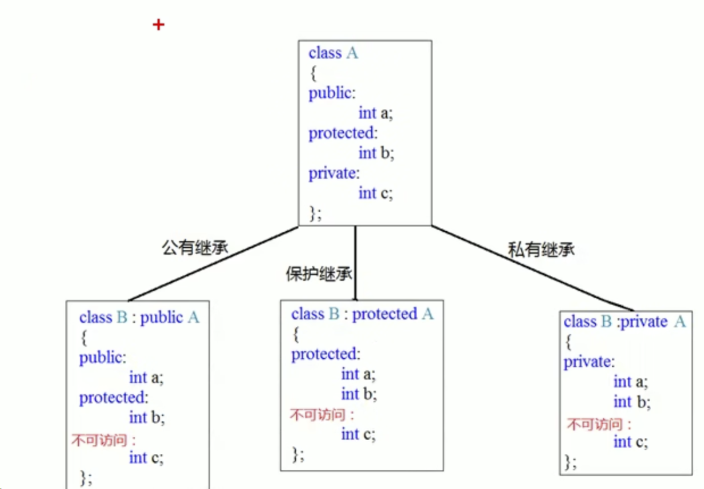

#### ==6.6.2 继承中的对象模型==

> **问题：**从父类继承过来的成员，哪些属于子类对象中？
>
> ​	**==父类中所有*非静态成员属性*都会被子类继承下去，==**
>
> ##### 子类通常继承以下内容：
>
> 1. **公有（Public）成员**：在公有继承中，基类的公有成员会成为派生类的公有成员。
> 2. **保护（Protected）成员**：在公有继承中，基类的保护成员会成为派生类的保护成员。
> 3. **成员函数（包括虚函数）**：基类的所有成员函数**（不包括构造函数、析构函数、重载的赋值运算符和友元函数）**都会被派生类继承。如果基类的**成员函数是虚函数**，派生类中的对应函数也将是虚函数，无论是否使用`virtual`关键字。子类中`override` 关键字（C++11 引入）用于显式指示重写基类的虚函数。
>
> ##### 子类不会继承以下内容：
>
> 1. **构造函数和析构函数**：这些函数是不被继承的。
> 2. **重载的赋值运算符**：像`operator=`这样的重载运算符不会被继承。
> 3. **友元函数**：友元关系不是继承的。
> 4. **私有（Private）成员**：基类的私有成员不会成为派生类的直接成员，但派生类通过基类的公有和保护成员函数可以间接访问它们。
>
> 父类中**私有成员也是被子类继承下去了**，只是由编译器给隐藏后访问不到。

#### 6.6.3 继承中构造和析构顺序

> 子类继承父类后，**当创建子类对象，也会调用父类的构造函数**
>
> 问题：父类和子类的构造和析构顺序是谁先谁后？
>
> 
>
> 总结：**继承中 先调用父类构造函数，再调用子类构造函数，析构顺序与构造相反**


#### 6.6.4 继承中同名成员处理方式

> 问题：当子类与父类出现同名的成员，**如何通过子类对象，访问到子类或父类中同名的数据呢？**
>
> * 访问子类同名成员   直接访问即可
>
> * 访问父类同名成员   需要加作用域
>
>   `s.Base::m_A`
>
> 总结：
>
> 1. 子类对象可以直接访问到子类中同名成员
> 2. 子类对象加作用域可以访问到父类同名成员
> 3. **当子类与父类拥有同名的成员函数**，**子类会隐藏父类中所有版本的同名成员函数**，加**作用域**可以访问到父类中同名函数
>
> 
>
> 总结：**同名静态成员**处理方式和非静态处理方式一样，**只不过有两种访问的方式**（通过对象 和 **通过类名**）


#### 6.6.5 **多继承和菱形继承**


> C++允许**一个类继承多个类**
>
> 语法：` class 子类 ：继承方式 父类1 ， 继承方式 父类2...`
>
> 多继承可能会引发父类中有同名成员出现，需要加作用域区分
>
> 
>
> #### **C++实际开发中不建议用多继承**
>
> 
>
> **菱形继承概念：**
>
> ​	两个派生类继承同一个基类
>
> ​	又有某个类同时继承者两个派生类
>
> ​	这种继承被称为菱形继承，或者钻石继承
>
> 
>
> **典型的菱形继承案例：**
>
> 
>
> 
>
> 
>
> **菱形继承问题：**
>
> 1. 羊继承了动物的数据，驼同样继承了动物的数据，当草泥马使用数据时，就会产生二义性。
>
> 2. 草泥马继承自动物的数据**继承了两份**，其实我们应该清楚，这份数据我们只需要一份就可以。
>
>    
>
> ​	利用虚继承可以解决菱形继承问题
>
> - 使用虚继承之后，数据只有一份了
> - vbptr **虚基类指针**，指向 vbtable **虚基类表**，表中记录了偏移量，因此最终指向的是同一份数据
>
> 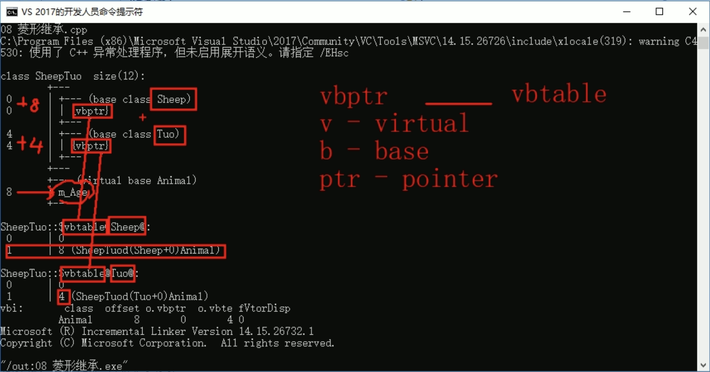
>
> 
>
> **示例：**
>
> ```C++
> class Animal
> {
> public:
> 	int m_Age;
> };
> 
> //继承前加virtual关键字后，变为虚继承，可解决菱形继承的问题
> //此时公共的父类Animal称为虚基类
> class Sheep : virtual public Animal {};
> class Tuo   : virtual public Animal {};
> class SheepTuo : public Sheep, public Tuo {};
> 
> void test01()
> {
> 	SheepTuo st;
> 	st.Sheep::m_Age = 100;
> 	st.Tuo::m_Age = 200;
> 
> 	cout << "st.Sheep::m_Age = " << st.Sheep::m_Age << endl;
> 	cout << "st.Tuo::m_Age = " <<  st.Tuo::m_Age << endl;
> 	cout << "st.m_Age = " << st.m_Age << endl;
> }
> 
> 
> int main() {
> 
> 	test01();
> 
> 	system("pause");
> 
> 	return 0;
> }
> ```
>
> 
>
> 总结：
>
> * 菱形继承带来的主要问题是子类继承两份相同的数据，导致资源浪费以及毫无意义
> * 利用虚继承可以解决菱形继承问题
>
> 

#### 6.6.6 虚继承

> 在 C++ 中，虚继承是一种特殊的继承方式，主要用于解决多重继承中的“菱形继承问题”（Diamond Problem）。**这个问题出现在当两个派生类继承自同一个基类，并且又有一个类继承自这两个派生类时，基类的数据会在最终派生类中出现两次，导致资源浪费和访问歧义。**
>
> ### 菱形继承问题
>
> 考虑以下情况：
>
> ```cpp
> class Base {
> public:
>     int data;
> };
> 
> class Derived1 : public Base { /* ... */ };
> class Derived2 : public Base { /* ... */ };
> 
> class FinalDerived : public Derived1, public Derived2 { /* ... */ };
> ```
>
> 在这种情况下，`FinalDerived` 类会从两个路径继承 `Base` 类（通过 `Derived1` 和 `Derived2`），导致 `Base` 类中的成员在 `FinalDerived` 中存在两份拷贝。
>
> ### 虚继承
>
> 虚继承通过关键字 `virtual` 引入，它确保无论基类被继承了多少次，最终派生类中都只有一份基类的成员。
>
> #### 修改后的例子
>
> ```cpp
> class Base {
> public:
>     int data;
> };
> 
> class Derived1 : virtual public Base { /* ... */ };
> class Derived2 : virtual public Base { /* ... */ };
> 
> class FinalDerived : public Derived1, public Derived2 { /* ... */ };
> ```
>
> 在这个例子中，`Derived1` 和 `Derived2` 都是通过虚继承继承自 `Base`，这意味着 `FinalDerived` 中只会有一份 `Base` 的成员。
>
> ### 虚继承的特点
>
> 1. **共享基类**：通过虚继承，**所有派生类共享同一个基类对象**，而不是每个派生类都有自己的基类对象副本。
>
> 2. **初始化控制**：在虚继承中，最终派生类负责初始化虚基类。这意味着虚基类的构造函数只会被最终派生类调用一次。
>
> 3. **内存布局复杂**：虚继承使得类的内存布局变得更加复杂，因为它需要维护虚基类表（vtable）来处理对共享基类成员的访问。
>
> 4. **性能考虑**：由于虚继承的额外开销，它可能会导致性能上的轻微下降。因此，**只有在确实需要解决菱形继承问题时才应该使用虚继承。**
>
> ### **总结**
>
> 虚继承是 C++ 提供的一种特殊的继承机制，用于解决多重继承中的菱形继承问题。虽然它增加了类的复杂性和运行时开销，但在某些情况下，使用虚继承是解决问题的有效方式。理解虚继承的工作原理和使用场景对于编写正确和高效的面向对象代码非常重要。


### ==6.7 多态==

一个**接口（函数）**有多种形态，**不同的子类调用这个函数时，显示的内容不一样**

#### 6.7.1 多态的基本概念

> **多态是C++面向对象三大特性之一**
>
> 多态分为两类
>
> * 静态多态: **函数重载** 和 **运算符重载**属于静态多态，复用函数名
> * ⭐️动态多态: **派生类**和**虚函数**实现运行时多态
>
> 
>
> 静态多态和动态多态区别：（静态联编与动态联编）
>
> C++ 实现多态主要有两种形式：**静态多态（编译时多态）和动态多态（运行时多态）**
>
> * 静态多态的函数地址**早绑定**  -  编译阶段确定函数地址
> * 动态多态的函数地址**晚绑定**  -  **运行阶段确定函数地址**
>
> 
>
> 下面通过案例进行讲解多态
>
> ```C++
> class Animal
> {
> public:
> 	//Speak函数就是虚函数
> 	//函数前面加上virtual关键字，变成虚函数，那么编译器在 编译的时候 就不能确定函数调用了，实现晚绑定
> 	virtual void speak()
> 	{
> 		cout << "动物在说话" << endl;
> 	}
> };
> 
> class Cat :public Animal
> {
> public:
> 	void speak()
> 	{
> 		cout << "小猫在说话" << endl;
> 	}
> };
> 
> class Dog :public Animal
> {
> public:
> 
> 	void speak()
> 	{
> 		cout << "小狗在说话" << endl;
> 	}
> 
> };
> 
> //我们希望传入什么对象，那么就调用什么对象的函数
> //如果函数地址 在编译阶段 就能确定，那么静态联编
> //如果函数地址 在运行阶段 才能确定，就是动态联编
> 
> void DoSpeak(Animal &animal)
> {
> 	animal.speak();  //也即 speak（）函数的地址  在运行阶段 才能确定，看传的是什么
> }
> 
> //多态满足条件： 
> //1、有继承关系
> //2、子类 重写 父类中的虚函数,     重写：函数返回值类型、函数名、参数列表 完全相同
> //  子类里重写的虚函数 可写可不写 virtual
> 
> //多态使用：
> // 父类指针或引用 指向子类对象   
> // Animal &animal = cat
> 
> void test01()
> {
> 	Cat cat;
> 	DoSpeak(cat);
> 
> 
> 	Dog dog;
> 	DoSpeak(dog);
> }
> 
> 
> int main() {
> 
> 	test01();
> 
> 	system("pause");
> 
> 	return 0;
> }
> ```
>
> 总结：
>
> ##### 多态满足条件
>
> * 有继承关系
> * **子类重写父类中的虚函数**
>
> ##### 多态使用条件
>
> * **==父类指针或引用指向子类对象==**
>
> 重写：函数返回值类型  函数名 参数列表 完全一致称为重写
>
> 
>
> *空类的大小是1* 


#### ==6.7.2 多态的原理==

> 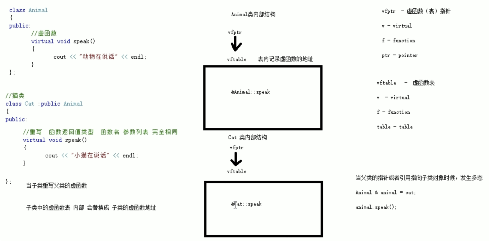
>
> 当子类没重写父类虚函数的时候，子类中虚函数表继承的是父类的内容。（见下面详解）


> ### 虚函数
>
> - 在基类中使用 `virtual` 关键字声明的函数。
> - 派生类可以重写（`Override`）这些函数以提供特定于类的行为。
>
> 
>
> 在 C++ 中==实现动态多态的核心机制==是**虚函数表**（Virtual Table，通常称为 vtable）和**虚函数表指针**（Virtual Table Pointer，通常称为 vptr）。这些概念是理解 C++ 中动态多态如何工作的关键。
>
> ### 虚函数表（vtable）
>
> 每个包含虚函数的类都有一个称为虚函数表（vtable）的**静态数组**。
>
> 因此存放在全局区 （常量区）
>
> vtable为类的每个虚函数包含一个入口，这些入口是指向虚函数实现的指针。如果类继承自其他类，则其vtable还会包含对基类虚函数的指针。
>
> - **vtable的创建**：在编译时，编译器为每个含虚函数的类创建一个vtable。如果类被继承，编译器可能会调整vtable以反映新的函数重写。
>
> - **vtable的内容**：vtable包含指向类的虚函数的指针。这些指针指向函数的实际代码。
>
>   
>
> **当类中包含至少一个虚函数时**，编译器**为这个类**创建一个虚函数表**。这个表是一个**函数指针数组**，每个**指针指向类中一个虚函数的实现。如果派生类重写了这些函数，vtable 中相应的指针会指向派生类中的函数。
>
> 1. **目的**：vtable **使得在运行时可以确定应该调用哪个函数**，从而实现动态绑定。
> 2. **存储**：通常，==每个含虚函数的类都有自己的 vtable，而且类的所有实例共享同一个 vtable。==
>
> ### 虚函数表指针（vptr）
>
> 每个含有虚函数的类的对象在被创建时，都会包含一个隐式的指针（vptr），指向该类的 vtable。vptr 的设置和更新都是由编译器自动完成的。
>
> 1. **初始化**：在构造函数中，vptr 被设置为指向对应类的 vtable。
> 2. **继承中的更新**：如果有派生类重写了虚函数，派生类的构造函数会更新 vptr，使其指向派生类的 vtable。
>
> 
>
> 在 C++ 中，**每个含虚函数的类都有自己的独立虚函数表（vtable），而每个对象都有一个指向其对应类的 vtable 的虚函数表指针（vptr）**。**这意味着基类和派生类各自拥有各自的 vtable，即使派生类继承自基类。**


> ### 基类和派生类的 vtable
>
> 1. **基类**：对于一个含有虚函数的基类，编译器会为其创建一个 vtable。这个表包含了基类中所有虚函数的地址。
>
> 2. **派生类**：如果派生类重写了基类的虚函数，或者添加了新的虚函数，**编译器也会为派生类创建一个 vtable。这个表包含：**
>     - **派生类重写的虚函数的地址**。
>     - 从基类继承的**未被重写的虚函数的地址**。
>     - **派生类新增的虚函数的地址**。
>
> ### 对象的 vptr
>
> - **每个对象都有一个 vptr**，**指向其类的 vtable**。当创建一个对象时，构造函数会设置这个对象的 vptr 指向正确的 vtable。**对于派生类对象，即使它是通过基类的指针或引用被操作，它的 vptr 也指向派生类的 vtable。**
>
> ### 示例
>
> 假设有一个基类 `Base` 和一个从 `Base` 派生的类 `Derived`，每个类都有一个虚函数 `func`。
>
> ```cpp
> class Base {
> public:
>     virtual void func() { /* ... */ }
>     // vptr 指向 Base 的 vtable
> };
> 
> class Derived : public Base {
> public:
>     void func() override { /* ... */ }
>     // vptr 指向 Derived 的 vtable
> };
> ```
>
> 在这个例子中，`Base` 和 `Derived` 类各自有各自的 vtable。`Base` 的 vtable 包含 `Base::func` 的地址，而 `Derived` 的 vtable 包含 `Derived::func` 的地址。每个 `Base` 或 `Derived` 类的对象都有一个 vptr，分别指向各自类的 vtable。
>
> ### 总结
>
> - 基类和派生类各自有各自的虚函数表（vtable）。
> - 每个对象都有一个虚函数表指针（vptr），指向其类的 vtable。
> - 当派生类重写基类的虚函数时，派生类的 vtable 会包含这些重写函数的地址，而基类的 vtable 保持不变。
> - 这种机制支持了 C++ 的运行时多态性，即通过基类指针或引用调用派生类的方法。
>
> 
>
> ==*为什么是基类的指针指向子类对象呢，是不是这个指针指向的对象不同，它的vptr也不同，因此指向的vtable也不同*==
>
> 是的，您的理解是正确的。在 C++ 中，当使用基类的指针或引用指向一个派生类的对象时，虚函数的调用机制确实如您所描述。这是 C++ 支持运行时多态性的关键。
>
> 
>
> ### 虚函数调用机制的详细解释
>
> 1. **基类指针和派生类对象**：
>    - 当使用**基类类型的指针（或引用）指向派生类对象时**，这个指针的静态类型是基类，但它的动态类型是派生类。
>    - 也就是说，**虽然指针的类型是基类，但它实际上指向的是派生类的对象**。
>
> 2. **vptr 的设置**：
>    - 在**构造派生类对象时，对象的 vptr 被设置为指向派生类的 vtable。这是在构造过程中由编译器自动完成的**。
>    - 因此，即使是通过基类的指针或引用来操作这个对象，**由于 vptr 指向派生类的 vtable，调用的将是派生类中重写的虚函数。**
>
> 3. **动态绑定**：
>    - ==调用虚函数时，程序运行到那一点，会根据对象的 vptr 所指向的 vtable 来决定实际调用的函数版本。==
>    - 如果**派生类重写了虚函数**，**则 vtable 中会包含指向派生类中该函数实现的指针**。因此，实际调用的将是**派生类中的版本**。
>
> ### 示例分析
>
> 在您的示例中：
>
> ```cpp
> Base* obj = new Derived();
> obj->virtualFunction();
> ```
>
> - `obj` 是一个类型为 `Base*` 的指针，但它实际指向一个 `Derived` 类型的对象。
> - 当通过 `obj` 调用 `virtualFunction()` 时，程序会查看 `obj` **指向的对象**（即 `Derived` 类型的对象）的 vptr。
> - 由于 `obj` 指向的是 `Derived` 类型的对象，它的 vptr 指向 `Derived` 类的 vtable。
> - 在 `Derived` 类的 vtable 中，`virtualFunction` 对应的条目指向 `Derived` 类中该函数的实现。
> - 因此，调用的是 `Derived` 类中重写的 `virtualFunction` 方法。
>
> **总结**
>
> 在 C++ 中，虚函数的这种调用机制实现了**动态绑定**，**使得我们可以通过基类的接口来操作不同派生类的对象**。这是实现运行时多态的基础，是面向对象编程中的一个重要特性。**不同的对象（即使是通过相同的基类指针或引用操作）可以有不同的行为，这取决于对象的实际类型。**
>
> **重要性**
>
> 虚函数表和虚函数表指针是 C++ 实现运行时多态的关键。这种机制使得函数的动态绑定成为可能，也就是说，直到运行时才确定调用哪个函数。这增加了程序的灵活性和可扩展性，但也带来了一定的性能开销（如额外的内存和间接函数调用）。
>
> **总结**
>
> 虚函数表和虚函数表指针是 C++ 动态多态的基础。通过 vtable 和 vptr，C++ 程序能够在运行时确定正确的函数调用，从而实现基类指针或引用对派生类对象的透明操作。这是面向对象编程中多态性的重要体现。


> ### 不写成虚函数的情况
>
> 在 C++ 中，如果基类中的成员函数不是虚函数（即没有使用 `virtual` 关键字声明），那么即使通过指向派生类对象的基类指针或引用调用这个函数，也只会调用基类中定义的版本，而不是派生类中可能存在的同名函数。这种机制被称为**静态绑定。**
>
> ### 静态绑定
>
> **静态绑定意味着函数调用在==编译==时就已经确定了**。编译器根据**指针或引用的静态类型**（**声明类型**）来决定调用哪个函数，**而不是基于运行时对象的实际类型。**
>
> ```cpp
> class Base {
> public:
>     void function() {
>         std::cout << "Base function" << std::endl;
>     }
> };
> 
> class Derived : public Base {
> public:
>     void function() {
>         std::cout << "Derived function" << std::endl;
>     }
> };
> 
> Base* basePtr = new Derived();
> basePtr->function();  // 调用 Base::function，而非 Derived::function
> ```
>
> 在这个例子中，即使 `basePtr` 实际上指向一个 `Derived` 类型的对象，它依然调用 `Base` 类中的 `function` 方法。
>
> ### 动态绑定（多态）
>
> 与静态绑定相对的是动态绑定，**它允许在运行时根据对象的实际类型决定调用哪个函数**。为了实现动态绑定，**需要使用虚函数。**
>
> ```cpp
> class Base {
> public:
>     virtual void function() {
>         std::cout << "Base function" << std::endl;
>     }
> };
> 
> class Derived : public Base {
> public:
>     void function() override {
>         std::cout << "Derived function" << std::endl;
>     }
> };
> 
> Base* basePtr = new Derived();
> basePtr->function();  // 现在调用 Derived::function
> ```
>
> 在这个例子中，由于 `function` 被声明为虚函数，所以调用 `basePtr->function()` 时会根据 `basePtr` 实际指向的对象类型（在本例中为 `Derived`）来调用相应的函数。
>
> ### 总结
>
> 在没有使用虚函数的情况下，通过基类指针或引用调用成员函数时，**会发生静态绑定，即总是调用基类中的版本**。这限制了多态的使用。为了实现多态，允许在运行时根据对象的实际类型调用相应的成员函数，应使用虚函数。


> ### 如果在派生类（子类）中没有重写基类（父类）的虚函数，那么会发生以下情况：
>
> 1. **继承基类的实现**：派生类会继承基类中的虚函数实现。也就是说，如果派生类没有提供自己的实现，那么基类的实现将被使用。
>
> 2. **虚函数表（vtable）**：在派生类的虚函数表中，对于未被重写的虚函数，虚函数表中相应的条目将指向基类中的函数实现。这意味着当通过派生类的对象或指针调用这个虚函数时，将执行基类中定义的版本。
>
> ### 示例
>
> ```cpp
> class Base {
> public:
>     virtual void func() {
>         std::cout << "Base func" << std::endl;
>     }
> };
> 
> class Derived : public Base {
>     // 没有重写 func()
> };
> 
> Base* obj = new Derived();
> obj->func();  // 将调用 Base::func()
> delete obj;
> ```
>
> 在这个示例中，由于 `Derived` 类没有重写 `func()` 函数，所以当通过指向 `Derived` 对象的 `Base` 类型指针调用 `func()` 时，将会执行 `Base` 类中定义的 `func()`。
>
> ### 补充说明
>
> - **继承虚函数的行为**：即使派生类没有重写基类的虚函数，该函数在派生类中仍然是虚函数。如果有另一个类从 `Derived` 派生并重写了这个函数，该重写将会被使用。
>
> - **重要性**：了解虚函数和虚函数表的工作原理对于理解 C++ 中多态性的行为非常重要。它确保了即使派生类没有提供特定的虚函数实现，多态性仍然可以正常工作。
>
> ### 总结
>
> 如果派生类中没有重写基类的虚函数，那么该派生类将继承基类的虚函数实现。在派生类的虚函数表中，未被重写的虚函数将指向基类中的实现。这确保了通过派生类对象或指针调用这些函数时，基类的行为将被执行。
>
> ### 这种情况也是动态绑定
>
> 是的，即使派生类没有重写基类的虚函数，通过派生类对象或指针调用这个虚函数时仍然发生动态绑定。这是因为虚函数的调用解析是在运行时进行的，而不是在编译时。
>
> ### 动态绑定的工作原理
>
> 在 C++ 中，当调用一个虚函数时：
>
> 1. **运行时决定**：编译器会在运行时查看对象的虚函数表（vtable）来决定应该调用哪个函数实现。
> 2. **基于对象类型**：如果通过派生类的指针或引用调用虚函数，即使派生类没有重写这个函数，程序也会根据该对象的实际类型（派生类）查找对应的虚函数表。
> 3. **查找虚函数表**：如果派生类没有重写基类的虚函数，派生类的虚函数表中对应的条目会指向基类的函数实现。
>
> ### 示例
>
> 考虑以下代码：
>
> ```cpp
> class Base {
> public:
>     virtual void func() {
>         std::cout << "Base func" << std::endl;
>     }
> };
> 
> class Derived : public Base {
>     // 没有重写 func()
> };
> 
> Base* basePtr = new Derived();
> basePtr->func();  // 动态绑定调用 Base::func()
> delete basePtr;
> ```
>
> 即使 `Derived` 类没有重写 `func()`，通过 `basePtr` 调用 `func()` 时仍发生动态绑定。虽然调用的是 `Base` 类中的实现，但这个决定是在运行时根据 `basePtr` 指向的对象类型（这里是 `Derived` 类型）做出的。
>
> ### 总结
>
> 在 C++ 中，虚函数机制保证了即使派生类没有重写基类的虚函数，通过派生类对象或指针调用这个函数时，仍然进行动态绑定。动态绑定确保了虚函数调用总是基于对象的实际类型，这是实现多态性的关键。


#### 6.7.2 （扩展）虚函数内存布局相关

##### **1. 一个类有几个虚函数表？一个类的对象有几个虚函数表指针？**

> 一个类没有继承父类，就只有一个虚函数表，它的对象也只有一个虚函数表指针。
>
> 一个类**继承了几个父类，就有几个虚函数表**，一个类**有几个虚函数表，就有几个虚函数表指针**
>
> 
>
> 理解一个类在继承多个父类时所涉及的虚函数表（vtable）和虚函数表指针（vptr）的数量，需要考虑C++中多重继承的机制和虚函数的工作原理。这里有一些关键的概念和规则：
>
> ### 多重继承与虚函数表
>
> 在C++的多重继承中，如果一个类继承自多个基类，并且这些基类中至少有一个拥有虚函数，那么：
>
> 1. **每个基类一个vtable**：每个基类都会有自己的虚函数表。如果派生类重写了这些基类中的虚函数或者添加了新的虚函数，派生类也会有自己的虚函数表。
>
> 2. **继承来的vtable**：派生类对象会包含多个虚函数表，分别对应它所继承的每个基类。这意味着，如果一个类继承了几个拥有虚函数的父类，它就会有几个虚函数表。
>
> ### 虚函数表指针
>
> 与虚函数表相对应，派生类对象在内存中会有：
>
> 1. **每个基类一个vptr**：每个基类对应的部分在派生类对象中都有一个虚函数表指针（vptr），指向相应的虚函数表。因此，如果一个类继承了多个带有虚函数的基类，它的每个实例就会有多个vptr。
>
> 2. **vptr的布局**：在派生类对象的内存布局中，**每个基类的vptr一般位于对应于该基类部分的开始位置。**
>
> ### 例子
>
> 考虑以下情况：
>
> ```cpp
> class Base1 {
>     virtual void func();
> };
> 
> class Base2 {
>     virtual void func();
> };
> 
> class Derived : public Base1, public Base2 {
>     void func() override;
> };
> ```
>
> 在这个例子中，`Base1` 和 `Base2` 都有自己的虚函数表。当 `Derived` 类继承这两个类时，它将继承这两个虚函数表。因此，`Derived` 类的每个对象将有两个vptr，分别指向 `Base1` 和 `Base2` 的虚函数表。如果 `Derived` 重写了这些函数或添加了新的虚函数，它还将拥有自己的虚函数表。
>
> ### 注意事项
>
> - **编译器依赖**：虚函数表和虚函数表指针的具体实现细节依赖于编译器，不同的编译器可能有不同的实现方式。
> - **内存开销**：多重继承可能导致更大的内存开销，因为每个对象需要存储更多的vptr。
> - **设计考虑**：在设计使用多重继承的类时，需要考虑这些因素以及可能的复杂性。
>
> 了解这些规则可以帮助更好地理解C++中多重继承和虚函数的工作原理，以及它们对类设计和对象内存布局的影响。这些规则可能因编译器的具体实现而有所不同，因为C++标准没有规定虚函数表和虚函数表指针的具体实现细节。


##### 2. 一个类对象的虚函数表指针  在类对象的内存布局

> 类对象的**虚函数表指针**，按照继承父类的顺序，从对象的**首地址**开始依次排布。
>
> 
>
> 如果是说我这个对象中有多个虚函数表的指针，那这个多个指针是如何排列的呢。为什么会有多个虚函数表的指针，其实就是他这个类有多个虚函数表，为什么会有多个虚函数表呢，根据上一点我们可以知道，因为它继承了多个有虚函数的父类。那按照他的这个继承的顺序继承了，比如继承了多少个有虚函数表的父类，那它就有多少个对应的虚函数指针。**按照他这个继承的这个顺序，这个虚函数表的这个指针就依次的排列。**
>
> 就比如说我这个类A继承了BCD，BCD都是有这个虚函数的父类，那对应的BCD都会有对应的一个指针，在这个虚函数表的指针存放在A中，所以A中会有三个虚函数表的指针，那这个三个虚函数表的指针是如何排列的呢，首先它一定是从首地址开始的，首地址呢继继承的第一个这个虚函数表的指针，就是B这个表对应的一个虚函数表的指针，接下来是C对应C的这个父类对应的一个xu函数表指针，他们**依次从首地址开始去进行一个排布的**。
>
> 
>
> 
>
> 在C++中，当一个类包含虚函数时，其对象在内存中的布局通常包括一个或多个虚函数表指针（vptr）。这些指针指向相应的虚函数表（vtable），用于支持运行时多态。下面是关于虚函数表指针在类对象内存布局中的位置的一般描述：
>
> ### 类对象的内存布局
>
> 1. **虚函数表指针 (vptr)**: 
>    - 对于包含虚函数的类，其对象的内存布局通常在最开始的部分包含一个vptr。
>    - 在多重继承的情况下，如果一个类继承自多个包含虚函数的基类，那么每个基类对应的部分都会有一个vptr。
>
> 2. **数据成员**:
>    - 在vptr之后是类的数据成员。这些成员的布局顺序通常遵循它们在类定义中的声明顺序。
>    - 在继承的情况下，基类的数据成员通常会先于派生类的数据成员放置。
>
> ### 示例
>
> 假设我们有如下类定义：
>
> ```cpp
> class Base {
> public:
>     virtual void func() {}
>     int baseData;
> };
> 
> class Derived : public Base {
> public:
>     void func() override {}
>     int derivedData;
> };
> ```
>
> 对于这个例子，`Derived` 类的对象在内存中的布局可能如下：
>
> ```diff
> +------------------+ <- 对象开始
> | vptr to vtable   |
> +------------------+
> | baseData         |
> +------------------+
> | derivedData      |
> +------------------+
> ```
>
> - `vptr`: 指向包含`Derived::func`等函数指针的虚函数表。
> - `baseData`: 从基类 `Base` 继承的数据成员。
> - `derivedData`: `Derived` 类自己的数据成员。
>
> ### 注意事项
>
> - **编译器依赖**：虚函数表指针和虚函数表的确切布局细节依赖于编译器的具体实现。不同的编译器可能会有不同的实现方式。
> - **优化和调整**：编译器可能会对类的内存布局进行优化或调整，以提高内存访问效率或满足平台特定的对齐要求。
>
> 理解虚函数表指针在类对象的内存布局中的位置对于深入理解C++的多态机制和内存模型是非常重要的。虽然这些细节在平时的应用编程中不常直接处理，但在进行底层编程或调试时非常关键。


##### 3. 虚函数表中的函数的排布总体原则

> 1. 虚函数按照其声明顺序存放在表中
>
> 2. 单继承中父类的虚函数在子类的虚函数前面，依次按照声明顺序排列，共同形成一张表
>
> 3. 多继承中，子类的虚表和第一个继承的父类合并成一张表。剩下的父类单独形成虚函数表
>
> 4. 一个类没有继承父类，就只有一个虚函数表，它的对象也只有一个虚函数表指针。
>
>    一个类**继承了几个父类，就有几个虚函数表**，一个类**有几个虚函数表，就有几个虚函数表指针**。虚函数表指针在内存中的布局按照继承的父类的顺序排布。第一个虚函数表指针位于对象的首地址。
>
> 5. 子类中如果有和父类相同的虚函数，会对父类的虚函数进行覆盖。
>
> 


##### 4. 虚函数表是在哪个阶段建立的

> 虚函数表（vtable）是C++中实现多态性的一个关键机制。
>
> **虚函数表的建立发生在编译阶段，具体可以分为以下几个步骤：**
>
> ### 1. 编译阶段
>
> 在编译阶段，编译器会为每个包含虚函数的类创建一个虚函数表。**虚函数表是一个静态数组，包含了指向类的虚函数的指针。每个类的类型都有自己的虚函数表。**
>
> ### 2. 类的构造过程
>
> 当创建类的对象时，编译器会在对象内存中设置一个指针（通常称为vptr，虚函数表指针），指向相应类的虚函数表。这通常发生在对象的构造过程中。
>
> - 对于非继承的类，vptr直接指向该类的虚函数表。
> - 对于继承的情况，如果派生类重写了基类的虚函数，vptr将指向派生类的虚函数表，该表包含了指向派生类重写函数的指针以及从基类继承的其他虚函数的指针。
>
> ### 3. 程序运行时
>
> 虽然虚函数表是在编译时创建的，但多态性（即通过基类指针或引用调用派生类的虚函数）是在运行时实现的。当通过基类的指针或引用调用虚函数时，程序会使用vptr来定位对象的vtable，并通过vtable调用适当的函数实现。
>
> ### 总结
>
> - 虚函数表是在编译阶段为每个包含虚函数的类创建的。
> - 类的每个对象在构造时会设置一个指向相应虚函数表的指针（vptr）。
> - 虚函数的动态绑定（多态性）是在程序运行时通过虚函数表实现的。
>
> 虚函数表是C++实现多态的基础，它允许在运行时动态地选择正确的方法来执行。虽然虚函数表的具体实现细节依赖于编译器，但理解其基本工作原理对于深入理解C++的面向对象特性非常重要。


#### 6.7.3 纯虚函数和抽象类

> 在多态中，**通常父类中虚函数的实现是毫无意义的，主要都是调用子类重写的内容**
>
>  
>
> 因此可以将虚函数改为**纯虚函数**
>
> **纯虚函数**语法：`virtual 返回值类型 函数名 （参数列表）= 0 ;`
>
> 当类中有了纯虚函数，这个类也称为==抽象类==
>
> 
>
> **抽象类特点**：
>
>  * **无法实例化对象**
>  * 子类必须**重写抽象类中的纯虚函数，否则也属于抽象类**


#### ==6.7.4 虚析构和纯虚析构==

> “*没有虚构造函数*”，在 C++ 中，构造函数不能是虚函数，因为构造对象时必须知道对象的确切类型，而虚函数机制是在对象已经构造后才能工作的。对于需要**运行时多态构造对象**的场景，通常采用工厂方法或其他设计模式。


> **多态使用时**，**如果子类中有属性开辟到堆区**，那么**父类指针在释放时无法调用到子类的析构代码**
>
> 
>
> 解决方式：将父类中的析构函数改为**虚析构**或者**纯虚析构**
>
> 虚析构和纯虚析构共性：
>
> * 可以**解决父类指针释放子类对象**
> * **都需要有具体的函数实现**
>
> 虚析构和纯虚析构区别：
>
> * 如果是纯虚析构，该类属于抽象类，无法实例化对象
>
> 
>
> ##### 虚析构语法：
>
> `virtual ~类名(){}`
>
> ##### 纯虚析构语法：
>
> 纯虚析构，**需要有声明，也需要有实现**，声明在类内，**类外写个实现**
>
> ` virtual ~类名() = 0;`
>
> `类名::~类名(){}`
>
> 子类中有堆区数据，多态的时候，不使用父类虚析构或纯虚析构的话，**走不到子类的析构函数**
>
>   
>
> 
>
> 总结：
>
> ​	1. 虚析构或纯虚析构就是用来**解决通过父类指针释放子类对象**
>
> ​	2. ~~如果**子类中没有堆区数据，可以不写为虚析构或纯虚析构**~~==不严谨，详见下文==
>
> ​	3. 拥有**纯虚析构函数**的类也属于抽象类，无法实例化对象
>
> 
>
> 
>
> 在 C++ 中，**虚析构函数**是多态行为的一个重要组成部分，尤其是当涉及到**继承和动态内存分配**时。虚析构函数的工作原理与虚函数和虚函数表（vtable）密切相关。
>
> ### 虚函数和虚函数表
>
> 1. **虚函数**：在基类中使用 `virtual` 关键字声明的成员函数。**它们允许派生类提供针对相同函数调用的不同实现。**
>
> 2. **虚函数表（vtable）**：**每个含有虚函数的类都有一个虚函数表**。这是一个编译器自动生成的表，包含指向类中每个虚函数实际实现的指针。
>
> 3. **虚函数表指针（vptr）**：**每个对象都有一个指针**（vptr），指向其类的虚函数表。当调用虚函数时，实际调用的函数是通过 vptr 和 vtable 确定的。
>
> ### 虚析构函数的工作原理
>
> 当将析构函数声明为虚时，它**也会被放入类的 vtable 中**。这就允许动态类型的确定，即在运行时确定应调用哪个析构函数。
>
> 1. **基类中的虚析构函数**：
>     - 当基类的析构函数声明为 `virtual`，派生类的析构函数（无论是否显式声明为 `virtual`）都会成为虚函数，并被放入 vtable 中。
>
> 2. **通过基类指针删除派生类对象**：
>     - 当通过基类指针删除派生类对象时，运行时会查看对象的 vptr，从而确定要调用的析构函数。
>     - **如果基类析构函数是虚的，vptr 会指向正确的 vtable，因此会调用正确的析构函数（即派生类的析构函数），然后是基类的析构函数。**
>
> 3. **防止资源泄露**：
>     - 这种机制**确保了即使是通过基类指针删除对象，派生类特有的资源也能被正确释放，**防止内存泄露或其他资源管理问题。
>
> ### 示例
>
> ```cpp
> class Base {
> public:
>     virtual ~Base() {
>         // 基类的析构代码
>     }
> };
> 
> class Derived : public Base {
> public:
>     ~Derived() {
>         // 派生类的析构代码
>     }
> };
> 
> Base* obj = new Derived();
> delete obj;  // 首先调用 Derived 的析构函数，然后是 Base 的析构函数
> ```
>
> 在这个示例中，由于 `Base` 类的析构函数是虚的，所以当通过 `Base*` 类型的指针 `obj` 删除 `Derived` 类型的对象时，会先调用 `Derived` 类的析构函数来释放派生类特有的资源，然后调用 `Base` 类的析构函数。
>
> ### 总结
>
> 虚析构函数确保当通过基类指针删除派生类对象时，能够按照正确的顺序调用派生类和基类的析构函数。这是通过虚函数和虚函数表的机制实现的，保证了基于继承的多态行为的安全性和正确性。在设计涉及继承的类时，如果预期会通过基类指针来管理对象，声明虚析构函数是非常重要的。
>
> 
>
> 即使子类中没有直接分配的堆区数据，将基类的析构函数声明为虚函数仍然是一个良好的实践，特别是在涉及继承和多态时。
>
> ### 理由如下：
>
> 1. **未来的扩展**：即使当前的子类没有分配堆内存，**将来对类的修改可能会加入这样的操作**。如果基类析构函数已经被声明为虚析构函数，那么这种修改不会影响代码的安全性。
> 2. **多态性**：在多态使用场景中，经常通过基类的指针或引用来操作派生类对象。如果基类析构函数不是虚的，那么通过基类指针删除派生类对象时，只会调用基类的析构函数，**忽略派生类的析构函数。这可能导致派生类特有资源的泄漏，即使它们不是堆内存。**
> 3. **维护性和健壮性**：*声明虚析构函数是一个良好的面向对象设计原则，它使得代码更具可维护性和健壮性。即使当前派生类不需要特别的清理操作，保持这一实践可以使代码更加稳定，也更容易理解。*
>
> ### 例外情况：
>
> 如果确定一个类不会被用作基类，或者确信不会涉及多态（即不会通过基类指针来删除派生类对象），那么可以不将析构函数声明为虚函数。然而，**这种情况较少见**，而且通常需要仔细考虑设计的决策。
>
> ### 总结
>
> 虽然子类中没有堆区数据可能不会直接导致资源泄漏，但将基类析构函数声明为虚还是一种良好的实践。这是因为它提供了代码未来扩展的灵活性，并确保了在多态情况下资源的正确管理。在设计面向对象的系统时，考虑到类的继承和多态性是非常重要的。
>
> 
>
> ## 子类可以不显式重写父类的虚函数
>
> 是的，**多态的实现确实依赖于派生类重写基类的虚函数**，但这个概念需要适当地理解。在 C++ 中，多态主要涉及成员函数，尤其是虚函数。析构函数也属于特殊的成员函数，它们在实现多态时有特殊的行为和规则。
>
> ### 多态和虚析构函数
>
> 1. **虚析构函数的多态**：
>     - 当基类定义了虚析构函数时，派生类的析构函数自动成为虚函数，无论是否显式地用 `virtual` 关键字标记。
>     - 在删除指向派生类对象的基类指针时，虚析构函数确保调用正确的析构顺序：首先是派生类的析构函数（即使它是隐式的），然后是基类的析构函数。
>     - 这种机制确保了即使派生类没有显式重写析构函数，多态性也能正确实现，资源也能被正确管理。
>
> 2. **成员函数的多态**：
>     - 对于普通成员函数，多态的实现确实需要派生类**显式重写**基类中声明为 `virtual` 的函数。
>     - 只有当派生类提供了一个同名、同参数的函数时，通过基类指针或引用调用该函数才会体现多态行为，即运行时调用派生类的实现。
>
> ### 示例
>
> ```cpp
> class Base {
> public:
>     virtual ~Base() { /* ... */ }
>     virtual void function() { /* ... */ }
> };
> 
> class Derived : public Base {
> public:
>     void function() override { /* ... */ }  // 显式重写实现多态
>     // 析构函数隐式为虚函数
> };
> 
> Base* obj = new Derived();
> obj->function();  // 多态调用 Derived::function()
> delete obj;       // 调用 Derived::~Derived()，然后是 Base::~Base()
> ```
>
> 在这个例子中，`Derived` 类重写了 `function` 方法来实现多态，但它并没有显式重写析构函数。尽管如此，删除 `obj` 时仍然会首先调用 `Derived` 的析构函数（即使是隐式的），然后是 `Base` 的析构函数，这是多态性的体现。
>
> ### 总结
>
> 在 C++ 中，多态性确实要求派生类重写基类的虚函数**，但对于析构函数，只要基类的析构函数是虚的，派生类的析构函数就自动成为虚析构函数**。这保证了即使没有显式重写析构函数，删除指向派生类对象的基类指针时仍能正确调用析构函数，确保资源的安全管理。


## 7. 模板


## 8. STL 

见 *STL源码剖析* ，*数据结与预算法*

### 8.1 `vector`


#### 8.1 vector的底层实现是array?

> 这里的说法是基本正确的，但需要一些具体化。在C++中，`vector` 是一个动态数组，它的底层实现确实是使用数组（通常是**指针指向动态分配的数组内存**）。`vector` 提供了类似数组的接口，但与普通数组（如 C++ 中的内置数组类型 `array`）相比，`vector` 有几个关键的区别：
>
> 1. **动态大小**：`vector` 可以在运行时改变大小，而内置数组的大小在编译时就固定了。
> 2. **内存管理**：`vector` 会自动管理内存，包括必要时的内存重新分配和释放，而内置数组则没有这些功能。
> 3. **额外的功能**：`vector` 提供了许多便利的成员函数，如 `push_back`、`insert`、`erase` 等，这些在内置数组中都不可用。
>
> 因此，虽然 `vector` 的底层实现使用的是数组，但它提供了更多的功能和灵活性，使得 `vector` 在很多情况下比内置数组更加适用。

#### 8.1（扩展）静态数组与动态数组

> 在C++中，动态数组和静态数组是两种不同的数组类型，它们在使用方式、内存管理和灵活性方面有着本质的区别。
>
> ### 静态数组
>
> 静态数组（Static Array）是在编译时其大小已确定的数组。它在栈上分配内存，并且其大小在整个生命周期内不可改变。
>
> #### 特点
>
> 1. **固定大小**：静态数组的大小在编译时必须已知，并且一旦定义，大小不能改变。
> 2. **栈分配**：通常在栈上分配内存（除非作为全局或静态存储期的变量）。
> 3. **生命周期**：静态数组的生命周期通常与其所在的作用域（例如函数）相同。
> 4. **初始化**：可以在声明时直接初始化。
>
> #### 示例
>
> ```cpp
> int arr[10]; // 静态数组，大小为10
> ```
>
> ### 动态数组
>
> 动态数组（Dynamic Array）是在运行时其大小可以改变的数组。在C++中，`std::vector` 是动态数组的一个例子，它在堆上分配内存，并且可以在运行时动态地扩展或收缩。
>
> #### 特点
>
> 1. **动态大小**：动态数组的大小可以在运行时改变。
> 2. **堆分配**：通常在堆上分配内存，允许运行时分配大量空间。
> 3. **灵活性**：提供了添加、删除和访问元素的灵活接口。
> 4. **自动内存管理**：在C++中，`std::vector` 自动管理内存，包括自动扩容和析构时的内存释放。
>
> #### 示例
>
> ```cpp
> std::vector<int> vec; // 动态数组
> vec.push_back(1); // 添加元素
> vec.push_back(2);
> ```
>
> ### 总结
>
> - **静态数组**：
>   - 在编译时大小已知。
>   - 生命期与定义它的作用域相同。
>   - 在栈上分配内存（通常情况下）。
> - **动态数组**：
>   - 运行时可以改变大小。
>   - 在堆上分配内存。
>   - 通常通过标准库容器（如 `std::vector`）实现，提供自动内存管理和灵活的接口。
>
> 选择使用静态数组还是动态数组取决于具体的应用场景。静态数组在知道确切元素数量且数量不大的情况下非常高效。而动态数组在需要灵活性和可能需要很大空间的场合更为合适。

#### 8.1.2 相关的函数


# C++ 常规知识


## 1. `voltatile`关键字

> 在C++中，`volatile` 关键字是一种**类型修饰符，用于告诉编译器对象的值可能以编译器无法预知的方式被改变**。这通常用于硬件访问和多线程编程中，确保程序不会对这些变量的访问进行优化，从而可能导致的问题。
>
> 当一个变量被声明为 `volatile` 时，**编译器会保证每次从该变量读取值时都直接从它的内存地址读取，而不是从缓存或寄存器中读取。同样地**，每次向该变量写入值时也会直接写入其内存地址。这意味着编译器不会对这些变量的读写操作进行优化，因为它假定这些值可能会在程序的控制之外被改变。
>
> 以下是一些使用 `volatile` 的情况：
>
> 1. **硬件访问**：当与硬件设备交互时，硬件的状态可能会独立于程序的控制而改变。因此，用于与硬件设备交互的变量通常被声明为 `volatile`。
> 2. **中断服务程序**：在中断服务程序（ISR）中使用的变量，可能会在ISR之外被改变，因此通常声明为 `volatile`。
> 3. **多线程应用**：在多线程程序中，一个线程可能会修改另一个线程可以访问的变量。虽然 `volatile` 可以确保变量的可见性，但它不提供线程同步（例如互斥锁那样）。
>
> 一个简单的 `volatile` 变量声明示例：
>
> ```cpp
> volatile int sharedVar;
> ```
>
> 需要注意的是，`volatile` 关键字不应该被用作线程同步的主要手段。在现代多线程编程中，通常有更加安全和高效的同步机制，如互斥锁、原子操作等。此外，过度使用 `volatile` 可能会降低程序的性能，因为它禁止了编译器进行某些优化。因此，只有在确实需要时才应使用 `volatile`。


## 2. `final、override`关键字

> 在 C++11 中，`final` 和 `override` 是两个与类和成员函数相关的新关键字，它们增加了代码的可读性和安全性，特别是在涉及继承和多态时。
>
> ## `final`
>
> `final` 关键字用于防止类的进一步派生或成员函数的重写。
>
> #### 用于类
>
> 当用于类时，`final` 指定该类不能被继承。
>
> ```cpp
> class Base final { /* ... */ };
> 
> class Derived : public Base { /* ... */ };  // 错误：不能从 final 类 Base 继承
> ```
>
> 在这个例子中，尝试从 `Base` 派生 `Derived` 类将导致编译错误，因为 `Base` 被声明为 `final`。
>
> #### 用于成员函数
>
> 当用于成员函数时，`final` 指定该**虚函数**在当前类及其派生类中不能被重写。
>
> final 修饰函数，只能修饰虚函数
>
> ```cpp
> class Base {
> public:
>     virtual void func() final { /* ... */ }
> };
> 
> class Derived : public Base {
> public:
>     void func() override { /* ... */ }  // 错误：不能重写 final 函数
> };
> ```
>
> 在这个例子中，`Derived` 类中尝试重写 `func()` 将导致编译错误，因为在 `Base` 类中 `func()` 被标记为 `final`。
>
> 
>
> 我们使用final修饰虚函数，不是说你直接在原始的父类里边给它加上一个final关键字，如果你在这儿加final，那就有问题了。你既然在父类中写了一个虚函数，就是要在子类中的进行重写，最终实现多态。那么你直接就在这让他是最后一次了，那最后一次后边我们怎么重写啊，你这个多态就无法实现了。因此呢咱们不会在基类中去给这个虚函数添加final，而是在子类继承了父类之后，在子类中去把这个虚函数后面呢加上一个final，不让当前的子类的子类，去重写这个虚函数了，这个子类的子类就是grandchild了。
>
> 
>
> 
>
> 
>
> ## `override`
>
> `override` 关键字用于显式声明一个函数是重写了基类的虚函数。这有助于编译器检查代码的正确性。
>
> ```cpp
> class Base {
> public:
>     virtual void func() { /* ... */ }
> };
> 
> class Derived : public Base {
> public:
>     void func() override { /* ... */ }  // 明确表示这是一个重写
> };
> ```
>
> 在这个例子中，`Derived` 类中的 `func()` 函数用 `override` 明确标记为重写了 `Base` 类中的虚函数。如果 `Derived::func` 的签名与任何基类中的虚函数不匹配，编译器将报错。
>
> 
>
> ### 总结
>
> `final` 和 `override` 关键字在现代 C++ 编程中非常有用。
>
> `final` 被用于防**止类的进一步派生或虚函数的进一步重写**，
>
> 而 `override` 用于显式标记成员函数重写了基类的虚函数。这些关键字**提高了代码的明确性和安全性**，帮助开发者避免常见的错误，尤其是在涉及复杂的继承层次时。


## 3. 重写 和 覆盖 

> 在 C++ 中，术语“重写”（Overriding）和“覆盖”（Overloading）经常被使用，但它们在意义上有重要的区别：
>
> ### 重写（Overriding）
>
> 重写指的是在派生类中提供一个与基类中具有相同名称和参数列表的**虚函数**的新实现。**这是多态性的关键部分。**
>
> - **特点**：
>     - 重写发生在继承层次中。
>     - 要重写的函数在基类中必须被声明为 `virtual`。
>     - 重写的函数和基类中的函数有**相同的名称、返回类型（或协变返回类型），以及相同的参数列表。**
>     - 重写是多态行为的基础，允许通过基类的指针或引用调用派生类中的函数。
>
> #### 示例
>
> ```cpp
> class Base {
> public:
>     virtual void func() { /* ... */ }
> };
> 
> class Derived : public Base {
> public:
>     void func() override { /* ... */ }  // 重写 Base 中的 func
> };
> ```
>
> 在这个例子中，`Derived` 类中的 `func` 函数重写了 `Base` 类中的 `func` 函数。
>
> 
>
> ### 覆盖（Overloading）
>
> 覆盖是指在同一作用域内或在派生类中创建具有相同名称但参数列表不同的函数。它是函数多态性的一种表现形式。
>
> - **特点**：
>     - 覆盖可以发生在同一类中或继承层次中。
>     - 覆盖的函数具有相同的名称，但参数列表不同（参数的数量或类型不同）。
>     - 覆盖不影响继承，它是静态绑定的。
>
> #### 示例
>
> ```cpp
> class MyClass {
> public:
>     void func() { /* ... */ }
>     void func(int a) { /* ... */ }  // 覆盖 MyClass 中的 func
> };
> ```
>
> 在这个例子中，`MyClass` 类中有两个名为 `func` 的函数，它们的参数列表不同，因此构成了覆盖。
>
> ### 总结
>
> - **重写（Overriding）** 是派生类改变继承来的虚函数行为的过程。
> - **覆盖（Overloading）** 是在同一作用域内创建多个具有相同名称但参数列表不同的函数的过程。
>
> 正确理解和使用这两个概念对于编写正确的面向对象代码和实现多态性至关重要。
>
> 
>
> 是的，"覆盖（Overloading）" **在 C++ 中通常指的就是函数重载**（Function Overloading）。函数重载是指在同一作用域内定义几个具有相同名称但参数列表不同的函数。这是一种静态多态性的形式，因为调用哪个函数是在编译时根据参数列表的不同决定的。
>
> ### 函数重载（Overloading）的特点
>
> 1. **相同名称**：重载的函数共享相同的名称。
> 2. **不同参数列表**：重载的函数必须在参数的数量、类型或顺序上有所不同。
> 3. **返回类型**：重载的函数可以有不同的返回类型，但仅返回类型的不同不足以构成重载。
> 4. **编译时决策**：编译器根据调用时提供的参数类型和数量来决定调用哪个函数。
>
> ### 示例
>
> ```cpp
> class MyClass {
> public:
>     void func() { /* ... */ }
>     void func(int a) { /* ... */ }  // 重载 func
>     void func(double a) { /* ... */ } // 另一个 func 的重载
> };
> 
> MyClass obj;
> obj.func();      // 调用第一个 func
> obj.func(10);    // 调用第二个 func
> obj.func(3.14);  // 调用第三个 func
> ```
>
> 在这个例子中，`MyClass` 类中有三个名为 `func` 的函数，它们的参数列表不同，构成了函数重载。
>
> ### 总结
>
> 函数重载（Overloading）是 C++ 中的一个重要概念，它允许同一个函数名称用于不同的场景，提高了代码的可读性和灵活性。重载决定了函数的多态性表现，这是在编译时而非运行时解决的。


## 4.  `break` 和 `continue` 

> 在C++中，`break` 和 `continue` 是两个用于控制循环流程的关键字，它们在循环结构（如 `for`、`while` 和 `do-while` 循环）中特别有用。理解这两者的用法和区别对于编写有效的循环结构是非常重要的。
>
> ### break
>
> `break` 关键字用于**完全终止最内层的循环**或 `switch` 语句。当程序执行到 `break` 语句时，它会立即跳出当前的循环或 `switch` 语句块，并继续执行循环之后的代码。
>
> #### 用途
>
> - **退出循环**：当满足某个特定条件时，你可能想要立即退出循环。
> - **`switch` 语句**：在每个 `case` 后使用 `break` 来防止执行流进入下一个 `case`。
>
> #### 示例
>
> ```cpp
> for (int i = 0; i < 10; ++i) {
>     if (i == 5) {
>         break;  // 当 i 等于 5 时退出循环
>     }
>     std::cout << i << " ";
> }
> // 输出：0 1 2 3 4
> ```
>
> 
>
> ### continue
>
> `continue` 关键字用于跳过当前循环迭代中剩余的代码，并直接进入下一次的迭代。与 `break` 不同，`continue` 并不会完全终止循环，而是跳过当前循环体中 `continue` 之后的代码，立即进行下一次循环条件的判断。
>
> #### 用途
>
> - **跳过迭代**：当循环中的某个特定条件满足时，你可能想要跳过当前迭代的剩余部分，并继续下一次迭代。
>
> #### 示例
>
> ```cpp
> for (int i = 0; i < 10; ++i) {
>     if (i % 2 == 0) {
>         continue;  // 跳过偶数迭代
>     }
>     std::cout << i << " ";
> }
> // 输出：1 3 5 7 9
> ```
>
> ### 区别
>
> - **`break`**：完全终止循环，跳出循环体。
> - **`continue`**：跳过当前循环迭代的剩余部分，直接开始下一次迭代。
>
> 使用这两个关键字时，应当注意它们只影响最内层的循环。在嵌套循环的场景中，`break` 和 `continue` 只作用于它们所处的那一层循环。


## 5. RAII

> RAII（Resource Acquisition Is Initialization）是一种在C++中广泛使用的编程惯用法，它涉及到资源的获取和释放。
>
> RAII的核心思想是**利用对象的生命周期来管理资源**（如动态分配的内存、文件句柄、网络连接等），确保在**对象创建时获取资源，在对象销毁时释放资源**。
>
> ### RAII的关键点
>
> 1. **资源的获取**：在构造函数中获取资源。资源可以是内存、文件句柄、锁等。
> 2. **资源的释放**：在析构函数中释放资源。确保不论函数如何退出（正常退出或因异常而退出），析构函数总会被调用，从而释放资源。
>
> ### 为什么使用RAII
>
> RAII的主要优势是它提供了一种**防止资源泄漏的机制**。在C++中，异常可能导致函数提前退出，如果资源的释放代码位于函数末尾，那么它可能永远不会被执行。使用RAII，**资源的释放被绑定到对象的生命周期，因此无论如何退出，资源都会被正确释放。**
>
> ### RAII示例
>
> 一个典型的RAII用法是管理动态分配的内存。例如，使用智能指针（如 `std::unique_ptr` 和 `std::shared_ptr`）来管理内存。
>
> ```cpp
> #include <memory>
> 
> void function() {
>     std::unique_ptr<int> ptr(new int(10));  // 资源获取
>     // ... 执行一些操作 ...
> } // ptr的生命周期结束，资源（内存）被自动释放
> ```
>
> 在这个示例中，当 `ptr` 的生命周期结束时（即函数退出时），它的析构函数被自动调用，从而释放了它所管理的内存。
>
> ### RAII在标准库中的应用
>
> C++标准库广泛使用RAII模式。例如：
>
> - **智能指针**：`std::unique_ptr`、`std::shared_ptr` 管理动态分配的内存。
> - **容器**：如 `std::vector`、`std::string`，在析构时释放内存。
> - **锁**：如 `std::lock_guard` 和 `std::unique_lock`，在析构时释放锁。
>
> ### 总结
>
> RAII是C++中管理资源生命周期的重要和有效的方法。它通过将资源的生命周期与对象的生命周期相关联，确保资源的正确获取和释放，从而防止资源泄漏和异常安全问题。RAII是C++资源管理的基石，是每个C++程序员必须掌握的关键概念。

## 

## 6. `inline`

> 在C++中，"内联"（inline）是一个重要的概念，主要用于提高小型函数的执行效率。内联函数是一种特殊的函数，它通过**在每个调用点上将函数体的副本替换调用本身**，从而减少函数调用的开销。
>
> ### 基本概念
>
> 1. **内联函数的定义**：通过在函数声明或定义前加上关键字 `inline` 来指定函数为内联函数。
>    
>    ```cpp
>    inline int add(int a, int b) {
>        return a + b;
>    }
>    ```
>
> 2. **内联的工作原理**：当你调用一个内联函数时，编译器尝试将函数调用替换为函数体本身的副本。这意味着程序中每次调用内联函数的地方，都会插入整个函数的代码，而不是进行常规的函数调用。
>
> 3. **优点**：减少函数调用的开销，尤其是对于小而频繁调用的函数。这在循环和递归中尤其有用。
>
> 4. **缺点**：如果过度使用，可能导致编译后的程序体积增大（代码膨胀），因为每个调用点都插入了函数的副本。
>
> ### 使用准则和限制
>
> 1. **适用性**：最适合用于小型、高频率调用的函数。例如，简单的访问器（getter）和修改器（setter）经常被声明为内联函数。
>
> 2. **编译器的自由度**：即使一个函数被声明为内联，编译器也可能选择不内联它，特别是当它认为内联不会带来效率提升时。例如，对于大型函数或递归函数，编译器可能忽略内联请求。
>
> 3. **适用范围**：内联主要是针对函数的效率优化。它并不改变函数的其他属性，比如它的链接性。
>
> ### 实践中的内联
>
> 1. **类成员函数**：在类定义中直接定义的成员函数自动成为内联函数。
>
>    ```cpp
>    class MyClass {
>    public:
>        inline void myMethod() {
>            // ...
>        }
>    };
>    ```
>
> 2. **头文件和内联**：由于内联函数需要在每个调用点展开，它们的定义通常放在头文件中，而不是源文件。
>
> 3. **模板和内联**：在C++模板中，函数模板和类模板的成员函数默认是内联的。
>
> ### 总结
>
> 内联是C++中一个用于优化程序性能的重要特性，特别适用于小型且频繁调用的函数。正确使用内联可以减少函数调用的开销，提高程序的运行效率。然而，需要注意的是，内联并不总是带来性能提升，有时还可能因为增加了代码体积而适得其反。因此，合理地使用内联，以及依赖编译器的智能决策，是关键。


# C++11 重要新特性相关

## 0. 智能指针

> 见上文章节


## 1. 原始字面量

[大丙教程](https://subingwen.cn/cpp/R/)

在 C++11 中引入了一项新特性，称为原始字符串字面量（Raw String Literal），它允许程序员编写包含多种特殊字符的字符串，而无需使用传统的转义序列。这在处理复杂字符串时非常有用，例如在编写包含文件路径、正则表达式或含有多个引号和反斜杠的字符串时。


## 2. 指针空值类型`nullpter`

[大丙教程](https://subingwen.cn/cpp/nullptr/)

 C++ 中，`void * `类型无法隐式转换为其他类型的指针，此时使用 0 代替` ((void *)0)`，用于解决空指针的问题。

`nullptr`可隐式转换成` int*、char* `以及 `double* `指针类型。

使用`nullptr`可以很完美的解决上边提到的函数重载问题:


在 C++11 标准下，相比 NULL 和 0，使用 nullptr 初始化空指针可以令我们编写的程序更加健壮。

### 2.（扩展）C/C++是强类型的语言

> 在编程语言中，类型系统的严格性是衡量语言是否为“强类型”语言的一个重要标准。C++ 被认为是一种强类型语言，这主要表现在其对类型的严格检查和对类型转换的严格要求上。让我们详细解析这一点。
>
> ### 强类型语言的特点
>
> 1. **严格的类型检查**：在编译期间，强类型语言会进行严格的类型检查。如果数据类型不匹配，编译器会报错或警告。这有助于在代码运行前捕捉到潜在的错误。
>
> 2. **限制类型转换**：在强类型语言中，不允许隐式地将一种类型的数据转换为另一种类型，除非这种转换是安全的或者明确允许的。
>
> 3. **类型安全**：强类型语言强调类型安全，即在任何情况下，数据的类型都是清晰定义和明确使用的。
>
> ### C++ 的强类型特性
>
> 在 C++ 中，强类型体系的体现包括但不限于以下方面：
>
> - **类型兼容性**：C++ 对类型兼容性有严格的规则。例如，不能将整型变量直接赋值给字符串类型的变量。
>
> - **类型转换**：C++ 对类型转换有严格的规则。虽然 C++ 支持类型转换，但推荐使用显式的类型转换操作符（如 `static_cast`、`dynamic_cast`），以提高代码的可读性和安全性。
>
> - **模板的类型检查**：C++ 模板在实例化时会进行严格的类型检查，确保类型的正确使用。
>
> ### `void*` 的特殊性
>
> 在 C++ 中，`void*` 是一种特殊的指针类型，它可以指向任何类型的数据，但失去了类型信息。这种设计允许 `void*` 指针在不同类型间进行转换，提供了一定的灵活性。然而，由于 C++ 是强类型语言：
>
> - 不能直接对 `void*` 指针所指向的内容进行操作，因为没有类型信息。
>
> - `void*` 类型的指针无法隐式转换为其他类型的指针。要将 `void*` 转换为特定类型的指针，必须进行显式的类型转换，例如使用 `static_cast`。
>
> ### 总结
>
> C++ 作为一种强类型语言，具有严格的类型检查和类型转换规则。这些规则有助于提高程序的安全性和可维护性。`void*` 类型的指针在 C++ 中的限制体现了强类型系统对灵活性和安全性的平衡。虽然 C++ 允许一定程度的类型转换，但这些转换需要显式进行，以确保程序员清楚地了解其后果和潜在风险。


## 3. `constexpr`关键字

[大丙教程](https://subingwen.cn/cpp/constexpr/)

**常量表达式**，就是由多个常量进行加减乘除得到的一个表达式，最终的结果呢它还是一个常量，那么对于这个常量函数呢，就说这个函数的返回值它是一个常量。

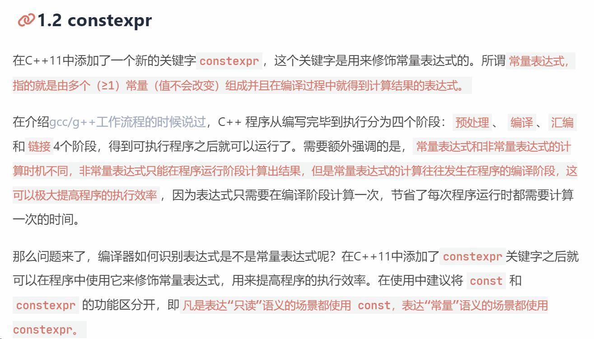


> 在 C++11 及其后续版本中，`constexpr` 是一个用于声明**常量表达式**的关键字。`constexpr` 指示编译器验证并确保一个变量或函数**在编译时是常数**。**这一特性允许在编译期进行更多的计算，从而提高运行时的性能。**
>
> ### `constexpr` 变量
>
> 当使用 `constexpr` 声明一个变量时，该变量**必须在编译时就能被确定其值**。这通常意味着它的值必须是字面值或者其他 `constexpr` 变量/函数的返回值。
>
> ```cpp
> constexpr int max_size = 100;  // 字面值
> constexpr int half_max = max_size / 2;  // 由其他 constexpr 变量计算得来
> ```
>
> ### `constexpr` 函数
>
> `constexpr` 函数是指可以产生编译时常量的函数。如果传递给 `constexpr` 函数的参数是常量表达式，那么其返回值也可以是常量表达式。
>
> ```cpp
> constexpr int add(int x, int y) {
>     return x + y;
> }
> 
> constexpr int sum = add(3, 4);  // 编译时计算
> ```
>
> `constexpr` 函数必须满足以下条件：
>
> - 函数体必须足够简单（C++11 中通常限制为单个 `return` 语句，C++14 放宽了这一限制）。
> - 函数的返回类型以及所有参数类型都必须是字面类型（通常是内置类型、指针或引用）。
>
> ### `constexpr` 与 `const` 的区别
>
> - **`const`**：仅表示变量的值不可修改。`const` 变量的值可以在运行时确定。
> - **`constexpr`**：表示变量是一个编译时常量。`constexpr` 变量必须在编译时有已知的值。
>
> ### 优点
>
> - **性能**：将计算从运行时移至编译时，减少运行时的计算负担。
> - **类型安全**：与宏（Macro）相比，`constexpr` 提供了类型安全的替代方案，减少了出错的风险。
>
> ### 使用场景
>
> - **数组大小**：作为数组大小或模板参数。
> - **常量计算**：用于定义可以在编译时计算的常量，如数学常数、配置参数等。
> - **编译时函数计算**：对于需要编译时确定结果的函数。
>
> ### 总结
>
> `constexpr` 是 C++11 引入的一个功能强大的特性，它扩展了常量表达式的应用范围，允许更多的编译时计算。正确使用 `constexpr` 可以提高程序的性能和可读性，并保持类型安全。


## 4. 自动类型推导 `auto` `decltype`

[大丙教程](https://subingwen.cn/cpp/autotype/)

### 4.1 `auto`

> 
>
> 在使用auto的时候，**必须要进行初始化**，它才能够推导出对应的变量的类型。
>
> 使用decltype，是基于一个已经存在的变量去推导对应的类型，我们得到这个类型之后呢，就可以用于定义新的变量。
>
> 
>
> 
>
> 
>
> C++11 引入了自动类型推导的概念，这主要通过 `auto` 和 `decltype` 关键字实现。这些特性旨在减少编码时的类型冗余，同时提高代码的可读性和可维护性。
>
> ### 1. `auto` 关键字
>
> `auto` 关键字使得编译器能够自动推断变量的类型。它主要用于变量声明时，代替显式类型名称。
>
> #### 使用场景
>
> - **局部变量初始化**：在声明变量时，可以使用 `auto` 来自动推导变量的类型。
>
>     ```cpp
>     auto x = 5;  // x 被推导为 int
>     auto y = 3.14;  // y 被推导为 double
>     ```
>
> - **迭代器和复杂类型**：对于迭代器或复杂类型，`auto` 特别有用，因为它们的类型往往较长且难以书写。
>
>     ```cpp
>     std::vector<int> vec = {1, 2, 3};
>     auto it = vec.begin();  // 迭代器类型
>     ```
>
> - **函数返回类型**：C++14 进一步扩展了 `auto` 的用途，允许在函数声明中使用 `auto` 作为返回类型。
>
>     ```cpp
>     auto add(int a, int b) -> int {
>         return a + b;
>     }
>     ```
>
> #### 注意事项
>
> - `auto` 类型的变量**必须在声明时初始化**，因为编译器需要初始化表达式来推导其类型。
> - `auto` 本身不是一个类型，而是一个**类型占位符**。
>
> ### 总结
>
> C++11 中的自动类型推导通过 `auto` 和 `decltype` 关键字简化了类型声明，特别是对于复杂的类型表达式和模板编程。这使得代码更加清晰和易于维护，同时还减少了错误的可能性。
>
> 
>
> ## 详细的内容看教程里面的 
>
> 
>
> 
>
> ## auto的使用限制
>
> - 不能作为函数参数使用。因为只有在函数调用的时候才会给函数参数传递实参，auto要求必须要给修饰的变量赋值，因此二者矛盾。
>
> 我们如果给这个函数的形参进行类型的自动推导，就相当于呢你没有做初始化，什么时候才能够给形态初始化，是我们调这个函数的时候。如果这个函数不被调用，那么这个a和b是什么类型呢，是永远不能够被确定下来的，我们在讲auto使用的时候呢，必须要直接进行初始化，这样的话呢类型啊就自动的被编译器推导出来了，如果它作为形参呢，这个类型不能够直接被推导出来，因为你没有做实例化操作。
>
> - 不能用于**类的非静态成员变量**的初始化
>
> 那么非静态成员为什么不能够进行初始化呢，还是一样的，因为呢这个类的非静态成员呢
> **它不属于类，它是属于对象的**，只有这个对象被创建出来之后，那么我们才能够给这个变量进行初始化操作，如果说不创建对象，那么这个成员呢它是没有办法进行类型的自动推导的啊，所以说这个也是不成立的。
>
> ```c++
> class Test
> {
>     auto v1 = 0;                    // error
>     static auto v2 = 0;  // error,类的静态非常量成员不允许在类内部直接初始化
>     
>      static auto v2 ;   //error 无法推导auto类型，需要初始化
>     static const auto v3 = 10;      // ok
> }
> 
> ```
>
> - 不能使用auto关键字**定义数组**
>
> 什么叫做定义数组啊，就是你去创建一个新的数组
>
> - 无法使用auto推导出模板参数
>
>   ```c++
>   template <typename T>
>   struct Test{}
>       
>   int func()
>   {
>       Test<double> t;
>       Test<auto> t1 = t;           // error, 无法推导出模板类型
>       return 0;
>   }
>   ```
>
> ## auto的使用场景
>
> 1. 用于STL的容器遍历
> 2. 用于泛型编程
>
> ```c++
> template <class A>
> void func(void)
> {
>     auto val = A::get();
>     cout << "val: " << val << endl;
> }
> ```


### 4.2 `decltype`

> `decltype` 关键字用于检查表达式的类型，但不对表达式进行求值。
>
> #### 使用场景
>
> - **类型提取**：当你需要获取某个表达式的类型而不实际进行计算时。
>
>   ```cpp
>   int x = 0;
>   decltype(x) y = 10;  // y 的类型与 x 的类型相同，即 int
>   ```
>
> - **函数返回类型推断**：特别是当返回类型依赖于参数类型时。
>
>   ```cpp
>   template <typename T, typename U>
>   auto add(T t, U u) -> decltype(t + u) {
>       return t + u;
>   }
>   ```
>
> #### 注意事项
>
> - `decltype` 只用于推导类型，不会执行表达式。
>
>   
>
> **decltype推导的表达式可简单可复杂**，在这一点上auto是做不到的，auto只能推导已初始化的变量类型。
>
> ### 推导规则
>
> 1. 表达式为普通变量或者普通表达式或者类表达式，在这种情况下，使用decltype推导出的类型和表达式的类型是一致的
>
> 2. 表达式是函数调用，使用decltype推导出的类型和函数返回值一致
>
>    （见讲义）
>
>    函数 func_cint() 返回的是一个**纯右值**（在表达式执行结束后不再存在的数据，也就是临时性的数据），对于纯右值而言，只有类类型可以携带const、volatile限定符，除此之外需要忽略掉这两个限定符，因此推导出的变量d的类型为 int 而不是 const int。
>
>
>    
>
> 3. 表达式是一个左值，或者被括号`( )`包围，使用 decltype推导出的是表达式类型的**引用**（如果有const、volatile限定符不能忽略）。
>
> ### decltype的应用
>
> `decltype(T().begin())`这种写法在vs2017/vs2019下测试可用完美运行。


### 4.3 返回值类型后置

> 在C++中，返回值类型后置（trailing return type）是一种语法**，允许在函数声明中在参数列表之后指定返回类型**。这种语法在C++11及更高版本中引入，主要用于以下几个场景：
>
> 1. **提高可读性**：对于返回类型复杂的函数，尤其是当返回类型依赖于函数参数时，后置返回类型可以使代码更易于阅读和理解。
>
> 2. **模板和自动类型推导**：在模板编程中，后置返回类型使得可以使用函数参数类型来推导返回类型。这对于泛型编程特别有用。
>
> 3. **Lambda 表达式**：在C++11中引入的Lambda表达式中，后置返回类型提供了一种指定复杂返回类型的方法。
>
> ### 语法
>
> 后置返回类型的基本语法是在参数列表后使用 `->` 符号，后面跟着返回类型。例如：
>
> ```cpp
> auto functionName(parameters) -> returnType;
> ```
>
> ### 示例
>
> 1. **基本示例**：
>
>    ```cpp
>    auto add(int x, int y) -> int {
>        return x + y;
>    }
>    ```
>
>    在这个例子中，`add` 函数的返回类型是 `int`，使用了后置返回类型的语法。
>
> 2. **模板函数中的使用**：
>
>    ```cpp
>    template <typename T, typename U>
>    auto add(T x, U y) -> decltype(x + y) {
>        return x + y;
>    }
>    ```
>
>    这里，`decltype(x + y)` 用于推导两个模板参数相加的结果类型。这是在模板编程中常见的使用场景。
>
> 3. **Lambda 表达式中的使用**：
>
>    ```cpp
>    auto lambda = [](int x, int y) -> int {
>        return x + y;
>    };
>    ```
>
>    在Lambda表达式中，后置返回类型同样非常有用，特别是当返回类型不能被自动推导时。
>
> ### 优势和限制
>
> - **优势**：提高了代码的可读性和灵活性，特别是在模板编程和泛型编程中。
> - **限制**：对于简单的函数，使用后置返回类型可能会让代码显得更复杂。
>
> 总的来说，返回值类型后置是C++11引入的一个强大特性，它在处理复杂类型推导时尤其有用，但在简单情况下可能不是必需的。


## 5. 模板的优化

> [大丙](https://subingwen.cn/cpp/template/)
>
> ### 5.1 模板的右尖括号
>
> ### 5.2 默认模板参数


## 6. `using`关键字

> 在 C++ 中，`using` 关键字是一个多功能的声明，它被用于几个不同的上下文中，包括类型别名声明、命名空间声明和继承中的方法导入。
>
> ### 1. 类型别名
>
> `using` 可以用来创建类型的别名，这在 C++11 中引入，作为 `typedef` 的现代替代品。它使得为复杂的类型名称创建简单易读的别名成为可能。
>
> #### 示例
>
> ```cpp
> using IntPtr = int*;  // IntPtr 现在是 int* 的别名
> using Vec = std::vector<int>;  // Vec 是 std::vector<int> 的别名
> 
> IntPtr ptr = new int(10);
> Vec vec = {1, 2, 3, 4};
> ```
>
> 在这个例子中，`IntPtr` 是指向 `int` 的指针的别名，而 `Vec` 是 `std::vector<int>` 的别名。
>
> ### 2. 命名空间别名
>
> `using` 也用于为命名空间或命名空间中的成员创建别名，这有助于减少代码中的冗余。
>
> #### 示例
>
> ```cpp
> namespace my_long_namespace {
>     void myFunction() {/* ... */}
> }
> 
> using namespaceAlias = my_long_namespace;
> namespaceAlias::myFunction();
> ```
>
> 在这里，`namespaceAlias` 是 `my_long_namespace` 的别名，可以用来访问该命名空间下的成员。
>
> 
>
> ### 3. 继承中的方法导入
>
> 在类继承中，`using` 关键字可以用来将基类中的名称引入到派生类的作用域中。这通常用于继承中的方法重载。
>
> 相关知识：前文 6.4 继承 同名成员处理方式
>
> #### 示例
>
> ```cpp
> class Base {
> public:
>     void func() {}
> };
> 
> class Derived : public Base {
> public:
>     using Base::func;  // 将 Base 中的 func 引入到 Derived 的作用域
>     void func(int) {}
> };
> 
> Derived d;
> d.func();     // 调用 Base::func
> d.func(10);   // 调用 Derived::func(int)
> ```
>
> 在这个例子中，`Derived` 类使用 `using` 将 `Base` 类的 `func` 方法引入自己的作用域，并提供了一个重载版本。
>
> ### 总结
>
> `using` 关键字在 C++ 中是一个多用途的声明，用于创建类型别名、命名空间别名以及在继承中导入基类方法到派生类。它提供了一种简洁且灵活的方式来简化代码，使其更易于阅读和维护。

### 6.1 using定义函数指针

> 假设我们定义一个函数指针，using的优势就能凸显出来了，看一下下面的例子：
>
> ```c++
> // 使用typedef定义函数指针
> typedef int(*func_ptr)(int, double);
> 
> // 使用using定义函数指针
> using func_ptr1 = int(*)(int, double);
> ```
>
> 如果不是特别熟悉函数指针与typedef，第一眼很难看出func_ptr其实是一个别名，其本质是一个函数指针，指向的函数返回类型是int，函数参数有两个分别是int，double类型。
>
> **使用using定义函数指针别名的写法看起来就非常直观了，把别名的名字强制分离到了左边，而把别名对应的实际类型放在了右边，比较清晰，可读性比较好。**


### 6.2 using 与 typedef

> 在 C++ 中，`using` 和 `typedef` 都被用来创建类型的别名，但它们的语法和应用场景有所不同。了解这两者的区别和用法对于编写清晰、易于维护的代码非常重要。
>
> ### `typedef`
>
> `typedef` 是 C++ 早期版本中用来定义类型别名的关键字。
>
> #### 基本用法
>
> - 定义一个新的名称作为现有类型的别名。
> - 语法：`typedef 现有类型 别名;`
>
> #### 示例
>
> ```cpp
> typedef int Integer;
> typedef std::vector<int> IntVector;
> typedef void (*FuncPtr)(int, double);
> ```
>
> 在这些例子中，`Integer` 是 `int` 的别名，`IntVector` 是 `std::vector<int>` 的别名，而 `FuncPtr` 是指向特定函数的指针类型的别名。
>
> ### `using`
>
> `using` 是 C++11 引入的关键字，提供了一种更灵活的方式来定义类型别名。
>
> #### 基本用法
>
> - 同样用于创建类型别名。
> - 语法：`using 别名 = 现有类型;`
>
> #### 示例
>
> ```cpp
> using Integer = int;
> using IntVector = std::vector<int>;
> using FuncPtr = void (*)(int, double);
> ```
>
> 这些使用 `using` 的例子与 `typedef` 的功能相同，但语法更加直观和一致。
>
> ### `using` vs `typedef`
>
> - **语法清晰性**：`using` 的语法通常被认为更清晰，尤其是对于复杂的类型，如函数指针或模板类型。
> - **模板别名**：`using` 支持模板别名，这是 `typedef` 所不具备的。**模板别名允许为模板创建别名，增加了别名类型的灵活性和表现力。**
> - 使用typename不支持给模板定义别名，这个简单的需求仅通过typedef很难办到，需要添加一个**外敷类**：
>
> #### using定义模板别名示例
>
> ```cpp
> template<typename T>
> using Vec = std::vector<T>;
> 
> Vec<int> intVec; // 等同于 std::vector<int>
> ```
>
> 在这个例子中，`Vec` 是一个模板别名，可以用于任何 `std::vector<T>` 类型。
>
> 
>
> ### 总结
>
> 虽然 `using` 和 `typedef` 在功能上相似，都用于定义类型的别名，但 `using` 提供了更清晰、更一致的语法，并且支持模板别名，使其成为现代 C++ 编程中更受推荐的选择。在 C++11 及更高版本中，`using` 通常是创建类型别名的首选方式。


## 7. 委托构造和继承构造函数

[大丙](https://subingwen.cn/cpp/construct/)

> 在 C++ 中，委托构造（Delegating Constructors）和继承构造函数（Inherited Constructors）是两种与类构造相关的高级特性。这两种特性在 C++11 中引入，用于简化类的构造过程。
>
> ### 委托构造（Delegating Constructors）
>
> 委托构造允许一个构造函数在同一个类中调用另一个构造函数，这样可以避免代码重复，使构造函数的初始化逻辑更加集中。
>
> #### 基本用法
>
> - 在 C++11 及更高版本中，一个构造函数可以委托给同一类中的另一个构造函数，这是通过在构造函数的初始化列表中直接调用另一个构造函数来实现的。
>
> #### 示例
>
> ```cpp
> class MyClass {
> public:
>     MyClass(int x) : value(x) { /* ... */ }
>     MyClass() : MyClass(0) { /* 委托给 MyClass(int) */ }
> private:
>     int value;
> };
> ```
>
> 在这个例子中，无参数的构造函数 `MyClass()` 委托给了接受一个整数参数的构造函数 `MyClass(int)`。
>
> 
>
> ### 继承构造函数（Inherited Constructors）
>
> 继承构造函数允许派生类继承并直接使用基类的构造函数，而无需在派生类中显式定义相同的构造函数。
>
> #### 基本用法
>
> - 使用 `using` 关键字在派生类中声明继承基类的构造函数。
> - 这允许派生类直接使用基类构造函数的所有或部分重载版本。
>
> #### 示例
>
> ```cpp
> class Base {
> public:
>     Base(int x, double y) { /* ... */ }
>     Base(int x) { /* ... */ }
> };
> 
> class Derived : public Base {
> public:
>     using Base::Base;  // 继承 Base 的所有构造函数
> };
> ```
>
> 在这个例子中，`Derived` 类继承了 `Base` 类的所有构造函数。因此，可以直接使用 `Derived d(10, 3.14);` 或 `Derived d(10);` 来创建 `Derived` 类的对象。
>
> ### 区别和用途
>
> - **委托构造**：用于在同一个类中的构造函数之间共享初始化代码，避免重复。
> - **继承构造函数**：用于让派生类继承并直接使用基类的构造函数，减少派生类中构造函数的冗余。
>
> ### 总结
>
> 委托构造和继承构造函数都是为了简化类构造过程而引入的特性。委托构造让类的构造函数可以复用同类中的其他构造函数，而继承构造函数允许派生类直接使用基类的构造函数。这两种特性在设计类的层次结构和构造逻辑时非常有用。


## 8. 列表初始化

[大丙](https://subingwen.cn/cpp/list-init/)

> *相关细节见讲义*
>
> ### 列表初始化与窄化转换
>
> 列表初始化禁止窄化转换，这是一种可能导致数据丢失的隐式类型转换
>
> ```c++
> int x{7.9};  // 错误：从 double 到 int 的窄化转换
> ```
>
> 这里，尝试将一个 `double` 类型的值初始化给 `int` 类型的变量，这会因为窄化转换而导致编译错误。
>
> 
>
> ### 总结
>
> 列表初始化是 C++11 引入的一种通用、直观且安全的初始化方式。它可以用于各种类型，包括基本类型、类、结构体和容器，同时避免了窄化转换的问题。由于其清晰和类型安全的特性，列表初始化在现代 C++ 编程中被广泛推荐使用。


**8.1 列表初始化聚合体类型**

- 普通数组本身可以看做是一个聚合类型

- 满足以下条件的类（class、struct、union）可以被看做是一个聚合类型：

  - 无用户自定义的构造函数。

  - 无私有或保护的非静态数据成员。
  - 无基类
  - 无虚函数

**8.2 列表初始化非聚合体类型**

**8.3 std::initializer_list**


## 9. 范围`for`循环

[大丙](https://subingwen.cn/cpp/for/)


**使用细节**


> ### 9.1 关系型容器
>
> ### 9.2 元素只读
>
> ### 9.3 访问次数
>
> 1次


> ### 注意事项
>
> - ### 遍历数组
>
> 是的，在 C++ 中使用范围 `for` 循环遍历数组时，您只需要指定数组的名称。范围 `for` 循环（也称为基于范围的 `for` 循环）会自动遍历数组的每个元素。您的代码示例正确地展示了这一点。
>
> 这里是范围 `for` 循环的基本语法：
>
> ```cpp
> for (auto element : array) {
>     // 这里可以使用 element
> }
> ```
>
> 在这个循环中：
>
> - `array` 是要遍历的数组。
> - `element` 是对数组中当前元素的引用。`auto` 关键字让编译器自动推断元素的数据类型。
>
> 您的代码示例中，`record` 是一个整型数组，范围 `for` 循环会遍历数组中的每个整数。如果数组中的任何一个元素不为零，则函数返回 `false`。
>
> 这种方式简化了对数组的遍历，不需要手动管理索引或数组长度，减少了错误的可能性。这种语法在 C++11 及以后的版本中可用。


## ==10. 可调用对象包装器、绑定器==

[大丙](https://subingwen.cn/cpp/bind/)

可调用对象用一句比较笼统，不是很精确的话来描述呢，就是在C++里边有那么一类对象，我们可以呢将这类对象**按照  函数的方式  进行调用**,这样的对象呢就称之为**可调用对象**。


**可调用对象**在c++里边有很多种类型，他们的书写格式呢也是不一样的，那么这几种可调用对象，我们就可以把它理解为在秦始皇统一六国之前的文字货币和度量衡，为了统一管理秦始皇统一六国之后呢，就做了一件非常伟大的事啊,就把他们所有的都统一了吧，怎么统一呢，就是书同文车同轨。

**可调用对象包装器**呢就是做了这件事啊，**书同文车同轨**的这件事，那么这样的话呢，天下所有的东西都是一样的了，我们有了一个统一的标准，这个可调用对象包装器啊，就是**把这些不同类型的可调用对象呢再次进行了包装**，进行了一个类型的统一。那么我们在使用这些不同类型的可调用对象的时候，
为了方便操作，可以呢统一的使用包装器呢进行包装，然后就可以以一种统一的类型来进行参数的传递
或者是数据的传递了。

再有一个呢就是这个**绑定器**，这个绑定器呢是用来，给这个包装好的可调用对象呢进行**参数绑定**的，我们可以进行一些初始化操作。

### 10.1 可调用对象 

在C++中存在“可调用对象”这么一个概念。准确来说，可调用对象有如下几种定义：


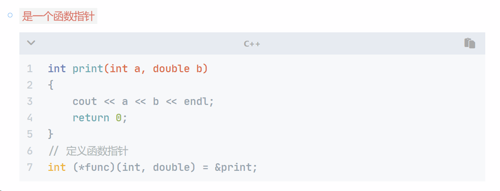

只要我们看到一个函数，这个函数呢都可以被抽象出一个对应的函数指针。

> 定义函数指针，可以使用typedef、using，参见上文章节。
>
> ```c++
> using funcptr = viod(*)(int, string);
> ```
>
> 
>
> `funcptr` 在您的例子中是一个**函数指针类型**，而**不是一个具体的可调用对象**。它定义了一个指针类型，这个类型的指针可以指向一个具有特定签名的函数。换句话说，`funcptr` 本身只是一个类型定义，它告诉编译器这种类型的指针可以指向什么样的函数。
>
> **要创建一个可调用的对象**，您需要定义一个 `funcptr` 类型的变量，并使其指向一个具体的函数。例如：
>
> ```c++
> void someFunction(int, string);
> 
> // 使用 funcptr 类型定义一个函数指针
> funcptr myFunc = someFunction;
> 
> // 现在，myFunc 是一个指向 someFunction 的可调用对象
> myFunc(123, "hello");
> ```
>
> 在这个例子中：
>
> - `someFunction` 是一个符合 `funcptr` 类型要求的函数。
> - `myFunc` 是一个 `funcptr` 类型的变量，指向 `someFunction` 函数，因此它是一个可调用对象。
>
> 总结一下，`funcptr` 是一个函数指针类型，而不是一个具体的可调用对象。但是，您可以使用这个类型来声明指向函数的指针，这些指针指向的函数是可调用的。


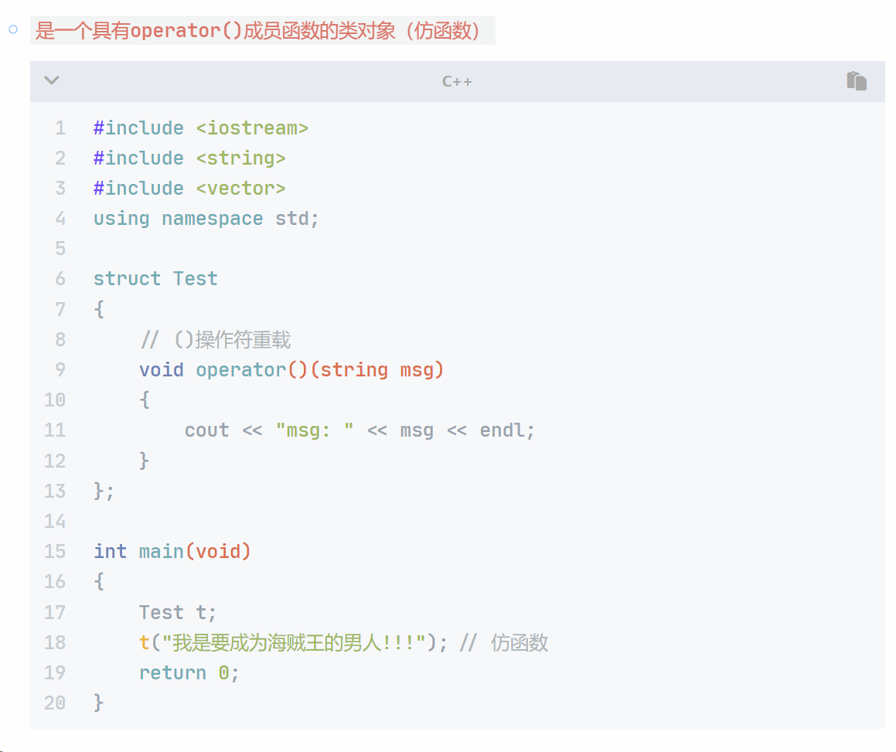


（这个不常用的）

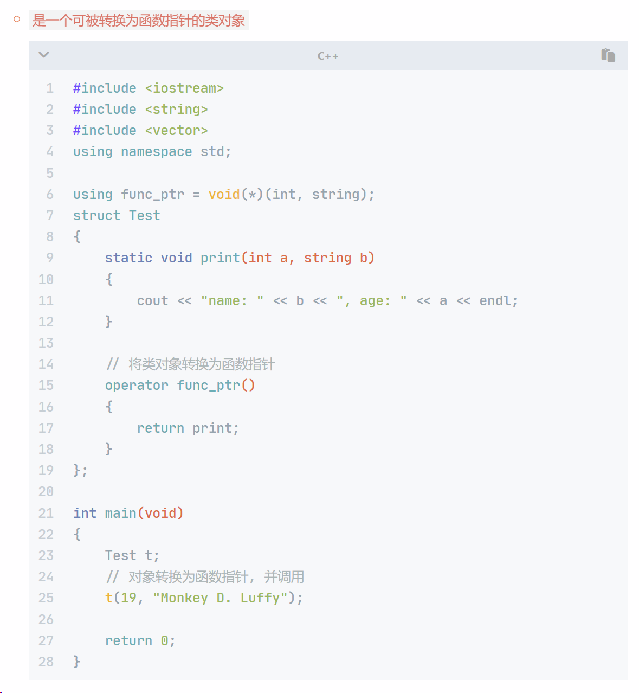

operator 关键字


#### 10.1 (扩展)`operator Type()`

> 在 C++ 中，可以通过定义类型转换运算符（`operator Type()`）来实现将类对象转换为某种特定类型。这种运算符可以被定义为类的成员函数，并且不需要指定返回类型，因为返回类型即是运算符指定的类型。
>
> 这里是一个简单的例子，展示如何定义一个类型转换运算符，将自定义类对象转换为 `int` 类型：
>
> ```cpp
> class MyClass {
> public:
>     MyClass(int value) : m_value(value) {}
> 
>     // 类型转换运算符：将 MyClass 对象转换为 int
>     operator int() const {
>         return m_value;
>     }
> 
> private:
>     int m_value;
> };
> 
> int main() {
>     MyClass obj(10);
>     int value = obj;  // 自动调用 MyClass 的类型转换运算符
>     std::cout << "Value: " << value << std::endl;  // 输出 10
>     return 0;
> }
> ```
>
> 在这个例子中，`MyClass` 有一个类型转换运算符 `operator int()`，它使得 `MyClass` 对象可以被隐式转换为 `int` 类型。当你尝试将 `MyClass` 对象赋值给一个 `int` 类型变量时，这个运算符就会被调用。
>
> ### 注意事项
>
> - **隐式转换**：类型转换运算符创建了隐式转换。这意味着转换会自动发生，有时可能在不期望的情况下发生，这可能导致错误或难以发现的 bug。
>
> - **显示转换**：为了避免隐式转换可能带来的问题，可以使用 `explicit` 关键字来定义显式转换运算符。这样就需要显式地使用类型转换语法来进行转换，例如 `static_cast<int>(obj)`。
>
> - **转换运算符的滥用**：虽然类型转换运算符很强大，但应谨慎使用，以避免引入隐式类型转换导致的逻辑错误。
>
> 通过合理使用类型转换运算符，可以提高 C++ 类的灵活性和表达力，但需要注意控制隐式转换的行为，以避免潜在的问题。


- 类的成员函数指针 或 类成员指针

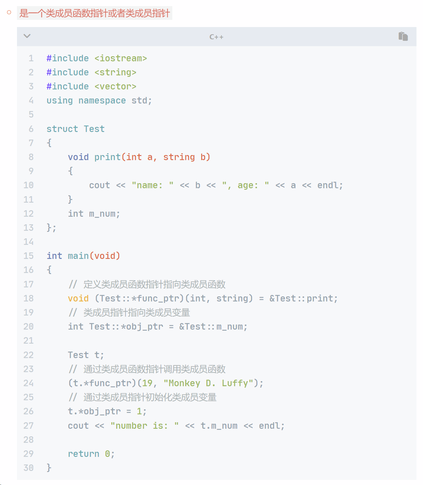

我们知道，在一个类中呢，它是有成员函数的，这个成员函数就可以被抽象出一个对应的类成员的函数指针吧。那么另外呢咱们这个类里边呢还是也有成员变量，那么这个成员变量呢，也可以被抽象出一个类指针，那么我们这个类指针指向类里边的这个变量的地址。那么像这两种类型的指针，也可以被称之为可调用对象。

```c++
using fptr = void(Test::*)(int, string);
fptr f1 = Test::print; // 在这里函数名就是地址，因此可不用加取地址
fptr f1 = &Test::print; //这种写法也是对的

using ptr1 = int Test::*;
ptr1 pt = &Test::m_num;
```


> 在您的示例中，`f1` 和 `pt` 不是 `Test` 类的指针，而是指向 `Test` 类成员的指针，它们分别是指向成员函数和成员变量的指针。让我们分别解释这两种指针：
>
> ### 1. 指向成员函数的指针 (`fptr`)
>
> ```cpp
> using fptr = void(Test::*)(int, string);
> fptr f1 = Test::print; // 或者 fptr f1 = &Test::print;
> ```
>
> - `fptr` 是一个类型别名，表示指向 `Test` 类的成员函数的指针。这个成员函数接受一个 `int` 和一个 `string` 作为参数，并返回 `void`。
> - `f1` 是 `fptr` 类型的变量，即它是一个指向 `Test` 类的成员函数 `print` 的指针。需要注意的是，即使 `print` 是静态成员函数，它仍然可以被视为类成员。
> - 这个指针不指向 `Test` 类的实例（对象），而是指向类内部的一个具体函数。
>
> ### 2. 指向成员变量的指针 (`ptr1`)
>
> ```cpp
> using ptr1 = int Test::*;
> ptr1 pt = &Test::m_num;
> ```
>
> - `ptr1` 是一个类型别名，表示指向 `Test` 类的 `int` 类型成员变量的指针。
> - `pt` 是 `ptr1` 类型的变量，即它是一个指向 `Test` 类的 `int` 类型成员变量 `m_num` 的指针。
> - 类似地，这个指针不指向 `Test` 类的实例，而是指向类内部的一个具体的 `int` 类型成员变量。
>
> ### 使用成员指针
>
> - 使用这些指针时，你需要一个 `Test` 类的实例来“**解引用**”这些指针。例如，如果 `f1` 指向一个非静态成员函数，你需要这样使用它：
>
>   ```cpp
>   Test t;
>   (t.*f1)(10, "example"); // 调用 t 的成员函数
>   ```
>
> 这里如果写成 t.*f1(10, "example"); 是会报错的，因为解引用的优先级，低于小括号的优先级，所以 f1 优先和右侧的参数列表进行匹配了。我们需要呢先解引用，然后再和右侧的参数列表呢进行匹配，因此需要把咱们仅仅用这个操作**放到一个小括号里边**。
>
> - 对于指向成员变量的指针，使用方法如下：
>
>   ```cpp
>   Test t;
>   int value = t.*pt; // 获取 t 的成员变量的值，指针解引用之后就是变量了
>   t.*pt = 100;
>   ```
>
> 总结来说，`f1` 和 `pt` 是指向 `Test` 类的成员的指针，而不是指向 `Test` 类实例本身的指针。这些指针允许间接访问和操作类的成员。


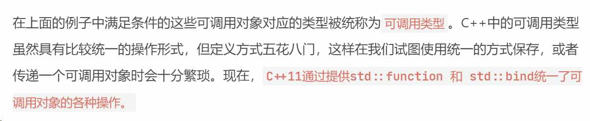


### 10.2 可调用对象包装器 


### 10.3 可调用对象绑定器


## 11. `lambda` 表达式 

[大丙教程](https://subingwen.cn/cpp/lambda/)


# 其他


