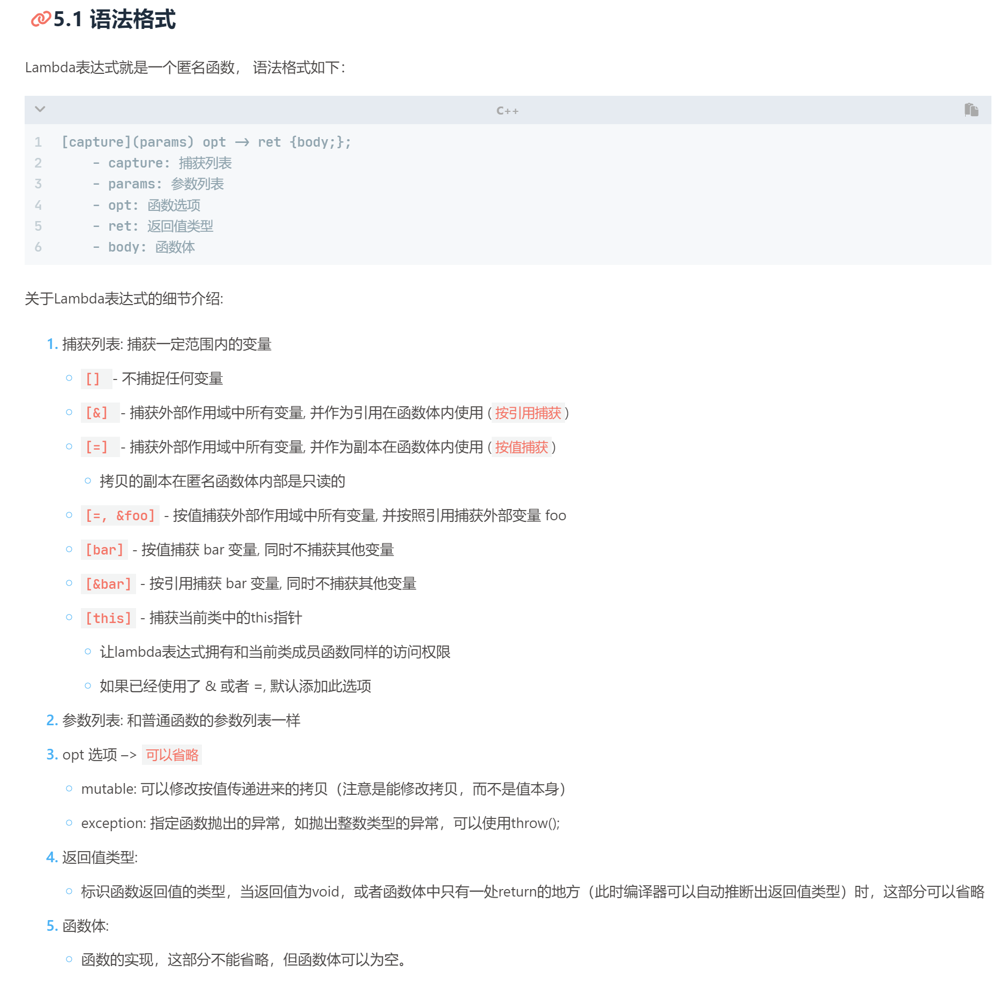

# C++

# -----基础------

## ---C++中的头文件

C++中的头文件（通常以`.h`或`.hpp`结尾）有几个重要作用：

1. **接口声明**：头文件通常包含类的定义、函数原型、模板定义、宏定义、全局变量声明等。这些是程序的接口部分，通过在头文件中声明，其他文件可以通过包含这个头文件来使用这些接口。
2. **重用代码**：通过在不同的源文件中包含同一个头文件，可以在不同的源文件中重用头文件中声明的代码。这有助于减少代码冗余，并保持代码的一致性。
3. **编译优化**：头文件还可以帮助编译器更有效地编译程序。例如，通过声明头文件，编译器可以更容易地确定哪些代码依赖于哪些其他代码，从而优化编译过程。
4. **模块化设计**：头文件促进了模块化设计。你可以将程序的不同部分（如类定义、函数原型等）放在不同的头文件中，这有助于组织和管理大型项目。


## ---变量初始化

在C++中，确实可以声明变量而不立即初始化它们。然而，这种做法的影响取决于变量的类型以及它被声明的位置。

### 局部变量

局部变量是在函数内部声明的变量。如果您声明一个局部变量而不初始化它，它将拥有一个不确定的值。这是因为局部变量通常存储在**栈上**，**而栈内存是不会被自动清除或初始化的**。试图使用未初始化的局部变量会导致不确定的行为，通常被视为一个严重的编程错误。

例如：

```cpp
int main() {
    int x; // 未初始化
    std::cout << x; // 未定义行为，x的值是不确定的
}
```

### 全局变量和静态变量

全局变量和静态变量的情况有所不同。如果您声明了一个全局变量或静态变量而没有显式地初始化它，它会被自动初始化为零（对于基本数据类型）。对于类类型，会调用默认构造函数进行初始化（如果存在的话）。

例如：

```cpp
int globalVar; // 自动初始化为0

int main() {
    static int staticVar; // 自动初始化为0
    std::cout << globalVar << " " << staticVar; // 输出 "0 0"
}
```

### 类成员变量

类的成员变量的行为类似于全局变量和静态变量。如果在类定义中没有给成员变量提供初始值，则它们将被默认初始化。对于基本数据类型，这意味着它们被初始化为零；对于类类型，将调用默认构造函数。

### 推荐做法

虽然未初始化变量可能在某些情况下被默认初始化，但最佳实践是总是显式地初始化您的变量。这可以避免不确定的行为，使代码更清晰、更易于维护和调试。在C++11及更高版本中，您可以使用统一初始化语法（如 `int x{};`）来保证变量总是被初始化。


# ------知识点-----

# ---关键字---

## ---`__declspec(dllexport)`关键字

在C++中，`__declspec(dllexport)`是一个用于Windows平台的特定关键字，它用于导出函数、数据和对象到一个动态链接库（DLL）中。这个关键字在创建和使用DLL时非常重要。下面是对其使用和功能的详细解释：

### 作用

1. **导出函数或变量**：通过在函数或全局变量声明前添加`__declspec(dllexport)`，你可以将它们从一个DLL导出。这意味着这些函数或变量可以被其他使用该DLL的应用程序或DLL访问。

2. **创建接口**：在DLL中使用此关键字可以定义一个可以被其他模块（如其他DLL或可执行文件）使用的接口。

### 使用场景

1. **动态链接库开发**：当你开发一个DLL并希望在其中提供给其他应用程序使用的函数或数据时，你需要使用`__declspec(dllexport)`。

2. **跨模块共享代码**：当你有一些通用的函数或数据，你希望它们能够在多个应用程序或DLL之间共享时，你可以将它们放在一个DLL中，并使用`__declspec(dllexport)`进行导出。

### 语法

在函数或全局变量前使用，例如：

```cpp
// 导出函数
__declspec(dllexport) void MyFunction();

// 导出全局变量
__declspec(dllexport) int MyGlobalVar;
```

### 与 `__declspec(dllimport)` 的区别

- `__declspec(dllexport)` 用于导出。
- `__declspec(dllimport)` 用于导入。在使用DLL中的导出的函数或变量时，使用这个关键字。

通常在头文件中，会使用预处理器指令来区分导入和导出，例如：

```cpp
#ifdef BUILDING_MY_DLL
#define MY_DLL_EXPORT __declspec(dllexport)
#else
#define MY_DLL_EXPORT __declspec(dllimport)
#endif

// 使用宏定义来声明函数
MY_DLL_EXPORT void MyFunction();
```

这样，在编译DLL时定义`BUILDING_MY_DLL`，此时`MY_DLL_EXPORT`将会被定义为`__declspec(dllexport)`，在使用DLL的其他项目中不定义它，使`MY_DLL_EXPORT`变为`__declspec(dllimport)`。

### 平台特定

需要注意的是，`__declspec(dllexport)`是特定于Windows平台的MSVC的。在其他平台（如Linux），使用动态库的机制是不同的，通常使用其他关键字如`__attribute__((visibility("default")))`来实现类似的功能。


## ---动态库导入导出

在Windows平台上，使用动态链接库（DLL）时，`__declspec(dllexport)` 和 `__declspec(dllimport)` 是特殊的Microsoft扩展，用于控制函数、变量或类的导出和导入。理解这两个关键字的作用对于正确地创建和使用DLL至关重要。

### __declspec(dllexport)

- 当你创建一个DLL时，需要告诉编译器哪些函数、变量或类是要导出的，即这些是可以被DLL的使用者调用或访问的。
- 通过在函数、类或变量的声明前添加 `__declspec(dllexport)`，你告诉编译器生成导出这些符号到DLL的代码。

### __declspec(dllimport)

- 当你使用一个DLL时，需要告诉编译器哪些函数、变量或类是从DLL中导入的。
- 通过在函数、类或变量的声明前添加 `__declspec(dllimport)`，你告诉编译器这些符号是在别处定义的，具体来说是在一个DLL中定义的。
- 这样做的好处是编译器可以优化对这些符号的访问。比如，编译器可以避免一些额外的跳转指令，直接生成访问DLL中的函数或变量的代码。

### 为什么两者都需要

虽然`__declspec(dllexport)`在DLL中标记了要导出的符号，但使用这些符号的程序并不知道它们来自哪里。`__declspec(dllimport)`提供了这个必要的信息。同时，它还使得编译器能够生成更有效的代码来访问这些DLL中的符号。

通常，为了简化代码，会使用预处理器指令在DLL的构建和使用中切换这两个关键字。例如：

```cpp
#ifdef BUILDING_MY_DLL
#define MY_DLL_EXPORT __declspec(dllexport)
#else
#define MY_DLL_EXPORT __declspec(dllimport)
#endif

MY_DLL_EXPORT void MyFunction();
```

在这个例子中：

- 当编译DLL时，定义`BUILDING_MY_DLL`。这样，`MyFunction`会被标记为导出。
- 当使用DLL时，不定义`BUILDING_MY_DLL`。这样，`MyFunction`会被标记为导入。

这种方法简化了代码管理，并确保在创建和使用DLL时使用正确的声明。


这段代码是一个**典型的跨平台动态链接库（DLL）导出/导入宏定义的例子**，用于在不同操作系统上处理库函数或类的导出和导入。它的作用是根据不同的编译环境（Windows或其他操作系统）选择正确的方式来声明库中的类和函数。让我们一步步解析这段代码：

### 分析

#### 1. 检查操作系统

```cpp
#ifdef _WIN32
    // Windows平台的代码
#else
    // 非Windows平台的代码
#endif
```

这部分代码使用预处理器指令检查编译环境是否是Windows（`_WIN32`宏通常在所有Windows平台上定义，包括32位和64位系统）。

#### 2. Windows平台

对于Windows平台：

```cpp
#ifdef CAPICOMMON_EXPORTS
    #define CAPICOMMON_API __declspec(dllexport)
#else
    #define CAPICOMMON_API __declspec(dllimport)
#endif
```

- `CAPICOMMON_EXPORTS`：**这通常在构建库本身时定义**。如果定义了这个宏，`CAPICOMMON_API`被定义为`__declspec(dllexport)`，这意味着随后用`CAPICOMMON_API`标记的函数和类会从DLL中导出。
- 如果`CAPICOMMON_EXPORTS`未定义，则`CAPICOMMON_API`被定义为`__declspec(dllimport)`，表示随后用`CAPICOMMON_API`标记的函数和类会从DLL中导入。

#### 3. 非Windows平台

```cpp
#define CAPICOMMON_API __attribute__ ((visibility ("default")))
```

- 对于非Windows平台（比如Linux或macOS），`CAPICOMMON_API`被定义为`__attribute__ ((visibility ("default")))`。这是GCC和Clang编译器的特性，用于控制符号的可见性。在这种情况下，它允许从共享库中导出函数和类。

### 使用场景

使用`CAPICOMMON_API`来**标记类、函数或变量**，使其可以在DLL（或在非Windows平台上的类似动态库）中被导出或导入。例如：

```cpp
class CAPICOMMON_API MyClass {
    // 类的定义
};

CAPICOMMON_API void MyFunction();
```

这样，无论是在Windows还是其他操作系统上，`MyClass`和`MyFunction`都会被正确地导出或导入。

### 结论

这种方法使得在不同平台上编写可移植的库代码更加容易。它通过预处理器指令自动处理了在不同编译环境中导入和导出符号的复杂性。这对于维护跨平台库非常有用，因为它减少了平台特定代码的需求。


## ---`explicit` 关键字

`explicit` 是C++中的一个关键字，通常用于**修饰单参数的构造函数**，**以防止隐式类型转换**。它的作用是**禁止编译器进行隐式的构造函数调用，只允许显式地调用构造函数。**

通常情况下，当构造函数只有一个参数时，它可以被用于隐式地将该参数类型转换为类的类型。这种情况下，如果你在代码中使用了一个该类的对象，传入一个参数，编译器可能会自动调用构造函数进行隐式转换。

使用 `explicit` 关键字可以阻止这种隐式的构造函数调用，强制要求使用显式的方式来调用构造函数。这可以帮助避免一些潜在的意外行为和歧义，提高代码的可读性和清晰性。

以下是一个示例：

```cpp
class MyClass {
public:
    explicit MyClass(int value) {
        // 构造函数实现
    }
};

int main() {
    MyClass obj1 = 42;  // 错误，因为构造函数是 explicit 的
    MyClass obj2(42);   // 正确，显式地调用构造函数

    return 0;
}
```

**`MyClass obj1 = 42;`**：这行代码尝试通过隐式转换将整数 `42` 转换为 `MyClass` 类型的对象。由于 `MyClass` 的构造函数被声明为 `explicit`，这种隐式转换是不允许的，因此这行代码会导致编译错误。

在上述示例中，由于构造函数被声明为 `explicit`，在实例化 `MyClass` 对象时不能使用隐式转换（`MyClass obj1 = 42;` 是错误的）。只能使用显式的方式来调用构造函数（`MyClass obj2(42);` 是正确的）。

总之，`explicit` 关键字用于构造函数，用于避免隐式类型转换，强制要求显式地使用构造函数进行对象的创建。


在 C++ 中，`explicit` 关键字用于阻止类构造函数进行隐式类型转换。在没有 `explicit` 关键字的情况下，C++ 允许构造函数进行隐式转换，这可能导致意料之外的行为。使用 `explicit` 关键字可以强制要求开发者明确地进行类型转换，增加代码的清晰度和预见性。

### 隐式类型转换

C++ 允许单参数构造函数（或只有一个参数的构造函数有默认值）隐式地将类型从该参数类型转换为其类类型。例如：

```cpp
class MyClass {
public:
    MyClass(int x) { /* ... */ }
};

void func(MyClass m) { /* ... */ }

func(10); // 隐式调用 MyClass(int)
```

在上面的代码中，`func(10);` 会隐式地调用 `MyClass` 的构造函数，将整数 `10` 转换为 `MyClass` 类型的对象。

### 使用 `explicit`

当在构造函数前添加 `explicit` 关键字时，编译器不再允许这种隐式转换：

```cpp
class MyClass {
public:
    explicit MyClass(int x) { /* ... */ }
};

void func(MyClass m) { /* ... */ }

func(10); // 错误：不允许隐式转换
func(MyClass(10)); // 正确：显式转换
```

使用 `explicit` 关键字可以避免隐式转换可能带来的混淆和错误，特别是在复杂的程序中，隐式转换可能导致意外的行为或性能问题。

### `explicit` 在构造函数和转换函数中的应用

- **构造函数**：通常用于单参数构造函数或只有一个参数有默认值的构造函数，防止隐式类型转换。
  
- **转换函数**：从 C++11 开始，`explicit` 关键字也可以用于类的转换函数，以防止隐式的类类型转换。

### 优点

- **防止错误**：阻止编译器自动执行可能不安全或不明确的类型转换。
- **提高代码清晰度**：确保类型转换的发生是程序员明确意图的结果，增加代码的可读性和可维护性。

### 总结

`explicit` 关键字是 C++ 中一个重要的特性，它用于控制类构造函数的隐式类型转换行为。通过使用 `explicit`，程序员可以避免一些隐蔽的错误，并使程序行为更加明确和可预测。在设计类和构造函数时，合理使用 `explicit` 关键字是一个良好的编程实践。


## ---`override` 关键字


在 C++11 和更高版本中，`override` 关键字用于显式地指示编译器一个成员函数应该覆写基类中的一个虚拟成员函数。如果标记为 `override` 的函数没有正确地覆写任何基类中的虚拟函数，则编译器将报错。

使用 `override` 关键字有几个好处：

1. **代码清晰性**：通过阅读代码，你可以很容易地知道该函数是一个覆写函数。
   
2. **编译时检查**：如果你意外地改变了基类函数的签名（例如，由于重构或其他修改），但忘记了更新派生类中的函数，编译器会提醒你。

3. **防止误操作**：使用 `override` 可以避免你无意中创建一个与基类函数名称相同但不是覆写的新函数。

#### 示例

```cpp
class Base {
public:
    virtual void foo() { /* ... */ }
};

class Derived : public Base {
public:
    void foo() override { /* ... */ } // 正确覆写
};
```

如果基类的 `foo()` 方法发生变化：

```cpp
class Base {
public:
    virtual void foo(int x) { /* ... */ } // 现在需要一个整型参数
};
```

派生类中的代码会立即引发编译错误，因为 `Derived::foo()` 没有正确地覆写新版本的 `Base::foo(int x)`。

#### 在你给出的代码中

在 `void setup() override;` 中，`override` 指示编译器 `setup()` 函数应该覆写 `qSlicerAbstractModuleWidget` 基类中的一个同名虚拟函数。如果基类中不存在这样的函数，或者函数签名不匹配，编译器将报错。这是一种强制检查机制，用于确保多态行为的正确性。


## ---`decltype`关键字

`decltype`是C++11及以后版本中引入的一个关键字，用于查询表达式的类型。这个关键字非常有用，特别是在模板编程和类型推导的上下文中。`decltype`会“检查”其参数（一个表达式或一个变量等）并“返回”该参数的类型。

下面是一些基础的使用示例：

```cpp
int x = 0;
decltype(x) y = x;  // y 的类型是 int，因为 x 的类型是 int

double f();
decltype(f()) z;  // z 的类型是 double，因为 f() 返回 double
```

在模板编程中，`decltype`也非常有用：

```cpp
template<typename T, typename U>
auto add(T t, U u) -> decltype(t + u) {
    return t + u;
}
```

在这个例子中，`decltype(t + u)`用于推导函数`add`返回值的类型。这样，你可以将不同类型的参数传递给`add`函数，它会返回正确的类型。

#### 注意事项

1. **值类别（Value Category）**：`decltype`不仅仅检查类型，它还考虑值类别（例如，lvalue、rvalue）。这意味着`decltype`可能会返回带有引用修饰符的类型。

    ```cpp
    int x = 0;
    decltype((x)) y = x;  // 注意：y 的类型是 int&，而不是 int
    ```

    在这里，`decltype((x))`的类型是`int&`，因为`(x)`是一个lvalue表达式。

2. **表达式不求值**：`decltype`只检查表达式的类型，但不实际执行表达式。

    ```cpp
    int f();
    decltype(f()) x = 42;  // f() 不会被调用
    ```

3. **与`auto`的组合**：`decltype`经常与`auto`关键字一起使用，以便进行更复杂的类型推导。

    ```cpp
    auto x = 42;
    decltype(x) y = x;  // y 的类型与 x 相同
    ```

`decltype`是C++类型系统的一个强大工具，特别是在编写通用代码或进行复杂类型推导时。它提供了一种方式来查询表达式或变量的精确类型，包括其值类别（lvalue、rvalue等）。这使得程序员能够编写更灵活、更健壮的代码。


## ---`extern "C"`

`extern "C"` 在 C++ 中是一个重要的关键字，用于解决 C 和 C++ 之间的链接（Linkage）兼容问题。在详细解释 `extern "C"` 之前，需要先理解 C++ 程序中函数名的处理方式（即 Name Mangling 或 Name Decoration）以及它与 C 语言的差异。

### Name Mangling（名字改编）

C++ 支持**函数重载**，这意味着你可以在同一个作用域内拥有多个同名函数，只要它们的参数类型或数量不同。为了区分这些重载的函数，C++ 编译器会对函数名进行改编，将函数的参数类型和数量信息编码到函数名中，这个过程被称为 Name Mangling。

### C 语言与 Name Mangling

与 C++ 不同，C 语言不支持函数重载，因此不需要对函数名进行改编。这意味着 C 语言中函数的二进制名称（Binary Name）与其在代码中的名称相同。

### `extern "C"` 的作用

当你在 C++ 代码中使用 `extern "C"` 时，告诉 C++ 编译器对于被 `extern "C"` 包围的代码，应该避免 Name Mangling，使用 C 语言的链接约定。这样做的目的是为了确保 C++ 程序可以调用 C 语言编写的函数库，或者反过来，让 C 程序可以调用 C++ 程序中的特定函数。

### 使用场景

- **调用 C 语言库**：如果你的 C++ 程序需要调用一个用 C 语言编写的库，你需要使用 `extern "C"` 来声明这些函数。
- **C++ 库提供给 C 使用**：如果你在 C++ 中编写了一个库，并打算让 C 语言程序也能使用它，你需要用 `extern "C"` 来导出相关的接口。

### 语法

`extern "C"` 可以作用于单个函数声明，也可以用一个块来包围多个函数声明：

```cpp
extern "C" void myFunction(); // 单个函数

extern "C" {
    void function1();
    int function2(int);
    // 更多的 C 风格函数声明
}
```

### 示例

假设有一个用 C 语言编写的库，提供了以下函数：

```c
// C 语言库中的函数
void c_library_function();
```

要在 C++ 程序中调用这个函数，你应该这样声明：

```cpp
extern "C" void c_library_function();

int main() {
    c_library_function(); // 正常调用 C 语言函数
    return 0;
}
```

这样，当你的 C++ 程序链接到这个 C 语言库时，编译器和链接器可以正确识别 `c_library_function` 函数。

### 注意事项

- `extern "C"` **只影响链接名称**，不影响 C++ 代码中的类型检查和其他编译时行为。
- 在使用 `extern "C"` 时，不能将其应用于类或类成员函数，因为 C 语言不支持类。
- 当在 C++ 中定义了 `extern "C"` 函数时，该函数应遵循 C 语言的编程约定，因为它可能被 C 代码调用。

通过 `extern "C"`，C++ 程序可以方便地与 C 语言代码交互，**这在混合编程环境中非常有用**，特别是在使用老旧的 C 语言库或系统 API 时。


## --`noexcept` 关键字

在C++中，`noexcept` 是一个关键字，用于指明一个函数或方法不会抛出异常。当一个函数被声明为 `noexcept` 时，它告诉编译器和程序员这个函数保证不会抛出任何异常。这个声明可以帮助编译器进行某些优化，并改善代码的可读性和可靠性。

### `noexcept` 的用途

1. **性能优化**：当编译器知道一个函数不会抛出异常时，它可以生成更高效的代码，因为不需要处理函数可能抛出异常的情况。

2. **异常安全保证**：在写异常安全代码时，了解哪些函数可能抛出异常是非常重要的。`noexcept` 提供了这种保证，使得异常处理更加可预测。

3. **移动语义**：在某些情况下，如果一个函数（特别是移动构造函数和移动赋值操作符）被标记为 `noexcept`，编译器可能会选择使用移动语义而非拷贝语义，因为移动操作通常更高效。

### 在 `std::thread` 中的应用

在你提供的 `std::thread` 构造函数中：

- **① 默认构造函数**：声明为 `noexcept`，意味着创建一个空的 `std::thread` 对象不会抛出异常。

- **② 移动构造函数**：同样声明为 `noexcept`，表示将一个线程对象移动到另一个线程对象（转移所有权）不会抛出异常。

- **④ 删除的拷贝构造函数**：表示 `std::thread` 对象不能被拷贝，这是因为每个 `std::thread` 对象代表一个独立的执行线程，拷贝它们通常没有意义，也可能会导致错误。

对于**③ 带参数的构造函数**：它不是 `noexcept` 的，因为它需要执行一个用户提供的函数，而这个函数可能会抛出异常。

### 总结

`noexcept` 是一个重要的C++特性，用于提高代码的性能和可靠性。在多线程编程中，了解哪些操作可能引发异常，哪些则不会，对于编写安全的并发代码至关重要。


# ------知识点-----


## `---lvalue`和`rvalue`左值和右值

在C++中，`lvalue`（"left value"）和`rvalue`（"right value"）是用于描述表达式属性的术语，特别是在赋值和传参等操作中。这两个术语有助于理解表达式如何与内存位置相关联，以及它们如何能（或不能）被修改。

#### lvalue（左值）

- **内存位置**：`lvalue`是一个表达式，它表示一个内存位置。因此，你可以将`lvalue`看作是一个对象（或变量）的地址。
  
- **可赋值**：通常，你可以将一个值赋给一个`lvalue`。例如，如果`x`是一个`int`类型的变量，那么`x = 10;`是合法的，因为`x`是一个`lvalue`。

- **可取地址**：你可以获取`lvalue`的地址。

  ```cpp
  int x = 10;
  int* p = &x;  // &x 是合法的，因为 x 是 lvalue
  ```

#### rvalue（右值）

- **临时性**：`rvalue`是一个临时的表达式，它不表示一个内存位置。例如，`42`、`x + y`或`std::string("hello")`都是`rvalue`。

- **不可赋值**：你不能将一个值赋给一个`rvalue`。例如，`42 = x;`是非法的。

- **不可取地址**：你不能获取`rvalue`的地址。

  ```cpp
  int* p = &42;  // 非法
  ```

#### 示例

```cpp
int x = 10;  // x 是 lvalue
int y = x + 42;  // x + 42 是 rvalue

x = 42;  // 合法，因为 x 是 lvalue
// x + 42 = y;  // 非法，因为 x + 42 是 rvalue

int* px = &x;  // 合法，因为 x 是 lvalue
// int* py = &(x + 42);  // 非法，因为 x + 42 是 rvalue
```

#### 扩展：lvalue 引用和 rvalue 引用

C++11引入了对`rvalue`引用（通常用`&&`表示）的支持，这主要用于实现移动语义。

```cpp
int x = 42;
int& ref1 = x;  // lvalue 引用
int&& ref2 = 42;  // rvalue 引用
```

了解`lvalue`和`rvalue`有助于更深入地理解C++的内存模型、赋值语义、函数传参以及更高级的特性如移动语义和完美转发。这些概念在进行系统编程、库设计或者优化等任务时尤为重要。


## --- `NOMINMAX` 是一个预处理器宏


在 Windows 平台下，`NOMINMAX` 是一个预处理器宏，通常用于禁用 Windows 头文件中定义的 `min()` 和 `max()` 宏。这些宏可能会与 C++ 标准库中的 `std::min()` 和 `std::max()` 函数或其他库中的同名函数产生冲突。

例如，在包含 Windows 头文件之前定义 `NOMINMAX`：

```cpp
#define NOMINMAX
#include <windows.h>
```

或者在 CMake 中添加：

```cmake
add_definitions(-DNOMINMAX)
```

这样做可以避免 `min` 和 `max` 宏的定义，使你能够使用 `std::min()` 和 `std::max()` 或其他库中定义的 `min` 和 `max` 函数，而不会出现奇怪的编译错误。

这个问题主要是因为 Windows 头文件中的这两个宏与 C++ 标准库中的模板函数有相同的名字，但它们的工作方式完全不同，这可能会导致代码出现问题。因此，如果你在使用 C++ 标准库或其他需要 `min()` 或 `max()` 函数的库，通常最好定义 `NOMINMAX` 以禁用 Windows 头文件中的这两个宏。


## ---`Lambda`表达式

> Lambda表达式是 C++ 11 最重要也是最常用的特性之一，是现代编程语言的一个特点，简洁，提高了代码的效率并且可以使程序更加灵活，Qt是完全支持c++语法的， 因此在Qt中也可以使用Lambda表达式。
>




## ---RAII（Resource Acquisition Is Initialization）

RAII（Resource Acquisition Is Initialization）是C++编程中的一种编程范式或者说是一种设计模式。这个概念由Bjarne Stroustrup提出，用于管理资源的生命周期，例如动态内存、文件句柄、网络套接字、数据库连接等。

RAII的基本思想是**将资源的获取（Acquisition）与对象的初始化（Initialization）绑定在一起，将资源的释放与对象的销毁（De-initialization）绑定在一起**。这样，资源的管理就自然地嵌入到对象的生命周期中，通过对象的构造和析构函数来自动管理。

#### 基本用法

一个典型的RAII类可能是这样的：

```cpp
class MyResource {
private:
    ResourceHandle handle;
public:
    MyResource() {
        handle = acquireResource();  // 获取资源
    }

    ~MyResource() {
        releaseResource(handle);  // 释放资源
    }

    // 其他操作资源的成员函数
};
```

当你创建`MyResource`对象时，它的构造函数会自动获取资源。当对象超出作用域或被显式删除时，析构函数会自动释放资源。

```cpp
void myFunction() {
    MyResource res;  // 获取资源

    // 使用资源

}  // res 超出作用域，自动释放资源
```

#### 优点

1. **自动管理**：RAII**使得资源管理自动化，减少了忘记释放资源导致的内存泄漏等问题。**
2. **异常安全**：如果在使用资源的过程中抛出异常，RAII可以确保资源在栈展开（stack unwinding）过程中被正确释放。
3. **代码简洁**：RAII减少了手动管理资源的代码，使得代码更加简洁和易于维护。

#### 注意事项

1. **所有权语义**：RAII通常涉及资源所有权的转移，这可能需要使用C++11引入的移动语义（move semantics）来实现。
2. **不适用于所有资源**：RAII主要用于生命周期明确、需要明确释放的资源。对于一些复杂的资源管理场景，RAII可能不是最佳选择。

总体来说，RAII是C++中用于资源管理的一种非常有效和广泛使用的模式。它利用了C++对象生命周期的确定性，通过构造函数和析构函数自动管理资源，从而简化代码并增加其健壮性。


## ---new 方法创建实例

使用 new 方法创建类的实例的时候，如 new TaskQueue 创建类的实例时，只能调用类的默认构造函数。

默认构造函数是一个类的特殊成员函数，它在创建对象时执行，用于初始化对象的成员变量和执行其他必要的操作。**当你使用`new`运算符创建对象时，编译器会自动调用该类的默认构造函数来初始化对象。**

如果你没有显式定义默认构造函数，编译器会提供一个默认的构造函数，该构造函数不执行任何特殊的初始化操作。如果你显式定义了默认构造函数，它将按照你的定义执行初始化操作。

在你之前的代码示例中，你将默认构造函数定义为`TaskQueue() = default;`，这意味着你明确要求编译器生成默认构造函数的实现。这个默认构造函数会执行类的默认初始化操作。

总之，使用`new TaskQueue`时，**只会调用类的默认构造函数来创建对象**。如果你有多个构造函数（重载构造函数），默认构造函数是那个没有参数的构造函数，或者是你明确定义为默认的构造函数。


#### `TestWidget* w = new TestWidget（this）`

在Qt中，创建窗口对象时传递参数是因为Qt框架使用了一种特殊的构造函数形式，这个构造函数接受一个父对象指针作为参数，用于建立父子关系和管理对象的内存生命周期。这不同于默认构造函数，因为它接受额外的参数，但它仍然是类的构造函数的一种变体。

在Qt中，这种构造函数通常用于创建窗口小部件（QWidget）或其他可视化控件。传递父对象指针的作用是告诉Qt框架哪个窗口小部件是哪个窗口小部件的父对象，从而建立了父子关系。这对于管理内存生命周期和布局管理非常有用。

例如，你的代码中的 `TestWidget* w = new TestWidget(this)`，其中 `this` 是父对象指针。这表示你正在创建一个 `TestWidget` 对象，并将当前对象（通常是另一个 `QWidget` 或派生类）设置为新创建的 `TestWidget` 的父对象。这会使新创建的 `TestWidget` 成为父对象的子对象，从而影响它们的显示、布局和内存管理。

这种方式不同于默认构造函数，因为它允许你在对象创建时传递额外的信息，以便在对象创建后进行初始化或建立父子关系。这是Qt框架的一种设计约定，用于处理可视化组件的创建和管理。


## ---函数的声明、定义和调用

在C++中，函数的声明、定义和调用是三个基本但不同的概念。

#### 函数声明（Function Declaration）

函数声明是告诉编译器有一个函数将在程序中被使用，但不提供该函数的具体实现。函数声明包括函数的返回类型、函数名和参数类型列表。

例如：

```cpp
// 函数声明
int add(int a, int b);
```

函数声明通常出现在头文件（`.h`或`.hpp`文件）中，或者在使用函数之前的源文件（`.cpp`文件）中。

#### 函数定义（Function Definition）

函数定义是函数声明的扩展，它提供了函数的具体实现。函数定义包括函数的返回类型、函数名、参数类型列表和函数体。

例如：

```cpp
// 函数定义
int add(int a, int b) {
    return a + b;
}
```

函数定义通常出现在源文件（`.cpp`文件）中。如果一个函数已经在头文件中被声明，那么它的定义必须与声明保持一致。

#### 函数调用（Function Call）

函数调用是在程序运行时执行函数的操作。当你调用一个函数时，控制权会转移到该函数，函数会执行其函数体中的代码，然后返回结果（如果有）并恢复到调用点。

例如：

```cpp
// 函数调用
int result = add(3, 4);  // result 将存储值 7
```

#### 使用示例

下面是一个简单的示例，展示了函数声明、定义和调用的关系：

```cpp
// 函数声明
int add(int a, int b);

int main() {
    // 函数调用
    int sum = add(5, 10);
    return 0;
}

// 函数定义
int add(int a, int b) {
    return a + b;
}
```

或者，你也可以将函数声明和定义放在一起，省去单独的声明步骤：

```cpp
// 函数定义（也是声明）
int add(int a, int b) {
    return a + b;
}

int main() {
    // 函数调用
    int sum = add(5, 10);
    return 0;
}
```

#### 总结

- **函数声明**：告诉编译器函数的签名，但不提供实现。
- **函数定义**：提供函数的具体实现。
- **函数调用**：在程序运行时执行函数。

通常，函数声明会放在头文件中，函数定义会放在源文件中，而函数调用会出现在需要该函数功能的任何地方。这样的组织结构有助于代码的模块化和可维护性。


## ---**`int main(int argc, char\* argv[])`**

**`int main(int argc, char\* argv[])`**: 主函数的声明。`argc`是命令行参数的数量，`argv`是一个包含所有命令行参数的字符串数组。


## ---虚析构函数

在C++中，虚析构函数主要用于处理基类和派生类之间的析构问题。以下是需要使用虚析构函数的情况：

### 1. 当你有一个可以被其他类继承的基类时

如果你有一个基类，并且预期这个基类会被其他类继承，那么你应该考虑为这个基类提供一个虚析构函数，即使这个析构函数不执行任何操作。

### 2. 当你通过基类指针或引用删除派生类对象时

这是虚析构函数最常见的使用场景。如果基类的析构函数不是虚函数，那么通过基类指针或引用删除派生类对象时，只有基类的析构函数会被调用，而派生类的析构函数不会被调用。这可能导致资源泄漏或其他未定义的行为。

```cpp
class Base {
    // ... 其他成员 ...
};

class Derived : public Base {
public:
    ~Derived() {
        // 清理派生类特有的资源
    }
};

Base* obj = new Derived();
delete obj;  // 如果Base的析构函数不是虚函数，这里会有问题
```

为了确保正确地调用析构函数并释放资源，你应该在基类中声明析构函数为虚函数：

```cpp
class Base {
public:
    virtual ~Base() {
        // 清理基类资源
    }
    // ... 其他成员 ...
};
```

### 3. 当你不确定派生类是否有资源需要在析构函数中释放时

即使你当前的派生类没有资源需要释放，但未来可能会有。为了确保代码的健壮性和可维护性，为基类提供虚析构函数是一个好的做法。

### 注意：

- 如果基类已经有虚函数（例如虚成员函数），那么为这个基类提供虚析构函数通常没有额外的性能开销，因为这个类已经有一个虚函数表（vtable）。
  
- 如果一个类不是为继承而设计的，那么为它提供虚析构函数可能是不必要的，并可能带来轻微的性能开销。

总之，当你设计一个可能被继承的基类，并且可能通过基类指针或引用来删除派生类对象时，你应该为这个基类提供一个虚析构函数。这样可以确保派生类的资源被正确地释放，并避免潜在的资源泄漏或其他问题。


## ---继承构造函数（Inheriting Constructors）

在 C++11 中，继承构造函数（Inheriting Constructors）是一个允许派生类继承其基类构造函数的特性。这意味着，派生类能够使用基类的构造函数，而不需要在派生类中显式定义它们。这个特性可以简化代码，并减少因代码重复而可能引入的错误。

### 基本语法

基本的语法用于声明继承构造函数如下：

```cpp
using Base::Base;
```

其中 `Base` 是派生类继承的基类。这行代码告诉编译器派生类应该继承基类的所有构造函数。

### 示例

下面是一个简单的示例，展示了如何使用继承构造函数：

```cpp
#include <iostream>
#include <string>

class Base {
public:
    Base() {
        std::cout << "Base default constructor" << std::endl;
    }
    
    Base(const std::string& str) {
        std::cout << "Base string constructor: " << str << std::endl;
    }
    
    Base(int i) {
        std::cout << "Base int constructor: " << i << std::endl;
    }
};

class Derived : public Base {
public:
    using Base::Base;  // Inherit constructors from Base
    
    // Additional constructor for Derived
    Derived(double d) {
        std::cout << "Derived double constructor: " << d << std::endl;
    }
};

int main() {
    Derived d1;            // Calls Base default constructor
    Derived d2("hello");   // Calls Base string constructor
    Derived d3(42);        // Calls Base int constructor
    Derived d4(3.14);       // Calls Derived double constructor
    
    return 0;
}
```

在这个示例中，`Derived` 类通过 `using Base::Base;` 语句继承了 `Base` 类的所有构造函数。因此，你可以使用 `Base` 类的任何构造函数来构造 `Derived` 类的对象，就像这些构造函数是 `Derived` 类自己的一样。

### 注意事项

- 如果派生类继承了基类的构造函数，那么基类的构造函数将不会自动调用派生类的默认构造函数。这与通常在没有使用继承构造函数的情况下的行为不同。
  
- 如果派生类有自己的数据成员，那么在使用继承的构造函数时，这些数据成员将被默认初始化（对于类类型调用其默认构造函数，对于基本类型则不进行初始化）。

- 如果派生类显式定义了一个与基类构造函数参数匹配的构造函数，那么这个构造函数不会被继承构造函数覆盖。

继承构造函数是一个非常有用的特性，它可以帮助你减少不必要的样板代码，并提高代码的可维护性。希望这些信息对你有帮助！


## ---命名空间（Namespace）

在 C++ 中，命名空间（Namespace）是一种特性，用于封装一组全局类、对象和/或函数的名称，以避免名称冲突。命名空间可以帮助组织代码，并提供在大型项目或库中避免名称冲突的方法。

### 1. 基本语法

基本的命名空间定义如下：

```cpp
namespace MyNamespace {
    // code declarations
}
```

你可以在命名空间中**定义类型、变量和函数**。

### 2. 使用命名空间中的成员

要访问命名空间中的成员，你可以使用作用域解析运算符 `::`。

```cpp
MyNamespace::MyFunction();
```

### 3. 使用指令 `using`

你可以使用 `using` 指令来**引入命名空间中的特定成员或整个命名空间**。

- 引入特定成员：

```cpp
using MyNamespace::MyFunction;
```

- 引入整个命名空间：

```cpp
using namespace MyNamespace;
```

请注意，过度使用 `using namespace` 可能导致名称冲突，这正是命名空间设计用来避免的问题。

### 4. 嵌套命名空间

命名空间可以嵌套在其他命名空间中。

```cpp
namespace Outer {
    namespace Inner {
        // code declarations
    }
}
```

访问嵌套命名空间中的成员：

```cpp
Outer::Inner::MyFunction();
```

### 5. 匿名命名空间

匿名命名空间在文件内部提供了局部作用域。在同一文件中，你可以直接访问匿名命名空间中的成员，而在其他文件中则不可见。

```cpp
namespace {
    // code declarations
}
```

### 6. 内联命名空间（C++11）

内联命名空间中的成员可以被外部命名空间直接访问，就像它们是外部命名空间的一部分一样。

```cpp
namespace Outer {
    inline namespace Inner {
        // code declarations
    }
}
```

在这种情况下，你可以直接使用 `Outer::MyFunction()`，而不需要 `Outer::Inner::MyFunction()`。

### 示例

下面是一个简单的示例，展示了如何定义和使用命名空间。

```cpp
#include <iostream>

namespace Math {
    const double PI = 3.14159265358979323846;
    
    double square(double num) {
        return num * num;
    }
}

int main() {
    std::cout << "PI: " << Math::PI << std::endl;
    std::cout << "Square of 5: " << Math::square(5) << std::endl;
    
    return 0;
}
```

在这个示例中，`PI` 常量和 `square` 函数被封装在 `Math` 命名空间中，可以使用 `Math::PI` 和 `Math::square` 来访问它们。

希望这些信息能帮助你理解 C++ 中的命名空间和它们的使用方法！


## --- `vtkMyCallback() = default;`

首先，`vtkMyCallback() = default;`是**C++11引入的一个新语法**，它用于明确地告诉编译器我们希望使用默认的版本（即编译器自动生成的版本）的某个特定函数。这种方法在类中显式声明函数（如构造函数、析构函数、拷贝构造函数、拷贝赋值函数、移动构造函数和移动赋值函数），但使用`= default`来说明你希望使用编译器提供的默认实现。

在您的代码中：
```cpp
vtkMyCallback() = default;
```
这行代码定义了`vtkMyCallback`类的默认构造函数，并指定其行为应该是编译器提供的默认行为。换句话说，这个构造函数不会做任何额外的事情，它只是进行常规的初始化。

这个语法提供了一种简洁的方式来明确指定默认行为，而不是完全依赖于编译器隐式提供的行为。这种方式的好处是，当阅读代码时，可以立即知道类是否有某个特定函数，以及该函数是否采用默认行为。

这与在类体中完全不声明构造函数的行为略有不同。如果您在类中完全不声明构造函数，编译器仍然会为您生成一个，但使用`= default`可以在类的声明中为读者明确地提供这一点，使代码更具可读性。

此外，使用`= default`还有其他用途。例如，你可能想显式地删除某个函数而不是默认它。在这种情况下，您可以使用`= delete`来明确地删除该函数，例如：
```cpp
vtkMyCallback(const vtkMyCallback&) = delete;
```
这表示拷贝构造函数被删除，因此您不能拷贝该类的实例。这是C++11中引入的另一个有用的特性，允许开发者明确地阻止编译器生成某些函数。


## ---`#undef main`

在 C 或 C++ 程序中，`#undef` 指令用于取消已定义的宏的定义。当你看到 `#undef main` 这样的代码时，它的目的是取消之前对 `main` 函数的宏定义。

### 为什么会出现 `#undef main`

在某些情况下，尤其是在使用某些库或框架时（如 SDL），`main` 函数可能被定义为一个宏。这通常是为了简化跨平台的编程，因为这些库需要在程序的启动阶段进行自己的初始化和清理工作，而这些工作可能在不同平台上有不同的要求。

例如，SDL 库在 Windows 平台上使用 `WinMain` 作为程序的入口点，而不是标准的 `main`。为了使得同一份代码可以在不同平台上无缝运行，SDL 通过宏定义将 `main` 重定义为 `SDL_main`，然后在库的内部将 `SDL_main` 调用转换为适当的平台特定调用。

### 使用 `#undef main`

使用 `#undef main` 的目的是为了确保 `main` 函数不被宏替换，而是作为程序的实际入口点。这在你需要绕过库的默认行为时特别有用。

### 注意事项

- 使用 `#undef main` 应谨慎进行，因为这可能会影响库的预期行为，尤其是那些依赖于自定义 `main` 宏的初始化和清理流程的库。
- 在撤销 `main` 宏定义之前，一定要了解为什么它在库中被定义，并考虑这样做可能带来的后果。
- 如果你不确定是否需要使用 `#undef main`，最好查阅你所使用的库的文档，或寻求来自库开发者的建议。

总之，`#undef main` 是一种在特定情况下使用的高级技术，目的是控制 `main` 函数的行为，尤其是在使用某些第三方库时。正确使用时，它可以帮助解决跨平台编程中的一些问题，但使用不当则可能引入新的问题。


## --- `std::ref`

> 在 C++ 中，`std::ref` 是一个在 `<functional>` 头文件中定义的函数模板，它用于创建一个对象的引用包装器（reference wrapper）。这个引用包装器允许你将引用作为值传递，这在某些情况下非常有用，比如在需要通过值传递参数但又想保持对原始对象的引用时。
>
> ### 功能和用途
>
> 1. **传递引用**：通常在 C++ 中，参数是通过值传递的，这意味着函数接收参数的副本。使用 `std::ref`，你可以确保函数接收一个引用，从而能够修改原始数据。
>
> 2. **用于线程**：在创建 `std::thread` 时，如果你想传递参数的引用而不是副本，`std::ref` 非常有用。直接传递引用会导致编译错误，因为 `std::thread` 的构造函数期望通过值传递参数。
>
> 3. **与 `std::bind` 一起使用**：当使用 `std::bind` 绑定函数参数时，`std::ref` 可以确保参数作为引用绑定，而不是被复制。
>
> ### 示例
>
> #### 传递引用到线程
>
> ```cpp
> #include <iostream>
> #include <thread>
> #include <functional>
> 
> void threadFunction(int& x) {
>     x++;
> }
> 
> int main() {
>     int value = 0;
>     std::thread t(threadFunction, std::ref(value));
>     t.join();
>     std::cout << "Value: " << value << std::endl; // 输出 1
>     return 0;
> }
> ```
>
> 在这个例子中，`std::ref` 用于确保 `value` 被作为引用传递到线程函数中。如果没有 `std::ref`，代码将无法编译，因为 `std::thread` 的构造函数会尝试通过值复制 `value`。
>
> #### 与 `std::bind` 结合使用
>
> ```cpp
> #include <functional>
> #include <iostream>
> 
> void add(int a, int& b) {
>     b += a;
> }
> 
> int main() {
>     int value = 2;
>     auto func = std::bind(add, 3, std::ref(value));
>     func(); // 调用 add(3, value)
>     std::cout << "Value: " << value << std::endl; // 输出 5
>     return 0;
> }
> ```
>
> 这里，`std::ref` 被用于 `std::bind` 来确保 `value` 作为引用传递给函数 `add`。
>
> ### 注意事项
>
> - 当使用 `std::ref` 时，确保被引用的对象在引用包装器使用期间保持有效。如果被引用的对象被销毁或超出其作用域，那么引用包装器将引用一个无效的对象，这可能导致未定义的行为。
> - `std::ref` 生成的是非常量引用包装器。如果需要创建对常量的引用包装器，应使用 `std::cref`。
>
> 总结来说，`std::ref` 是 C++ 标准库中一个非常有用的工具，允许你以值的方式传递引用，这在处理线程、绑定函数参数等场合特别有用。


## --- 返回值类型后置


> C++11 引入了一项新特性，允许在函数声明中进行返回值类型后置（也称为尾返回类型或后置返回类型）。这种语法特别有用于处理复杂的类型推导，尤其是当函数的返回类型依赖于其参数类型时。
>
> ### 基本语法
>
> 返回值类型后置的基本语法使用 `auto` 关键字和 `->` 操作符。语法结构如下：
>
> ```cpp
> auto functionName(parameters) -> returnType {
>     // 函数体
> }
> ```
>
> 其中：
> - `auto` 用来指示返回类型将在之后指定。
> - `-> returnType` 明确指定了函数的返回类型。
>
> ### 示例
>
> 假设我们有一个模板函数，其返回类型取决于模板参数的类型，这时候后置返回类型就非常有用了：
>
> ```cpp
> template<typename T, typename U>
> auto add(T t, U u) -> decltype(t + u) {
>     return t + u;
> }
> ```
>
> 在这个例子中，函数 `add` 的返回类型是 `T` 和 `U` 类型相加的结果类型，这通过 `decltype(t + u)` 得到。在 C++11 之前，表达这样的类型关系是很困难的。
>
> ### 用途
>
> 1. **复杂类型推导**：当函数返回类型依赖于其参数类型或表达式类型时，后置返回类型可以清晰地表达这种关系。
>
> 2. **模板编程**：在模板编程中，特别是使用 auto 和 decltype 时，后置返回类型提供了一种方便的方式来声明复杂的类型依赖关系。
>
> 3. **Lambda 表达式**：在 C++14 中，后置返回类型也用于 lambda 表达式，允许更复杂的返回类型。
>
> 4. **可读性**：在某些情况下，使用后置返回类型可以使函数原型更加清晰易读。
>
> ### C++14 中的简化
>
> C++14 进一步简化了这个特性，允许完全省略后置返回类型，让编译器通过函数返回语句自动推导返回类型：
>
> ```cpp
> template<typename T, typename U>
> auto add(T t, U u) {
>     return t + u;
> }
> ```
>
> 在这个例子中，`add` 函数的返回类型将由 `t + u` 表达式的类型自动推导得出。
>
> ### 总结
>
> 返回值类型后置是 C++11 引入的一个功能强大的特性，它极大地增强了语言在处理复杂类型方面的能力，特别是在模板编程和类型推导中。这种特性在现代 C++ 编程中变得越来越重要，是每个 C++ 开发者应该了解的重要工具之一。


