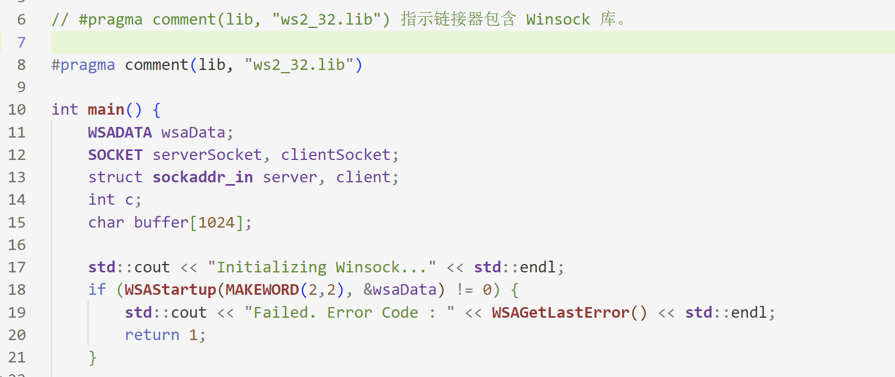
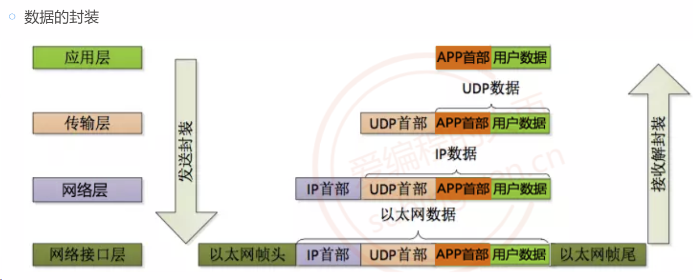
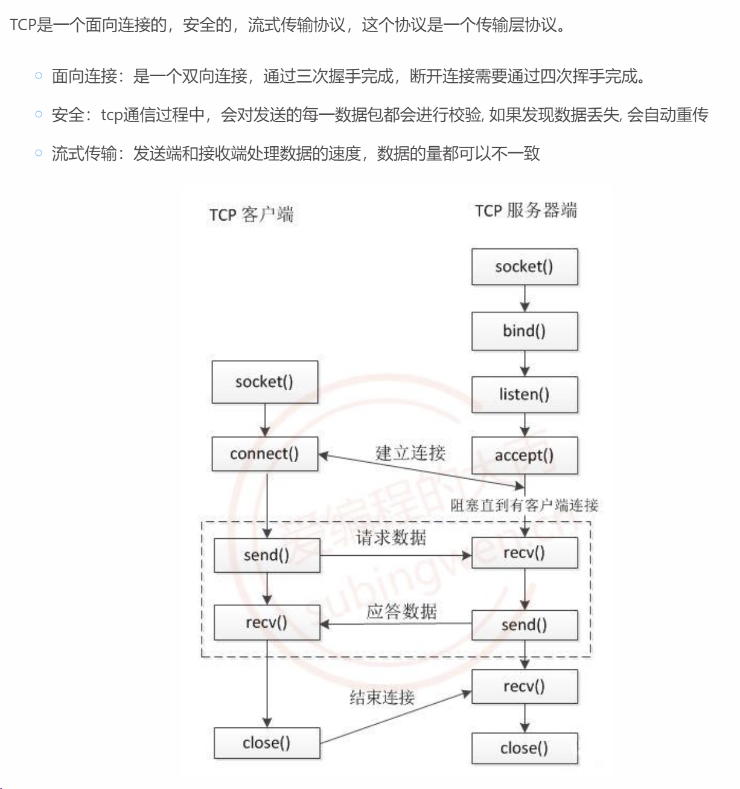
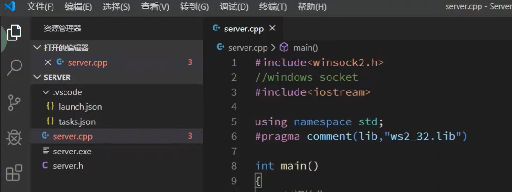
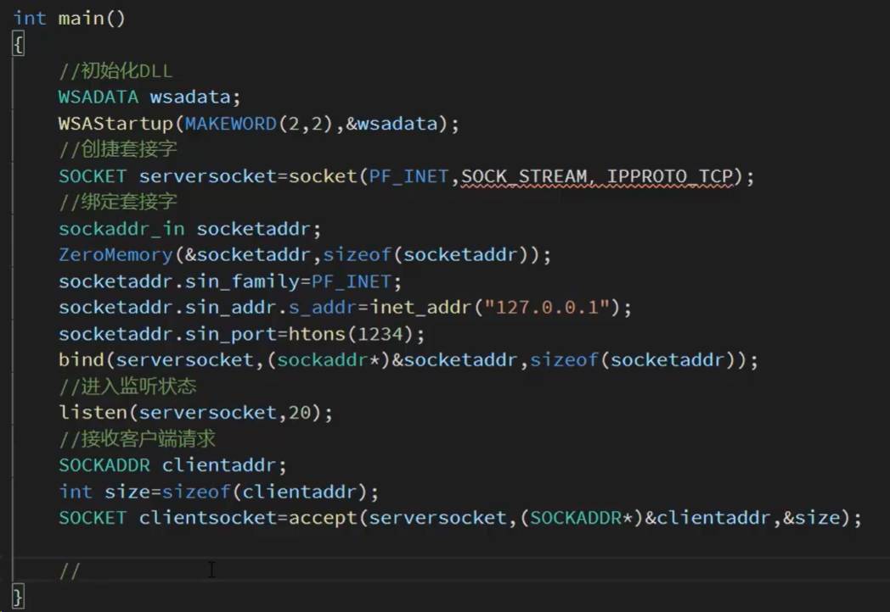
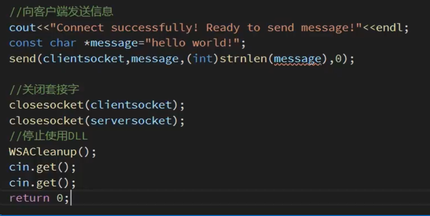

# 网络编程


> C++网络编程是一个广泛的话题，涉及许多不同的概念和技术。网络编程通常指的是使计算机通过网络进行数据交换的过程。C++作为一门系统编程语言，并没有直接在其标准库中包含网络编程的功能，但它可以通过操作系统级别的API（如UNIX的sockets，Windows的Winsock）或者第三方库（如Boost.Asio）来实现网络通信。
>
> ### 基本概念
>
> 1. **套接字（Sockets）**：
>    - 套接字是网络通信的基本构建块。在网络编程中，套接字用于建立连接、发送和接收数据。
>    - 在UNIX/Linux中，套接字API遵循POSIX标准，而在Windows中，则使用Winsock API。
>
> 2. **TCP和UDP**：
>    - **TCP（传输控制协议）**：是一种面向连接的、可靠的、基于字节流的传输层通信协议。在TCP套接字编程中，通信双方首先建立连接，然后进行数据传输，最后断开连接。
>    - **UDP（用户数据报协议）**：是一种无连接的协议。与TCP不同，UDP套接字发送的是独立的消息（称为数据报）。
>
> 3. **IP地址和端口号**：
>    - **IP地址**：用于标识网络上的计算机。
>    - **端口号**：用于标识计算机上的特定应用程序。
>
> ### 网络编程步骤
>
> 1. **初始化套接字库**（特别是在Windows中，使用Winsock）。
> 2. **创建套接字**：使用`socket()`函数。
> 3. **设置套接字选项**（可选）：比如设置超时，非阻塞模式等。
> 4. **绑定套接字到地址和端口**（服务器端）：使用`bind()`函数。
> 5. **监听连接**（服务器端TCP）：使用`listen()`函数。
> 6. **接受连接**（服务器端TCP）：使用`accept()`函数。
> 7. **连接到服务器**（客户端TCP）：使用`connect()`函数。
> 8. **发送和接收数据**：使用`send()`和`recv()`（TCP）或`sendto()`和`recvfrom()`（UDP）。
> 9. **关闭套接字**：使用`close()`（POSIX）或`closesocket()`（Winsock）。
>
> ### 异步操作和多线程
>
> 1. **阻塞与非阻塞套接字**：默认情况下，套接字操作是阻塞的。可以设置套接字为非阻塞模式，或使用异步IO操作。
> 2. **多线程**：在服务器端，常常需要为每个客户端连接创建一个新线程或使用线程池来处理多个连接。
>
> ### 第三方库
>
> - **Boost.Asio**：这是一个跨平台的C++库，用于网络编程。它提供了对异步IO的支持，包括TCP和UDP套接字。
> - **Poco和Qt**：这些库也提供了网络功能，包括HTTP客户端和服务器，以及较低级别的套接字操作。
>
> ### 错误处理
>
> - 网络编程需要仔细处理错误情况，比如连接失败、数据传输中断等。
>
> ### 安全性
>
> - 对于需要安全数据传输的应用程序，考虑使用SSL/TLS。
>
> ### 示例代码
>
> 编写一个完整的网络应用程序通常涉及到上述所有概念。例如，一个简单的TCP服务器将包括套接字初始化、创建套接字、绑定、监听、接受连接、数据交换以及关闭套接字的步骤。
>
> ### 结论
>
> C++网络编程是一个复杂但有趣的领域。虽然C++标
>
> 准库本身不提供网络功能，但通过操作系统级别的API或第三方库，可以有效地实现网络通信。掌握这些概念和技能对于编写现代C++应用程序非常重要。


# 套接字通信

[大丙](https://subingwen.cn/linux/socket/)

> 搭配教程上的内容一起学习，在教程的**扩展阅读**，里面有windows的相关内容。

## 1. 概述

套接字通信其实就是网络通信，如果想要做出能够在网络中进行通信的软件，就需要使用网络相关的技术，套接字是网络通信的基础，是非常重要的。

windows上也有一套和LINUX相似度，99%的API函数，它的使用流程呢和LINUX，套接字的使用流程几乎是一模一样的，只不过呢windows上进行套接字通信之前，需要先**加载套接字库**，最后呢再释放这些套接字库资源。，在LINUX操作系统上呢就不需要进行加载和释放啊，因此啊咱们使用起来会更加的简单一些，在这两个平台上涉及到的套接字，相关的API函数呢，他们的**名字以及参数其实都是相同的**，只不过在windows上，这些函数数的类型呢进行了重定义，我们看起来似乎有些区别，其实它们的本质是一样的。

> #### 加载套接字库
>
> 
>
> 如果你使用的是CMake作为你的构建系统，那么确实可以（且通常更推荐）在CMakeLists.txt中指定需要链接的库。这种做法更为通用，可以确保你的项目在不同的编译器和平台上都能够正确构建。
>
> 要在CMake中链接到Winsock库，你可以在你的`CMakeLists.txt`文件中添加如下内容：
>
> ```cmake
> cmakeCopy code# 首先找到ws2_32.lib
> find_library(WS2_32_LIBRARY ws2_32)
> 
> # 确保你的目标已经定义
> add_executable(your_executable_name source_file.cpp)
> 
> # 将ws2_32.lib库链接到你的目标上
> target_link_libraries(your_executable_name ${WS2_32_LIBRARY})
> ```
>
> 在这个示例中，`your_executable_name` 应该替换为你的可执行文件的目标名，而`source_file.cpp`应替换为你的源文件名。这种方式的好处是，它不依赖于特定的编译器指令，使得你的构建过程更加清晰和可移植。


在网络通信的时候呢，客户端和服务器的比例是 N ：1，也就是说呢有多个客户端，一个服务器。如果有多客户端和服务器进行通信，那么现在就有问题了，服务器如何处理多个客户端的请求呢，这个呢有两种处理方式，一种方式呢是按照先后顺序依次处理，这样的话呢只要客户端的请求足够多，服务器的效率呢就能够足够低。第二种方式呢是进行**并发处理**，在这儿呢主要是给大家介绍一下，如何使用**多线程进行并发**，掌握了如何使用多线程进行并发之后呢，我们可以把多线程的换成**线程池**，线程池就可以对多个线程进行管理，就不需要再次创建它们，只需要把服务器端需要处理的任务，直接扔到线程池里边，这样的话呢我们的工作量就降低了，并且呢能够更好的体会一下线程池它的优势。

除此之外呢，在服务器端还有其他的并发处理方式，比如说使用**多进程**，如果我们在对多个进程进行管理呢，和线程池一样，咱们就可以得到一个进程池。再有呢就是使用**IO多路转接**，也就是使用**select或者是epoll**进行处理啊，这个呢有些小伙伴有可能听说过，那么使用IO转接函数呢，可以在单线程的情况下处理多个客户端的请求。如果这个IO多路转接在搭配多线程使用的话，就可以大大提高它的工作效率。再或者呢我们可以使用一些开源的框架，比如说libevent，这是一个开源的网络通信框架，天然的支持高并发，比如说我们要做游戏，那么就把这个游戏的任务逻辑写出来就行了，关于他的数据的接收和发送，这个我们只需要调用相关的API函数就OK了，以上说到的都是针对于服务器端的优化，以及呢如何进行并发的处理。

对应的，如果咱们客户端的业务流程比较复杂，需要同时进行软件的上传和下载。在这种情况下呢，咱们就需要和服务器端建立多个连接，这样的话呢才能够提高效率，那么我们就可以在客户端呢创建一个**套接字连接池**，每个连接呢对应一个要处理的业务流程。因为我们发起了多个连接，那么每个连接呢是不是都需要处理，这个时候就需要使用多线程了，因此呢套接字连接池是和多线程搭配使用的，因为用到多线程，所以说呢我们也可以让这个套接字连接池呢，和线程池搭配着使用，这些都是OK的。由于C++里边呢没有用于通信的套接字类，所以后面呢我也会给大家讲解一下，如何基于这些C语言的API，封装出对应的用于通信的C加类，顺便夯实C++基础。


## 2. 相关概念


### 2.1 广域网和局域网

什么叫做局域网呢，就是在一定的区域范围内，这个网络呢就叫做局域网，局域网内的各个计算机节点之间是可以相互通信的，但是呢他们不能够访问外网，城市和城市之间，也可以搭建一个很大的局域网络，国家和国家之间其实也可以搭建一个非常大的局域网络啊，只要我们想这就可以做到。
	在局域网内部呢，咱们默认情况下不能够访问外网，如果我们想要访问外网怎么办呢。这个局域网里边呢，一般情况下会给我们提供一台代理服务器，我们通过提供的账号呢登录到代理服务器上，代理服务器呢就可以帮助我们连接到外网。另外一种情况呢就是我们不需要代理服务器，咱们家里边呢就是有一个路由器吧，那么这个路由器上面接上网线，是不是也能够访问网这个路由器，给我们提供的其实也是一个局域网络吧，因为我们通过路由器得到ip地址是一九二点168点多少多少啊，如果说我们把这个ip地址啊给到了另外一个城市的哥们，他能够通过这个ip地址访问你的主机吗，这是绝对不可能的，如果说咱们通过网线或者代理服务器连接到了外网，这个外网呢也可以称之为公网或者是广域网，有三种叫法，其实说的是一回事儿啊。
	我们通过这个公网呢就可以连接到各个国家的各个计算机节点上，在理论上呢只要这台计算机它连接到了外网，，其实呢它就能够访问巫王里边的所有的服务器，但是啊每个国家都有自己的防火墙。另外啊关于这个广域网呢，我们可以把它理解为全世界最大的一个局域网吧，因为我们现在能够居住的范围仅局限于地球吧，假如说有一天呢火星上也能够住人了，并且呢地球和火星之间还搭建了一条高速网络，那么现在啊这个火星和地球之间的网络呢，咱们就可以称之为外网，地球上那个网络呢它就是一个实实在在的局域网，火星上那个网络呢也是一个实实在在的局域网，它们之间能够通信的这些网络呢才可以称之为外网。

### 2.2 ip

 ip，它的全称是internet protocol，就是网络协议。基于这个网络协议呢，咱们就能够得到一个ip地址，这个ip地址呢它是一个整形数，用来标识计算机在网络中的地址。计算机呢在网络环境中它也是有一个地址的，只要有了这样一个ip地址之后，不管你是在局域网还是在广域网中，都能够通过这个地址找到你，咱们也可以这么理解啊，这个ip地址是网络中计算机他的身份的唯一标识，通过这个ip地址，我们就能够找到网络中的某一台计算机或设备。

数据呢从局域网ip地址，走到交换机，交换机呢再把这个数据发送到外网，数据再回来之后呢给到交换机，交换机呢再把这个数据给到局域网络中的某一台主机，通过这种方式呢也能够连到外网，只不过是多台主机共用了同一个外网的ip地址。


### 2.3 端口

我现在呢作为一个消息的发送者，要把这个消息发送给某一台主机，怎么就知道这台主机在哪呢，是不是通过一个ip地址就能找到这台主机了，比如说呢是这个192.168.1.106，找到这台主机了，在这个主机上面是不是运行着很多个应用程序啊，我把这个消息啊发送到这台主机上面之后，哪一个应用程序需要接收这个数据呢，你是不是要非常明确地把它判断出来呀，咱们就需要通过一种方式啊，来标识运行在当前在主机上的所有的应用程序，就是所有的进程啊。能标识呢其实就是通过端口来进行标识，我们在发送这个消息的时候，可以指定消息的地址吧，就是它的ip，另外呢还需要定位这台主机上面对应的哪一个进程接收到这个消息吧，所以说呢后边我们再给它加上一个端口，ip和端口都加上之后，这个消息的接收者咱们就能够确定下来了。

这个端口，相当于就是消息接收者对应的那个进程的名字，那么这个进程的名字呢是通过一个端口来标识的，这个端口和ip一样，都是一个整形数，但是呢它是一个短整型，16位的整形数，unsigned short。

首先是基于这个电脑的ip地址，找到了我的这个终端，那么找到这个终端之后，在这个电脑上面呢，它同时运行了很多个进程，哪个进程能够接收到这个消息呢，肯定是绑定了固定端口的那个进程呢就能够收到对应的消息了，所以说呢这个发送端在发送的时候，他肯定是把消息发送到了某个i p的某个端口上面。，这样的话呢这个ip对应的主机上的绑定了这个端口的进程呢，就能够收到我发送的消息了，也就是说这个微信对应的技能和qq对应的竞争，他们绑定的端口是不是不一样啊，他们绑定了不同的端口，所以说呢他们就能够通过这个端口呢收到不同的终端，给他们发送过来的对应的消息。


最后呢我们需要记住一句话，**通过一个ip地址呢，咱们能够定位一台主机**，就能找到一台电脑啊，在这个电脑上面能够同时运行多个应用程序吧，每个应用程序对应的都是一个进程，我们怎么找到这个进程呢，**就是通过端口呢，咱们就能够定位到某一个进程了**，定位到这个进程之后呢，就能找到对应的这个应用程序。只要把这两句话记住了，这个ip和端口它们的职责就是它们的作用啊，你就能够非常明确了，这样的话咱们后边你就能明白了，为什么在网络通信的时候，必须要指定出ip和端口才能够进行通信。


### 2.4 数据的传输

网络分层模型


在现阶段，不需要去研究这个底层协议它的格式，以及网络通信的时候是如何基于这些格式进行数据传输的，咱们只需要搞明白对应的这个套接字接口怎么去调用就行了，以及套接字通信的流程。像这些呢都已经在底层封装好了，我们只需要按照通信流程去通信就行，只要咱们调用对应的这个函数接口啊，数据呢就能够按照这种格式在计算机之间进行传输。


**数据的传输过程，看 *计算机网络* 笔记**




在应用层以下，程序员默认情况下是不需要做任何的处理的，这些呢都是由内核来完成的。我们只需要把应用层这个数据呢搞清楚就行了，应用层数据刚才说了两种情况，一种情况呢是不进行数据的打包，另外一种呢是打包，打包呢就需要使用相关的协议了，这个协议呢可以是标准协议，也可以是自定义协议，如果说你对应用层数据进行了封装，那么接收到这个数据之后呢，需要在应用层呢把这个数据按照发送端的那个协议格式啊，再把它解开，我们就能够得到原始数据了。


### 2.5 socket 编程

Socket套接字由远景研究规划局（Advanced Research Projects Agency, ARPA）资助加里福尼亚大学伯克利分校的一个研究组研发。其目的是**将TCP/IP协议相关软件移植到UNIX类系统**中。设计者开发了一个接口，以便应用程序能简单地调用该接口通信。这个接口不断完善，最终形成了Socket套接字。Linux系统采用了Socket套接字，因此，Socket接口就被广泛使用，到现在已经成为事实上的标准。现在呢不管是在linux还是在windows以及其他平台上，咱们进行网络通信，都是基于这套标准的。

socket呢它的英文含义是插座，通过这个名字能够形象地描述出我们在进行网络通信的时候，都需要有哪些角色的参与。我们想啊，如果说单纯的有一个插座，这个插座能发挥它的作用吗，是不行的，怎么就能发挥它的作用呢，是不是需要有一个插头啊，把这个插头插到插座上，那么这个插座就能给插头供电了吧。

我们在进行网络通信的时候，首先呢需要一个类似于**插座**的角色，其实就是**服务器**角色，服务器角色你先把它启动起来，在这儿准备着干嘛呢，等待对应的插头的接入，这个**插头**呢其实就是**客户端**，那你想啊一个插座上是不是有很多的插孔啊，也就意味着啊咱们这个服务器呢可以有很多的客户端接入，接入进来之后呢，这个服务器就能给这若干个客户端呢提供服务了，而且呢是谁主动连接谁呢，肯定是**客户端主动的连接服务器**，这个和插座一插头的使用方法呢是完全相同的。


#### 2.5.1 字节序

字节序，顾名思义字节的顺序，就是大于一个字节类型的数据在内存中的存放顺序，也就是说对于单字符来说是没有字节序问题的，字符串是单字符的集合，因此字符串也没有字节序问题。

目前在各种体系的计算机中通常采用的字节存储机制主要有两种：Big-Endian 和 Little-Endian，数据在内存中的存储顺序呢主要有两种分别是大端，还有一个呢是小端。那么这个大端和小端呢还有另外一个名字啊，这个大端呢称之为网络字节序，那么这个小端呢可以称之为主机字节序。

咱们通常所用的pc机数据在内存中的存储顺序呢，就是按照这种小端的顺序来存储的。我们在进行网络通信的时候，数据呢是按照大端顺序来存储的，比如说我们在套接字通信的时候发送的数据，你需要把它从小端转换成大端，然后呢进行发送，我们在进入到数据之后呢，还需要把这个大端再转换成小端，才能够在咱们本地的主机上面呢进行存储。


### 2.6 TCP通信



在通信的时候呢，一共是有两个角色了，一个是客户端，一个是服务器。客户端的通信流程呢，比服务器的通信流程要简单，下面呢咱们先来说一下他们这两个角色对应的处理流程，然后再说在处理期间都需要用到什么样的api函数。咱们把流程介绍完了之后，再介绍这个函数的时候，就能知道他在通信过程中所担当的是一个什么样的角色。


#### windows 下的句柄

> 在Windows编程中，"句柄"（Handle）是一个非常重要的概念。句柄是一个**用于引用各种资源或对象的标识符**，例如窗口、文件、套接字等。在Windows操作系统中，句柄的使用非常普遍，因为它提供了**一种抽象层来处理资源和对象，而不需要关心这些资源和对象的具体实现细节。**
>
> ### 句柄的基本概念
>
> 1. **抽象标识符**：句柄是一个抽象的标识符，通常是一个指针或整数，用于代表一个特定的资源或对象。
>
> 2. **封装**：句柄封装了对资源的引用，使得程序员无需关心资源的物理地址或底层表示，只需要通过句柄来操作资源。
>
> 3. **类型多样性**：Windows中有多种类型的句柄，例如窗口句柄（HWND）、文件句柄（HANDLE）、图形设备接口句柄（HDC）、菜单句柄（HMENU）等。
>
> ### 句柄与套接字
>
> 在网络编程中，套接字句柄（SOCKET）是一个特殊类型的句柄，用于标识一个网络连接或通信端点。在Winsock API中，这个句柄用于表示一个打开的网络套接字，通过它可以进行网络数据的发送和接收。
>
> ### 句柄的操作
>
> - **创建和打开**：当创建或打开一个资源时（例如打开一个文件、创建一个窗口、创建一个套接字），Windows会返回一个相应的句柄。
>   
> - **使用**：通过句柄可以对资源进行操作，例如读写文件、发送接收网络数据、绘制窗口内容等。
>
> - **关闭和释放**：使用完资源后，应该关闭相应的句柄，释放系统资源。例如，关闭文件句柄或套接字句柄。
>
> ### 句柄的重要性
>
> 句柄的使用使得Windows程序能够以统一和抽象的方式处理各种不同类型的资源。这对于编写可维护和可移植的代码非常重要，因为它减少了程序与操作系统内部实现之间的直接交互。
>
> ### 总结
>
> 句柄是Windows编程中用于引用和操作系统资源的关键概念。它提供了一种高级别的抽象，允许程序员在不了解或直接操作资源内部结构的情况下，进行资源的操作和管理。在网络编程中，套接字句柄是用来表示和管理网络连接的关键工具。


#### 2.6.1 服务端通信流程

在网络通信的时候呢，通信完毕之后，需要咱们调用关闭套接字的这个函数，就是进行了四次挥手，只要咱们调用对应的这个close函数，这个挥手呢它就会进行两次，比如说我们客户端调用了一次close，那么挥手两次，服务器端再调用一次close，挥手两次，最终呢2+2=4，四次挥手呢就完成了。在通信的两端呢，谁先调用close函数，那么谁就先进行前两次挥手，后调用close那个角色呢，他进行的就是后两次挥手了，就是第三次和第四次。


#### 2.6.2 客户端通信流程


在客户端的这个通信流程里边呢是没有绑定操作的，在服务器端的这个操作流程里面呢，它有一个绑定操作，那么这个通信的客户端它是不是需要绑定一个端口呢，答案是需要的。为什么客户端需要绑定一个端口，但是在通信流程里面并没有通过函数进行指定呢？是因为啊咱们调用了connect函数之后，就会自动的给这个用于通信的套接字，绑定一个随机的，没有被占用的端口。为什么随机绑定一个就可以了，在服务器端就不能够随机绑定？咱们考虑这么一件事，服务器端是不是需要先启动，你既然需要先启动，我要把这个数据呢发送给你，什么数据呢，连接数据吧。如果你不绑定一个固定的端口和一个固定的地址，那我怎么知道按照什么地址去连接呢，所以说啊这个服务器端它需要绑定一个固定的端口和一个固定的ip，我在连接的时候才有目的性。在客户端通过connect，就会自动的绑定成功的一个端口了，绑定成功之后呢，发起连接。在服务器端是不是就接受了连接啊，刚才给大家介绍了，我们在服务器端调用accept函数的时候，是不是就得到了客户端的ip和端口对应的这个端口，就是随机绑定的端口，那么这个ip地址呢就是客户端对应的那个ip地址。

既然通过连接，咱们已经把客户端的ip和端口信息发送给了服务器，那服务器是不是就知道了客户端对应的具体的ip端口。服务器端呢，就可以基于得到的这个ip端口信息，和客户端进行数据的发送和接收了。，如果说呢咱们不想让客户端随机绑定一个端口，而是必须要给他指定一个固定的端口，那么我们就可以在套接字通信的客户端进行绑定，那么绑定这个操作应该写到哪儿呢，写到socket，创建套接字和connect连接服务器，这二者中间就写到这个位置就可以了啊。，但是一般情况下呢，咱们也不需要去手动绑定，直接让它自动的分配一个端口就行了，因为啊这个服务器它绝对不会主动地连接客户端，如果服务器不主动连接客户端，那么我们就不需要给客户端呢绑定一个固定的端口对吧，让他随机去分配一个端口就行了，因为它随机分配好了之后呢，会把分配的这个端口信息呢通过connect连接，然后呢告诉这个accept函数，accept函数呢就拿到了它随机绑定的那个端口啊，就是这么一个流程啊。咱们一定要把这个搞清楚，如果说咱们有这种需求啊，让服务器主动连接客户端，那就说明你的设计思路是有问题的，做自我检讨就可以了。


# `Windows`下`Winsock`的简单使用









