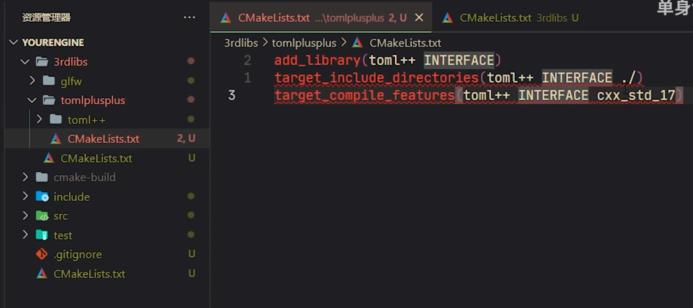

# CMake

## ---深度理解---


**==需要什么，以及这些东西都在哪==**


# ---静态库、动态库汇总---


> - ### 重要知识点
>
> `.dll`动态库文件只有在运行的时候才会需要，编译的时候找它对应的`.ib`
>
> 引用dll的时候，也是必须要有一个lib。因为lib里放了插桩函数，**在链接的时候只需要链接这个很小的lib**，**调用函数的时候，其实是先进入了lib里的这个插桩函数**，然后插桩函数在**运行时查找，跳转到dll文件**，相关的**函数实现是在dll文件里的**，因此节省了程序空间。
>
> 


## 1. `相关基础`


### ---什么是构建系统？

构建系统是一套用于自动化软件构建过程的工具和方法集合。软件构建不仅仅是编译源代码生成可执行文件，还包括多种其他任务，比如代码生成、单元测试、静态分析、链接、打包等。构建系统自动化这些过程，使得开发者可以集中注意力在代码编写上，而不是手动执行这些重复和容易出错的任务。

### ---为什么需要CMake？ 

CMake是一个跨平台、开源的**构建系统生成器**，它能生成**用于编译代码的平台特定构建系统**（例如，Makefile、Visual Studio项目文件等）。下面是一些选择CMake的理由：

1. **跨平台性**: CMake可以在多种操作系统和编译器下工作，允许你使用同一份`CMakeLists.txt`配置文件来生成针对不同平台的构建文件。

2. **易于使用**: CMake使用纯文本文件（通常命名为`CMakeLists.txt`）来描述构建过程，这些文件相对易于编写和维护。

3. **可扩展性**: CMake支持各种高级特性，包括但不限于自定义构建规则、找寻库和包、测试自动化等。

4. **社群支持**: CMake有着广泛的用户基础和丰富的文档，很多开源项目都使用CMake作为其构建工具。

5. **集成与兼容性**: CMake可以和其他现代开发工具（例如，Clang-Tidy, cppcheck等）或持续集成（CI）系统（例如，Jenkins, GitLab CI, GitHub Actions等）良好地集成。

6. **现代化**: 相较于一些古老的构建工具，如Make，CMake提供了更现代、更高级的功能和语法。

7. **生成多种构建系统**: 除了生成Makefile，CMake还可以生成Ninja、Visual Studio解决方案、Xcode项目等。

8. **开发速度**: 自动化的构建流程可以显著提高软件开发的速度和质量。

总体而言，CMake是一个功能丰富、高度可定制、跨平台的构建系统，非常适用于大型和复杂的代码库，也逐渐成为C++社群中的事实标准。


### ---`源代码—>可执行程序` 编译过程

源文件呢可能是 .c 或者.cpp ，想要变成可执行程序，需要通过**编译器**进行处理，这个所谓的编译器呢其实是一套工具链（tool chain），分为四部分：

- #### 预处理器

编写好的可执行程序，需要先进行预处理，预处理呢就是把文件展开，把对应宏进行替换，把注释去掉。预处理完毕之后得到的还是源文件，只不过在这个源文件里边，头文件是展开的，乱七八糟的注释呢就没有了，宏也没有了，被替换掉了。

- #### 编译

接下来呢需要通过编译器进行编译，这个编译器，其实就是咱们通常所说的gcc或者是c++，编译完毕之后呢，会得到一个汇编文件，后边就需要通过汇编器进行处理

- #### 汇编

汇编结束之后，得到的就是二进制文件了，在windows里边看到的就是这一系列的 .obj ；如果是linux里边，看到的就是 .o 文件

- #### 链接

最后还需要通过链接器，对这些二进制文件进 行链接，连接完毕之后，这些二进制文件就变成了一个二进制文件，直观上看它就是做了一个打包的操作，最终我们得到了一个可执行程序。这个可执行程序也是二进制的，而.obj 、.o 不能执行

**这是整个的编译过程**


### `--- .cmake`文件 


`.cmake` 文件是包含 CMake 脚本命令的文本文件，这些命令用于配置构建过程。这些文件通常用于以下几个目的：

#### 模块和包查找

`.cmake` 文件经常用于编写模块或包查找脚本。例如，`FindBoost.cmake` 文件会包含一组 CMake 命令，用于在系统中查找 Boost 库，并设置相应的目标和变量，以便在主 `CMakeLists.txt` 文件中使用。

#### 包含公共脚本

如果你有一些在多个项目或多个 `CMakeLists.txt` 文件中重复使用的 CMake 代码，你可以将这些代码放入一个 `.cmake` 文件中，并在需要的地方使用 `include()` 命令来包含它。

#### 配置文件

`.cmake` 文件也用于生成配置文件，这样其他项目可以轻松地找到和使用一个已经安装的库。这通常通过 `install(EXPORT ...)` 和相关命令来完成。

#### 工具链文件

在交叉编译的情境中，`.cmake` 文件可以用作工具链文件，其中包含了用于编译目标平台的编译器、链接器等工具的设置。

#### 初始化脚本

`.cmake` 文件也可以用于设置全局变量、包含其他 `.cmake` 文件或执行一次性任务，这些设置和任务对于整个构建过程都是可见的。

#### 示例

假设你有一个名为 `CommonSettings.cmake` 的文件，其中包含了一些常用的编译标志和其他设置：

```cmake
set(CMAKE_CXX_FLAGS "${CMAKE_CXX_FLAGS} -Wall")
```

你可以在主 `CMakeLists.txt` 文件或任何子目录的 `CMakeLists.txt` 文件中使用 `include()` 命令来包含这个文件：

```cmake
include(CommonSettings.cmake)
```

这样，`CommonSettings.cmake` 文件中定义的所有设置和变量都会应用到包含它的 `CMakeLists.txt` 文件中。

总体来说，`.cmake` 文件提供了一种模块化和重用 CMake 脚本的方式，使得你可以更容易地管理复杂的构建逻辑。


### ---CMake GUI 界面

CMake GUI界面上的"Configure"、"Generate"和"Open Project"按钮各自执行不同的功能，它们在项目构建流程中起到了不同的作用。

1. **Configure（配置）**

    点击"Configure"按钮会启动CMake配置过程。在这一步，CMake读取你的`CMakeLists.txt`文件，并**执行其中定义的所有指令**，**以确定如何构建你的项目**。这包括**找到依赖库、检查编译器设置、创建编译器标志**等。

    配置过程通常需要你指定一个构建系统（例如，Make、Ninja或某个IDE的项目文件格式，如Visual Studio）。此外，任何在`CMakeLists.txt`文件中定义的选项和变量也会在这一阶段展示出来，让你有机会修改它们。

    如果配置过程成功，你会看到输出日志，指出所有的设置和找到的依赖库。如果配置失败，输出日志将帮助你诊断问题。

2. **Generate（生成）**

    一旦配置过程成功完成，你就可以点击"Generate"按钮。这一步会**生成实际的构建文件**（例如Makefiles、Ninja build files或**IDE项目文件**），这些文件描述了如何构建你的项目。

    这一步是**根据在"Configure"阶段生成的设置来完成的**。**一旦生成了这些构建文件，你通常就可以退出CMake GUI并使用你选择的构建系统来编译和链接你的项目**。

    此阶段并不会再去执行`CMakeLists.txt`文件

3. **Open Project（打开项目）**

    这个按钮通常用于直接打开生成的IDE项目文件，例如如果你生成了一个Visual Studio解决方案（`.sln`）文件，点击这个按钮会尝试用Visual Studio打开它。

这三个步骤通常按顺序执行：先"Configure"，然后"Generate"，最后**使用生成的构建文件来编译和链接你的应用程序**，你可以通过点击"Open Project"直接在相应的IDE中打开它。然而，每当你修改了`CMakeLists.txt`文件或相关设置，通常需要重新运行"Configure"和"Generate"步骤。


### ---Superbuild 构建策略


Superbuild 是一种特殊的构建策略，主要用于管理复杂项目和它们的依赖项。在这种构建策略中，主要使用 CMake 的 `ExternalProject_Add` 函数或类似的机制来下载、配置、构建和安装外部项目。

以下是一个简单的例子，说明如何使用 Superbuild 来构建一个依赖于库 `MyLibrary` 的项目 `MyProject`。

```cmake
# Main CMakeLists.txt for Superbuild
cmake_minimum_required(VERSION 3.10)
project(MySuperbuild)

include(ExternalProject)

# External MyLibrary
ExternalProject_Add(MyLibrary
  GIT_REPOSITORY https://github.com/someone/MyLibrary.git
  CMAKE_ARGS -DCMAKE_INSTALL_PREFIX=${CMAKE_BINARY_DIR}/install
)

# Main Project
ExternalProject_Add(MyProject
  DEPENDS MyLibrary
  GIT_REPOSITORY https://github.com/me/MyProject.git
  CMAKE_ARGS -DCMAKE_INSTALL_PREFIX=${CMAKE_BINARY_DIR}/install
             -DMyLibrary_DIR=${CMAKE_BINARY_DIR}/install/lib/cmake/MyLibrary
)
```

在这个例子中，`MyLibrary` 项目首先被下载和构建，然后是 `MyProject` 项目。所有的项目都被安装到 `${CMAKE_BINARY_DIR}/install`，这是一个在构建目录中创建的临时目录。

#### 使用本地已下载的库

你可以通过几种方式使用本地已经下载好的库：

1. **直接指定路径**: 在 `ExternalProject_Add` 函数中，你可以使用 `SOURCE_DIR` 参数来指定本地源代码的路径。

    ```cmake
    ExternalProject_Add(MyLibrary
      SOURCE_DIR /path/to/local/MyLibrary
      CMAKE_ARGS -DCMAKE_INSTALL_PREFIX=${CMAKE_BINARY_DIR}/install
    )
    ```

2. **条件语句**: 你可以使用 CMake 选项和条件语句来动态决定是否下载或使用本地库。

    ```cmake
    option(USE_LOCAL_LIB "Use local MyLibrary" OFF)

    if(USE_LOCAL_LIB)
      set(MyLibrary_SRC_DIR "/path/to/local/MyLibrary")
    else()
      set(MyLibrary_SRC_DIR "https://github.com/someone/MyLibrary.git")
    endif()

    ExternalProject_Add(MyLibrary
      SOURCE_DIR ${MyLibrary_SRC_DIR}
      CMAKE_ARGS -DCMAKE_INSTALL_PREFIX=${CMAKE_BINARY_DIR}/install
    )
    ```

    在运行 CMake 配置时，你可以设置 `-DUSE_LOCAL_LIB=ON` 来启用这个选项。

3. **内部变量**: 如果你的 Superbuild 允许你通过 CMake 变量设置源目录，你可以在配置时使用 `-D` 标志来设置这些变量。

    ```bash
    cmake .. -DMyLibrary_SRC_DIR=/path/to/local/MyLibrary
    ```

使用这些方法，你可以灵活地控制 Superbuild 应该从哪里获取依赖库，无论是从远程仓库下载还是使用本地已经下载好的版本。


### ---cmak的函数和宏

在 CMake 中，函数（`function`）和宏（`macro`）用于定义可重用的代码块，以便在 `CMakeLists.txt` 文件和模块中多次使用。虽然它们在语法和用途上有很多相似之处，但在变量作用域上存在一些关键的不同。

#### 函数（Function）

##### 定义和调用

函数在 CMake 中使用 `function` 关键字定义，并通过名称调用。

```cmake
function(my_function arg1 arg2)
    message("Function arguments: ${arg1}, ${arg2}")
endfunction()

my_function("Hello" "World")
```

##### 变量作用域

函数在 CMake 中拥有自己的局部作用域。这意味着在函数内部定义或修改的变量不会影响到函数外部的作用域。

```cmake
set(var "Outside")
function(test_function)
    set(var "Inside")
endfunction()
test_function()
message("${var}")  # Outputs: Outside
```

#### 宏（Macro）

##### 定义和调用

宏在 CMake 中使用 `macro` 关键字定义，并与函数类似地通过名称调用。

```cmake
macro(my_macro arg1 arg2)
    message("Macro arguments: ${arg1}, ${arg2}")
endmacro()

my_macro("Hello" "World")
```

##### 变量作用域

与函数不同，宏不拥有自己的局部作用域。这意味着宏内部的变量修改会影响到外部的作用域。

```cmake
set(var "Outside")
macro(test_macro)
    set(var "Inside")
endmacro()
test_macro()
message("${var}")  # Outputs: Inside
```

#### 选择函数还是宏

- **函数**通常更安全，因为它们不会意外地修改外部作用域的变量。在大多数情况下，函数是推荐的选择，除非你确实需要修改外部变量。
  
- **宏**在你需要修改外部变量或利用外部变量的当前值时可能更有用。它们也可以用于**在不同的作用域中“注入”代码**。

#### 参数处理

函数和宏都可以接受参数，并在其内部通过 `${arg1}`、`${arg2}` 等访问这些参数。你还可以使用 `ARGC` 变量来获取参数的数量，以及 `ARGV` 列表来访问所有参数。

```cmake
function(print_args)
    message("Number of arguments: ${ARGC}")
    message("Arguments: ${ARGV}")
endfunction()

print_args("arg1" "arg2" "arg3")
```

#### 总结

函数和宏在 CMake 中提供了一种方式来编写可重用的代码块。选择使用函数还是宏主要取决于你是否需要在代码块内部与外部作用域的变量进行交互。希望这些信息能帮助你理解 CMake 中的函数和宏！如果你有进一步的问题或需要更多的帮助，请随时询问。


### ---CMake 的核心机制和概念

> CMake 是一个非常强大的构建系统生成器，它通过一系列的核心机制和底层原理来实现其功能。下面是一些 CMake 的核心机制和概念：
>
> #### 1. **生成器（Generators）**
>
> CMake 支持多种构建系统和编译器，这是通过所谓的“生成器”实现的。生成器负责将 CMake 配置转换为特定构建系统（如 Makefiles、Visual Studio 项目文件等）的构建文件。
>
> #### 2. **变量和缓存**
>
> CMake 使用变量来存储和管理信息。CMake 有两种主要类型的变量：普通变量和缓存变量。普通变量是临时的，而缓存变量存储在 CMake 缓存中，可以在多次运行 CMake 时保持其值。
>
> #### 3. **目标（Targets）**
>
> 目标是构建过程中的一个单元，它可以是一个可执行文件、库、测试或自定义命令。目标包含构建它们所需的源文件和编译设置。
>
> #### 4. **属性（Properties）**
>
> 属性是与目标、源文件、目录或测试相关联的设置。它们可以用来控制构建过程的各个方面，例如编译器标志、包含目录或链接库。
>
> #### 5. **命令（Commands）**
>
> CMake 脚本由一系列命令组成，这些命令用于定义项目的构建和配置过程。命令可以用来添加目标、设置变量、定义属性等。
>
> #### 6. **脚本和模块**
>
> CMake 使用 `CMakeLists.txt` 脚本来定义项目结构和构建过程。你也可以使用 `include()` 或 `find_package()` 命令来包含其他 CMake 脚本或模块。
>
> #### 7. **查找和检测**
>
> CMake 提供了一系列的命令和模块，用于查找库、包、程序和文件。这些命令通常用来检测系统上的依赖项和特性。
>
> #### 8. **测试（Testing）**
>
> 通过集成的 CTest 工具，CMake 支持测试管理。你可以使用 CMake 命令来定义测试、关联测试目标和管理测试过程。
>
> #### 9. **打包（Packaging）**
>
> CMake 包含 CPack 工具，用于生成源代码包和二进制分发包。你可以定义安装规则和打包设置，以便在构建过程中生成包。
>
> #### 10. **跨平台构建**
>
> CMake 能够生成多种平台和编译器的构建文件，允许开发者在不同的操作系统和开发环境中构建项目。
>


### ---**变量**和**缓存变量**

在 CMake 中，**变量**和**缓存变量**是两种存储数据的主要方式。它们的主要区别在于作用域和持久性。

#### 变量

变量在 CMake 中用于存储临时数据。它们的**作用域通常限制在**定义它们的 `CMakeLists.txt` 文件或函数/宏内。一旦设置了一个变量，它就可以在相同作用域的后续 CMake 代码中使用。

```cmake
set(MY_VARIABLE "Hello, CMake!")
message(${MY_VARIABLE})  # 输出: Hello, CMake!
# message()命令支持字符串内插
```

#### 缓存变量

缓存变量是存储在 CMake 缓存中的变量，它们的值在 CMake 运行之间是持久的。

- 缓存变量的值存储在**构建目录中的** `CMakeCache.txt` 文件中。

这意味着即使你重新运行 CMake，缓存变量的值也会保持不变，除非它们被显式地修改。

```cmake
set(MY_CACHE_VARIABLE "Hello, Cache!" CACHE STRING "A description of the cache variable")
```

在这个例子中，`MY_CACHE_VARIABLE` 是一个缓存变量，它的值是 "Hello, Cache!"。`STRING` 指定了变量的类型，而 "A description of the cache variable" 是一个描述性的帮助字符串，通常在 CMake GUI 中显示。

#### 使用缓存变量

缓存变量通常用于存储可以由用户在配置项目时修改的设置。例如，你可以使用缓存变量来存储一个选项，该选项决定是否构建项目的某个特性：

```cmake
option(BUILD_MY_FEATURE "Build my feature" ON)
```

在这个例子中，`option()` 命令实际上在内部使用缓存变量来存储选项的值。`BUILD_MY_FEATURE` 是一个类型为 `BOOL` 的缓存变量，其值可以在配置项目时通过 CMake GUI 或命令行进行修改。

#### 注意事项

- 当使用 `set()` 命令设置变量时，如果存在同名的普通变量和缓存变量，普通变量将优先使用。
- 使用 `unset()` 命令可以删除普通变量或缓存变量。
- 使用 `mark_as_advanced()` 命令可以将缓存变量标记为高级选项，在 **CMake GUI 中默认隐藏。**


## ~~ ~~ ~~ ~~

### ~~ ~~ Cmake 与 VS

#### ---vs项目工程文件分类


- 项目下的子文件夹


当我们使用cmake的`add`命令生成库或者可执行文件时，后面指定上相关的cpp、h、hpp等文件，那么cmake就会识别到这些文件，并帮我们分类添加在vs项目工程里面

```cmake
add_executable(${PROJECT_NAME} ${${PROJECT_NAME}_SRCS} ${${PROJECT_NAME}_HDRS} ${${PROJECT_NAME}_UIS} ${WRAP_FILES})
```


#### ---CMake 可以用来在 vs 中设置文件夹

是的，CMake 可以用来在 Visual Studio 中设置文件夹（在 Visual Studio 中通常称为“过滤器”）。你可以使用 `source_group` 命令来组织你的源代码文件，使它们在 Visual Studio 中以文件夹的形式显示。

##### 基本用法

下面是一个基本的 `source_group` 使用示例：

```cmake
source_group(TREE "${CMAKE_CURRENT_SOURCE_DIR}" FILES ${SOURCES})
```

其中 `${SOURCES}` 是你项目中所有的源文件。

##### 详细示例

假设你有以下的源文件结构：

```css
project/
│
├── src/
│   ├── main.cpp
│   ├── utilities/
│   │   ├── utility1.cpp
│   │   └── utility1.h
│   └── interfaces/
│       ├── interface1.cpp
│       └── interface1.h
└── CMakeLists.txt
```

你可以在 `CMakeLists.txt` 文件中使用 `source_group` 来在 Visual Studio 中创建相应的文件夹结构：

```cmake
# 设置源文件变量
set(SOURCES
    src/main.cpp
    src/utilities/utility1.cpp
    src/utilities/utility1.h
    src/interfaces/interface1.cpp
    src/interfaces/interface1.h
)

# 创建一个可执行文件目标
add_executable(MyApp ${SOURCES})

# 使用source_group创建文件夹结构
source_group(TREE "${CMAKE_CURRENT_SOURCE_DIR}/src" PREFIX "Source Files" FILES ${SOURCES})
```

在这个例子中：

- `TREE` 参数指定了源文件树的根目录。
- `PREFIX` 参数指定了在 Visual Studio 中显示的文件夹的名称。
- `FILES` 参数指定了要组织的文件。

当你使用 CMake 生成 Visual Studio 项目文件并打开它时，你应该能在解决方案资源管理器中看到与你的源文件系统结构相匹配的文件夹结构。


#### ---`SET_PROPERTY` 命令设置文件夹

在 CMake 中，`SET_PROPERTY` 命令用于设置各种属性的值，而 `GLOBAL PROPERTY USE_FOLDERS ON` 是一种特殊的用法，它用于在 Visual Studio 和其他一些生成器中启用项目文件夹功能。

##### 代码解释

```cmake
SET_PROPERTY(GLOBAL PROPERTY USE_FOLDERS ON)
```

- `SET_PROPERTY`：CMake 命令，用于设置属性。
- `GLOBAL`：指定要设置的属性的作用域。在这种情况下，`GLOBAL` 指的是全局作用域，意味着这个属性的设置会影响到整个 CMake 项目。
- `PROPERTY USE_FOLDERS ON`：指定要设置的属性及其值。`USE_FOLDERS` 是一个预定义的属性，当其值设置为 `ON` 时，它允许你在支持的 IDE（例如 Visual Studio）中使用 `FOLDER` 属性来组织你的项目和目标。

##### 使用 `FOLDER` 属性

一旦 `USE_FOLDERS` 属性被设置为 `ON`，你就可以使用 `FOLDER` 属性来组织你的项目和目标。例如：

```cmake
SET_PROPERTY(GLOBAL PROPERTY USE_FOLDERS ON)

add_executable(MyExecutable main.cpp)
set_target_properties(MyExecutable PROPERTIES FOLDER "MyFolder")
```

在这个例子中，`MyExecutable` 目标将出现在 Visual Studio 解决方案资源管理器中名为 "MyFolder" 的文件夹下。

##### 注意

- 不是所有的生成器都支持 `USE_FOLDERS` 属性。如果一个生成器不支持这个属性，它将被忽略。
- 你可以使用多级文件夹，例如 `FOLDER "Level1/Level2"`。
- 使用文件夹可以帮助你更好地组织大型项目，特别是当你有多个目标和项目时。

希望这些信息对你有帮助！如果你有进一步的问题或需要更多的帮助，请随时询问。


### ~~ ~~ Cmake 单元测试

- #### CMakeLists文件

- 根目录： CMakeLists.txt， 

 添加 `include(CTest)`; 然后开启单元测试功能； 添加 `enable_testing()`；添加 `add_subdirectory(test)`

CTest 是CMake官方的一个测试工具集


- test目录： test/CMakeLists.txt，

`add_executable()` 生成可执行程序；还要使用 `add_test()` 来告诉它，现在要变成一个单元测试


#### ----重用测试代码

当有多个测试的时候，在CMakeLists.txt避免重复代码

在 CMake 中处理多个测试时，确实可能遇到重复代码的问题。为了避免这种重复，你可以使用**函数或宏**来抽象出通用的构建和测试逻辑。

##### 使用函数或宏减少重复

下面是一个简单的例子，展示了如何使用 CMake 函数来避免重复代码：

```cmake
function(add_my_test test_name test_source)
    add_executable(${test_name} ${test_source})
    target_link_libraries(${test_name} my_lib) # Link to your library
    add_test(NAME ${test_name} COMMAND ${test_name})
endfunction()

# 使用函数添加测试
add_my_test(test1 test1.cpp)
add_my_test(test2 test2.cpp)
add_my_test(test3 test3.cpp)
```

在这个例子中，`add_my_test` 函数接受测试的名称和源文件，然后使用这些参数创建一个测试目标和一个 CTest 测试。这样，你可以用一行代码为每个测试添加一个目标和一个测试，而不是为每个测试重复相同的逻辑。

是的，在 CMake 中你可以使用宏（`macro`）来达到类似于函数（`function`）的效果，减少代码重复。宏和函数在 CMake 中都用于定义可重用的代码块，但它们在变量作用域上有一些不同。

##### 使用宏的例子：

```cmake
macro(add_my_test test_name test_source)
    add_executable(${test_name} ${test_source})
    target_link_libraries(${test_name} my_lib) # Link to your library
    add_test(NAME ${test_name} COMMAND ${test_name})
endmacro()

# 使用宏添加测试
add_my_test(test1 test1.cpp)
add_my_test(test2 test2.cpp)
add_my_test(test3 test3.cpp)
```

##### 函数与宏的区别：

- **变量作用域**：
  - **函数**在变量作用域上更加严格。它们不会无意中修改外部变量，因为它们拥有自己的局部变量作用域。
  - **宏**与调用它们的作用域共享变量。这意味着宏可以修改外部变量，也可能受到外部变量的影响。
  
- **调用语法**：函数和宏的调用语法相同。

在大多数情况下，使用函数通常更安全，因为它们不会无意中修改外部变量。然而，宏在某些情况下可能更有用，例如，当你需要修改外部变量或利用它们的值时。

在你给出的测试用例的上下文中，你可以选择使用函数或宏，具体取决于你的需求。如果你不需要修改外部变量，通常建议使用函数以减少潜在的副作用和提高代码的可维护性。如果你需要更灵活的作用域规则，宏可能是一个更好的选择。

##### 优点

1. **减少重复**：你不需要为每个测试重复相同的 CMake 代码。
   
2. **易于维护**：如果你需要更改测试的构建或添加逻辑，你只需要更改函数，而不是每个测试的代码。
   
3. **一致性**：使用函数确保所有测试以相同的方式构建和添加。

##### 缺点

1. **复杂性**：对于简单的项目，创建函数可能会增加不必要的复杂性。
   
2. **灵活性**：如果测试需要不同的构建或添加逻辑，你可能需要修改函数以支持这些特殊情况，这可能会使函数变得更加复杂。

3. **学习曲线**：对于不熟悉 CMake 的人来说，理解函数和宏可能需要一些时间。

##### 总结

使用 CMake 函数或宏可以帮助你减少重复的代码和提高维护性，但也可能增加一些复杂性。你需要权衡这些优缺点，并根据你的项目需求做出决定。希望这些信息能帮助你！如果你有进一步的问题或需要更多的帮助，请随时询问。


#### ---设置是否需要编译的开关

使用`option`命令


### ~~ ~~ Cmake 引用第三方库 

**可以建立一个文件夹，专门用于存放第三方库**


- #### 本身是 CMake 工程的第三方库 **`Source Code Libraries`**

这种库的源代码被直接添加到项目中

使用`add_subdirectory()`一层一层地囊括到自己的工程里面

然后使用`target_link_libraries()`连接到自己的工程上面就可以了

可以将库的源代码编译为一个静态或动态库，并链接到你的目标上。


- #### 单头文件的库，没有源文件 `Header-Only Libraries`




头文件是不会进行编译的，因此`add_library()`里不写头文件库的名字

然后使用`target_include_directories()`连接到自己的工程上面就可以了，只需要在项目中包含这些头文件即可使用库的功能。

`INTERFACE` 关键字


- #### **预编译的第三方库** **`Precompiled Libraries`**

没有库的源码，或者库的工程特别大，不希望将其加入到项目中

这种库以预编译的二进制形式提供（例如 `.lib` 或 `.a` 文件）。你需要在项目中指定库文件和头文件的位置，并链接这些库文件。

- 可以使用，`add_library(... STATIC IMPORTED)` 和 `find_package(...)` 两种不同的方法，在项目中引入和使用第三方库。

当使用 `find_package` 来查找预编译的库时，CMake 通常会查找库的头文件和二进制文件，并提供变量来在你的项目中使用这些文件。

例如：

```cmake
cmakeCopy codefind_package(MyLibrary REQUIRED)
target_link_libraries(my_target PUBLIC MyLibrary::MyLibrary)
```

在这种情况下，`find_package` 通常会在系统目录（或你提供的其他路径）中查找库的配置文件，并设置一些变量或目标，以便你在项目中使用库。


### ---预编译头文件PCH

预编译头文件（`Precompiled Header`，通常缩写为 `PCH`）是一种**编译器优化技术**，用于加速编译过程。这种技术主要用于减少编译时间，特别是在项目中有大量源文件并且包含了许多头文件的情况下。

当头文件非常多的时候，有标准库、模板库、第三方库的时候，特别是模板库，编译会很慢，它需要解析所有包含的头文件。模板是一种元编程，用代码生成代码，写得越多生成就会越多，可能严重拖慢编译时间。PCH就是把这些文件头文件预先给它编译一遍，先编译成一个小块，然后就可以链接进去，加快编译速度。

#### 工作原理

预编译头文件的工作原理大致如下：

1. **预编译阶段**：编译器将一个或多个头文件预编译为一个预编译头文件。这通常包括解析所有的代码、宏展开、模板实例化等，生成一个编译过的二进制表示。
   
2. **编译阶段**：在编译源文件时，编译器使用预编译头文件，而不是重新解析头文件。由于预编译头文件已经是编译过的二进制格式，这通常比重新解析和编译头文件要快得多。

#### --- 使用场景

预编译头文件通常用于以下场景：

- **大型项目**：在大型项目中，预编译头文件可以显著减少总体的编译时间。
  
- **频繁修改的源文件**：如果你经常修改和重新编译源文件，使用预编译头文件可以减少每次编译的时间。

- **包含多个头文件的源文件**：如果你的源文件包含了大量的头文件，特别是**标准库或第三方库的头文件**，预编译头文件可以加速编译。

#### 如何使用

预编译头文件的使用方法取决于你使用的编译器和构建系统。下面是一些常见编译器/构建系统的简单示例：

- **GCC/Clang**

```cpp
// precompiled_header.h
#include <vector>
#include <string>
// ... other includes
```

```bash
# Generate the precompiled header
g++ -std=c++11 -x c++-header precompiled_header.h -o precompiled_header.h.gch
```

在源文件中：

```cpp
// source_file.cpp
#include "precompiled_header.h"
// ... rest of the code
```

- **Visual Studio**

在 Visual Studio 中，你可以在项目属性中设置预编译头文件：

- **预编译头文件**：选择 "使用"。
- **预编译头文件名**：输入你的预编译头文件名（例如 `precompiled_header.pch`）。

然后，在源文件中：

```cpp
// source_file.cpp
#include "precompiled_header.h"
// ... rest of the code
```

- **CMake**

在 CMake 中，你可以使用 `target_precompile_headers()` 函数来启用预编译头文件：

```cmake
target_precompile_headers(YourTarget PRIVATE precompiled_header.h)
```


#### 注意事项

- 预编译头文件通常包含很多常用的、变动不频繁的头文件。
- 修改预编译头文件中的任何内容通常会触发整个项目的重新编译，因此最好只在预编译头文件中包含稳定的头文件。
- **不是所有的编译器都支持预编译头文件**，或者在不同的编译器之间可能需要**不同的设置**。在跨平台项目中使用预编译头文件时要特别小心。

希望这些信息能帮助你理解预编译头文件的基本概念和用法！如果你有更多的问题或需要进一步的解释，请随时询问。


#### 实际使用的坑


注意看这里编译了pch.cpp,编译好了为`cmake_pch.cxx`,然后main.cpp链接完毕了，engine这个工程就完成了，产生一个静态库。

但是后面又编译了一遍pch.cpp，产生cmake_pch.cxx，然后cgmath.cpp链接完毕了，cgmath这个工程就完成了，生成一个可执行文件。


**这是==CMake的一个坑==**

engine/CMakeLists.txt 里面写的是target_precompile_headers( `PUBLIC` ) ，那这样的话所有依赖于engine target的其他目标，就会重新编译PCH

可以在test/CMakeLists.txt 里面添加一句


这样就不会再编译一遍了


在 CMake 的 `target_precompile_headers` 指令中，你可以使用 `REUSE_FROM <target>` 来重用另一个目标的预编译头文件。这样，你可以避免为多个目标重复编译相同的预编译头文件，从而节省编译时间。

下面是一个简单的示例，展示了如何使用 `REUSE_FROM`：

```cmake
# Target 'my_lib' with precompiled headers
add_library(my_lib my_lib.cpp)
target_precompile_headers(my_lib PRIVATE pch.h)

# Target 'my_app' reusing precompiled headers from 'my_lib'
add_executable(my_app my_app.cpp)
target_precompile_headers(my_app REUSE_FROM my_lib)
```

在这个示例中：
- `my_lib` 是一个库目标，它使用 `pch.h` 作为预编译头文件。
- `my_app` 是一个可执行目标，它重用 `my_lib` 的预编译头文件，而不是自己编译 `pch.h`。

这样，`pch.h` 只会为 `my_lib` 编译一次，然后 `my_app` 会重用这个预编译头文件，而不是重新编译它。

请注意，为了能够重用预编译头文件，目标需要使用相同的编译选项。如果 `my_lib` 和 `my_app` 使用不同的编译选项，这可能无法正常工作。在这种情况下，你需要确保所有使用相同预编译头文件的目标使用相同的编译选项。


在 CMake 中使用 `target_precompile_headers` 时，确实需要注意其作用范围和如何影响其他目标。当你使用 `PUBLIC` 或 `INTERFACE` 关键字时，预编译头文件（PCH）的设置会传递给依赖的目标，这可能或可能不是你想要的行为。

**问题**

- **使用 `PUBLIC` 关键字**：这意味着预编译头设置不仅应用于当前目标，还应用于链接到它的所有其他目标。
  
- **重新编译 PCH**：所有依赖于 `engine` 的目标都会重新编译预编译头，这可能会增加编译时间，尤其是在大型项目中。

##### **可能的解决方案**

##### 1. **使用 `PRIVATE` 关键字**

如果你不希望 PCH 设置传递给其他目标，可以使用 `PRIVATE` 关键字：

```cmake
target_precompile_headers(engine PRIVATE pch.h)
```

这样，PCH 只应用于 `engine` 目标，不会影响到其他目标。

##### 2. **分离接口和实现**

如果你的库（例如 `engine`）被其他多个目标依赖，并且你希望避免为每个目标重新编译 PCH，你可以考虑将接口和实现分离：

- **接口目标**：只包含用于定义库公共接口的头文件。这个目标不使用 PCH，并且被其他所有目标公共依赖。
  
- **实现目标**：包含库的实现，并使用 PCH。这个目标私有依赖于接口目标，并且不被其他目标直接依赖。

例如：

```cmake
# Interface target
add_library(engine_interface INTERFACE)
target_include_directories(engine_interface INTERFACE ${ENGINE_INCLUDE_DIRS})

# Implementation target
add_library(engine_impl STATIC ${ENGINE_SOURCES})
target_precompile_headers(engine_impl PRIVATE pch.h)
target_link_libraries(engine_impl PRIVATE engine_interface)
```

其他目标可以公共依赖于 `engine_interface`，而不会受到 `engine_impl` PCH 设置的影响：

```cmake
add_executable(my_app my_app.cpp)
target_link_libraries(my_app PRIVATE engine_interface)
```

##### 3. **仔细选择 PCH 内容**

确保你的 PCH 只包含稳定的、不经常变化的头文件。这样，即使 PCH 设置传递给其他目标，也不会频繁触发重新编译。


## 2. 重要命令

### ---`option()`

`option()` 是 CMake 中用于定义一个可以通过 CMake GUI 或命令行进行设置的开关选项的命令。这通常用于提供构建配置的可选项，允许用户或开发者在构建过程中**启用或禁用特定的功能或设置。**

#### 基本语法

`option()` 命令的基本语法如下：

```cmake
option(<option_variable> "help_string" [initial_value])
```

- `<option_variable>`：这是将在 CMake 脚本中用来引用选项的变量名。
- `"help_string"`：这是描述选项的字符串，通常在 CMake GUI 中显示。
- `[initial_value]`：这是选项的初始值，它是可选的，并且可以是 `ON` 或 `OFF`。如果省略，CMake 将使用 `OFF` 作为默认值。

#### 示例用法

下面是一个 `option()` 命令的基本用法示例：

```cmake
option(ENABLE_MY_FEATURE "Enable my special feature" OFF)
```

在这个例子中，我们定义了一个名为 `ENABLE_MY_FEATURE` 的选项，带有描述性的帮助字符串 "Enable my special feature"，并设置初始值为 `OFF`。

#### 使用选项

定义了选项之后，你可以在 CMake 脚本中使用这个选项来条件性地执行命令或设置变量。例如：

```cmake
if(ENABLE_MY_FEATURE)
    message("My feature is enabled")
    # Additional CMake commands for the feature...
else()
    message("My feature is disabled")
endif()
```

#### 设置选项值

用户或开发者可以在配置项目时通过 CMake GUI 或命令行设置选项的值。例如，要在命令行中设置选项，你可以使用 `-D` 参数：

```sh
cmake -DENABLE_MY_FEATURE=ON ..
```

在 CMake GUI 中，定义的选项将显示为一个复选框，用户可以通过勾选或取消勾选来设置选项的值。

#### 注意事项

- 选项总是布尔值，并且只能是 `ON` 或 `OFF`。
- 选项的值可以在项目配置时通过 GUI 或命令行进行修改。
- 选项通常用于控制项目构建的可选特性或设置。


### ---`find_package()`

`find_package`是CMake中用于查找和加载设置的一种命令。这个命令**尝试寻找库文件和头文件，并为你的项目创建相应的目标和变量**。

**具体行为取决于寻找的软件包和它们自己的CMake配置**。

#### 基础用法

最基础的`find_package`调用如下：

```cmake
find_package(PackageName)
```

这将尝试找到一个名为`PackageName`的软件包。如果找到，`find_package`会设置一些变量，比如`PackageName_FOUND`，以及一些通常会设置的目标，比如`PackageName::Core`。

#### 必需的软件包

如果软件包是必需的，你可以添加`REQUIRED`标记：

```cmake
find_package(PackageName REQUIRED)

find_package(VTK REQUIRED)
find_package(ITK REQUIRED)
```

这意味着如果CMake不能找到该软件包，它会停止配置过程并显示一个错误消息。

#### 版本号

你还可以指定一个版本号：

```cmake
find_package(PackageName 2.4)
```

或者

```cmake
find_package(PackageName 2.4 REQUIRED)
```

这将只接受版本`2.4`或更高的`PackageName`。

#### 组件

某些软件包可能包含多个组件。你可以用`COMPONENTS`关键字来指定你需要哪些：

```cmake
find_package(PackageName COMPONENTS Component1 Component2)
```

#### 变量和目标

`find_package`通常会设置一些变量和目标，你可以用这些来配置你的项目。

例如，在使用`find_package(Boost REQUIRED)`之后，你可能会得到以下变量：

- `Boost_FOUND`：如果找到Boost库则为真。
- `Boost_INCLUDE_DIRS`：Boost头文件的目录。
- `Boost_LIBRARIES`：**链接到的Boost库**。 比如 `VTK_LIBRARIES`

以及目标：

- `Boost::filesystem`
- `Boost::thread`
- 等等

这些目标和变量用于`target_link_libraries()`、`target_include_directories()`等命令。

#### ---使用的是静态库还是动态库呢

在使用 `find_package` 导入第三方库时，使用静态库还是动态库通常取决于几个因素：

##### 1. **库的 CMake 配置**
库的 CMake 配置或“Find Module”可以指定默认使用静态库还是动态库。有些库提供选项来控制是使用静态还是动态链接，例如通过提供一个 `USE_STATIC_LIBS` 选项或类似的。

##### 2. **系统和平台**
在某些系统和平台上，可能更倾向于使用一种类型的库。例如，在 Windows 上，可能更常见的是使用动态链接库（DLLs），而在某些嵌入式系统上，可能更倾向于使用静态库。

##### 3. **项目设置**
你的项目设置也可能影响库的选择。例如，如果你设置了 `BUILD_SHARED_LIBS` 变量，这可能影响到 `find_package` 查找库的方式。

##### 4. **库的安装和构建方式**
库在系统上的安装和构建方式也会影响到 `find_package` 的行为。例如，如果库只安装了静态或只安装了动态版本，那么 `find_package` 将使用可用的版本。

##### 示例
在某些情况下，你可以通过设置库提供的选项来控制链接的类型。例如：

```cmake
set(Boost_USE_STATIC_LIBS ON) 
find_package(Boost REQUIRED COMPONENTS filesystem)
```

在这个例子中，`Boost_USE_STATIC_LIBS` 变量控制 `find_package` 是查找 Boost 的静态库还是动态库。

##### 结论
总的来说，`find_package` 使用静态库还是动态库取决于多种因素，包括库的 CMake 配置、系统和平台的约定、项目的设置以及库的安装和构建方式。在具体使用时，你可能需要查阅库的文档，了解如何控制链接的类型，并根据项目的需求进行配置。如果你有进一步的问题或需要更多的帮助，请随时询问。


#### 示例

```cmake
cmake_minimum_required(VERSION 3.10)
project(MyProject)

# 查找必需的软件包
find_package(Boost 1.65 REQUIRED COMPONENTS filesystem)

# 添加一个可执行文件
add_executable(myapp main.cpp)

# 链接到Boost::filesystem
target_link_libraries(myapp PRIVATE Boost::filesystem)
```

在这个例子中，CMake将会尝试找到Boost软件包和它的`filesystem`组件。然后，在`myapp`可执行文件中，它将会链接到这个组件。

这样，通过使用`find_package`，你可以简洁地管理项目依赖和它们如何链接和包含在你的项目中。


### ---`find_package(ITK REQUIRED)   include(${ITK_USE_FILE})`

`include(${ITK_USE_FILE})` 在使用 ITK（Insight Segmentation and Registration Toolkit）库的传统 CMake 配置中是常见的。**这一行通常用于包含 ITK 的 CMake 配置文件，该文件设置了一些变量和编译选项，以便正确地使用 ITK。**

#### 是不是必须的？

- **是的**，在许多情况下，`include(${ITK_USE_FILE})` 是必要的，因为它包含了 ITK 配置的重要部分，例如预处理器定义、编译器标志等，这些通常是为了正确使用 ITK 所必需的。
  
- **不一定**，在某些情况下，如果你完全确定你的项目不依赖于在 `${ITK_USE_FILE}` 中定义的特定设置，或者你愿意手动设置这些，那么你可能不需要它。但这通常不是推荐的做法，除非你非常熟悉 ITK 的构建和配置系统。

#### 可以不写吗？

- **理论上可以**，但你可能会遇到各种编译或链接问题，因为 ITK 的某些设置可能没有被正确配置。
  
- **实际上不推荐**，除非你愿意手动管理所有与 ITK 相关的编译和链接设置，否则最好包含这个文件，以确保一切按预期工作。

#### 一个典型的 ITK 配置示例：

```cmake
find_package(ITK REQUIRED)
include(${ITK_USE_FILE})

add_executable(MyApp main.cpp)
target_link_libraries(MyApp ${ITK_LIBRARIES})
```

在这个示例中：

- `find_package(ITK REQUIRED)` 查找 ITK，并确保它是可用的。
- `include(${ITK_USE_FILE})` 包含 ITK 的配置文件，设置各种编译和链接选项。
- `add_executable(MyApp main.cpp)` 添加一个可执行文件目标。
- `target_link_libraries(MyApp ${ITK_LIBRARIES})` 链接 ITK 库到你的目标。

总之，虽然 `include(${ITK_USE_FILE})` 不一定在所有情况下都是绝对必要的，但在大多数情况下，包含它会使配置过程更加平滑，并帮助避免一些不易诊断的问题。除非你有充分的理由不这样做，否则最好保留这一行。

### vtk9.0版本后不用写 `VTK_USE_FILE`

CMake Deprecation Warning at C:/D/VTK/vtk_build/lib/cmake/vtk-9.3/vtk-use-file-deprecated.cmake:1 (message):
  The `VTK_USE_FILE` is no longer used starting with 8.90.


### ---`find_package (Eigen3 3.3 REQUIRED NO_MODULE)`


这行 `find_package` 命令是 CMake 中用于查找和加载外部库或包的命令。具体来说，这个命令试图在系统中查找 `Eigen3` 库，并且指定了一些特定的参数。下面是对这些参数的详细解释：

1. **Eigen3**: 这是要查找的包的名称。在这个例子中，它指定了 `Eigen3`，这是一个流行的C++模板库，用于线性代数。

2. **3.3**: 这是你请求的最小版本号。在这个例子中，它指定了至少需要 `Eigen3` 的 `3.3` 版本。

3. **REQUIRED**: 这个参数表示 `Eigen3` 是项目构建的必需部分。如果 CMake 找不到指定版本的 `Eigen3`，它将停止配置过程并显示错误。

4. **NO_MODULE**: 这个参数告诉 CMake 使用 "模块模式" 来查找库。在模块模式下，CMake 会首先搜索 `Find<Eigen3>.cmake` 或 `Eigen3Config.cmake` 文件来确定如何加载库。如果设置了 `NO_MODULE`，它则只会寻找后者。这通常意味着库提供了自己的配置文件，使得 CMake 可以直接加载必要的设置，而不是依赖于 CMake 自带的查找模块。

### 总结

所以，`find_package (Eigen3 3.3 REQUIRED NO_MODULE)` 这行命令指示 CMake 在配置过程中查找至少为版本 3.3 的 `Eigen3` 库。这是一个必需的依赖项，且需要使用库自带的配置文件（而非 CMake 自带的查找模块）。如果找不到这个库或指定的版本，CMake 配置过程将会失败。


### ---`target_link_libraries()`

`target_link_libraries()` 是 CMake 中用于指定一个目标（通常是一个可执行文件或库）需要链接哪些库的命令。这个命令不仅设置了链接阶段所需的库，还可以传播这些依赖关系到其他依赖于当前目标的目标。

#### 基本用法

基础语法如下：

```
cmakeCopy codetarget_link_libraries(target
  <PRIVATE|PUBLIC|INTERFACE> item1 [item2 ...]
  [<PRIVATE|PUBLIC|INTERFACE> item1 [item2 ...] ...])
```

- `target`：目标名称，应该是通过 `add_executable()` 或 `add_library()` 创建的。
- `PRIVATE`、`PUBLIC`、`INTERFACE`：定义了库的传播规则。

#### 传播规则

- `PRIVATE`：库仅用于此目标。
- `INTERFACE`：库用于消费此目标的其他目标。
- `PUBLIC`：库用于此目标以及消费此目标的其他目标。

#### 示例

#### 链接系统库

```
add_executable(my_executable main.cpp)
target_link_libraries(my_executable PRIVATE m)
```

这里，`my_executable` 需要链接 C 标准数学库 `m`。

#### 链接自定义库

假设你有一个自定义库 `my_library` 和一个可执行文件 `my_executable`。

```
add_library(my_library my_library.cpp)
add_executable(my_executable main.cpp)

target_link_libraries(my_executable PRIVATE my_library)
```

这里，`my_executable` 需要链接 `my_library`。

#### 链接多个库

你也可以链接多个库：

```
target_link_libraries(my_executable PRIVATE my_library another_library)
```

#### 使用 `PUBLIC` 和 `INTERFACE`

如果你有两个库，`my_library` 和 `another_library`，其中 `my_library` 依赖于 `another_library`，你可以这样设置：

```
target_link_libraries(my_library PUBLIC another_library)
```

这样，任何链接到 `my_library` 的目标也会自动链接到 `another_library`。


#### 注意事项

- `target_link_libraries()` 应该在 `add_executable()` 或 `add_library()` 之后调用。
- 在链接第三方库时，你可能还需要使用 `find_package()` 或 `find_library()` 等命令来找到这些库。
- 如果你使用的是现代 CMake（推荐使用 CMake 3.x 或更高版本），尽量避免使用全局命令（如 `link_libraries()`），而应优先使用 `target_link_libraries()`。

通过使用 `target_link_libraries()`，你可以更灵活地管理你的构建配置，使其更容易维护和理解。


`target_link_libraries()` 可以用于链接静态库（`.a` 或 `.lib` 文件）和动态库（`.so`、`.dylib` 或 `.dll` 文件）。CMake 通常会自动识别库的类型并进行适当的链接。你通常不需要明确指定库是静态的还是动态的，除非在同一目录中有同名的静态和动态库。


### ---`target_include_directories()`

`target_include_directories()` 是一个 CMake 命令，用于为特定的构建目标（例如库或可执行文件）添加**包含目录路径**。**`找头文件`**

与 `include_directories()` 不同，**这个命令只影响指定的目标**，而不是全局的。这样做的好处是它提供了更精细的控制，并使 CMake 配置更加模块化和可维护。

#### 基本用法

基础语法如下：

```cmake
target_include_directories(target [SYSTEM] [BEFORE]
  <INTERFACE|PUBLIC|PRIVATE> [items1...]
  [<INTERFACE|PUBLIC|PRIVATE> [items2...] ...])
```

- `target`：目标名称，应该是通过 `add_executable()` 或 `add_library()` 创建的。
- `SYSTEM`：标记这些目录为系统目录，这样编译器就不会产生这些目录中的警告。
- `BEFORE`：将目录添加到其他目录之前。
- `INTERFACE`、`PUBLIC`、`PRIVATE`：定义了目录的传播规则。

#### 传播规则

- `PRIVATE`：目录仅用于此目标。
- `INTERFACE`：目录用于消费此目标的其他目标。
- `PUBLIC`：目录用于此目标以及消费此目标的其他目标。

#### 示例

假设你有一个库 `my_library` 和一个可执行文件 `my_executable`，并且你希望添加一个包含目录 `include/`。

#### 为单个目标添加包含目录

```cmake
target_include_directories(my_library PRIVATE include/)
```

这里，`include/` 目录仅用于编译 `my_library`。

#### 为多个目标添加包含目录

```cmake
target_include_directories(my_library PUBLIC include/)
target_include_directories(my_executable PRIVATE include/)
```

在这个例子中，`my_library` 的 `PUBLIC` 属性意味着 `include/` 也将用于依赖于 `my_library` 的其他目标。

#### 使用变量

```cmake
set(MY_INCLUDE_DIR "include/")
target_include_directories(my_library PUBLIC ${MY_INCLUDE_DIR})
```

这里，我们使用了一个变量 `MY_INCLUDE_DIR`，这在大型项目中很有用，因为它允许你在多个地方重用相同的值。

#### 注意事项

- `target_include_directories()` 应该在 `add_executable()` 或 `add_library()` **之后调用**。
- 如果你使用的是 CMake 3.x，尽量避免使用 `include_directories()`，而应优先使用 `target_include_directories()`。

通过使用 `target_include_directories()`，你可以更灵活地管理你的构建配置，使其更容易维护和理解。

#### 什么情况下需要使用`target_include_directories()`呢

`target_include_directories()` 是一个在 CMake 中用来**指定目标（例如库或可执行文件）的包含目录的命令**。当你编译一个目标时，编译器需要知道在**哪里找到所有的头文件**。`target_include_directories()` 允许你为目标指定这些路径。

在某些情况下，你可能会发现即使没有明确调用 `target_include_directories()`，你的项目也能正确编译。这通常发生在以下几种情况：

##### 1. 使用 `find_package` 和 `target_link_libraries`

当你使用 `find_package` 和 `target_link_libraries` 与某些预定义的库（例如 Boost 或 Qt）交互时，这些库的 CMake 配置文件通常会自动处理包含目录。例如：

```cmake
find_package(Boost REQUIRED)
add_executable(MyExecutable src/main.cpp)
target_link_libraries(MyExecutable PRIVATE Boost::boost)
```

在这个例子中，`Boost::boost` 目标通常已经包含了必要的包含目录，所以你不需要手动调用 `target_include_directories()`。

##### 2. 头文件在项目的源代码目录中

如果你的头文件位于与源文件相同的目录或其子目录中，并且你没有在源文件中使用绝对路径来包含它们，编译器通常能够自动找到它们。例如，如果你的源代码结构如下：

```
src/
    main.cpp
    my_header.h
```

并且 `main.cpp` 中包含头文件的方式是 `#include "my_header.h"`，那么你通常不需要 `target_include_directories()`。

##### 3. 头文件在系统的标准路径中

如果你的头文件位于系统的标准路径中（例如 `/usr/include` 在 Linux 上），编译器通常能够自动找到它们，无需额外的包含路径。

##### 使用 `target_include_directories()`

尽管在上述情况下你可能不需要使用 `target_include_directories()`，但在以下情况下你可能需要使用它：

- 当你的**头文件不在源文件的同一目录或子目录中时。**
- 当你的**头文件不在系统的标准路径中时**。
- 当你**使用的第三方库没有提供 CMake 配置文件，或者没有自动处理包含目录时**。

例如：

```cmake
add_library(MyLibrary src/my_code.cpp)
target_include_directories(MyLibrary PUBLIC include)
```

在这个例子中，`MyLibrary` 目标的源文件可以在 `include` 目录中找到必要的头文件。`PUBLIC` 关键字意味着这些包含目录也会被链接到 `MyLibrary` 的任何其他目标使用。你也可以使用 `PRIVATE` 或 `INTERFACE` 关键字来分别只为目标自身或链接到它的目标指定包含目录。


### ---` target_link_directories`

是的，CMake 3.13 及更高版本提供了 `target_link_directories()` 命令，**用于为特定目标添加链接目录**。这个命令允许你**指定库文件在哪些目录中可以找到，这些目录将被添加到链接器的搜索路径中。**

但基本不需要用这个，某些只有头文件的库，可以用这个

基本语法如下：

```cmake
target_link_directories(target
    <PRIVATE|PUBLIC|INTERFACE> dir1 [dir2 ...]
    [<PRIVATE|PUBLIC|INTERFACE> dir1 [dir2 ...] ...])
```

- `target` 是你要添加链接目录的目标（通常是一个可执行文件或库）。
- `PRIVATE`、`PUBLIC` 和 `INTERFACE` 关键字用于指定链接目录应用的范围。

例如：

```cmake
add_executable(MyApp main.cpp)
target_link_directories(MyApp PRIVATE /path/to/dir)
```

这里，`/path/to/dir` 是一个包含了你想要链接的库文件的目录。这样，当 CMake 生成构建系统时，它会配置链接器以在 `/path/to/dir` 目录中查找库文件。


> 注意：尽管 `target_link_directories()` 是一个有用的命令，
>
> 但最佳实践通常是使用 `find_package()` 和 `target_link_libraries()` 命令来管理依赖，因为这样可以更明确地指定哪个库应该被链接。


### ---`include()`

`include()` 是 CMake 中用于**包含（或读取）其他 CMake 脚本文件的命令**。这个命令允许你将复杂的 CMake 逻辑分解成多个文件，从而提高可维护性和可重用性。

当你使用 `include()` 命令时，**指定的 CMake 脚本文件会被立即执行**，就像它是调用 `include()` 的 CMake 脚本文件的一部分一样。

#### 基本用法

```cmake
include(path/to/your/script.cmake)
```

这会包含并执行位于 `path/to/your/script.cmake` 的 CMake 脚本。

#### 可选参数

`include()` 命令还有一些可选参数：

- `OPTIONAL`：如果指定了这个选项，并且 CMake 不能找到文件，它不会报错。
- `RESULT_VARIABLE`：这个选项允许你指定一个变量，用于存储 `include()` 操作的结果（成功或文件未找到）。
- `NO_POLICY_SCOPE`：这个选项告诉 CMake 不要为包含的脚本创建新的策略作用域。

例如：

```cmake
include(path/to/optional/script.cmake OPTIONAL)
```

如果 `script.cmake` 不存在，这行命令不会导致错误。

#### 使用场景

1. **模块和包的查找脚本**：`include()` 经常用于包含由 `find_package()` 命令找到的脚本。
  
    ```cmake
    find_package(SomePackage REQUIRED)
    include(${SomePackage_USE_FILE})
    ```

2. **功能和宏**：你可以创建包含自定义函数和宏的 CMake 脚本，并使用 `include()` 在其他 CMake 脚本中使用它们。

    ```cmake
    include(MyCustomFunctions.cmake)
    my_custom_function()
    ```

3. **子项目和第三方库**：在更大的项目中，`include()` 可用于包含子项目或第三方库的 CMake 脚本。

    ```cmake
    include(external/SomeLibrary/CMakeLists.txt)
    ```

4. **配置文件**：对于跨多个项目或多个平台共享的通用设置，可以使用 `include()` 将这些设置放在一个单独的文件中。

    ```cmake
    include(common_settings.cmake)
    ```

通过使用 `include()` 命令，你可以使你的 CMake 构建脚本更加模块化和易于管理。这在大型项目中特别有用，因为它允许你重用代码并更容易地进行维护。


### ---`add_subdirectory`

`add_subdirectory()` 是一个 CMake 命令，用于向构建过程中添加子目录。这个命令会导致 CMake **在指定的子目录中查找并执行** `CMakeLists.txt` 文件。这样，你可以**组织你的项目为多个逻辑单元**，每个单元都有自己的 `CMakeLists.txt` 文件。

#### 基本用法

最简单的用法是：

```cmake
add_subdirectory(subdir)
```

这里，`subdir` 是你想添加的子目录的名称。这个目录应该包含一个 `CMakeLists.txt` 文件。

#### 指定二进制目录

你还可以**指定一个二进制目录**，这是编译产物（如 `.o` 文件和可执行文件）**应该存放的地方：**

```cmake
add_subdirectory(subdir binary_dir)
```

如果你不指定二进制目录，它会**默认为源目录下的相应子目录。**

#### EXCLUDE_FROM_ALL

你还可以添加一个 `EXCLUDE_FROM_ALL` 参数：

```cmake
add_subdirectory(subdir binary_dir EXCLUDE_FROM_ALL)
```

当使用 `EXCLUDE_FROM_ALL` 参数时，这个子目录中的目标（如库和可执行文件）不会被默认构建目标（通常是 `all`）包括。这意味着，除非你明确请求，否则这些目标不会被构建。

#### 示例

假设你有如下的目录结构：

```
MyProject/
|-- CMakeLists.txt
|-- main.cpp
|-- MathFunctions/
|   |-- CMakeLists.txt
|   |-- mysqrt.cpp
```

在 `MyProject/CMakeLists.txt` 中，你可以使用 `add_subdirectory()` 如下：

```cmake
add_subdirectory(MathFunctions)
```

这会导致 CMake 在配置过程中进入 `MathFunctions` 目录，**并执行那里的** `CMakeLists.txt` 文件。

在 `MathFunctions/CMakeLists.txt` 中，你可能会有这样的内容：

```cmake
add_library(MathFunctions mysqrt.cpp)
```

这样，`MathFunctions` **库会作为整个构建过程的一部分**，并且可以在主 `CMakeLists.txt` 文件中通过 `target_link_libraries()` 命令**与其他目标（如可执行文件）进行链接**。

使用 `add_subdirectory()` 的好处是，它允许你将大型项目分解为更小、更易于管理的部分。每个子目录都可以有自己的 `CMakeLists.txt` 文件，这使得多人协作和模块化构建更加容易。


### ---`add_library`

`add_library` 是 CMake 中用于添加库（静态或动态）的命令。这个命令有多种用法，下面是一些常见的形式：

#### 1. 静态库
要创建一个静态库，你可以这样做：
```cmake
add_library(MyStaticLib STATIC src1.cpp src2.cpp)
```

#### 2. 动态库
要创建一个动态库，你可以这样做：
```cmake
add_library(MySharedLib SHARED src1.cpp src2.cpp)
```

#### 3. 模块库
这是用于创建动态加载库的，通常用于插件。
```cmake
add_library(MyModuleLib MODULE src1.cpp src2.cpp)
```

#### 4. Object 库
这种库不会创建实际的库文件，但会编译源代码。这对于在多个目标之间重用编译结果很有用。
```cmake
add_library(MyObjectLib OBJECT src1.cpp src2.cpp)
```

#### 5. 接口库
这种库没有实际的构建输出，但可以用于存储选项和传播使用 `target_link_libraries`。
```cmake
add_library(MyInterfaceLib INTERFACE)
```

#### 6. 指定源文件
你也可以在后面添加源文件：
```cmake
add_library(MyLib src1.cpp src2.cpp)
```

或者使用变量：
```cmake
set(SOURCES src1.cpp src2.cpp)
add_library(MyLib ${SOURCES})
```

#### 7. 公共头文件
如果你的库有一些公共头文件，你应该使用 `target_include_directories()` 来添加它们：
```cmake
target_include_directories(MyLib PUBLIC include/)
```

#### 8. 链接其他库
你可以使用 `target_link_libraries()` 来链接其他库：
```cmake
target_link_libraries(MyLib SomeOtherLib)
```

#### 9. 设置库的属性
你可以使用 `set_target_properties()` 来设置库的一些属性，如输出名称、版本等：
```cmake
set_target_properties(MyLib PROPERTIES OUTPUT_NAME "mylib")
```

这些只是 `add_library` 的一些基本用法。CMake 提供了更多高级功能，如生成表达式、导出目标等。但这应该足以覆盖大多数常见用例。


在 CMake 中，你可以使用 `add_library()` 命令来创建一个库，但这个命令本身并不提供直接设置库输出路径的选项。库的输出路径是由其他 CMake 变量控制的，例如 `CMAKE_ARCHIVE_OUTPUT_DIRECTORY`（用于静态库）、`CMAKE_LIBRARY_OUTPUT_DIRECTORY`（用于动态库）和 `CMAKE_RUNTIME_OUTPUT_DIRECTORY`（用于可执行文件和 Windows 上的 DLL）。

以下是一些方法来设置库的输出路径：

#### 设置全局变量
你可以在 `CMakeLists.txt` 文件的顶部设置这些变量，以影响所有目标的输出路径：

```cmake
set(CMAKE_ARCHIVE_OUTPUT_DIRECTORY ${CMAKE_BINARY_DIR}/lib)
set(CMAKE_LIBRARY_OUTPUT_DIRECTORY ${CMAKE_BINARY_DIR}/lib)
set(CMAKE_RUNTIME_OUTPUT_DIRECTORY ${CMAKE_BINARY_DIR}/bin)
```

#### 设置特定目标的属性
如果你只想改变一个特定库的输出路径，你可以使用 `set_target_properties()`：

```cmake
add_library(MyLibrary STATIC my_source.cpp)
set_target_properties(MyLibrary PROPERTIES
    ARCHIVE_OUTPUT_DIRECTORY ${CMAKE_BINARY_DIR}/custom_lib_dir
    LIBRARY_OUTPUT_DIRECTORY ${CMAKE_BINARY_DIR}/custom_lib_dir
    RUNTIME_OUTPUT_DIRECTORY ${CMAKE_BINARY_DIR}/custom_bin_dir
)
```

这样，`MyLibrary` 就会被输出到你指定的目录中。

#### 使用生成表达式
你还可以使用生成表达式来更灵活地设置输出目录，例如：

```cmake
set_target_properties(MyLibrary PROPERTIES
    ARCHIVE_OUTPUT_DIRECTORY "${CMAKE_BINARY_DIR}/lib/$<CONFIG>"
    LIBRARY_OUTPUT_DIRECTORY "${CMAKE_BINARY_DIR}/lib/$<CONFIG>"
    RUNTIME_OUTPUT_DIRECTORY "${CMAKE_BINARY_DIR}/bin/$<CONFIG>"
)
```

这里，`$<CONFIG>` 是一个生成表达式，它会在构建时被替换为当前的构建类型（如 `Debug`、`Release` 等）。

这些是设置库输出路径的常见方法。根据你的具体需求，你可能会选择其中的一种或多种方法。


### ---`add_library` 导入第三方库

`add_library` 命令在 CMake 中不仅可以用来定义和生成库文件，还可以用来创建一个库目标并导入一个已存在的第三方库。当你使用 `add_library` 来导入一个库而不是创建一个新的库时，你通常会使用 `IMPORTED` 关键字。

当你使用 `add_library` 来导入一个已存在的第三方库时，你可以这样做：

```cmake
add_library(MyImportedLib STATIC IMPORTED)
set_target_properties(MyImportedLib PROPERTIES
    IMPORTED_LOCATION "/path/to/libMyImportedLib.a"
    INTERFACE_INCLUDE_DIRECTORIES "/path/to/include"
)
```

在这个例子中：

- `MyImportedLib` 是你为导入的库定义的目标名称。
- `STATIC` 指定库的类型是静态的。你也可以使用 `SHARED` 如果你导入的是一个共享库。
- `IMPORTED` 关键字告诉 CMake 这个库是外部的，不是由这个构建系统生成的。
- `IMPORTED_LOCATION` 属性指定库文件的路径。
- `INTERFACE_INCLUDE_DIRECTORIES` 属性指定库的头文件路径。

#### 使用导入的库

一旦你使用 `add_library` 和 `set_target_properties` 设置了导入的库，你就可以使用 `target_link_libraries` 命令将其链接到其他目标：

```cmake
add_executable(MyExecutable src/main.cpp)
target_link_libraries(MyExecutable PRIVATE MyImportedLib)
```

在这个例子中，`MyExecutable` 目标现在链接到了导入的 `MyImportedLib` 库，并且在编译 `MyExecutable` 时会自动添加 `MyImportedLib` 的头文件路径到包含路径中。

#### 注意事项

- 确保库文件和头文件的路径正确，并且在构建机器上可用。
- 如果你的项目在多个平台或配置上运行，你可能需要为每个平台或配置设置不同的 `IMPORTED_LOCATION`。

使用 `add_library` 导入第三方库是 CMake 中管理外部依赖的一种常见方法，它允许你在不修改系统库路径的情况下使用外部库，并且确保你的构建系统的可移植性和重现性。


### ---`project()`

在 CMake 的 `CMakeLists.txt` 文件中，`project()` 指令用于设置项目名称并可选地设置一些版本号、描述等。这个指令也会初始化一些变量，比如 `PROJECT_NAME`，并且可以用于指定项目支持的编程语言。

在一个多目录（多级）的 CMake 项目中，主 `CMakeLists.txt` 文件通常包含一个 `project()` 指令来设置整个项目的上下文。子目录中的 `CMakeLists.txt` 文件可能不包含 `project()` 指令，因为**它们通常是主项目的一部分，并继承主项目的设置。**

然而，有些情况下，子目录的 `CMakeLists.txt` 文件也可能包含 `project()` 指令：

1. **独立编译**：如果子目录可以独立于主项目进行构建，那么它可能会包含自己的 `project()` 指令。

2. **模块化设计**：在大型项目中，不同的子目录可能代表不同的逻辑模块，每个模块都有自己的版本号、依赖等。在这种情况下，使用 `project()` 指令有助于模块化管理。

3. **变量作用域**：`project()` 指令会影响某些 CMake 变量的作用域。如果你需要在子目录中重置这些变量，你可能会使用 `project()` 指令。

4. **清晰性和可读性**：在某些情况下，为子目录添加 `project()` 指令可以使 `CMakeLists.txt` 文件更容易理解，尤其是当子目录包含大量的逻辑或设置时。

5. **子项目**：如果主项目是一个集合型项目，包含多个相对独立的子项目，那么每个子项目可能都有自己的 `project()` 指令。

总的来说，是否在子目录的 `CMakeLists.txt` 文件中使用 `project()` 指令取决于你的具体需求和项目结构。没有固定的规则说一定要或一定不要在子目录中使用它。


### ---`add_library(... STATIC IMPORTED)`

在 CMake 中，`add_library(... STATIC IMPORTED)` 和 `find_package(...)` 是两种不同的方法，用于在项目中引入和使用第三方库。这两种方法各有其用途和优缺点。

#### 使用 `add_library(... STATIC IMPORTED)` 和 `set_property(... IMPORTED_LOCATION ...)`

这种方法直接指定了第三方库的位置和类型。你明确地告诉 CMake 库的类型（例如，静态或动态）、库的位置以及可能的其他属性。

#### 优点：
- **直接和明确**：你精确地控制了使用哪个库文件。
- **无需查找脚本**：不依赖于 `find_package` 的查找脚本或库自带的 CMake 配置文件。

#### 缺点：
- **不够灵活**：如果库的位置变化或在不同系统/平台上有不同的路径，你可能需要手动调整路径或使用额外的逻辑来确定正确的路径。
- **手动管理依赖**：你可能需要手动指定库的依赖关系和其他属性。

#### 使用 `find_package(...)`

`find_package(...)` 通常用于查找和使用库提供的 CMake 配置文件或 CMake “Find Modules”，这些文件描述了如何找到库并如何使用它。

#### 优点：
- **灵活**：库的位置可以在多个标准路径中自动查找，也可以通过变量（例如 `CMAKE_PREFIX_PATH`）进行配置。
- **自动管理依赖**：如果库的 CMake 配置文件或 Find Module 设置得当，它们可以自动处理库的依赖关系、编译定义、编译标志等。
- **跨平台/跨系统**：在不同的系统或平台上，只要库的路径被正确设置或库在标准路径下，通常不需要修改 `CMakeLists.txt` 文件。

#### 缺点：
- **依赖查找脚本或库的 CMake 配置**：这可能限制了你能使用的库版本，特别是如果库的 CMake 配置文件或查找模块有问题的话。
- **可能的复杂性**：对于一些库，`find_package` 的使用可能变得复杂，特别是当涉及到多个可选组件或不同的配置时。

#### 总结

- 如果你需要**精确控制**使用哪个库文件，并且不介意可能需要手动管理库的依赖关系和属性，那么 `add_library(... IMPORTED)` 可能是一个好选择。
- 如果你希望利用库可能提供的 CMake 配置文件的便利，或者希望自动查找库的位置，并且库有一个良好的 CMake 配置或查找模块，那么 `find_package(...)` 可能更合适。

在实际项目中，你可能会根据具体的需求和库的特点选择不同的方法。希望这些信息对你有帮助！如果你有进一步的问题或需要更多的帮助，请随时询问。


### ---`target_compile_definitions`

`target_compile_definitions` 是 CMake 的一个命令，用于向目标（例如可执行文件或库）**添加编译定义**。这个命令的基本语法是：

```cmake
target_compile_definitions(<target>
  <INTERFACE|PUBLIC|PRIVATE> [items1...]
  [<INTERFACE|PUBLIC|PRIVATE> [items2...] ...])
```

- `<target>`: 目标名称，通常是你之前通过 `add_executable` 或 `add_library` 创建的目标。
- `<INTERFACE|PUBLIC|PRIVATE>`: 指定作用域。这决定了这些定义对其他目标的可见性：
  - `PRIVATE`: 定义只对这个目标有效，不影响链接它的其他目标。
  - `INTERFACE`: 定义只对链接这个目标的其他目标有效，但不影响目标本身。
  - `PUBLIC`: 定义对这个目标和链接它的其他目标都有效。
- `[items...]`: 要添加的定义，可以是多个。

### 示例

假设您有一个名为 `my_library` 的库和一个名为 `my_executable` 的可执行文件，您可以这样使用 `target_compile_definitions`：

```cmake
# 为库添加私有定义
target_compile_definitions(my_library PRIVATE MY_LIBRARY_DEFINE)

# 为可执行文件添加公共定义
target_compile_definitions(my_executable PUBLIC MY_EXECUTABLE_DEFINE)
```

在这个例子中，`MY_LIBRARY_DEFINE` 只会影响 `my_library` 的编译，而 `MY_EXECUTABLE_DEFINE` 会影响 `my_executable` 和任何链接了 `my_executable` 的目标。

### 使用注意事项

1. **定义的命名**: 避免使用常见或通用的名字，以减少与其他项目或系统定义冲突的可能性。
2. **作用域选择**: 仔细选择 `INTERFACE`、`PUBLIC` 或 `PRIVATE`，确保定义的可见性符合您的需求。
3. **与其他命令协作**: `target_compile_definitions` 通常与 `target_include_directories`、`target_compile_options` 等命令一起使用，共同决定编译过程。

这个命令在处理大型项目时特别有用，可以灵活地控制不同目标的编译定义，从而实现更细粒度的构建配置。


### ---`add_definitions()`

`add_definitions()` 是 CMake 中的一个命令，用于向整个项目中的所有目标添加编译定义。其基本用法是：

```cmake
add_definitions(-Ddefinition)
```

- `-Ddefinition`: 指定要添加的编译定义，格式通常是 `-D` 后跟定义的名称。如果定义具有值，可以用 `=` 连接，如 `-Ddefinition=value`。

### 示例

```cmake
# 为整个项目添加定义
add_definitions(-DMY_GLOBAL_DEFINE)
```

在这个例子中，`MY_GLOBAL_DEFINE` 将被添加到整个项目中的所有目标的编译定义中。

**`add_definitions()` 与 `target_compile_definitions()` 的区别**

1. **作用范围**:
   - `add_definitions()` 对整个 CMake 项目中的所有目标生效。这意味着项目中的每个可执行文件和库都会包含这些定义。
   - `target_compile_definitions()` 只对特定目标生效，并且可以更精细地控制定义的可见性（私有、公共或接口）。

2. **灵活性**:
   - `target_compile_definitions()` 允许针对不同的目标设置不同的编译定义，更加灵活。
   - `add_definitions()` 较为简单，但在大型或复杂项目中可能会导致不必要的全局影响。

3. **推荐使用**:
   - `target_compile_definitions()` 是更现代的方法，提供了更好的控制和灵活性，特别是在处理复杂项目时。
   - `add_definitions()` 更适合小型或简单的项目，或者当你确实需要对整个项目的所有目标应用相同的定义时。

### 使用注意事项

- 考虑到可维护性和灵活性，推荐优先使用 `target_compile_definitions()`。
- 当使用 `add_definitions()` 时，应该意识到它的全局性质，并确保定义的名称不会与项目中的其他部分冲突。
- 在多目标项目中，使用 `target_compile_definitions()` 可以更好地控制每个目标的编译环境，避免不必要的依赖和冲突。


## 3.一些变量

## `${CMAKE_BINARY_DIR}`

这是你运行 cmake 命令的目录，通常称为“构建目录”。所有生成的 Makefile 和编译产物（如 .o 文件、可执行文件等）通常都存放在这里。

## `${CMAKE_SOURCE_DIR}`

它指向**包含顶层CMakeLists.txt的目录。**

无论你在项目的哪个子目录下调用CMake，这个变量始终指向顶层源目录。

## `${CMAKE_CURRENT_SOURCE_DIR}`

这是**当前处理的 CMakeLists.txt 文件所在的目录**。如果你有一个源代码目录结构，并且在其中的多个子目录中都有 CMakeLists.txt 文件，那么这个变量会在每个 CMakeLists.txt 文件中都有不同的值。

## `${CMAKE_CURRENT_BINARY_DIR}` 

这是当前处理的 CMakeLists.txt 文件对应的构建目录。对于顶级的 CMakeLists.txt 文件，它和 ${CMAKE_BINARY_DIR} 是相同的。但如果你有一个多级目录结构，每个子目录都有自己的 CMakeLists.txt 文件，那么这个变量会在每个子目录中都有不同的值。


## `CMAKE_PREFIX_PATH `

`CMAKE_PREFIX_PATH` 是 CMake 中一个非常重要的环境变量，用于帮助 CMake 在构建项目时定位外部依赖项（例如库和工具）。下面是对这个变量的详细解释：

### 作用

- **定位外部依赖**：`CMAKE_PREFIX_PATH` 用于指定一个或多个路径，CMake 会在这些路径下搜索需要的包、库、工具等。这对于指定第三方库或工具的安装位置非常有用，特别是当它们没有安装在标准路径下时。

### 使用方法

- **设置路径**：你可以在命令行中通过 `-D` 选项设置 `CMAKE_PREFIX_PATH`，或者在 CMakeLists.txt 文件中直接设置。
- **示例**：假设你安装了一个库在 `/path/to/library`，你可以这样设置：
  - 在命令行中：`cmake -DCMAKE_PREFIX_PATH=/path/to/library ..`
  - 在 CMakeLists.txt 中：`set(CMAKE_PREFIX_PATH /path/to/library)`

### 与 `find_package` 的互动

- `CMAKE_PREFIX_PATH` 对 `find_package` 命令特别重要。当使用 `find_package` 来查找一个包时，CMAKE_PREFIX_PATH 中的路径将被用于搜索该包。
- 如果找到了正确的路径，`find_package` 可以找到并设置必要的变量，以便你的项目可以正确地链接和使用该包。

### 注意事项

- **多路径设置**：`CMAKE_PREFIX_PATH` 可以包含多个路径，使用分号（`;`）分隔。
- **与 `CMAKE_MODULE_PATH` 的区别**：不要将 `CMAKE_PREFIX_PATH` 与 `CMAKE_MODULE_PATH` 混淆。后者用于指定 CMake 模块（`.cmake` 文件）的位置，而不是库或包的位置。
- **环境变量**：你也可以通过设置环境变量 `CMAKE_PREFIX_PATH` 来影响 CMake 的行为，这通常在命令行环境下更为常见。

### 结论

`CMAKE_PREFIX_PATH` 是一个强大的工具，用于帮助 CMake 在不标准或自定义的位置找到依赖项。正确使用这个变量可以大大简化构建过程，特别是在处理复杂的项目和多个第三方库时。


## `${CMAKE_RUNTIME_OUTPUT_DIRECTORY}`

表示存放可执行文件的目录，通常为${CMAKE_BINARY_DIR}/bin

## `${CMAKE_LIBRARY_OUTPUT_DIRECTORY}`

表示存放动态库和静态库的目录，${CMAKE_BINARY_DIR}/lib

## `${CMAKE_ARCHIVE_OUTPUT_DIRECTORY}`

存放归档文件（如在Windows上的.lib文件）的目录，${CMAKE_BINARY_DIR}/bin


## 4.关键字

### `INTERFACE` 关键字

在 CMake 中，`INTERFACE` 关键字用于**定义目标和属性**，**这些属性仅在其他目标与其链接时传递**。这通常用于**单头文件的库（header-only libraries）和模板库**，因为这些库在构建过程中**不生成二进制文件**，但它们**的头文件和编译定义**需要传递给调用它们的目标。

#### `INTERFACE` 目标

你可以使用 `INTERFACE` 关键字创建一个接口库，这个库不会构建任何东西，但会传递使用它的目标的使用要求：

单纯进行依赖，并不会进行编译

```cmake
add_library(my_header_only_lib INTERFACE)
```

然后，你可以为这个库设置一些属性，这些属性会传递给链接到它的任何目标：

此时就需要使用`target_include_directories()`来指定头文件搜索路径，这里语法规定也要使用`INTERFACE` 关键字

```cmake
target_include_directories(my_header_only_lib INTERFACE
    ${CMAKE_CURRENT_SOURCE_DIR}/include
)
```

在这个例子中，任何链接到 `my_header_only_lib` 的目标都会自动添加相应的包含目录。

#### `INTERFACE` 属性

你还可以使用 `INTERFACE` 关键字为普通的库目标设置一些属性，这些属性只在其他目标链接到它时使用：

```cmake
add_library(my_lib my_lib.cpp)
target_compile_definitions(my_lib INTERFACE
    USE_MY_LIB_FEATURE
)
```

在这个例子中，`USE_MY_LIB_FEATURE` 编译定义只会添加到链接到 `my_lib` 的目标，而不是 `my_lib` 本身。

#### 使用 `INTERFACE` 目标

要使用 `INTERFACE` 目标，你可以像使用普通目标一样使用 `target_link_libraries()`：

```cmake
add_executable(my_exe my_exe.cpp)
target_link_libraries(my_exe PRIVATE my_header_only_lib)
```

在这个例子中，`my_exe` 目标会自动获得 `my_header_only_lib` 目标的所有接口属性，例如包含目录和编译定义。

#### 总结

`INTERFACE` 关键字在 CMake 中是一个强大的工具，它允许你创建和管理目标的使用要求，确保你的库和可执行文件在构建时使用正确的编译器标志、定义和包含目录。希望这些信息能帮助你理解和使用 CMake 的 `INTERFACE` 关键字！


## 4.CMake相关知识点

> ### 知识点汇总
>
> - CMake 中变量的值，默认情况下都是字符串类型，string
> - CMake中，为了跨平台，文件路径都要改成正斜杠 / 
> - < > 和 "" 包含头文件的时候，使用 "" 会优先搜索当前目录，使用 < > 只会搜索我们在CMakeLists里用target_include_dirextorie指定的目录
> - 编译的时候并不会执行 CMakeLists.txt 文件，是调用生成的工程里面的文件去编译的


## 5.标准 CMakeLists.txt 模板

```cmake
cmake_


```

