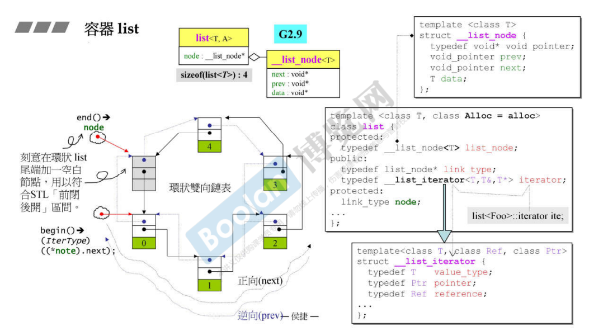
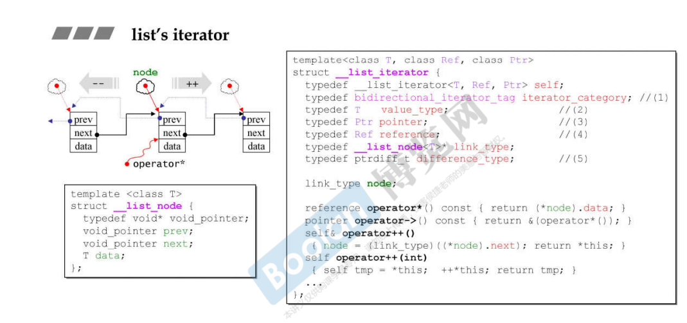
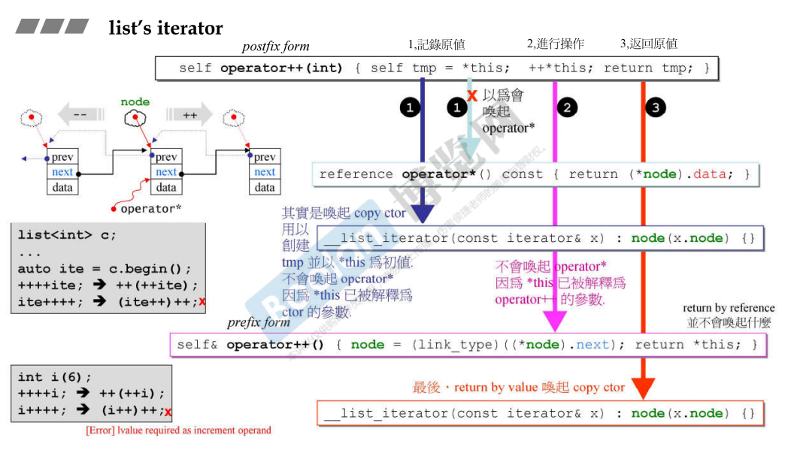
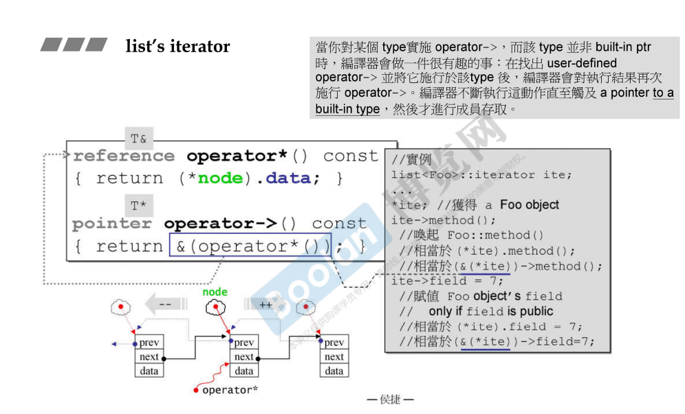
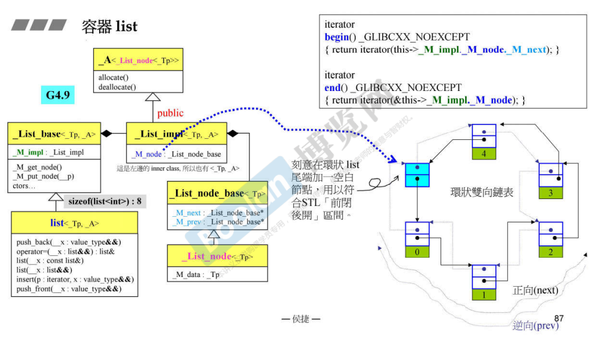

## 简介

list 是所有容器中，虽然不是最简单的（array、vector），但是是最具有代表性的。

链表应该是在学生生涯中学习的第一种数据结构。

本节课程着重介绍 list。

## 实现

### 双向链表



如上图，整个数据成员（data）只有一个 **node**，它是一个指针指向 list_node，大小为 4 个字节（32位电脑下）。所以一个 list 的大小为 4。

这个 node 的类型是 __list_node ，是一个带有**两根指针**和**一个data对象**，大小为 <u>*4 + 4 + 类型大小*</u>，所以 list 容器在向分配器请求内存时，会根据这个大小去请求。<u>*这是一个双向链表的节点。*</u>

> *这 gnu c 2.9中，__list_node 的指针类型是 **void** ，这样比较不好，**链表节点的指针类型应该为自身，否则可以指向任何节点**。*

另外，上图中有一个灰色的节点，这里解释为空白节点，这是为了去复合 STL 的前闭后开区间。[2. STL体系结构基础介绍](2. STL体系结构基础介绍) 的 <u>*特殊概念->左闭右开 标签*</u>

### 迭代器

在上图中，迭代器 iterator 为一个泡泡形状的图形。

在源代码中，iterator **是一个==对象==而非指针**：

> **若 iterator 是一个指针**，由于 **list 不是一块连续的空间**，当**执行 ++ 的动作时，已经不知道指向的位置在哪**。
>
> 所以需要**声明为一个对象，并且这个对象可以模拟指针**。（c++ 面向对象高级开发 part2.3.像指针的类）在 ++ 时访问 list 的下一个元素。
>
> ‼️<u>*在所有的容器（除了 vector 和 array）之外，iterator 必须是个**对象**，而非指针。*</u>
>
> 迭代器是一种智能指针   



⭐️如上图，由于 iterator 需要模拟指针，所以需要去进行大量的**操作符重载**（解引用、箭头、++、--、+=、-= 等指针操作）。

<u>*可以看到，iterator 的 ++ **有两个版本**，一个版本有参数，另一个版本没有参数。*</u>



如上图，针对于 iterator 的 ++ 操作。

⭐️++ 有前后置型，例如：i++ 为 后置型，++i 为 前置型。无论是哪种型，++ 操作的唯一参数为自身（i）。<u>***为了区分这两种类型，前置时操作符重载没有参数，后置时则会有参数。***</u> 

> *这个参数没有任何意义，只是为了区分而已。*

回到迭代器本身，

<u>***当执行 ++ 操作（前置）时：***</u>

> 先执行 ++ 操作：
>
> ​	取出node所指的的next指针，赋值给node
>
> 将拥有的 node 指针，指向 next （下一个）node
>
> 再将自身进行返回。

‼️<u>***当执行后置 ++ 操作时：***</u>

> 先将自身进行存储：
>
> ​	标记原值：在 *this 时，其实并不会调用 operator\*()，在这之前，<u>**编译器更早的接收到 = 赋值运算符，这时会先触发拷贝构造函数**</u>。
>
> ​	**以此类推，当 ++*this 时，也不会唤起解引用操作符，而是先执行前置++**
>
> 再执行 ++ 操作。
>
> 最后返回存储的值：
>
> ​	⭐️*<u>这里是一个值返回</u>*，而前置 ++ 是个引用返回，可以参考（c++ 面向对象高级开发 part1.3.类成员函数参数传递和返回值）
>
> 这样设计就会导致**无法进行连续的 后置++**（上图左下），当然，整数 int 类型也无法进行该操作，这种设计是一种对 int 的模拟。

-  `++++i` 与 `i++++`

C++语法规则中允许`++++i`，但不允许`i++++`，这涉及到递增运算符的前置和后置使用的方式以及编译器如何解释这些表达式。

前置递增运算符`++`将变量的值增加1，然后返回增加后的值。后置递增运算符`++`也会将变量的值增加1，但它会返回变化之前的值。

考虑以下示例：

```cpp
int i = 5;
int a = ++++i;
int b = i++++;
```

在这里，`++++i`会被解释为两个前置递增运算符，因此它会将`i`的值增加2，然后`a`会得到增加后的值，即7。

而`i++++`会被解释为一个后置递增运算符和一个后置递增运算符，但后置递增运算符需要一个可以修改的**左值**，而在`i++++`中，第一个后置递增运算符已经使`i`变成了一个**右值**（不可修改的值），所以第二个后置递增运算符无法操作。这就是为什么`i++++`是不合法的。

总之，`++++i`是合法的，因为它被解释为两个前置递增运算符，而`i++++`不合法，因为它涉及到两个后置递增运算符，其中第一个运算符将变量变为了右值，导致第二个运算符无法执行。


另外，通过**解引用**可以获取 node的 data 属性。



在 list 迭代器的使用层面，如上图，<u>使用 解引用 * 和 箭头操作符 -> 来获取 node 的 data 部分内容。</u>

### 新版本迭代器


如上图，gnu c 4.9 解决了 2.9 的一些问题，例如上述所说的链表节点指针类型是 void 的问题。

又例如，迭代器在 2.9 中需要传三个模板参数（T，T&，T*），类型、引用以及指针，但更新之后只需要传入一个类型即可。

> <u>*目前看来，gnu c 4.9 的版本应该是可以对标 vc 新版本的*</u> 
>
> 吗？



上图是 gnu c 4.9 list 的实现，各种组合和继承，已经开始头昏脑胀要晕掉了😵

> *这里侯捷老师也吐槽整个新版本的复杂性*
>
> *也说其实根据 2.9 版本来理解 list 的实现即可*

