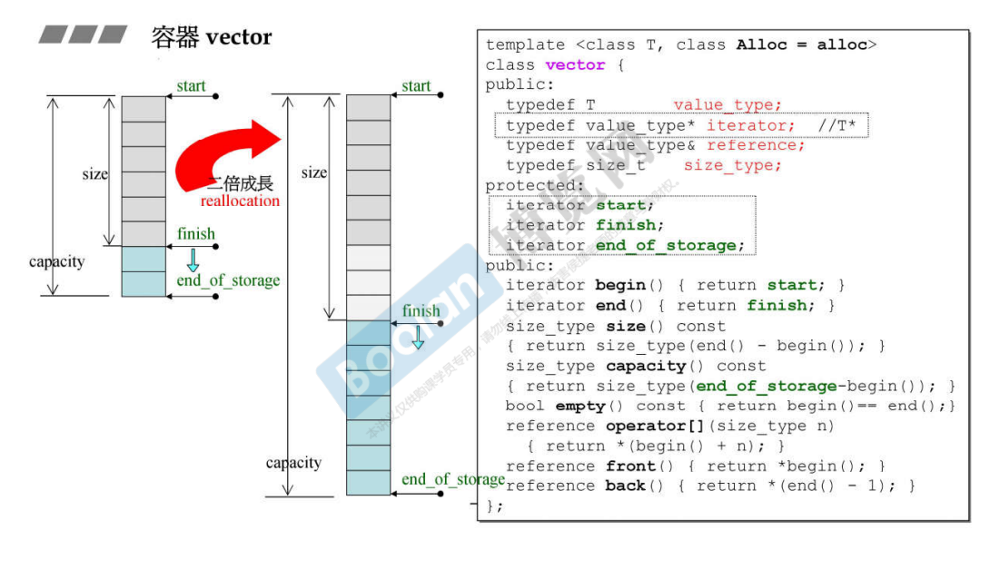
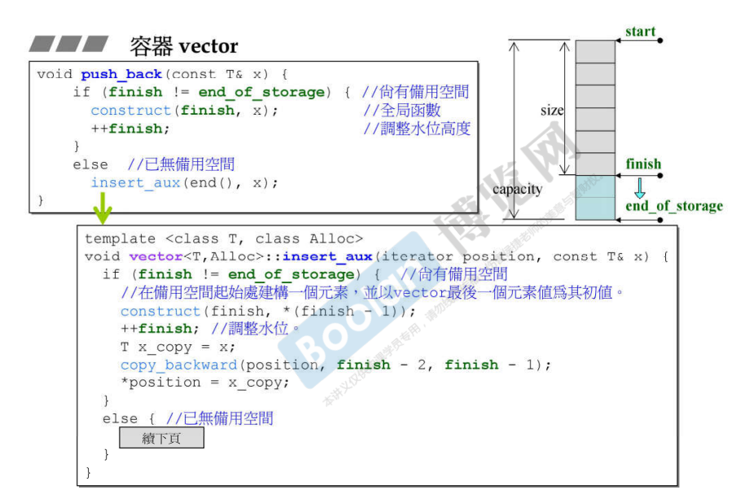
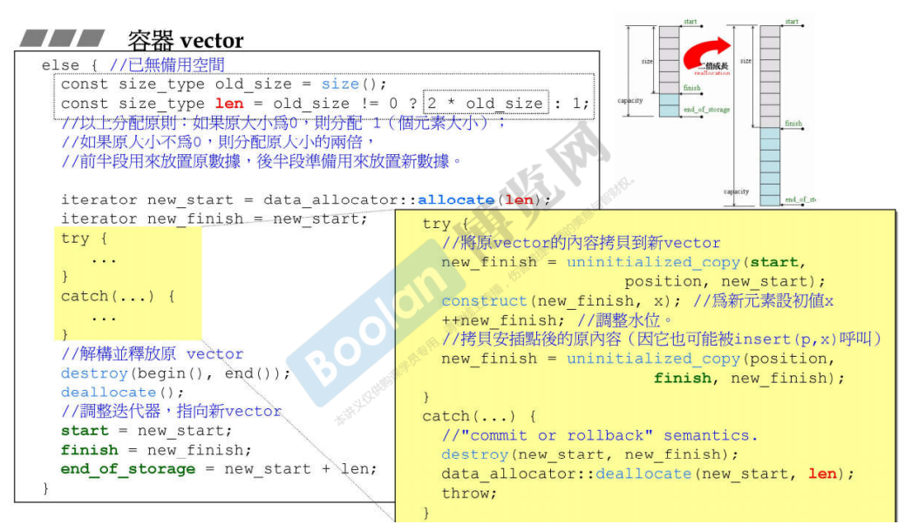
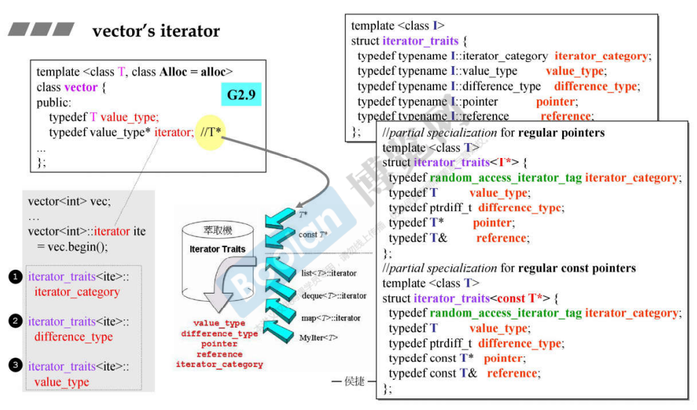
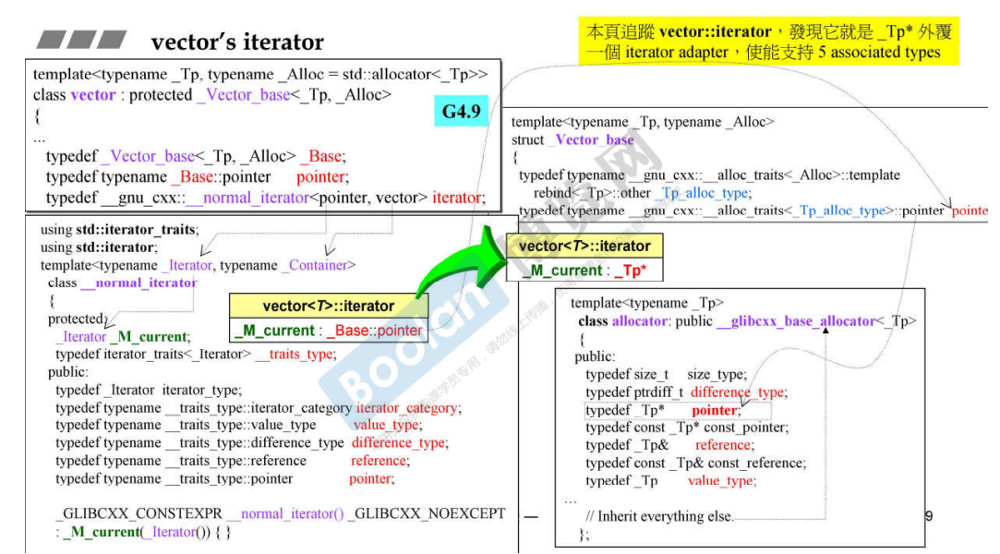
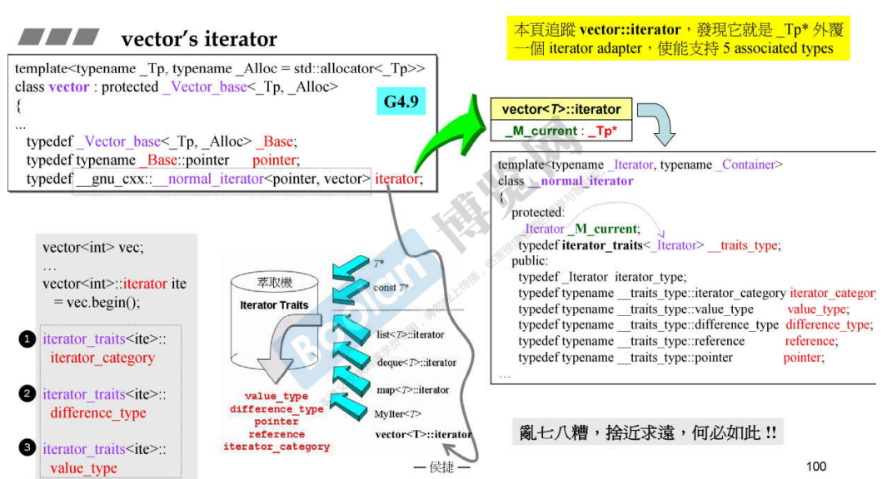

## 简介

vector 是一个动态增长的数组（array）

vector 的实现类似一个数组，当数组的容量不够时，会==自动扩充==。但是，在一段内存中，是**不可能进行原地扩充**的，它后面的内存有可能被使用。所以在扩充时，只能**去==别的地方==重新再获取一块扩充过的内存**，**再将原来的数据搬到这块新的内存中进行存放**。这种成长的过程相对缓慢 

## 对应实现



如上图，在 vector 中有三个变量：**start**、**finish**、**end_of_storage** 来记录着这个 vector 的信息。

当元素的个数超过 vector 的容量时，vector 会进行==两倍增长==，（[4.容器相关测试(顺序容器)](4.容器相关测试(顺序容器)) 的 <u>*vector 标签下*</u>）。当内存中没有两倍大的空间时，则不会去增长了。


### vector的两倍增长

C++的STL（标准模板库）中的`vector`容器在内存管理方面采用了一种叫做"倍增策略"（doubling strategy）的方法，以提高性能和减少内存分配的次数。这个策略的核心思想是，在需要扩展容器大小时，分配一块更大的内存，并将已有元素复制到新的内存区域中。为了避免频繁的内存分配和复制操作，`vector`会分配比当前大小更大的内存块，通常是当前大小的两倍。理论上你可以将`vector`的倍增策略调整为其他的倍数，比如3。不过，需要注意的是，倍增策略的选择是一个权衡的过程，需要考虑多个因素。

这个策略的优点在于：

1. **减少内存分配次数：** 内存分配是相对较慢的操作，通过一次性分配较大的内存块，可以减少内存分配的次数，提高程序的性能。

2. **连续存储：** `vector`需要保持元素的连续存储，以便支持O(1)时间复杂度的随机访问。当容器大小增长时，这种连续存储可能会被打破，所以需要重新分配内存。通过倍增策略，分配的内存仍然保持连续存储，不会影响随机访问的性能。

3. **避免浪费：** 如果每次只增加一个元素的大小，那么容器在增长时可能会频繁地进行内存分配，导致内存浪费。而倍增策略可以在一定程度上减少这种浪费。

当然，倍增策略也有一些缺点，例如：

1. **空间浪费：** 在容器大小不断增加的过程中，可能会分配比实际所需空间更多的内存，导致一定的空间浪费。

2. **扩容时的复制开销：** 扩容时需要将现有元素复制到新的内存区域，这可能会带来一定的时间开销，尤其是当容器中存储的是大对象或者代价昂贵的复制操作时。

总体来说，倍增策略在大多数情况下能够提供很好的性能和内存使用平衡，但在某些特定场景下可能需要根据实际情况进行调优或选择其他数据结构。


在上图中可以看到，vector 由**三根指针**（**start**、**finish**、**end_of_storage**）构成，32位中大小为 3 * 4 = 12 个字节。

> **start**：指向首个元素的<u>***指针***</u>，vector 的头部，使用 **begin()** 方法获取。
>
> **finish**：指向末尾元素的下一个元素的<u>***指针***</u>，符合左开右闭的原则 [2. STL体系结构基础介绍](2. STL体系结构基础介绍) 中的<u>*左开右闭标签下*</u>，使用 **end()** 方法获取。
>
> **size()**：容器中元素个数，为 **end() - begin()**。
>
> **capacity()**：vector 的 **容量**，表示目前可以容纳的元素个数，为 **end_of_storage - start**
>
> **empty()**：比较 begin() 和 end() 是否相等。
>
> **operator []** ,   容器只要是连续空间，必须提供中括号 ， deque也有[]

### 指针操作

```C++
int a = 0;
int* pa = &a;
int* pb = pa + 1;	//指向 pa 的下一个内存地址 (int 为 4 个字节, 应该 +4)
std::cout << pb - pa << std::endl;	// 1
```

如上述示例代码，<u>*pa 指向 a，pb 指向 pa 的下一个内存地址*</u>

由于 <u>*pb 为 int 类型指针，地址应该 +4*</u>，但是**在 pb - pa 时，结果为 1**。

> 这里合理的解释（笔者推测）：只能说指针相减的结果，<u>*并不是字节相差的个数（地址距离）*</u>；**而是编译器会将<u>*得到的地址的差值（地址距离）*</u>，<u>*再除以指针指向的类型（int，除以4）*</u>，最终得到真正的结果（偏移量）**。
>
> ⭐️所以在上述 vector 的指针操作中，**size()** 以及 **capacity()** 方法得到的是**指针的偏移量**，而不是地址距离。

### ‼️两倍增长



如上图，两倍增长是发生在添加元素的时候，这里使用 **push_back()** 方法作为例子。

可以看到，在使用该方法时，会判断 finish 和 end_of_storage 是否相等：

> 当**不等**时，表示尚有备用空间，构造元素，并且调整 finish 位置。
>
> 当**相等**时，表示没有备用空间，则会进行 insert_aux 操作。

下面来看看相等时（即没有备用空间）的操作，如下图：



首先，会进行计算新的空间大小（使用三目运算符），<u>*当空间为 0 时，则分配一个空间（否则 0 的两倍也是 0，相当于没分配）*</u>；<u>*当空间不为 0 时，则进行两倍增长*</u>，并且**得到分配的内存空间地址**（**new_start**，使用 allocate 方法 [6.分配器测试](6.分配器测试) 中的<u>*使用分配器标签下*</u>）。 

然后，**将原来的元素拷贝到新的内存中，并且构造添加的元素（push_back()）**，另外，考虑到不只是 push_back() 会增长空间，**insert()方法也会造成空间增长，所以需要将尾部的元素也进行拷贝**。

最后，<u>*将原本空间的元素进行销毁*</u>。

> ‼️<u>*vector 在每次成长时，⭐️会大量调用元素的**拷贝构造**和**析构函数**，造成很大的开销。*</u>

## vector 的迭代器



如上图，由于 vector 的元素在空间上是连续的，所以**只需要用指针就足够了**，在 [12. 迭代器的设计原则和iterator_traits的作用与设计](12. 迭代器的设计原则和iterator_traits的作用与设计) 的 iterator_traits 下有提到。

同样的，iterator_traits 在被 algorithm 调用，来询问 iterator 的各种特性时，在<u>*上图中（右半）*</u>或者<u>*上述文档*</u>中都有提到。相当于是对 iterator_traits 做一个示例，**针对于指针层面的迭代器**。

## 新版本（吐槽）


如上图，这是侯捷老师截取的 gnu c 4.9 版本的 vector 的类图。

> *<u>在这里，侯捷老师特别吐槽 **public** 继承，表示该继承方式表示 **子类 is-a 父类**，但这里显然不能表示，若想使用 allocator 的功能，**用 private 继承即可**</u>*
>
> （c++ 面向对象高级开发 part1.11.组合与继承）



另外，迭代器也 搞得很复杂😓。

> 侯捷老师也同样吐槽：<u>*新版本可能觉得复杂是一种美，但其实我们这边感觉很丑*</u>😂

如上图，绕了很大一圈，发现其实就是一个 Tp*，一个指针而已。

