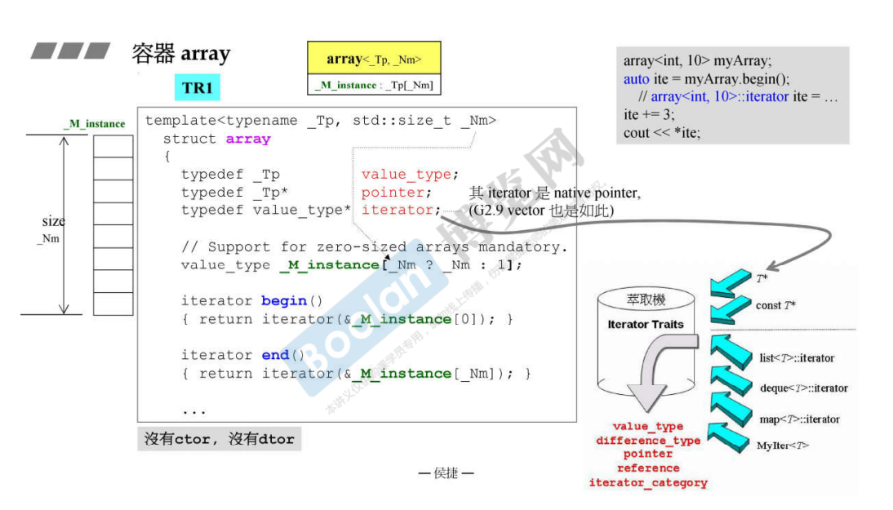
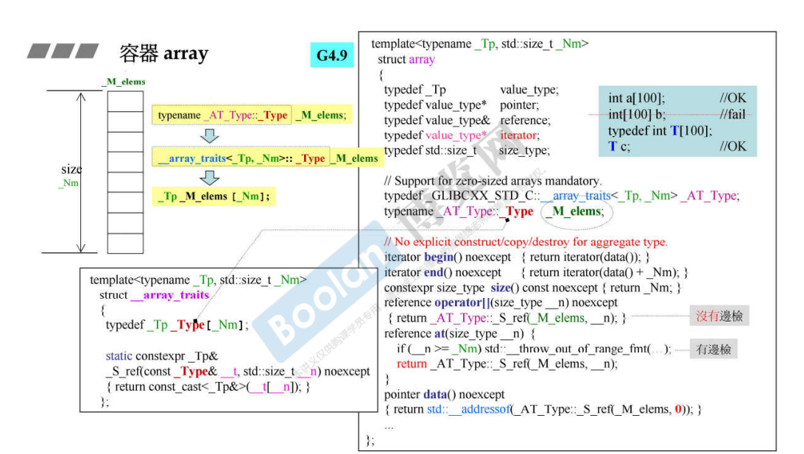
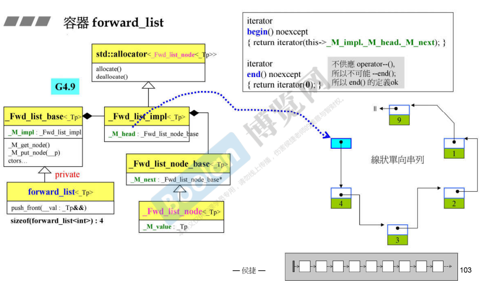

## 简介

这部分就比较简单，类似于 array，跟c++本身的数组没什么区别。

那么把这个**封装**成 array 的目的，是为了**适配 STL 这六大组件（迭代器、算法等）**。

## array



上图是 c++ 1.0（1998）版本的 array。

类似的，这个实现比较好理解（基于之前侯捷老师对新版本的吐槽😂）。

可以看到，在使用的时候，需要指定大小：

```C++
array<int, 10> myArray;
```

这是由于 array 本身是不可扩充的。

关于**迭代器**部分，跟 vector 相同，**同样是一个元素类型的指针**，但是不像 vector 那样有 **start、finish** 相关的指针。只在 **begin()** 和 **end()** 时，会返回对应元素的地址。类似的，关于萃取机（iterator_traits）部分也是差不多的（右半）。



如上图，新版本，一下子就把侯捷老师给整晕了😂。

他的实现其实和旧版本大致相同，同样是模拟 c++ 的数组

```C++
typedef _Tp _Type[_Nm] //左下角
```

> <u>*其实新版本也不是说全是不好的，只是有可能这样做考虑到 STL 的扩展性，只是比较难阅读*</u>

## forward_list



这里就没有过多介绍，可以参考 [11.深度探索list](11.深度探索list) 双向链表。

forward_list 单项链表其实和双向链表大致相同，只是双向链表能够双向移动，而单向链表只能往一个方向移动。