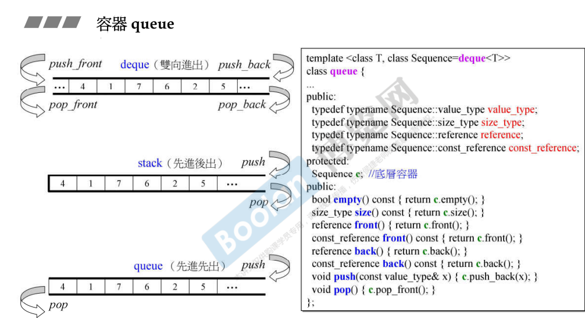
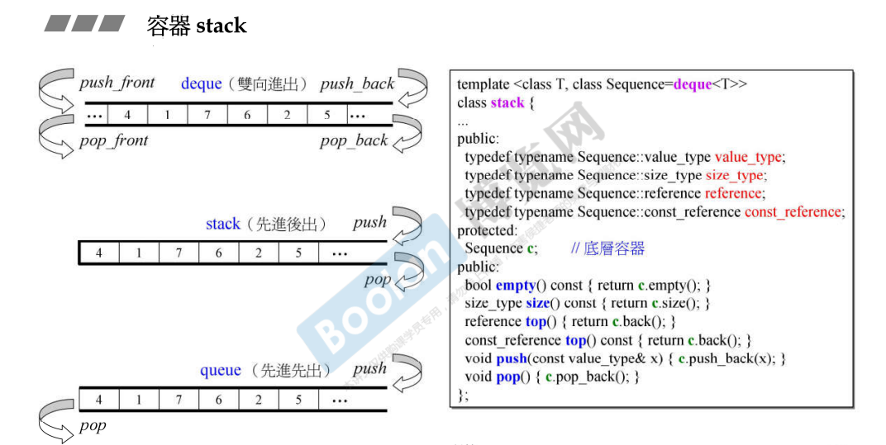
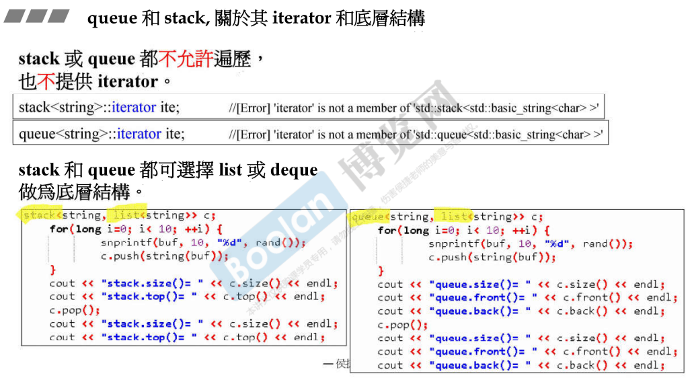
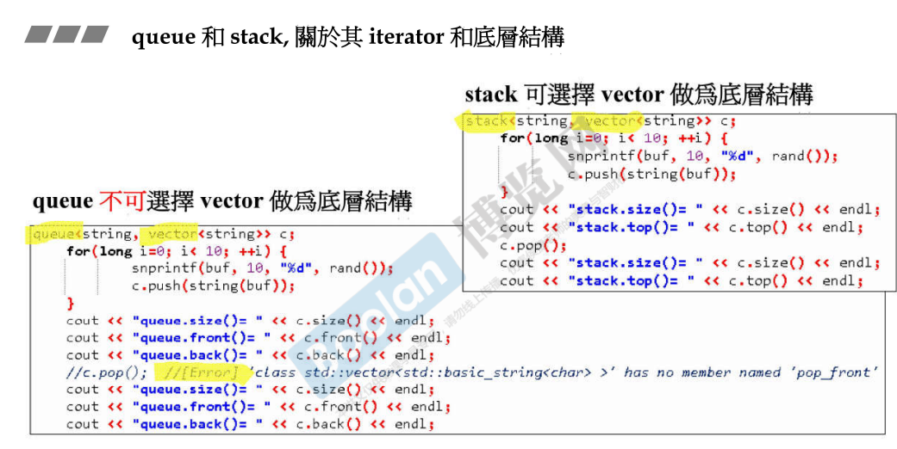

## 简介

queue、stack 的特性分别是 先进先出 / 先进后出。

如上图，可以看到 queue、stack 可以不必去重写 push、pop 的操作，只需**要内含一个 deque** ，然后封掉其中某些，即可。deque容器双向开口，可以完全满足。

+ ‼️另外，queue、stack **不允许遍历，不支持也不提供迭代器**。而且也可以使用 list 容器来做底部支撑。行为特殊，一个先进先出，一个先进后出，如果允许任意放元素，则干扰了这个行为模式，所以不允许放元素，不提供迭代器，放元素拿元素只能在头端尾端
+ 其他容器允许遍历，也允许在某个地方插入元素

可以做 queue、stack 的容器必须拥有最上面两张图中的 Sequence 中调用的方法（push_back、push_front...等）。

例如，vector 可以作为 stack 的底部支撑，然而不能作为 queue 的底部支撑（没有 pop_front 方法）

