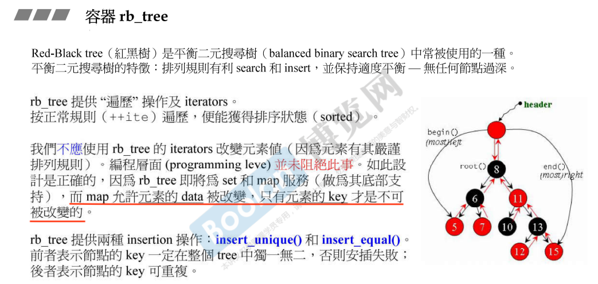
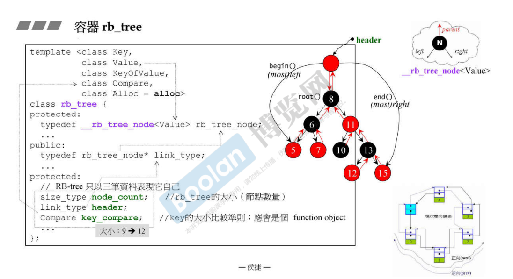
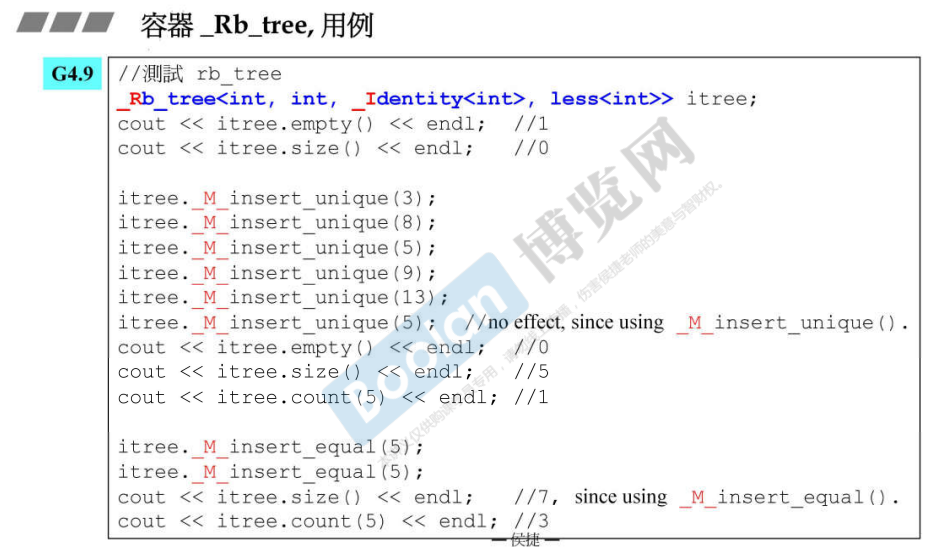
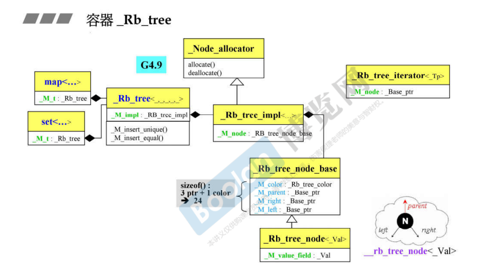

## 简介

之前介绍了顺序容器（sequence container），从现在开始谈关联容器（associative container）

> <u>*关联容器在**查找、插入**元素时拥有非常好的性能。*</u>

关联式容器在 STL 底层依赖于两种数据结构来实现：**红黑树（rb tree）、哈希表（hash table）**。在 [2. STL体系结构基础介绍](2. STL体系结构基础介绍) <u>*关联容器标签下*</u> 做了简单介绍。

关于红黑树，这里并不会去解释整棵树怎么调整、节点怎么生成；而是去解释红黑树的**运作方式**，然后去介绍**红黑树的实现**（上层）。

如上图，红黑树的图例，是一种**高度平衡的二叉搜索树**，而节点的 红 / 黑 表示一种状态（这里不解释）。

<u>*平衡的树状结构，有利于数据的查找，避免了当某一个枝节太深，而引起的树状结构退化成链表。*</u>

rb_tree 提供遍历操作以及迭代器 iterator，若按照正常的 iterator++ 遍历，**便能够获得排序的状态**。

​		‼️而红黑树的遍历方式和普通的二叉平衡搜索树（AVL）不同，如上图，根据节点的颜色：<u>*若子节点包含黑色节点，则先访问黑色节点，⭐️若没有黑色节点，则先访问左节点*</u>。<u>*遍历方式是一种变种的中序遍历*</u>。从最左边的元素开始

关于 iterator：

> 不应该使用 iterator 更改元素，但是 STL 没有禁用更改元素的功能。
>
> ​	**注意：这里需要解释一下，根据红黑树的源代码，其实这里只是能够去更改 value的值，因为iterator 是通过 key 来获取 value，所以最终指向的 value，<u>*这里可能和侯捷老师口中说的元素有歧义，这里的元素应该指的是 value，⭐️而修改也是去修改 value 的值*</u>。**
>
> 这样是合理的，当元素由 key : value 构成时，使用 iterator 可以改变 value，而不是去改变元素的 key

关于插入数据：

> 使用 **insert_unique()** 表示插入唯一的数据，当树中有相同的数据则插入失败。
>
> 使用 **insert_equal()** 表示可以插入重复的数据，即有相同的数据时也会进行插入。

## 实现部分

如上图：

> 首先是模板参数部分，在 STL 的现中，需要告知 **key**、**value (key | data)** 的类型是什么；
>
> 然后再告知 **KeyOfValue**，这个参数的作用是**通过红黑树的 value（可能是一个复合的类型），来获取其中的 key**，<u>*如下图*</u>；
>
> 之后就是需要比较方法 **Compare**，用来比较 key 的值，这是搜索树构建时必要的。
>
> 大小： 4+4+1=9，其中1是因为仿函数并没有数据，大小是0，而实现的时候编译器对大小为0的类，创造出来的对象大小永远是1。默认内存以4对齐，12 

另外，关于树状节点 __rb_tree_node，拥有指向 **左、右、父** 节点的指针。

## 使用

关于红黑树的使用，如上图。

> **identity**：是一个<u>*行为像函数的类*</u> （c++ 面向对象高级开发 part2.4.像函数的类），这个类是 gnu c 独有的，在 vc 是不存在的。
>
> ​	这个类的父类为 unary_function。
>
> **less**：同样是一个<u>*行为像函数的类*</u>，用于比较类型的大小。

上图是 gnu c2.9 中，红黑树的一些方法的使用。

> 在简介中介绍了，插入元素有 **insert_unique** 和 **insert_equal** 两种方法。
>
> 另外，还可以查看红黑树的 **size**、某个元素的个数 **count**、是否为空 **empty** 等等。。

## 新版本

 
