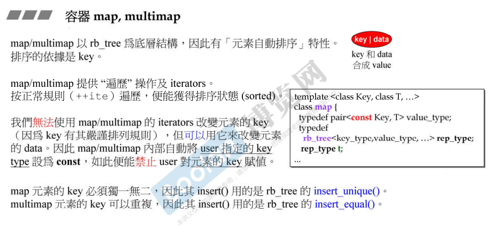
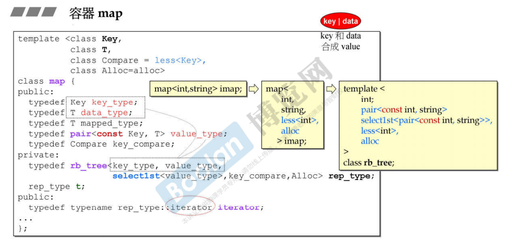
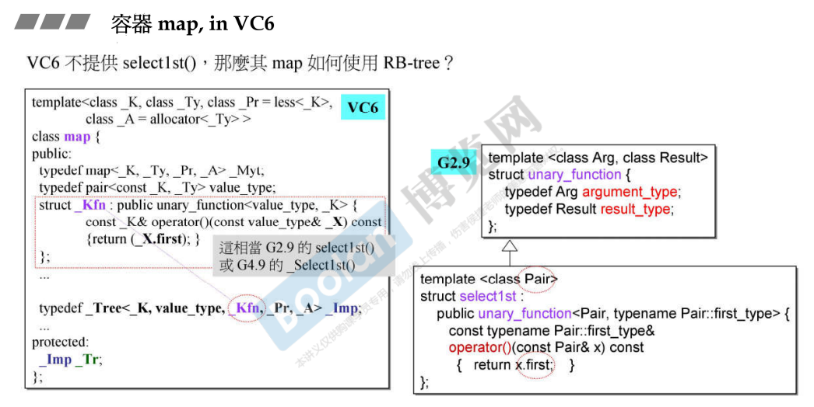
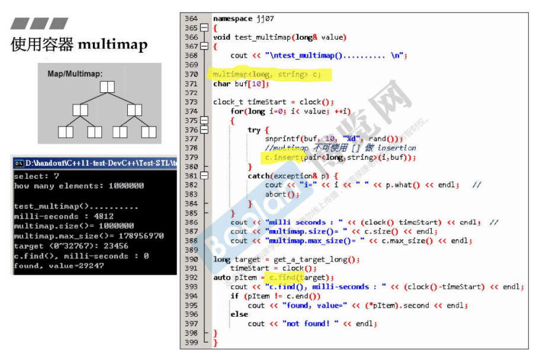
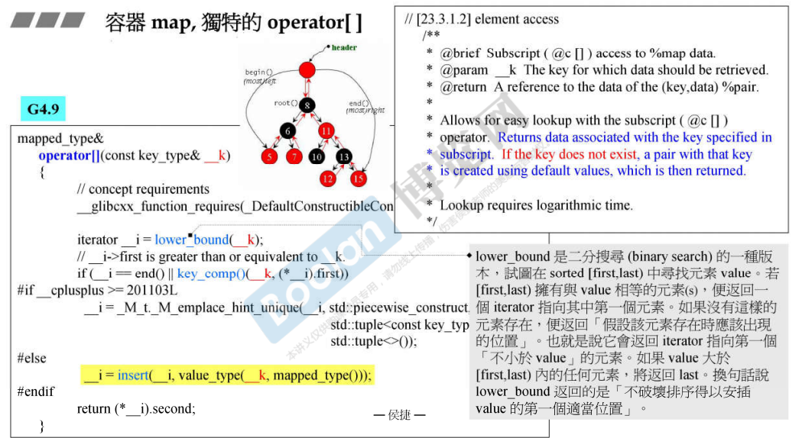
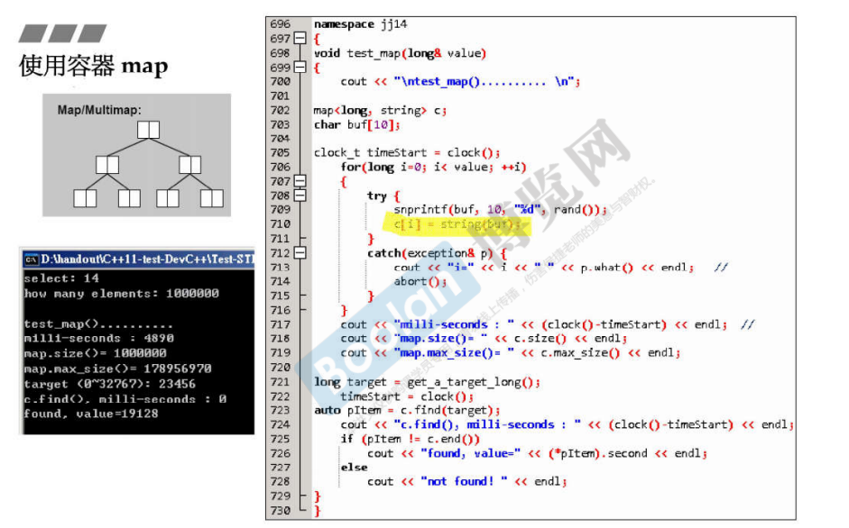

## 简介

如上图，和 set 相同，同样是以红黑树做底部支撑；而不同的是， set 的 key 即使 value，而 map 则需要通过 key 去寻找 value（data）。

同样的，既然是以红黑树为底部支撑，那么其元素是根据 key 来进行排序；同样可以使用迭代器 iterator 来访问元素，通过 iterator++ 来顺序访问元素。

跟 set 不同的是，通过 iterator 可以**修改元素的 value**，但是**不能够去修改元素的 key**。

另外：

> [17.RB-tree 深度探索](17.RB-tree 深度探索) 中的<u>*使用*</u>部分：
>
> **map** 元素 key 唯一，所以 **insert()** 调用的是 rb_tree 的 **insert_unique()**
>
> **multimap** 元素 key 可以重复，所以 **insert()** 调用的是 rb_tree 的 **insert_equal()**

## 实现部分

通过上图，可以观察 map 的具体实现部分，同样是包含了一个 rep_type（rb_tree）

模板参数部分：

> **Key**：元素 key 的类型
>
> ​	rb_tree 通过 **select1st<>** 从红黑树的 value 中获取 key，<u>***在 map 的 rb_tree 中，key 的类型为 map 的 Key，value 的类型为一个 pair<const key, value>，即取红黑树的 value 的第一个成员（pair.first）来根据 pair 获取 key***</u>。在这里，元素的类型为一个 **pair<>**，而 **select1st<>** 来<u>*获取 pair 的第一个值*</u>。
>
> **T**：元素 value 的类型

关于迭代器部分，是<u>*直接获取了红黑树的迭代器*</u>，红黑树的迭代器并不会去限制任何操作（例如元素（value）的更改），而此时，**通过红黑树的 iterator 获取的值是一个 pair**，而通过 map 传入的参数为为 **pair<const first, second>**，第一个参数类型为 const，所以是不能够进行更改。

> 以下是一点个人的理解：
>
> <u>*至于为什么不能去修改 pair 中的 key（first）*</u>，这是由于在 rb_tree 中的 **KeyofValue** 参数已经规定了如何通过 value 去获得 key，然而红黑树中的 key 是没有办法更改的，所以对应从 value 获取的 key 也不应该更改。

### vc6 版本

vc6 同样没有 select1st。

### multimap

在 [5.容器相关测试(关联容器)](5.容器相关测试(关联容器)) 的测试中，已经详细使用过了 multimap，如上图。

### operator []

在 map 中，是可以通过 [] **下标操作符**进行**插入元素和获取元素**，这里 [] 传入的是一个 key：

> map 会**通过 key 来查找元素**，并且将查到元素的 **value 的（pair.second）进行返回**。
>
> <u>*当 key 不存在时*</u>，map 会**创建一个默认的元素**（key-value），**放入 map** 中，并**返回 value**。

**这里需要注意的是：multimap <u>*无法使用*</u> [] 下标操作符。**这里是观察 STL 的源码（vs 2019）得知，multimap中没有对 [] 下标操作符进行重载。

### map

在 [5.容器相关测试(关联容器)](5.容器相关测试(关联容器)) 的测试中，已经详细使用过了 map，如上图。

这里特别标出了使用 [] 下标操作符来进行元素插入。**这里的速度当然不如直接 insert**。