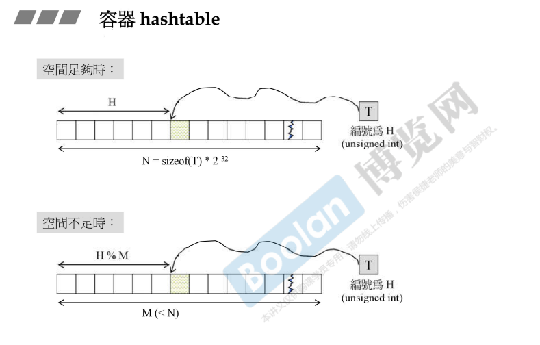
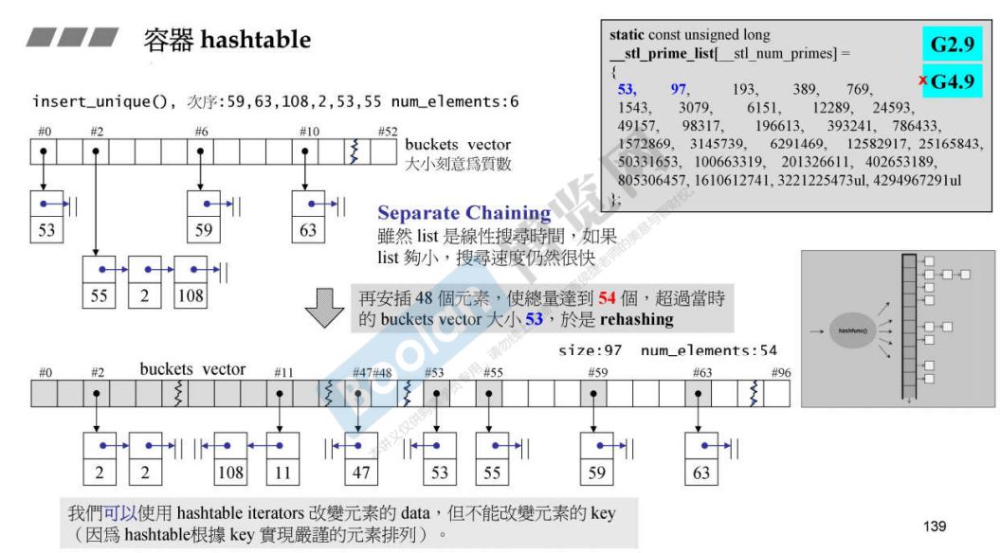
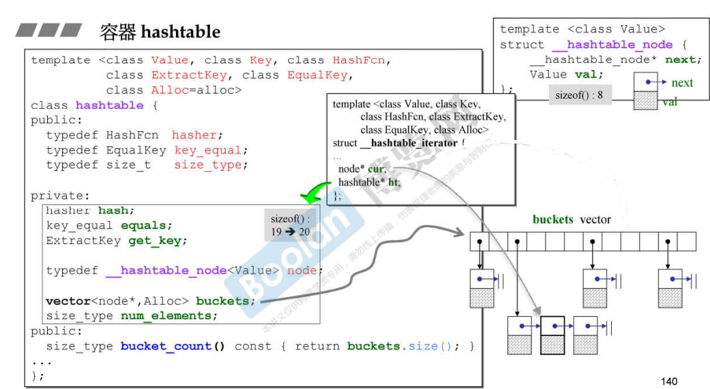
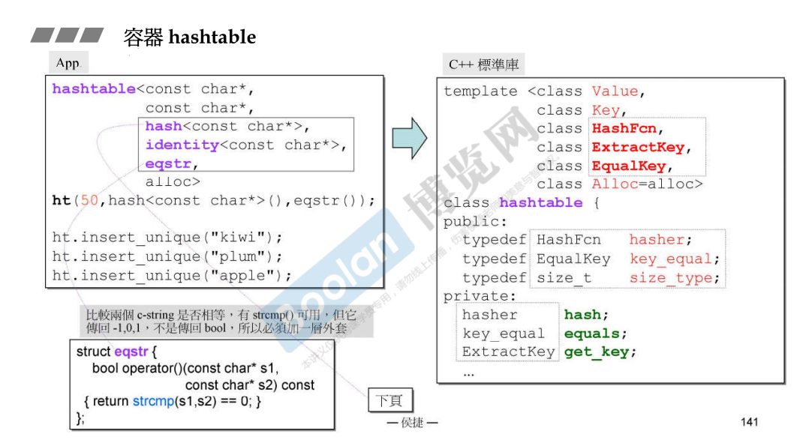
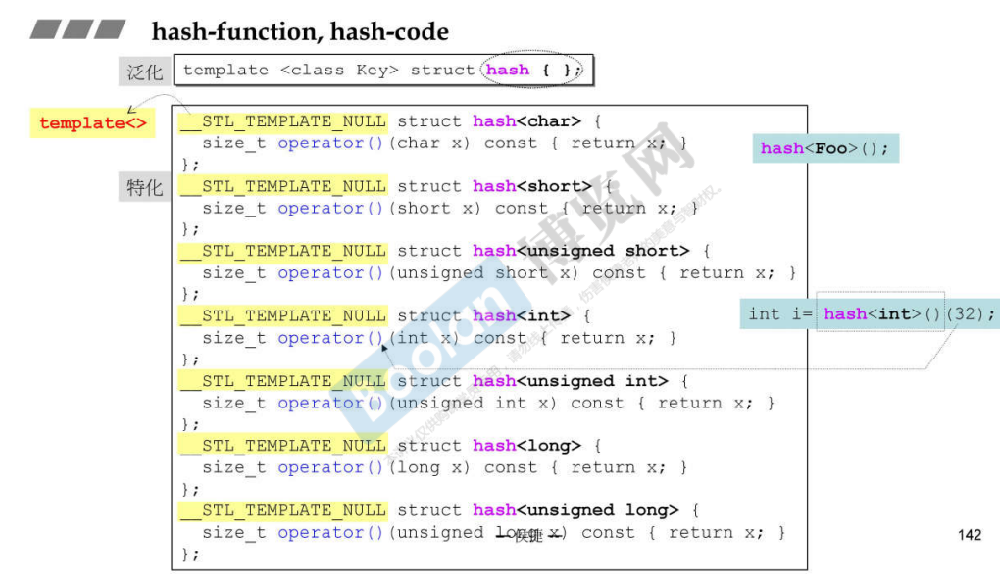
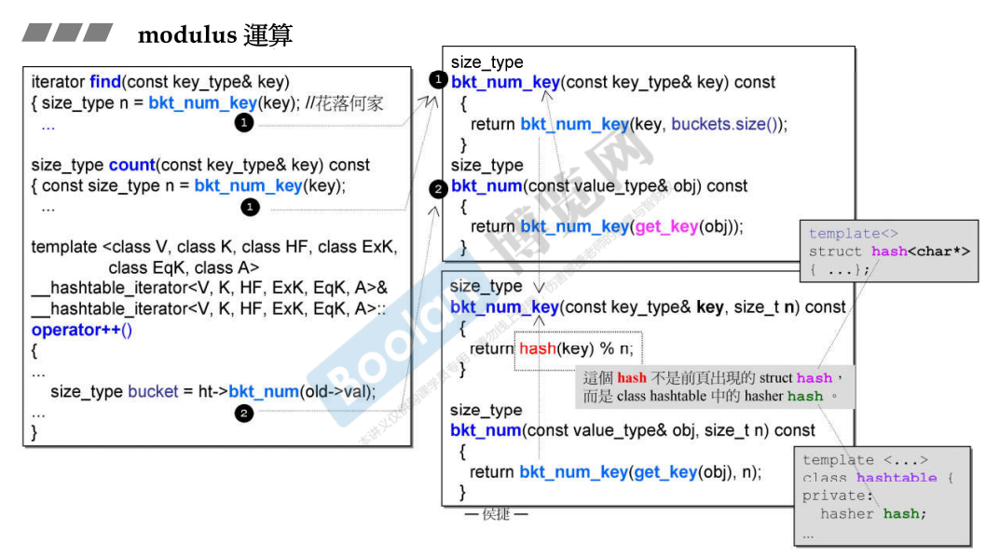

## 简介

在前几讲中介绍了关联容器的一个分支，也就是红黑树，在这里会对另一个分支进行介绍，也就是哈希表（hash table）。

跟红黑树不同的是，在介绍红黑树时，没有对其原理进行讲解，例如节点何时 红 / 黑；如何平衡左右子树等等。但是在这里，会详细介绍 hash table，侯捷老师称它比较简单，也可以讲的很精彩，期待一下。

> 这里假设一个场景：我们现在有一大堆的对象（object），要放在一个容器中，这些对象可以通过某种方法，映射为一个数值（号码），这些数值的变化如果在 [0, 2^32 - 1] 时，那我们需要多少空间才能存放这些对象呢？

如上图，我们需要这个对象的大小 * 2^32 这么大的空间，才可能存放所有的可能性。

但在实际上是不可能的，即使有这么多种变化，也不保证有这么多个元素。

那我们先申请一个小于 N 的空间 M （上图），当我们计算出对象的编号时，就往这个空间里面放。<u>*但是有一个问题，我们的空间不足以支撑 N 个编号*</u>，**所以我们做了一个处理，<u>*将得到的编号和 M 取余*</u>，将得到的结果再次放入对应的编号的空间中**。

那么又会产生一个新的问题，**当空间中已经有一个对象时，再次放入对象时会发生碰撞**，这时候就要通过一些办法解决这个碰撞。例如：通过一个一次方程，将元素挪到另外一个空间；等等...。<u>*如果多次碰撞，则需要其他的方程去计算编号，那么查找元素时就会降低性能*</u>。

还有另外一个解决办法，如下图：

既然发生了碰撞，那就**直接将碰撞的元素放到一起，通过一条‼️<u>*链表进行关联*</u>**。<u>*当然，当链表很长时，同样会降低查找元素（循序查找）的效率*</u>。所以，**当链表过长时，需要链表进行打散**。

关于打散链表，这里引入一个概念，叫做 **bucket（篮子）**，每个篮子是一个链表，当判断这个 bucket 过长时，则会将其进行打散。这里没有任何的数学规则，采取的方法是：⭐️<u>***如果元素个数比 bucket 的个数多，则需要打散***</u>。这时，**bucket 的大小会增加两倍，<u>*并计算得到附近的⭐️质数*</u>，（如上图，__stl_prime_list，gnu c），作为bucket新的大小，并且重新计算每个元素的位置**。这个操作称为 **==rehashing==**。

## 实现部分

如上图，是 gnu c 下 hash table 的实现部分。

 		3+12（vector里面有3个指针）+4=19  20（内存对齐，调整为4的倍数）

### 模板参数

> **Value、Key**：类似于红黑树。
>
> **HashFcn**：用于计算对象的编号，该参数可以通过一些计算，将对象计算出一个编号（hash code），放入对应的 bucket 中。
>
> **ExtractKey**：跟红黑树的 ValueofKey 一致，通过 Value 取出 Key。可以参考 [17.RB-tree 深度探索](17.RB-tree 深度探索)
>
> **EqualKey**：比较 Key **是否相等**。

### 成员部分

> **buckets**：是一个元素指向 node 的指针的 vector，元素为 node 类型的链表（__hash_node）。**注意：这里跟红黑树是一致的，元素为 Value，Key只是通过Value获取并且用于计算**。

### 迭代器部分

> 如上图，**__hashtable_iterator**，有两个指针，cur指向某一个节点，ht 指向hashtable本身
>
> （一个指向 bucket（node*），另一个指向链表。）
>
> 这个迭代器不仅是需要遍历链表的能力，**还需要去回到 bucket 中**，去访问下一个 bucket，因此需要指向hashtable本身的指针
>
> 这个迭代器有点类似于 deque，[15.deque深度探索](15.deque深度探索) <u>*模拟连续空间*</u>标签下。

## 使用部分

如上图，这是一个使用 hash table 的一个例子，在这个例子中，会将字符串（const char*）放入hash table 中；另外，**在 HashFcn 中，使用了一个 <u>hash<></u> 函数（下面会介绍）**；在 EqualKey 中，传入了 eqstr 函数（像函数的类），用于比较字符串之间是否相等，底部调用 **strcmp**，将字符一个一个比较，而不是比较指针。

### ⭐️HashFcn

在上图中，使用了一个 **hash<> 函数**作为 HashFcn 的参数，**这个模板类被多次特化**，如下图：

这些事例传入的参数都是一个**数值**（char、int、short、long...），则在这个 hash 函数中，会将这个**数值本身作为 hash code 进行返回**。

而对于字符串，会根据每个字符的 ASCII 进行计算（如上图，**h = 5 * h + *s**），这个函数没有数学的道理，只是一个人为设计的方程，让字符串的 hash code 尽量不重叠。

## modulus运算

在上面的简介中介绍，根据 HashFcn 计算得到的 **Hash Code**，会**对 bucket 大小进行取余**，然后再将元素放入对应的 bucket 中。

如上图，序号①调用的是 bkt_num_key；序号②调用的是 bkt_num。最终都会到 **hash(key) % n**，这个函数就是对 key 计算 hash code（HashFcn），然后将其对 bucket 大小取余。这就是 modulus（模数、余数）计算。

