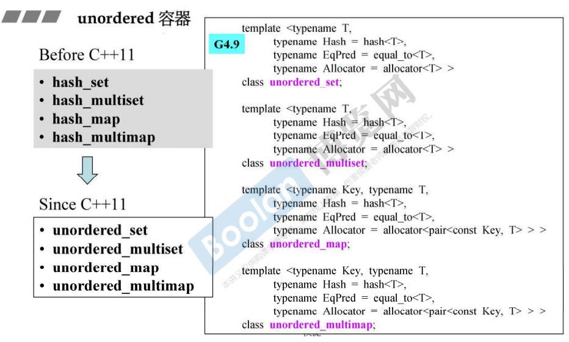
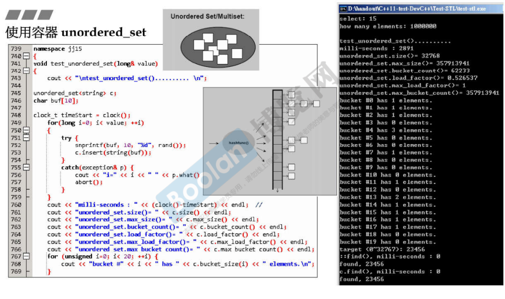

## 简介

如上图，在 c++ 11 以前，基于 hash table 实现的容器：hash_set、hash_multiset、hash_map、hash_multimap，分别改名为：unordered_set、unordered_multiset、unordered_map、unordered_multimap。

除了名字不同外，用法和实现基本一致。

## 使用部分

如上图，这是关于 unordered_set 的使用，这个容器不是 multi，所以元素（key）不能重叠。

可以看到，在插入 100 0000 个元素后，**bucket_count 的数量大于 size 元素数量**，这是正常的，在[20.hashtable深度探索](20.hashtable深度探索) 关于 hashtable 的简介中介绍了 **rehashing** 的条件，也就是<u>*当元素数量大于 bucket 数量时，会将 bucket 大小放大，再将元素打散进行重新放置*</u>，所以bucket 数量是会大于元素数量的。

## 结语

至此，STL 的容器部分已经全部介绍完成。