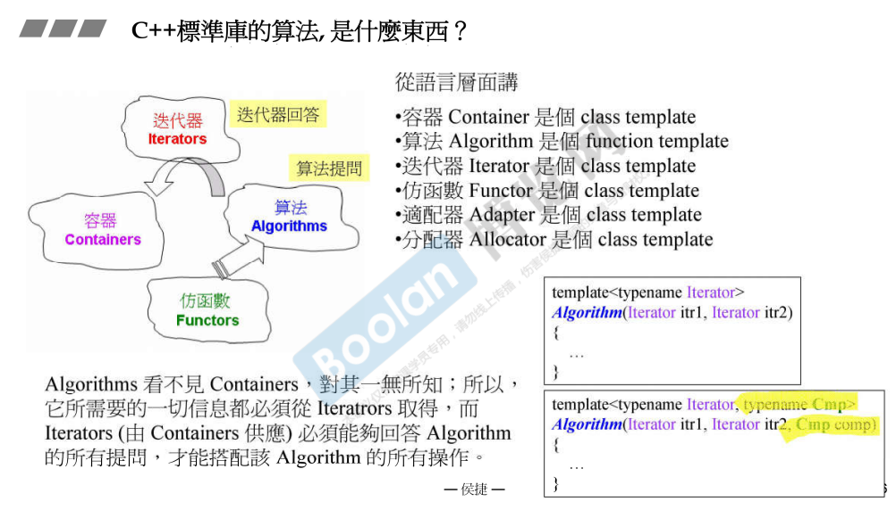
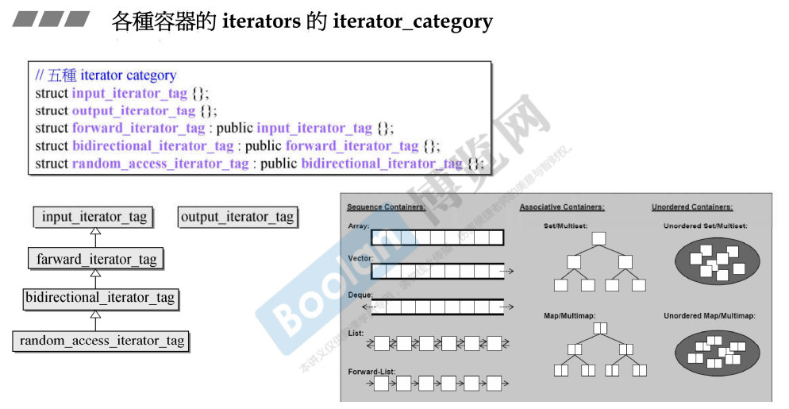
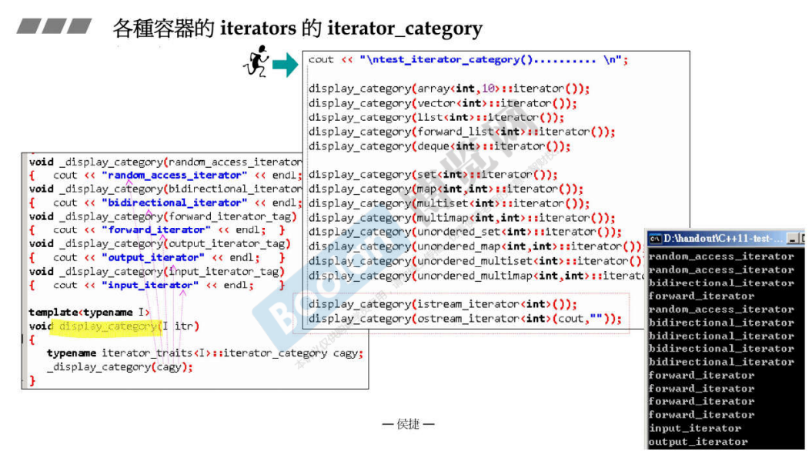
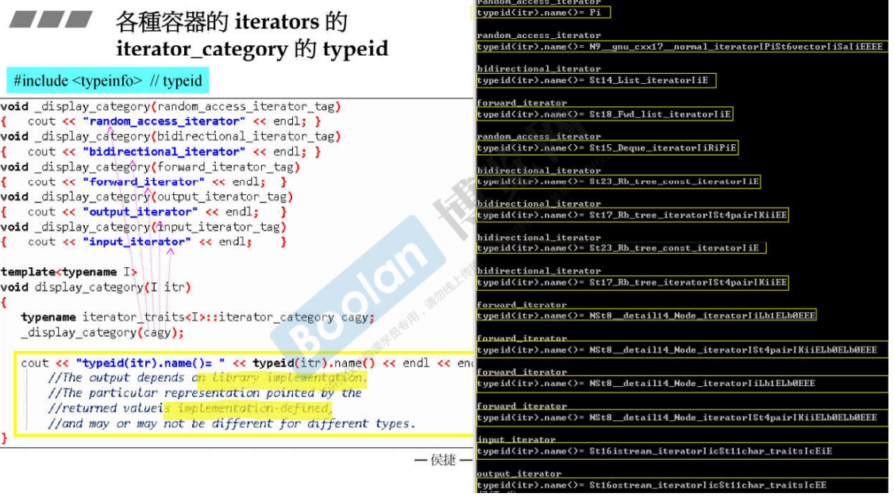
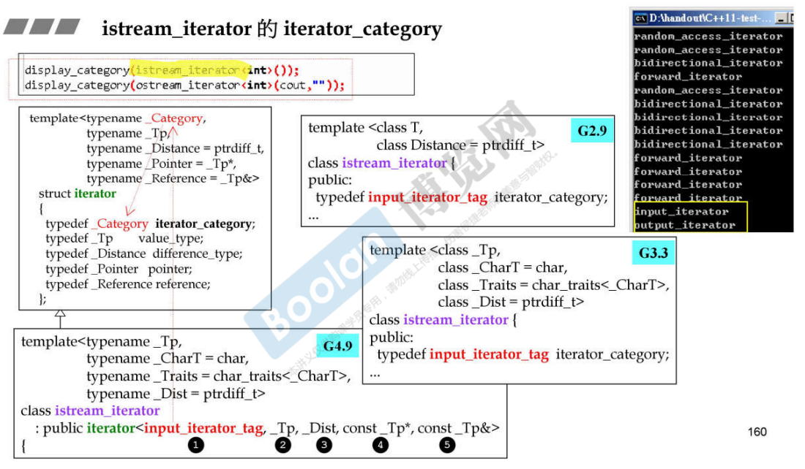
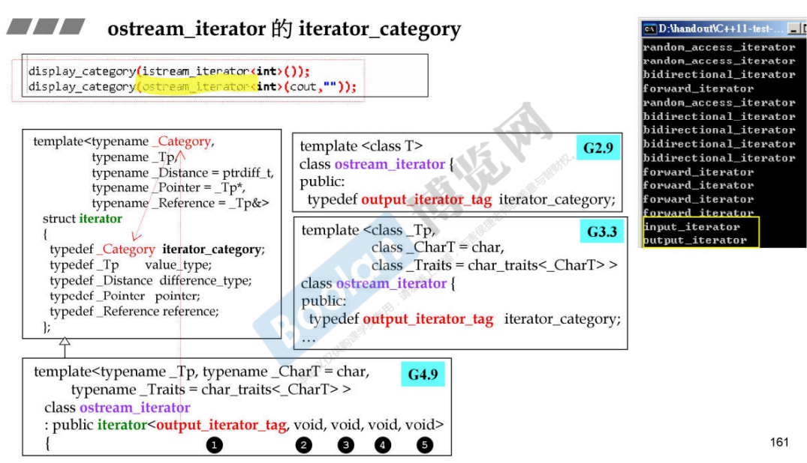

## 简介

在这节课之前，就已经介绍完了 STL 的容器部分，从现在开始，将会介绍 STL 中算法部分（algorithm）。



如上图，关于算法 algorithm，一般为一个**函数模板**（function template）。

另外，算法一般有两个版本（右下角）：

> 1.第一个版本有<u>*两个参数*</u>，这两个参数指定了容器的范围（迭代器）
>
> 2.第二个版本将会有<u>*三个参数*</u>，**第三个参数表示一个准则**，这个准则是对象之间的一些运算规则，算法通过准则来做运算。

算法在处理数据时，是<u>*无法知道容器的类型是什么，但是需要知道一些关于元素的信息（位置等）*</u>，那么**算法将会去跟迭代器提问，迭代器再去回答这些关于元素信息的问题**。

> <u>*当迭代器无法回答时，那么编译就会报错。*</u>
>
> 关于迭代器是否能进行回答，和其的特性（五种） [12. 迭代器的设计原则和iterator_traits的作用与设计](12. 迭代器的设计原则和iterator_traits的作用与设计) 有很大的关系。

## 1iterator_category



如上图，列举了一些容器以及 iterator 的种类（category）。迭代器是由容器来提供的

右下角是一个关于容器的种类图：

> 1.关于**连续容器**，比如 **array**、**vector**，另外，关于使用起来像顺序容器的 **deque**，迭代器应该为<u>*随机访问*</u>类型 **random_access_iterator_tag**，这种迭代器的特点是可以任意访问元素（支持跳跃访问）。
>
> 2.关于**非连续容器**，比如 **list**，双向链表（不应该跳跃访问），该容器的迭代器类型为 **bidirectional_iterator_tag**，双向访问；而 **forward_list** 单向链表则不提供双向访问的操作，所以迭代器类型为 **forward_iterator_tag**。
>
> 3.关于**基于红黑树实现的容器**，根据 [17.RB-tree 深度探索](17.RB-tree 深度探索) 简介中其实有提到，<u>***红黑树的节点其实是支持双向访问的***</u>，所以对应容器的迭代器类型为 **bidirectional_iterator_tag**
>
> 4.关于**基于哈希表实现的容器**，在 [20.hashtable深度探索](20.hashtable深度探索) 中介绍了哈希表的实现是 bucket 中存放一个个的链表，那么<u>*要判断其迭代器类型，**需要根据链表是否双向访问来决定***</u>。

左半部分则是迭代器种类的类图：

> 可以看到 iterator category 的继承关系 **input<-forward<-bidirectional<-random_access**，另外还有一个**output**。

### 各个容器的iterator



如上图，通过 **display_category()** 方法，来输出各种容器的 iterator category。而这个方法是**通过调用迭代器的萃取机 iterator_traits** （[12. 迭代器的设计原则和iterator_traits的作用与设计](12. 迭代器的设计原则和iterator_traits的作用与设计)）来获得 iterator_category（左下角），并且通过重载不同的 _display_category 来输出结果。

> 在这里，侯捷老师解释了 iterator_category **设计成 struct 而不是设计成 编号（1、2、3....）**的原因之一：
>
> ​	<u>***使用模板函数 + 函数重载，让整个代码的编写更加美观***</u>

在上图也是验证了上述关于各个容器对应的 iterator 的 category。

> 另外，关于 **istream** 和 **ostream**，他们的 iterator_category 分别为 **input_iterator** 和 **output_iterator**

### typeid



在上图中，display_category 多做了一件事情：

```C++
cout << "typeid(itr).name()=" << typeid(itr).name() << endl;
```

关于 **typeid**，是 c++ 本身提供的方法，在 

```C++
#include <typeinfo>
```

头文件中。

可以看到在右半部分为 typeid .name 的结果，除了类名之外，还有其他不同的前后缀，这是编译器自动进行添加；因此，不同编译器下的前后缀也会不一样。

### istream_iterator & ostream_iterator





在上面的两张图中，其实是简单展示了 istream / ostream 的 iterator 的不同版本源代码，并且对其中的 iterator_category 进行了简单的红色部分标注。

> istream_iterator ：input_iterator_tag
>
> ostream_iterator ：output_iterator_tag

> <u>*在后续的课程中会进行详细的介绍。*</u>