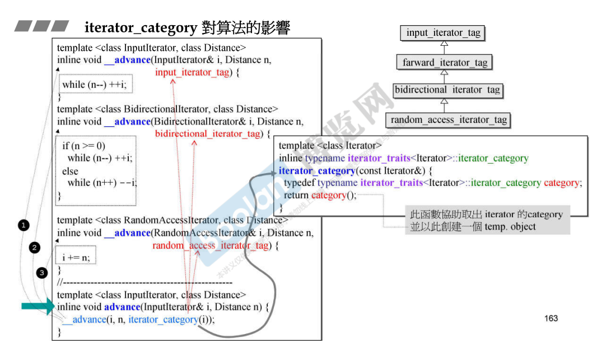
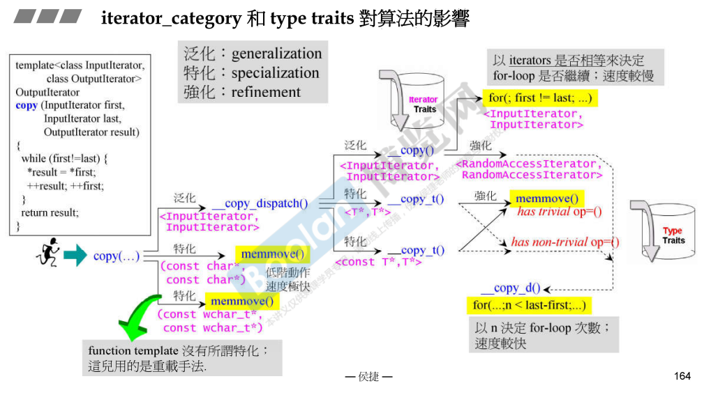
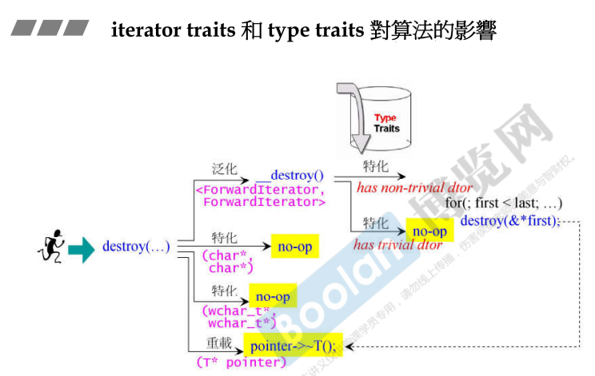
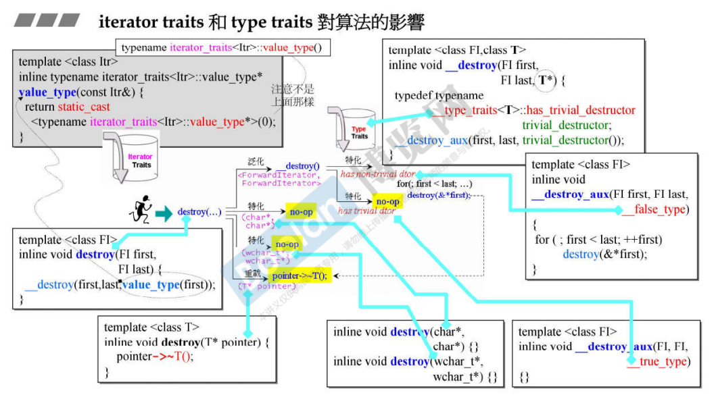
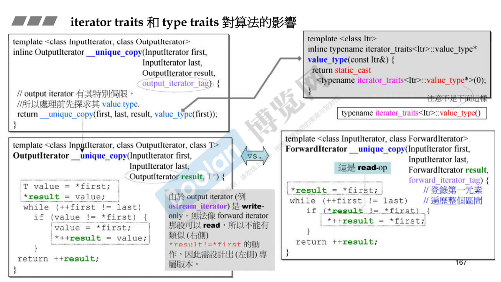
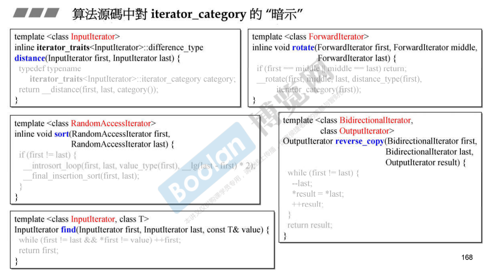

## 简介

在 [22.迭代器的分类（category）](22.迭代器的分类（category）) 中介绍了迭代器的分类（category），并且列举了不同的容器的迭代器的类型。

做完这些准备工作后，接下来将去详细介绍 **iterator_category 将如何去影响算法**。

## 算法举例

### distance


在上图中，列举了算法中的其中一个，**distance**，这是一个模板方法，将传入两个迭代器，标记着首尾，结果返回的是这两个迭代器的距离。

这个算法调用的是 **__distance** 方法的重载，可以看到在右半部分举例了两个重载：

> **random_access_iterator_tag**：一般为内存结构连续的容器的迭代器类型，直接将**两个迭代器相减**即可得到距离。
>
> **input_iterator_tag**：可以代指所有容器的迭代器类型，这种情况无法直接相减，从头走到尾 看走几步，**这里使用 first++，判断是否 ==last，并且进行计数**，得到距离。

至于 iterator 的 category 怎么获得，在 **distance** 方法中，使用 **iterator_traits** 获取关于 difference_type 、iterator_category 的特性 [12. 迭代器的设计原则和iterator_traits的作用与设计](12. 迭代器的设计原则和iterator_traits的作用与设计) 中有进行介绍。

> *<u>可以看到，**算法是一个主函数**，这个主函数会去调用次函数（重载），**根据迭代器特性的不同，去调用不同的次函数**。</u>*

### advance



又如上图，算法 **advance**，表示将<u>***迭代器前进 n 个单位***</u>。

类似于 **distance**，同样是一个 **advance** 主函数调用各种不同的 **__advance** 次函数，根据 iterator_category 来调用不同的实现。同样的，使用 iterator_traits 来获取 category 特性。

> **random_access_iterator_tag**：内存结构连续的容器，其迭代器只需要 + 相应的值，即可完成前进的动作。
>
> **bidirectional_iterator_tag**：双向链表、红黑树使用的迭代器，**迭代器本身可双向移动**，但是需要**根据传入的数值，一步步的去前进 / 后退迭代器**，而<u>*不能像 random_access 那样跳着走*</u>。
>
> **input_iterator_tag**：可以代指所有容器的迭代器类型，**这里直接调用迭代器的 ++，来使迭代器前进**。


==继承： is a==

### 次函数重载补充

在 distance 和 advance 这两个算法中，可以看到**并没有将所有的迭代器的 category 进行重载**（次函数）。

由于 category 本身具有继承关系： [22.迭代器的分类（category）](22.迭代器的分类（category）) 中的 <u>*iterator_category 标签下*</u>介绍了继承关系为： **input<-forward<-bidirectional<-random_access**。

那么根据面向对象的观念，<u>***子类 is-a 父类***</u>，例如 distance 中：

> 1.若迭代器的 category 是 **random_access**，编译器则会去寻找对应类型的实现，发现有，则会优先调用该实现。
>
> 2.若迭代器的 category 是 **forward**，编译器发现没有对应类型实现，则会去调用父类 **input** 的实现。
>
> 因此，无论是那种类型，编译器都能够找到对应的函数进行调用。

例如以下代码：

```C++
class Parent {
public:
	Parent() {
		std::cout << "Parent Constructor" << std::endl;
	}
	virtual void Func(){ std::cout << "Parent Func" << std::endl; }
	~Parent() {
		std::cout << "Parent DeConstructor" << std::endl;
	}
};

class Child : public Parent {
public:
	Child() : Parent(){
		std::cout << "Child Constructor" << std::endl;
	}
	void Func() { std::cout << "Child Func" << std::endl; }
	~Child() {
		std::cout << "Child DeConstructor" << std::endl;
	}
};

//只实现 parent
void FuncOverload(Parent p) 
{
	p.Func();
}

int main()
{
    Child child;
    //编译器调用 parent 实现
	FuncOverload(child);
}
```

### copy



在上图中，展示了 **copy** 算法的实现，该算法传入三个参数：

> 1.被拷贝对象的 起点 / 终点 first / last
>
> 2.拷贝对象的 起点 result

通过这三个位置，去将一段内存拷贝到另一端。

可以看到，copy 算法<u>*有很多个模板特化的实现*</u>：

> 1.**const char* / const wchar_t*** 这两种版本直接调用 **memmove**，直接拷贝内存，速度很快。
>
> 2.**T* 指针版本**，<u>*判断拷贝复制 operator= 是否重要（类成员是否含有动态分配的内存，**这里是判断是否使用了默认的拷贝赋值函数**）*</u>，（c++ 面向对象高级开发.part1.7.类的三大函数(拷贝、析构、拷贝赋值)）如果重要，则去调用右下角的 **__copy_d()**；否则去调用 **memmove**
>
> 3.**random_access**：调用 **__copy_d()**，根据 n 决定循环次数，速度较快。
>
> 4.**input**：其他的 category，根据 首位是否相同决定循环次数，速度较慢。

### destroy





和 copy 类似，上图中的 **destroy** 算法也会根据迭代器的 category 进行特化，同样也会去<u>***判断这个类的析构函数是否重要（析构函数是否编译器默认）***</u>：**若重要，则会去调用每个在容器中对象的析构函数，再去释放内存；否则不做任何事情，直接释放内存**。

### 关于 category 对算法影响的总结

> 从 **copy** 和 **destroy** 两个算法可发现，迭代器不同的 category 会对算法的执行过程产生影响（特化版本），最终会影响算法的执行效率。

### unique_copy



上图是 **unique_copy** 算法的部分源码，该算法的作用是<u>*将不重复的元素拷贝到目的端*</u>。

关于上图的 **ForwardIterator** 和 **OutputIterator** 的两种实现，侯捷老师这样解释到：

> 由于这两个迭代器的**读取操作（解引用 * 操作符）**的实现不同，OutputIterator 不能够像 ForwardIterator 那样直接读取元素（灰色打底），所以需要进行不同的实现。

## 算法的暗示

由于算法是一个个的模板方法，<u>***无法对传入的参数进行类型限制，只有对使用者的暗示***</u>，如下图：



在模板参数的名称中，其实有对使用者进行暗示，提醒在使用时应该将对应的类型进行传入。

> 但是其实没有限制，语法上不支持。
>
> 当使用者没有根据暗示来传参时，在使用到某个位置时，由于模板会对使用部分进行编译（c++面向对象高级开发.part2.6.模板），那么该编译可能会不通过。

