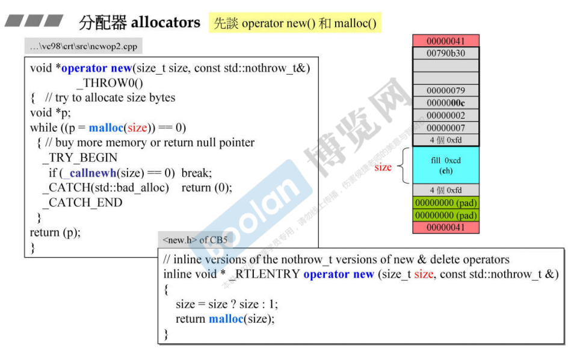
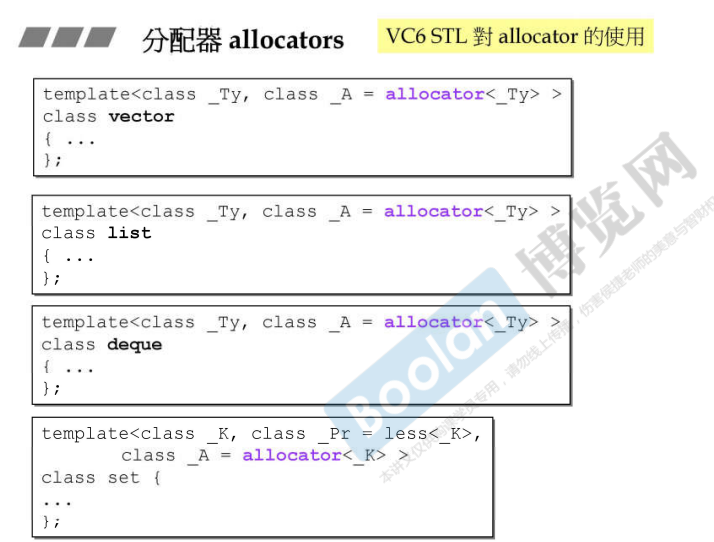

## 简介

是专属于容器的一种工具，一般不用做直接使用。

## operator new() 与 malloc()

所有的分配动作，最终都会归结于 ``malloc()``，这个函数再根据不同的平台（windows、Linux等）调用操作系统的 api，最终得到分配的内存。

（C++面向对象高级开发.part2.14.new & delete）中介绍了 operator new



在 c++ 层面，**分配动作会归结到 operator new，但最终还是调用 c 语言的 malloc**。如上图。

根据  （C++面向对象高级开发.part1.8.堆、栈与内存管理） 中介绍了分配的内存长得样子（上图右半），这时在 debug 模式下的内存分配。

## 分配器的实现



如上图，这是各个容器对分配器的使用，默认在模板参数中会将分配器的类型传入。


上图是 vc6 allocator 的实现。每一个分配器最终要的两个函数 [6.分配器测试](6.分配器测试)：

> allocate：分配内存，实际调用的是 operator new，**最终调用 malloc**
>
>   参数：
>
> ​	size_type：指定要分配多少个对象（个数）
>
> ​	const void* ：传入一个类型，配合 size_type，可以知道需要分配总体分配内存的大小（类型大小 * 个数）size_type * sizeof()
>
>   返回值：得到分配内存的首地址。
>
> deallocate：回收内存，实际调用 operator delete，最终调用 free
>
>   参数：
>
> ​	void* ：分配内存的首地址。
>
> ​	size_type：分配对象的个数。

在 vc6 中，allocator 没有任何的特殊设计。

### 一些其他版本（了解）

> 然后，侯捷老师介绍了 gnu c++ 2.9的 alloc 分配器，并且介绍了这个分配器的优势。
>
> 但是在 gnu c 4.9之后又用回了 allocator，并且没作解释。
>
> 以上了解即可。。。。。

## 一些补充

在这里可能还有一些疑惑：

> <u>*既然 allocator 也是去分配内存，那么和c++的直接 **new** 有什么区别呢？*</u>

诶，这个区别就大了，在 （C++面向对象高级开发.part1.8.堆、栈与内存管理）中的 <u>*堆内存分配详解*</u> 标签下介绍到，new 分为以下三个步骤：

> 1.operator new 分配内存
>
> 2.类型转换
>
> 3.调用构造

那么，如以下示例代码：

```C++
string* p = new string[100];
```

当动态分配 100 个 string 类型的对象数组时，内存分配一次，但是会进行 100 次的构造（在 （C++面向对象高级开发.part1.8.堆、栈与内存管理）中的 <u>*动态分配内存的大小*</u> 标签下），这就造成了性能下降。

而分配器却不同，如以下示例代码：

```cpp
allocator<string> str;
//内存分配
string* pstr = str.allocate(100);

//对象构造1
str.construct(pstr, "hello");

//对象构造2
pstr++;
str.construct(pstr, "world");
```

allocator 将内存分配、对象构造视作两个独立的过程，并且由独立的函数负责。

这样跟 new 相比，在需要的时候才对内存进行构造，使得性能上得到提升。

