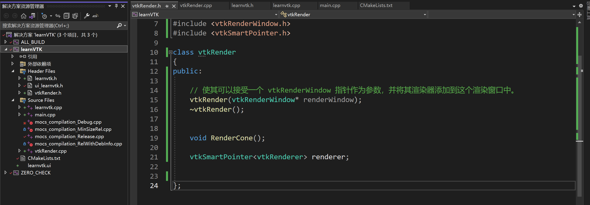
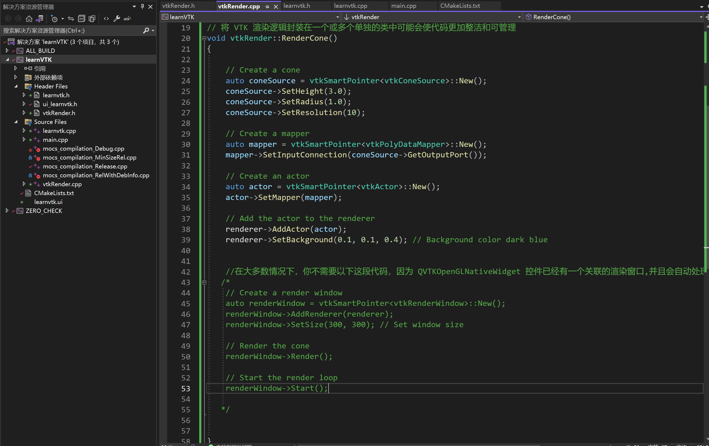

# VTK

# -----相关背景----

## OpenCV 和 VTK

OpenCV和VTK是两个在图像处理和计算机视觉领域中广泛使用的库，但它们专注于不同的领域，并具有不同的功能和用途。

### OpenCV（Open Source Computer Vision Library）

1. **专注领域**：OpenCV主要专注于实时的计算机视觉。它是一个功能丰富的库，主要用于执行图像处理和视频分析任务。

2. **主要功能**：
   - 图像处理：滤波、变形、颜色空间转换。
   - 特征检测和提取：边缘检测、角点检测、线条和形状识别。
   - 运动分析和对象追踪。
   - 机器学习：人脸识别、物体识别和分类。
   - 摄像头操作和视频文件处理。
   - 深度学习集成。

3. **应用领域**：广泛应用于面部识别、自动驾驶车辆、机器人视觉、运动跟踪等领域。

4. **优势**：性能优化（尤其是对实时应用），具有广泛的社区支持和丰富的文档。

### VTK（The Visualization Toolkit）

1. **专注领域**：VTK主要专注于三维计算机图形学、图像处理和可视化。它是一个用于创建复杂的三维图形应用程序的库。

2. **主要功能**：
   - 三维渲染和二维/三维图形可视化。
   - 支持多种科学可视化算法：等值线提取、体积渲染、矢量场可视化。
   - 图像处理功能：图像滤波、图像重构和图像分析。
   - 支持多种数据格式的读写。
   - 提供与Qt、wxWidgets等GUI工具包的集成。

3. **应用领域**：广泛用于科学研究、工程分析、医学成像和其他领域，其中需要三维可视化和分析。

4. **优势**：强大的三维数据可视化能力，丰富的数据处理和渲染功能。

### OpenCV与VTK的联系

虽然OpenCV和VTK在功能上有所不同，但它们之间存在一定的联系：

- **互补性**：在某些项目中，OpenCV和VTK可以一起使用，其中OpenCV处理图像和视频数据，VTK则用于数据的三维可视化。
- **数据转换**：可以将OpenCV处理的图像转换为VTK格式，用于进一步的三维渲染和可视化。
- **共同应用领域**：在医学成像和科学研究中，两者经常被结合使用，OpenCV用于图像处理和分析，VTK用于展示结果。

总结来说，OpenCV和VTK都是功能强大的库，分别在计算机视觉和三维数据可视化领域内发挥着重要作用。根据项目需求，它们可以单独使用或结合使用，以实现复杂的图像处理和数据可视化功能。


# ---------基础知识----------

## ---VTK中的 `New()`

在VTK（The Visualization Toolkit）中，`New()`函数的使用是一个常见的模式。而且，你正确地觉得这是一种设计模式的应用。这个模式在很大程度上与所谓的工厂方法模式（Factory Method Pattern）有关，但在VTK中的具体实现略有不同。

在典型的工厂方法模式中，有一个方法负责创建对象，而不是直接使用构造函数。这样，如果你想更改对象的创建方式，你只需要更改工厂方法，而不是到处更改那些直接调用构造函数的代码。

VTK中的`New()`方法有以下特点：

1. **统一的接口**: 使用`New()`方法可以为所有VTK类提供**一个统一的方式来创建对象**。

2. **引用计数**: VTK中的对象使用引用计数来管理其生命周期。当一个VTK对象被创建时，它的引用计数设置为1。当另一个对象或用户使用这个对象时，引用计数增加；当不再使用这个对象时，引用计数减少。当引用计数达到0时，对象被删除。`New()`方法创建的对象的引用计数被设置为1，然后当它被一个智能指针或其他对象所持有时，其引用计数会适当地增加或减少。

3. **易于子类化**: 由于VTK对象通常使用`New()`方法而不是构造函数创建，这使得在子类中重写对象创建过程更为容易。

**为什么不直接使用构造函数**？这样的好处是：

- 当你想更改对象的实例化方式（例如，更改为从对象池中获取或使用不同的构造逻辑）时，你只需要更改`New()`函数，而不是到处更改代码。
- 这种方法与VTK的内存管理策略很好地结合在一起。

总的来说，这种`New()`函数的使用是VTK为了统一对象创建、简化内存管理和提高扩展性而采用的策略。


在VTK中，`vtkSmartPointer` 是一个智能指针，用于自动管理VTK对象的生命周期。`vtkNew` 也是一个用于自动内存管理的工具，但两者之间的主要区别在于 `vtkSmartPointer` 可以被复制，而 `vtkNew` 对象不能。当需要在函数或类之间传递对象时，使用 `vtkSmartPointer` 更为合适。

## ---vtkNew

1. **自动管理生命周期**：`vtkNew` 类似于C++11中的 `std::unique_ptr`，为对象提供自动的生命周期管理。它在对象离开作用域时自动删除对象。
2. **易用性**：`vtkNew` 用起来非常简单，只需要声明并使用。不需要手动调用 `Delete` 方法。
3. **局部作用域**：当您只在一个函数或局部作用域内使用VTK对象时，`vtkNew` 是一个很好的选择。
4. **所有权**：`vtkNew` 对象的所有权不能被共享或传递，这意味着它们在语义上是唯一的。

## ---vtkSmartPointer

1. **共享所有权**：`vtkSmartPointer` 类似于 `std::shared_ptr`，支持引用计数的智能指针。当最后一个 `vtkSmartPointer` 被销毁时，它会自动删除所指向的对象。
2. **跨作用域共享**：它适用于需要在多个函数或类之间共享VTK对象的情况。
3. **动态分配**：当需要在程序的不同部分动态地创建和销毁对象时，`vtkSmartPointer` 是一个好选择。
4. **线程安全**：在多线程环境中，`vtkSmartPointer` 可以更安全地用于共享对象。


**总结**

- 如果对象只在局部作用域内使用，并且不需要跨函数或类共享，`vtkNew` 是一个更简洁和直接的选择。
- 如果对象需要在不同的函数或类之间共享，或者需要在应用程序的多个部分之间动态管理，那么 `vtkSmartPointer` 是更好的选择。

总的来说，如果没有特定的共享或跨作用域需求，`vtkNew` 由于其简单性和局部作用域内的自动内存管理，通常是首选。


`vtkNew` 和 `vtkSmartPointer` 都是 VTK 中用于**自动管理对象生命周期的智能指针**。它们之间的主要区别在于它们的使用场景和对象所有权的处理方式。

1. **vtkNew**:
   - `vtkNew` 类模板在栈上创建对象，并在其作用域结束时自动删除它。
   - `vtkNew` 是 C++11 之后的产物，因此它**遵循现代 C++ 的内存管理理念**。
   - 由于它在栈上创建对象，所以 `vtkNew` 通常用于局部变量。
   - `vtkNew` 不能被复制，但可以被移动。这意味着您不能将 `vtkNew` 类型的对象赋值给另一个 `vtkNew` 对象，但您可以将其作为参数传递给函数（通过引用或者转换为 `vtkSmartPointer`）。
   - `vtkNew` 提供了直接访问其管理的 VTK 对象的操作符 `->`。

2. **vtkSmartPointer**:
   - `vtkSmartPointer` 在堆上创建对象，可以通过复制智能指针在程序的不同部分之间共享 VTK 对象的所有权。
   - 当最后一个 `vtkSmartPointer` 被销毁时，所指向的对象会被自动删除。
   - `vtkSmartPointer` 可以被复制，这意味着当您给另一个 `vtkSmartPointer` 赋值时，引用计数会增加，并在最后一个引用被销毁时减少到零。
   - `vtkSmartPointer` 常用于函数间的对象传递、类成员变量或者在需要引用计数的场景中。

两者的关系在于，它们都是智能指针，旨在简化内存管理。在一些场景下，可以将 `vtkNew` 对象转换为 `vtkSmartPointer`，以便在 VTK 的管道中传递。在内部，`vtkSmartPointer` 使用了 VTK 的引用计数机制，允许多个指针指向同一个对象，而 `vtkNew` 更像是一个自动管理生命周期的局部指针。

以下是一个简化的使用案例，以说明它们的转换使用：

```cpp
// 使用 vtkNew 创建对象
vtkNew<vtkSomeClass> someObject;

// ... some code ...

// 需要将对象传递给接受 vtkSmartPointer 的函数时
SomeFunction(vtkSmartPointer<vtkSomeClass>(someObject));
```

在上述案例中，`someObject` 使用 `vtkNew` 创建，但在调用 `SomeFunction` 时，我们需要将它作为 `vtkSmartPointer` 传递，因此我们可以构造一个 `vtkSmartPointer` 对象。这是可能的，因为 `vtkNew` 提供了一个转换操作符，使得 `vtkNew` 对象可以被隐式转换为 `vtkSmartPointer` 对象。


选择 `vtkNew` 或 `vtkSmartPointer` 取决于您的具体需求和上下文。以下是一些决策点，可以帮助您选择合适的智能指针：

1. **函数或方法的局部变量**:
   - 如果您在一个函数或方法内创建一个VTK对象，并且该对象不需要在函数调用后存在，那么 `vtkNew` 是合适的。
   - `vtkNew` 是一个好选择，因为它保证了在函数结束时自动删除对象。

2. **类的成员变量**:
   - 如果对象将作为类的成员变量存在，并且需要在类实例的整个生命周期中保持，那么 `vtkSmartPointer` 更合适。
   - 对于在多个对象间共享的资源，`vtkSmartPointer` 通过引用计数保证了资源的正确释放。

3. **共享或传递对象所有权**:
   - 如果您需要将VTK对象作为函数参数传递，或者需要在不同的对象间共享，那么 `vtkSmartPointer` 是必要的。
   - `vtkSmartPointer` 允许对象跨越作用域安全地共享，因为它使用引用计数来管理对象的生命周期。

4. **线程安全**:
   - 如果您在多线程环境中工作，`vtkSmartPointer` 可以提供线程安全的引用计数（请查阅VTK文档确认其线程安全性的最新状态）。
   - `vtkNew` 则通常只限于创建它的那个线程的作用域。

5. **返回对象**:
   - 当函数需要返回一个新创建的VTK对象时，返回 `vtkSmartPointer` 而不是 `vtkNew`，因为 `vtkNew` 不能被复制，而只能被移动。

6. **遗留代码兼容性**:
   - 如果您维护的是遗留代码，可能需要根据现有代码的规范和约定来选择。

**总结**: 简而言之，如果对象是临时的并且限于当前作用域，用 `vtkNew`；如果对象的生命周期需要跨越作用域或者与其他对象共享，用 `vtkSmartPointer`。`vtkSmartPointer` 更灵活，但稍微有一点性能开销，因为它需要管理引用计数。

**注意**: 一般来说，公共API应该避免返回裸指针或者使用裸指针作为参数，因为这可能会导致资源泄露或者其他内存管理问题。使用智能指针是现代C++的最佳实践。


## ---在 Qt Designer 中使用 VTK 控件

以下是如何在 Qt Designer 中使用 `QVTKOpenGLNativeWidget` 的基本步骤：

1. **使用占位控件**:
   - 在 Qt Designer 中，从工具箱中拖放一个 `QWidget` 到你的窗口或对话框上。
   - 右键点击这个 `QWidget`，选择“提升为...”。
   - 在“提升为”对话框中，为“提升的类名”输入 `QVTKOpenGLNativeWidget`。
   - 对于头文件，输入 `QVTKOpenGLNativeWidget.h`。
   - 点击“添加”然后“关闭”。
   - 现在，每当你在 Qt Designer 中使用这个提升的 `QWidget`，它在运行时都会变成一个 `QVTKOpenGLNativeWidget`。
2. **在代码中使用**:
   - 在你的代码中，确保你已经包含了必要的 VTK 和 Qt 头文件。
   - 当你加载或实例化你的 UI，这个提升的 `QWidget` 会自动变成 `QVTKOpenGLNativeWidget`，你可以像使用任何其他 VTK 控件一样使用它。

请注意，这种方法只是在设计时为你提供了一个占位符，你不会在 Qt Designer 中看到 VTK 的实际渲染。但在运行时，这个控件会正常工作并显示 VTK 的渲染内容。

如果你需要在多个地方使用 `QVTKOpenGLNativeWidget`，你可能需要为每个实例重复上述的“提升为”步骤，或者考虑创建一个自定义的 Qt Designer 插件，但这需要更多的工作。


## --- `QVTKOpenGLNativeWidget` 类的使用

在 VTK 9.0 及以上版本中，`QVTKOpenGLNativeWidget` 用于在 Qt 应用程序中嵌入 VTK 渲染窗口。下面是一个基本的步骤和示例，展示了如何在 Qt 应用程序中使用 `QVTKOpenGLNativeWidget`。


[]: https://vtk.org/doc/nightly/html/classQVTKOpenGLNativeWidget.html	"官方文档"


### 1. 安装和配置 VTK 和 Qt
确保你已经安装了 VTK 和 Qt，并在你的项目中配置了这两个库。你可以使用 CMake 来找到库并设置包含路径和链接器标志。

### 2. 在 Qt Designer 或代码中创建 QVTKOpenGLNativeWidget
你可以在 Qt Designer 中直接创建 `QVTKOpenGLNativeWidget` 控件，也可以在代码中创建它。

### 3. 使用 VTK 渲染管线
创建 VTK 渲染管线并将其添加到 `QVTKOpenGLNativeWidget` 的渲染窗口中。

### 示例代码

下面的示例代码展示了如何在 Qt 应用程序中使用 `QVTKOpenGLNativeWidget` 来显示一个 VTK 圆锥体。

#### mainwindow.ui
如果你使用 Qt Designer，你可以在 UI 文件中添加一个 `QVTKOpenGLNativeWidget` 控件。在这个示例中，我们将其 objectName 设置为 `vtkWidget`。

#### mainwindow.h
```cpp
#pragma once

#include <QMainWindow>
#include <vtkConeSource.h>
#include <vtkPolyDataMapper.h>
#include <vtkActor.h>
#include <vtkRenderer.h>

QT_BEGIN_NAMESPACE
namespace Ui { class MainWindow; }
QT_END_NAMESPACE

class MainWindow : public QMainWindow
{
    Q_OBJECT

public:
    MainWindow(QWidget *parent = nullptr);
    ~MainWindow();

private:
    Ui::MainWindow *ui;
    vtkSmartPointer<vtkRenderer> renderer;
};
```

#### mainwindow.cpp
```cpp
#include "mainwindow.h"
#include "ui_mainwindow.h"

MainWindow::MainWindow(QWidget *parent)
    : QMainWindow(parent),
      ui(new Ui::MainWindow)
{
    ui->setupUi(this);

    // Create a VTK cone source
    vtkSmartPointer<vtkConeSource> coneSource = vtkSmartPointer<vtkConeSource>::New();
    coneSource->SetHeight(3.0);
    coneSource->SetRadius(1.0);
    coneSource->SetResolution(30);

    // Create a VTK polydata mapper
    vtkSmartPointer<vtkPolyDataMapper> mapper = vtkSmartPointer<vtkPolyDataMapper>::New();
    mapper->SetInputConnection(coneSource->GetOutputPort());

    // Create a VTK actor
    vtkSmartPointer<vtkActor> actor = vtkSmartPointer<vtkActor>::New();
    actor->SetMapper(mapper);

    // Create a VTK renderer and add the actor to it
    renderer = vtkSmartPointer<vtkRenderer>::New();
    renderer->AddActor(actor);
    renderer->SetBackground(0.3, 0.3, 0.3); // Set a dark grey background

    // Add the VTK renderer to the QVTKOpenGLNativeWidget
    ui->vtkWidget->renderWindow()->AddRenderer(renderer);
}

MainWindow::~MainWindow()
{
    delete ui;
}
```

#### main.cpp
```cpp
#include "mainwindow.h"

#include <QApplication>

int main(int argc, char *argv[])
{
    QApplication a(argc, argv);
    MainWindow w;
    w.show();
    return a.exec();
}
```

在这个示例中，我们首先在 `MainWindow` 构造函数中创建一个 VTK 渲染管线来渲染一个圆锥体。然后，我们使用 `ui->vtkWidget->renderWindow()->AddRenderer(renderer)` 将 VTK 渲染器添加到 `QVTKOpenGLNativeWidget` 的渲染窗口中。希望这个示例能帮助你理解如何在 Qt 应用程序中使用 `QVTKOpenGLNativeWidget`！


### 4.将VTK的渲染管线独立

明白了，你的问题是关于直接在主窗口类中设置渲染管线与在一个单独的 `vtkRender` 类中设置渲染管线的区别。

1. **直接在主窗口类中设置渲染管线**

    在这种方法中，你直接在主窗口类（或者任何包含 `QVTKOpenGLNativeWidget` 的类）中创建和设置 VTK 渲染管线。这通常涉及到创建数据源、映射器、actor 和渲染器，并将它们添加到 `QVTKOpenGLNativeWidget` 的渲染窗口中。

    ```cpp
    // Add the VTK renderer to the QVTKOpenGLNativeWidget
    ui->vtkWidget->renderWindow()->AddRenderer(renderer);
    ```
   
    这种方法的优点是简单直接。你可以在一个类中管理所有的 UI 和 VTK 代码，这在小型项目中可能更容易管理。

2. **在一个单独的 `vtkRender` 类中设置渲染管线**

    在这种方法中，你在一个单独的类（例如 `vtkRender`）中封装 VTK 渲染的逻辑，并在主窗口类中创建这个类的实例，将 `QVTKOpenGLNativeWidget` 的渲染窗口传递给它。

    ```cpp
    // Create a vtkRender instance and pass the render window of the QVTKOpenGLNativeWidget to it
    m_VTKRender = new vtkRender(ui->VTKwidget->renderWindow());
    
    // Render a cone
    m_VTKRender->RenderCone();
    ```
   
    这种方法的优点是分离了 UI 代码和 VTK 代码，使得你的项目更加模块化。这在大型项目中可能更容易管理，因为你可以在不同的类中组织不同的功能模块，并在需要时重用它们。

两种方法在功能上是等效的，选择哪一种主要取决于你的项目的复杂性和你的个人或团队的编码风格。在小型项目中，直接在主窗口类中设置 VTK 渲染管线可能更简单。在大型项目中，将 VTK 渲染逻辑封装在一个或多个单独的类中可能会使代码更加整洁和可管理。希望这能帮到你！


## --- `SafeDownCast:`


当然可以，让我们深入探讨`SafeDownCast`及其在VTK中的使用。

VTK（Visualization Toolkit）是一个广泛使用的3D计算机图形、图像处理和可视化库。在VTK中，许多对象都是从`vtkObject`或其子类派生的。因为VTK有自己的对象层次结构和运行时类型信息系统，所以它提供了自己的**安全类型转换机制**。

**SafeDownCast:**

在VTK中，`SafeDownCast`是一种静态方法，用于安全地将基类指针（例如`vtkObject*`）**转换为派生类指针**（例如`vtkRenderWindow*`）。如果转换是有效的（即给定对象确实是目标类型或其子类型的实例），`SafeDownCast`会返回相应的指针。如果转换是无效的，它会返回`nullptr`。

`SafeDownCast`与C++的`dynamic_cast`有些相似，但它是为VTK的对象系统特别设计的。与`dynamic_cast`不同，`SafeDownCast`不依赖于RTTI（运行时类型信息），因为VTK有自己的运行时类型检查系统。

这里的代码：
```cpp
vtkRenderWindow* renderWindow = vtkRenderWindow::SafeDownCast(caller);
```

进行的操作如下：

1. 尝试将`caller`（类型为`vtkObject*`）安全转换为`vtkRenderWindow*`类型。
2. 如果`caller`确实是`vtkRenderWindow`（或其子类）的一个实例，那么转换成功，`renderWindow`会包含一个有效的指针。
3. 如果`caller`不是`vtkRenderWindow`的实例，那么`renderWindow`会被设置为`nullptr`。

此方法非常有用，特别是在回调函数或事件处理程序中，您可能不确定调用者是什么类型，但您需要尝试将其转换为某个特定类型。如果转换失败，您可以通过检查结果是否为`nullptr`来轻松地检测它，并据此做出决策。

简而言之，`SafeDownCast`为VTK提供了一个安全、有效的方式来进行类型转换，同时避免了C++ RTTI的开销。


## --- error VTK里计算的误差

在这段代码中，误差 `error` 是通过计算每个变换后的点与目标点之间的欧氏距离来得到的，然后求取平均值。具体单位（毫米mm或厘米cm）取决于你输入点坐标的单位。

**VTK本身并不强制使用特定的单位系统。它处理的是点的坐标值，而这些值的具体单位取决于它们是如何被定义和输入的**。所以，如果你的点坐标是以毫米为单位输入的，那么计算出的误差就是毫米；如果坐标是以厘米为单位输入的，那么误差也将以厘米为单位。

在你的代码中，计算误差的步骤是这样的：

1. 使用 `vtkMath::Distance2BetweenPoints` 计算点对之间的距离的平方。
   
2. 累积所有点对之间的距离平方，计算总和。
   
3. 最后，将总和除以点的数量 `m_npoints`，然后取平方根得到平均误差。

因为 `vtkMath::Distance2BetweenPoints` 返回的是距离的平方，所以最终的误差是以相同的单位计算的。但请注意，单位完全取决于输入数据的单位。

如果你不确定输入数据的单位，你可能需要回溯到数据的来源，或者检查相关的文档或元数据以确定使用的具体单位。


## ---何时使用主线程（GUI线程）和何时使用子线程（后台线程）


在GUI编程中，尤其是使用像VTK这样的图形库时，关于何时使用主线程（GUI线程）和何时使用子线程（后台线程）的决定非常重要。通常，以下原则适用：

1. **主线程（GUI线程）用于渲染和用户界面操作**：因为大多数GUI框架（包括Qt）设计为非线程安全的，所以所有的GUI更新和渲染操作通常必须在主线程中执行。这包括使用VTK进行的任何渲染调用，因为这些调用通常涉及更新GUI组件（如渲染窗口）。

2. **子线程用于耗时的非GUI操作**：任何耗时的计算密集型任务或阻塞性I/O操作（例如，从文件系统或网络读取数据）都应该在子线程中进行。这确保了主线程保持响应，避免了界面冻结。

具体到你的案例，由于 `RenderCone()` 方法涉及到VTK的渲染过程，它应当在主线程中执行。将渲染流程放入子线程可能导致不可预测的行为，包括界面更新问题和程序崩溃。

如果 `RenderCone()` 方法中有一些可以独立于渲染流程进行的计算密集型任务，那么这些任务可以被放到子线程中执行。但是，**所有和渲染相关的操作，包括VTK渲染器、演员（actors）、映射器（mappers）和其他与GUI有直接关联的部分，都应该保留在主线程中。**

举例来说，如果你需要在 `RenderCone()` 中加载大量数据或执行复杂的计算，那么可以考虑将这部分逻辑放到子线程中，一旦数据处理完毕再将结果传回主线程进行渲染。这样做既可以保证界面的流畅性，也能保证渲染流程的安全和正确。


# ---------基础知识----------


# `VTK,QT` 结合使用实例


## `vtkRender .h .cpp`




这里为什么只有一个  vtkSmartPointer<vtkRenderer> renderer;成员呢，为什么需要它，为什么不需要别的vtk渲染管线的成员呢

在 VTK 中，`vtkRenderer` 是一个关键的组件，它负责管理渲染过程中的各种对象和状态。它包含了场景中的所有 actors、lights 以及 camera 的状态，并且知道如何调用它们的渲染方法来生成图像。这就是为什么在你的 `vtkRender` 类中有一个 `vtkRenderer` 成员的原因：它是渲染过程中的核心组件。

这里是一个简单的解释为什么 `vtkRender` 类只有一个 `vtkRenderer` 成员，而没有其他 VTK 渲染管线的成员：

1. **渲染器的重用**：`vtkRenderer` 可以包含多个 actors，这些 actors 可以共享或不共享数据源和映射器。因此，你可以在一个渲染器中渲染多个对象，而不是为每个对象创建一个新的渲染器。

2. **渲染窗口的关联**：`vtkRenderer` 需要被添加到一个 `vtkRenderWindow` 中，以便在屏幕上生成图像。在你的 `vtkRender` 类中，你将 `vtkRenderWindow` 作为一个参数传递给构造函数，并将 `vtkRenderer` 添加到这个渲染窗口中。这样，你就可以在 `QVTKOpenGLNativeWidget` 控件中显示由 `vtkRenderer` 生成的图像。

3. **渲染管线的动态创建**：在你的 `RenderCone` 方法中，你动态地创建了一个渲染管线（包括一个数据源、一个映射器和一个 actor），并将 actor 添加到 `vtkRenderer` 中。这样，你可以在运行时创建和渲染多个对象，而不是在类的构造函数中静态地创建它们。

4. **内存管理**：使用 `vtkSmartPointer` 管理 `vtkRenderer` 可以确保当你的 `vtkRender` 类被销毁时，`vtkRenderer` 也会被正确地销毁（除非它仍然被其他对象引用）。这简化了内存管理，并减少了内存泄漏的风险。

在一些情况下，你可能希望在你的 `vtkRender` 类中包含其他 VTK 对象的成员。例如，如果你想要在多个方法中重用或修改同一个 actor、数据源或映射器，你可以将它们作为类的成员。这完全取决于你的用例和你的设计决策。希望这能帮到你！





## `learnvtk   .h .cpp`


# VTK 观察者模式

在 VTK 中，观察者模式是一种常用的设计模式，用于在对象之间实现一种一对多的依赖关系。当一个对象的状态发生变化时，所有依赖于它的对象都会收到通知并自动更新。在 VTK 中，这通常用于处理事件响应。

在 VTK 中，观察者模式主要通过 `vtkObject` 类中的 `AddObserver` 方法实现。你可以使用这个方法**为 VTK 对象添加一个或多个观察者**，以便**在特定事件发生时**执行**自定义的回调函数**或方法。

## --基本用法

下面是一个简单的例子，展示了如何在 VTK 中使用观察者模式：

```cpp
#include <vtkSmartPointer.h>
#include <vtkConeSource.h>
#include <vtkCommand.h>

class CustomObserver : public vtkCommand
{
public:
    static CustomObserver* New()
    {
        return new CustomObserver;
    }

    virtual void Execute(vtkObject* caller, unsigned long eventId, void* callData) override
    {
        std::cout << "Event triggered!" << std::endl;
    }
};

int main()
{
    auto coneSource = vtkSmartPointer<vtkConeSource>::New();
    auto observer = vtkSmartPointer<CustomObserver>::New();

    // Add observer for StartEvent
    coneSource->AddObserver(vtkCommand::StartEvent, observer);

    // Trigger an event by updating the cone source
    coneSource->Update();

    return 0;
}
```

在这个例子中，我们首先创建了一个 `vtkConeSource` 对象和一个自定义的观察者类 `CustomObserver`。`CustomObserver` 继承自 `vtkCommand` 并重写了 `Execute` 方法，这个方法将在观察的事件被触发时调用。

然后，我们使用 `AddObserver` 方法为 `vtkConeSource` 对象添加了一个观察者，用于监听 `StartEvent` 事件。当 `StartEvent` 事件被触发（例如，通过调用 `coneSource->Update()` 方法）时，`CustomObserver` 的 `Execute` 方法将被调用，输出 "Event triggered!" 消息。

### 事件类型

VTK 定义了许多预设的事件类型，你可以在 `vtkCommand` 类中找到它们。一些常用的事件类型包括：

- `vtkCommand::StartEvent`: 在执行操作的开始时触发。
- `vtkCommand::EndEvent`: 在执行操作的结束时触发。
- `vtkCommand::ModifiedEvent`: 在对象被修改时触发。
- `vtkCommand::KeyPressEvent`: 在按键被按下时触发。
- 等等。

你可以在 VTK 的文档中找到完整的事件类型列表。

### 总结

VTK 的观察者模式允许你定义自定义的回调函数或方法，并在特定事件发生时自动执行它们。这在许多情况下都非常有用，例如，用于更新 UI、响应用户输入或监视对象的状态变化。希望这能帮到你！


## --匿名命名空间

在 C++ 中，使用匿名命名空间通常是为了限制一些代码实体（例如，变量、函数、类等）的可见性，**使它们只在定义它们的源文件中可见**。这样，这些代码实体就不会在其他源文件中引起命名冲突，也不会被其他源文件的代码访问。这是一种在文件范围内实现封装的方法。

在你给出的代码示例中：

```cpp
namespace {
// Callback for the interaction.
class vtkMyCallback : public vtkCommand
{
public:
  static vtkMyCallback* New()
  {
    return new vtkMyCallback;
  }
  void Execute(vtkObject* caller, unsigned long, void*) override
  {
    auto renderer = reinterpret_cast<vtkRenderer*>(caller);
    std::cout << renderer->GetActiveCamera()->GetPosition()[0] << " "
              << renderer->GetActiveCamera()->GetPosition()[1] << " "
              << renderer->GetActiveCamera()->GetPosition()[2] << std::endl;
  }
  vtkMyCallback() = default;
};
} // namespace
```

`vtkMyCallback` 类被定义在一个匿名命名空间中。这意味着这个类只能在定义它的源文件中被访问和使用。在这个源文件的其他部分，你可以正常地使用 `vtkMyCallback` 类，就像它是在全局命名空间中定义的一样。但是，在其他源文件中，`vtkMyCallback` 类是不可见的，即使你包含了定义它的源文件。

这种方法的一个潜在好处包括：

- **避免命名冲突**：由于 `vtkMyCallback` 类只在一个源文件中可见，它不会与其他源文件中的同名类冲突。
  
- **封装**：将 `vtkMyCallback` 类限制在一个源文件中可以防止其他源文件的代码误用它，这有助于封装和模块化你的代码。

- **编译优化**：在某些情况下，编译器可能能更有效地优化匿名命名空间中的代码，因为它知道这些代码不会在其他源文件中被访问。

使用匿名命名空间的一个典型场景是在你的源文件中有一些辅助函数或类，这些函数或类只被这个源文件中的代码使用，并且你不希望它们在其他地方被使用。希望这能帮到你！


# `vtkLandmarkTransform`


# VTK 的宏


在VTK（Visualization Toolkit）中，宏通常用于自动生成类的成员变量的访问方法，以减少手动编写这些常见方法的需要。这些宏通常在类的声明中使用，并在预处理阶段由编译器展开以生成方法的实现。下面我们将讨论几个常见的VTK宏：

### 1. `vtkSetObjectMacro`
```cpp
vtkSetObjectMacro(VariableName, VariableType);
```
`vtkSetObjectMacro`用于生成一个设置方法，用于设置一个VTK对象类型的成员变量。这个宏接受两个参数：成员变量的名字和类型。这个宏生成的方法将接受一个新的对象指针，将其分配给成员变量，并处理引用计数（增加新对象的引用计数并减少旧对象的引用计数）以防止内存泄漏和悬挂指针。它还会检查新旧对象是否不同，并在它们不同时调用`Modified()`方法来标记对象已被修改。

### 2. `vtkGetObjectMacro`
```cpp
vtkGetObjectMacro(VariableName, VariableType);
```
`vtkGetObjectMacro`用于生成一个获取方法，用于获取一个VTK对象类型的成员变量的指针。这个宏也接受两个参数：成员变量的名字和类型。生成的方法返回成员变量的指针，不增加其引用计数。

### 3. `vtkSetMacro` 和 `vtkGetMacro`
```cpp
vtkSetMacro(VariableName, VariableType);
vtkGetMacro(VariableName, VariableType);
```
`vtkSetMacro`和`vtkGetMacro`用于生成设置和获取方法，用于非对象类型的成员变量（例如，基本类型或POD类型）。这些宏接受两个参数：成员变量的名字和类型。`vtkSetMacro`生成的方法接受一个新的值并分配给成员变量，同时调用`Modified()`方法（如果新旧值不同）。`vtkGetMacro`生成的方法返回成员变量的值。

### 4. `vtkSetStringMacro` 和 `vtkGetStringMacro`
```cpp
vtkSetStringMacro(VariableName);
vtkGetStringMacro(VariableName);
```
`vtkSetStringMacro`和`vtkGetStringMacro`用于生成设置和获取方法，用于字符串成员变量。`vtkSetStringMacro`生成的方法接受一个`const char*`参数，复制字符串，并分配给成员变量。`vtkGetStringMacro`生成的方法返回一个`const char*`，指向字符串的成员变量。

### 总结
这些宏大大简化了VTK类的声明和实现，减少了手动编写这些常见方法的需要，并提供了一种一致的接口，使得VTK的使用者可以预测类的行为。在VTK的开发中，这些宏是非常常用的，它们确保了代码的一致性和减少了潜在的人为错误。


当然，我会提供更详细的解释和示例。

### 1. `vtkSetObjectMacro`

```cpp
vtkSetObjectMacro(VariableName, VariableType);
```

这个宏用于生成一个成员变量的setter方法，它也负责管理VTK对象的引用计数。

**使用示例:**
```cpp
class MyClass
{
public:
  vtkTypeMacro(MyClass, vtkObject);
  vtkSetObjectMacro(MyVariable, vtkSomeType);

private:
  vtkSomeType* MyVariable;
};
```
这将生成一个名为`SetMyVariable`的方法，它接受一个`vtkSomeType*`参数。这个方法会增加新对象的引用计数，减少旧对象的引用计数（如果它们不同），并更新成员变量的值。

### 2. `vtkGetObjectMacro`

```cpp
vtkGetObjectMacro(VariableName, VariableType);
```

这个宏用于生成一个getter方法，返回一个对象类型的成员变量的指针。

**使用示例:**
```cpp
class MyClass
{
public:
  vtkTypeMacro(MyClass, vtkObject);
  vtkGetObjectMacro(MyVariable, vtkSomeType);

private:
  vtkSomeType* MyVariable;
};
```
这将生成一个名为`GetMyVariable`的方法，它返回一个`vtkSomeType*`。

### 3. `vtkSetMacro` 和 `vtkGetMacro`

```cpp
vtkSetMacro(VariableName, VariableType);
vtkGetMacro(VariableName, VariableType);
```

这两个宏用于基本数据类型或POD（Plain Old Data）类型的setter和getter方法。

**使用示例:**
```cpp
class MyClass
{
public:
  vtkTypeMacro(MyClass, vtkObject);
  vtkSetMacro(MyVariable, int);
  vtkGetMacro(MyVariable, int);

private:
  int MyVariable;
};
```
这将生成一个名为`SetMyVariable`的方法，它接受一个`int`参数，和一个名为`GetMyVariable`的方法，它返回一个`int`。

### 4. `vtkSetStringMacro` 和 `vtkGetStringMacro`

```cpp
vtkSetStringMacro(VariableName);
vtkGetStringMacro(VariableName);
```

这两个宏用于字符串的setter和getter方法。

**使用示例:**
```cpp
class MyClass
{
public:
  vtkTypeMacro(MyClass, vtkObject);
  vtkSetStringMacro(MyVariable);
  vtkGetStringMacro(MyVariable);

private:
  char* MyVariable;
};
```
这将生成一个名为`SetMyVariable`的方法，它接受一个`const char*`参数，并为它分配内存和复制字符串。还会生成一个名为`GetMyVariable`的方法，它返回一个`const char*`。

### 注意

在使用这些宏时，需要确保你的类是从`vtkObject`或其派生类中派生的，因为这些宏依赖于`vtkObject`类的方法（例如`Modified()`）。希望这些示例和解释有助于你更好地理解这些VTK宏的用法！
