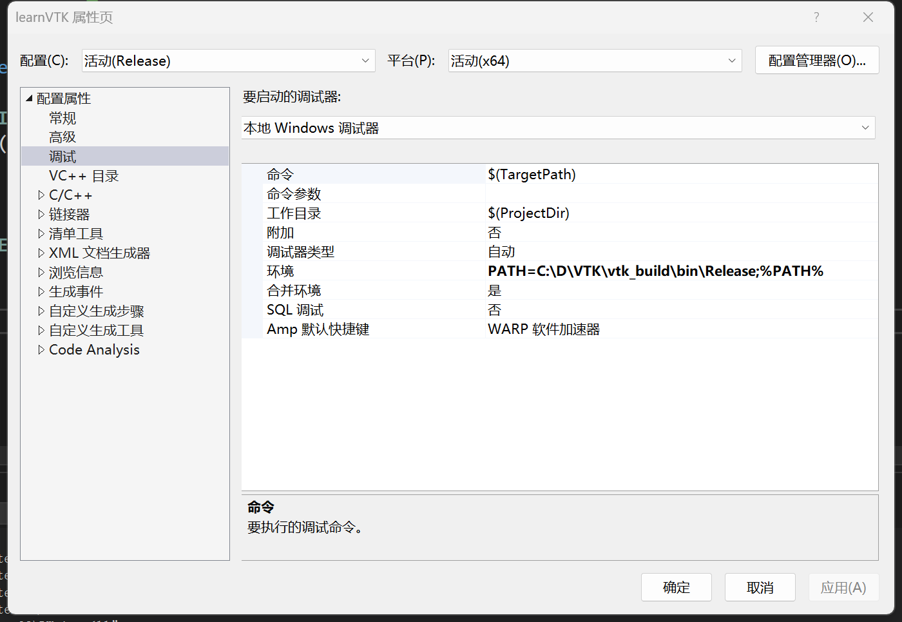
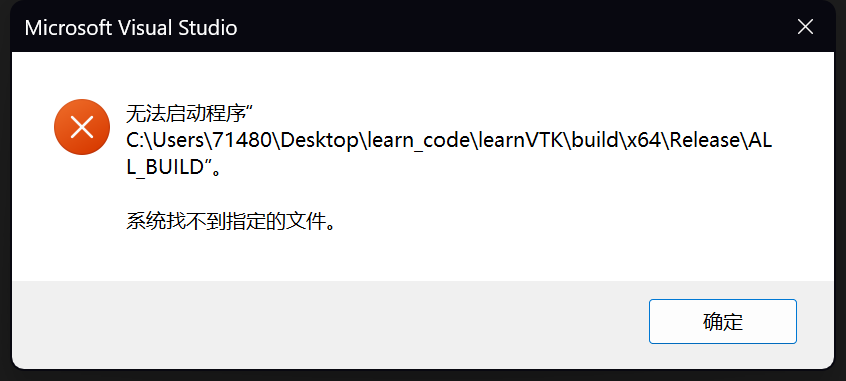
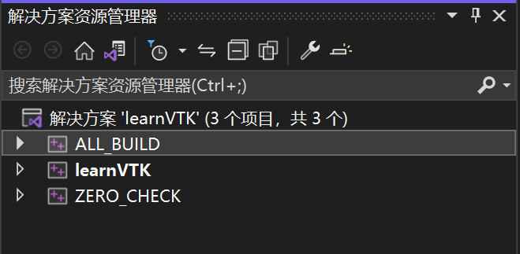
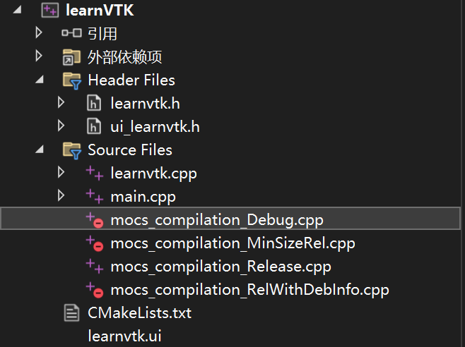
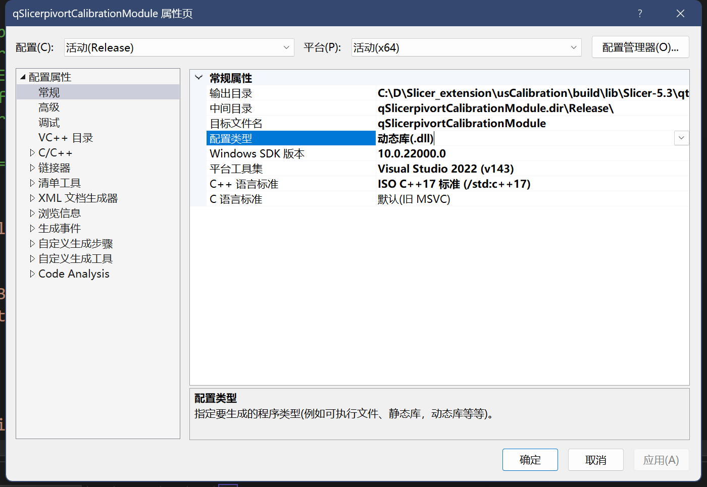
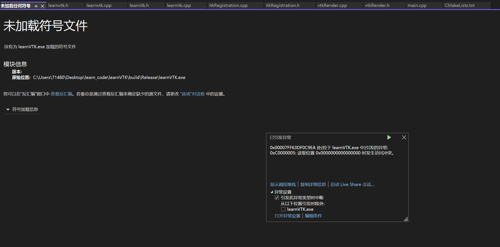
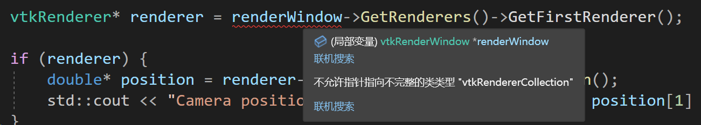

# 代码相关的问题记录


##  ~~ ~~ ~~ VS相关 ~~ ~~ ~~ 


## ---Visual Studio 在Release模式下可以调试吗

在Visual Studio中，即使在Release模式下，你仍然可以设置断点并进行调试。但是，需要注意几个关键点：

1. **优化问题**：在Release模式下，编译器会进行各种优化，这可能会影响调试过程。例如，某些变量可能被优化掉，导致你无法在调试器中查看它们的值。代码执行顺序也可能与源代码中的顺序不完全一致。

2. **符号信息**：Release模式通常不包含完整的调试符号信息（尽管这是可配置的），这可能会使得调试更加困难。

3. **代码与源代码不一致**：由于优化，实际执行的机器代码可能与你的源代码有所不同。这可能会导致断点出现在意外的位置，或者根本不触发。

4. **调试选项**：你可以在项目设置中调整一些选项，以在Release模式下获得更好的调试体验。例如，你可以禁用某些优化，或者生成包含调试信息的PDB（Program Database）文件。

5. **性能影响**：虽然在Release模式下调试可能对性能有一定影响，但这通常是可以接受的，特别是当你需要调试一个只能在Release模式下重现的问题时。

总体来说，虽然在Release模式下调试是可能的，但它通常不如在Debug模式下调试来得直观或容易。如果可能，最好在Debug模式下进行大部分调试工作。当你需要在Release模式下调试时，要准备好面对一些额外的挑战。


## **---设置 Visual Studio 的调试环境**: 配置dll目录 

在 Visual Studio 中，你可以为你的项目设置一个特定的 `PATH` 环境变量，这样当你从 Visual Studio 启动你的程序时，它会使用这个特定的 `PATH`。

- 打开你的项目属性。
- 转到“配置属性” -> “调试”。
- 在“环境”字段中，添加：`PATH=path_to_dlls;%PATH%`。
- PATH=C:\D\VTK\vtk_build\bin\Release;%PATH%
- C:\env\VTK-8.2.0build\bin\Release
- PATH=C:\D\VTK\vtk_build\bin\Release;C:\D\ITK\ITKBuild\bin\Release;%PATH%




## ---- “learnVTK.exe”(Win32): 已加载“C:\D\VTK\vtk_build\bin\Release\vtkFiltersSources-9.3.dll”。模块已生成，不包含符号。


这些消息看起来像是在你的开发环境（可能是 Visual Studio）中输出的调试信息。让我们逐一解析这些消息：

- `"learnVTK.exe"(Win32): 已加载“C:\D\VTK\vtk_build\bin\Release\vtkGUISupportQt-9.3.dll”。模块已生成，不包含符号。`
- `"learnVTK.exe"(Win32): 已加载“C:\D\VTK\vtk_build\bin\Release\vtkRenderingCore-9.3.dll”。模块已生成，不包含符号。`
- `"learnVTK.exe"(Win32): 已加载“C:\D\VTK\vtk_build\bin\Release\vtkFiltersSources-9.3.dll”。模块已生成，不包含符号。`
- `"learnVTK.exe"(Win32): 已加载“C:\D\VTK\vtk_build\bin\Release\vtkCommonExecutionModel-9.3.dll”。模块已生成，不包含符号。`

这些消息通常表示：

- **已加载**：这意味着你的应用程序（在这个例子中是 "learnVTK.exe"）在运行时加载了指定的动态链接库（DLL）文件。在这个上下文中，它加载了 VTK 的几个 DLL 文件，这些文件包含了 VTK 库的实现代码。
  
- **模块已生成，不包含符号**：这通常意味着 DLL 文件是以 Release 模式编译的，不包含用于调试的符号信息。符号文件（通常具有 `.pdb` 扩展名）包含了源代码和二进制代码之间的映射信息，这对于调试非常有用。如果你在 Debug 模式下运行你的应用程序，你可能希望使用包含调试符号的 DLL 文件，以便在调试时获取更多的信息。

这些消息通常只是用于调试和诊断的信息，并不表示出现了错误。如果你的应用程序运行正常，你通常可以忽略这些消息。如果你遇到问题或错误，你可能需要检查这些消息，以确保你的应用程序加载了正确的 DLL 文件和版本。希望这能帮到你！


## ---系统找不到指定的文件

使用vs生成可执行程序的时候，为什么会报错无法启动程序“C:\Users\71480\Desktop\learn_code\learnVTK\build\x64\Release\ALL_BUILD”。系统找不到指定的文件




当你在 Visual Studio 中使用 CMake 生成项目时，CMake 会为每个目标生成一个项目文件，并为整个解决方案生成一个特殊的目标，名为 `ALL_BUILD`。这个 `ALL_BUILD` 目标用于构建解决方案中的所有目标，但它本身并不是一个可执行目标。

当你尝试在 Visual Studio 中“启动”或“运行”项目时，Visual Studio 会尝试执行当前设置为启动项目的目标。如果你不小心将 `ALL_BUILD` 设置为启动项目（这可能是默认设置），并尝试运行它，你会收到你所描述的错误，因为 `ALL_BUILD` 不是一个可执行文件。

要解决这个问题，你需要更改启动项目：

1. 在 Visual Studio 的解决方案资源管理器中，找到你的实际可执行项目（不是 `ALL_BUILD`）。
2. 右键点击这个项目。
3. 选择“设为启动项目”。

现在，当你点击“启动”或“运行”时，Visual Studio 会尝试运行你的实际可执行文件，而不是 `ALL_BUILD`。

确保你的可执行项目已经成功构建，并且生成了相应的可执行文件。如果你的项目没有成功构建，你可能还需要解决其他构建错误。


## ---VS 项目工程

- 使用vs2022作为项目编译器的时候，在解决方案里 我注意到除了自己指定的项目名称，它还会有ALL_BUILD、ZRERO_CHECK项目，这些项目为什么会有，它们分别有什么作用



在使用 Visual Studio 2022（VS2022）作为项目编译器时，如果你看到了 `ALL_BUILD`、`ZERO_CHECK` 等项目，这通常意味着你的项目是通过 CMake 生成的。

CMake 是一个跨平台的自动化建构系统，它不依赖于特定的编译器，并且可以生成标准的构建文件（例如 Unix 的 Makefiles 或 Windows 的 Visual Studio 解决方案）。以下是这些项目的一些基本信息：

1. **ALL_BUILD**
   - **作用**：这个项目是一个用于构建解决方案中所有其他项目的“元”项目。当你构建这个项目时，Visual Studio 会构建解决方案中的所有项目。
   - **为什么存在**：它提供了一种简便的方式来一次性构建所有的项目，而不是手动选择并构建每一个项目。
2. **ZERO_CHECK**
   - **作用**：这个项目用于检查 CMakeLists.txt 文件（和其他的 CMake 配置文件）是否有变化。如果有变化，它会自动重新运行 CMake 以更新解决方案和项目文件。
   - **为什么存在**：当你修改了 CMake 配置文件后，这个项目确保你的解决方案和项目文件是最新的，无需手动重新运行 CMake。

这些项目是由 CMake 自动生成的，用于简化和自动化构建过程。通常，你不需要直接与这些项目交互，除非你正在进行构建过程的故障排查或特定的构建管理任务。希望这些信息能帮助你更好地理解你的 VS2022 解决方案中的这些项目！


- 项目下的子文件夹



当我们使用cmake的`add`命令生成库或者可执行文件时，后面指定上相关的cpp、h、hpp等文件，那么cmake就会识别到这些文件，并帮我们分类添加在vs项目工程里面

```cmake
add_executable(${PROJECT_NAME} ${${PROJECT_NAME}_SRCS} ${${PROJECT_NAME}_HDRS} ${${PROJECT_NAME}_UIS} ${WRAP_FILES})
```


## ---基于cmake的vs工程和普通的vs工程有哪些不一样

使用 CMake 生成的 Visual Studio (VS) 工程和使用 Visual Studio IDE 直接创建的工程在多个方面有一些不同。下面是一些主要的区别：

### 1. **项目文件和解决方案文件的生成**

- **CMake 生成的 VS 工程**：CMake 根据 `CMakeLists.txt` 文件生成项目（`.vcxproj`）和解决方案（`.sln`）文件。你不直接编辑这些文件，而是修改 `CMakeLists.txt` 文件并重新运行 CMake 以更新它们。
  
- **普通的 VS 工程**：当你使用 Visual Studio IDE 创建一个新的项目或解决方案时，VS 会直接生成 `.vcxproj` 和 `.sln` 文件。你可以通过 IDE 或直接编辑这些文件来修改它们。

### 2. **跨平台和跨编译器兼容性**

- **CMake 生成的 VS 工程**：由于 CMake 是一个跨平台的构建系统，你可以使用相同的 `CMakeLists.txt` 文件来生成 Windows、Linux、macOS 等多个平台的构建文件。这也意味着你可以用同一个构建配置生成 Visual Studio、Xcode、Makefile 等多种构建工具的项目文件。
  
- **普通的 VS 工程**：通常，使用 Visual Studio 创建的项目文件和解决方案文件是特定于 Windows 和 Visual Studio 的。要在其他平台或编译器上构建相同的代码，你可能需要创建和维护多个构建配置。

### 3. **依赖管理**

- **CMake 生成的 VS 工程**：CMake **有强大的依赖管理和库查找功能**。你可以使用 `find_package()`、`target_link_libraries()` 等命令来管理你的项目依赖，并确保正确的包含目录和链接器选项被设置。

- **普通的 VS 工程**：在 Visual Studio 中，你通常需要手动管理依赖，包括设置包含目录、链接器输入等。虽然 Visual Studio 也提供了一些依赖管理的工具和选项，但它们通常不如 CMake 那样强大和灵活。

  ### 注意点

  CMake 生成的 VS 工程，不要在vs中手动设置管理依赖了，不然即使改了，下次使用cmake进行config的时候，还是会变成cmake指定的

### 4. **项目结构和源文件管理**

- **CMake 生成的 VS 工程**：在 `CMakeLists.txt` 文件中，你使用 `add_executable()`、`add_library()` 等命令来定义你的目标，并使用 `target_sources()` 或变量来管理源文件。你不直接在 IDE 中管理源文件，而是在 `CMakeLists.txt` 中管理它们。
  
- **普通的 VS 工程**：你通常直接在 Visual Studio IDE 中添加或删除源文件，并在解决方案资源管理器中管理你的项目结构。

### 5. **构建配置**

- **CMake 生成的 VS 工程**：构建配置（例如 Debug、Release）通常在 `CMakeLists.txt` 文件中设置，并通过 CMake GUI 或命令行参数进行配置。
  
- **普通的 VS 工程**：构建配置直接在 Visual Studio IDE 中进行管理和切换。

两者之间的选择取决于你的项目需求。如果你需要更好的跨平台兼容性和依赖管理，或者你的项目依赖于使用 CMake 构建的第三方库，使用 CMake 可能是一个好选择。如果你只在 Windows 上工作，并且希望更直接地使用 Visual Studio 的所有功能，直接使用 Visual Studio 创建项目也是一个很好的选择。


## ---VS 项目的配置属性




在Visual Studio（VS）中，项目的配置属性允许开发者定制项目的构建过程。在“常规”属性下的“配置类型”设置，主要用于指定项目的输出类型。下面是一些常见的配置类型及其简要说明：

1. **应用程序（.exe）**：
   - 当你选择“应用程序”作为配置类型时，VS将构建一个可执行文件（.exe）。
   - 这通常用于创建独立的桌面应用程序。

2. **动态库（.dll）**：
   - 选择“动态库”将导致VS构建一个动态链接库（.dll）文件。
   - 动态链接库可以被其他程序或库在运行时调用。

3. **静态库（.lib）**：
   - 选择“静态库”将导致VS构建一个静态库（.lib）文件。
   - 静态库在其他程序编译时被链接，成为最终可执行文件的一部分。

4. **空项目**：
   - 选择“空项目”不会生成任何输出文件。
   - 这通常用于创建没有预定义输出类型的项目，例如，你可能只想使用VS来组织代码文件。

5. **生成文件**：
   - “生成文件”通常用于创建不生成标准输出（例如.exe或.dll）的项目。
   - 这可以用于执行自定义的构建步骤，例如代码生成或其他预构建事件。

6. **实用工具**：
   - “实用工具”通常用于执行辅助任务，例如清理或设置过程，并不直接生成常规的输出文件。
   - 这种类型的项目通常用于组织和执行与构建过程相关的辅助任务。

7. **Makefile**：
   - 选择“Makefile”允许你使用自定义的Makefile来控制构建过程。
   - 这通常用于导入和构建使用GNU Make工具创建的项目。

在VS中，你可以通过以下步骤访问并修改这些设置：

1. 在“解决方案资源管理器”中右键点击你的项目。
2. 选择“属性”。
3. 在弹出的属性页中，选择“配置属性”下的“常规”。
4. 在“配置类型”下拉菜单中，你可以选择上述提到的不同的配置类型。

选择正确的配置类型对于项目的构建和输出至关重要，因此在设置项目属性时需要确保正确选择以符合你的开发需求。


## ---未加载符号文件报错




报错 "0xC0000005: 读取位置 0x0000000000000000 时发生访问冲突" 通常指的是访问了空指针或无效的内存地址。这种错误通常发生在尝试解引用一个空指针（即指向 `nullptr` 或未初始化的指针）的时候。

在你的情况下，问题很可能出现在以下几个方面：

1. **未初始化的指针**：`m_TPSRegistration` 指针可能未被正确初始化。确保在使用这个指针之前，它已经指向了一个有效的 `TPSRegistration` 对象实例。
2. **对象生命周期问题**：如果 `m_TPSRegistration` 指向的对象在调用 `performRegistration` 方法前被销毁了，这也会导致类似的问题。确保管理对象生命周期，防止对象过早被销毁。
3. **多线程问题**：如果你的程序使用了多线程，并且有可能在另一个线程中改变了 `m_TPSRegistration` 指针，那么可能会在使用时产生冲突。这种情况下，需要确保线程安全。


## ---常见的编译错误

### 1.不允许指针指向不完整的类类型

### 

你可能会遇到“不允许指针指向不完整的类类型”的编译错误，如果你试图在**不包含相应类头文件的情况**下声明该类的对象或指针。这意味着编译器在当前上下文中没有足够的信息来完全了解这个类。

通常包含相应的类的头文件就可以解决这个编译错误


## ~~ ~~ ~~ VS相关 ~~ ~~ ~~ 


## ------------------------------------------------------

## --路径分隔符

在不同的操作系统中，路径分隔符（path separator）可能是不同的。这主要体现在两个方面：文件路径分隔符和环境变量路径分隔符。

### 文件路径分隔符：

- **Windows**：在Windows系统中，反斜杠（`\`）是用作文件路径分隔符的。例如：`C:\Program Files\SomeSoftware`

- **Unix/Linux/macOS**：在Unix和Unix-like系统（包括Linux和macOS）中，正斜杠（`/`）是用作文件路径分隔符的。例如：`/usr/local/bin`

### 环境变量路径分隔符：

- **Windows**：分号（`;`）用作环境变量（如`PATH`）中的多个路径的分隔符。

- **Unix/Linux/macOS**：冒号（`:`）用作环境变量（如`PATH`）中的多个路径的分隔符。

### 跨平台考虑：

- 当你编写需要在多个操作系统上运行的代码时，硬编码的路径分隔符可能会导致问题。许多编程语言和框架提供了跨平台的方法来处理文件路径。

- 例如，在Python中，你可以使用`os.path.join()`函数来构建跨平台的路径。

- 在C/C++中，你可能会使用条件编译或特定的库函数来处理不同系统的路径问题。

- 在Java中，`File.separator`会根据运行环境给出正确的路径分隔符。

- 在shell脚本中，通常使用正斜杠（`/`），因为Unix-like系统更常用于服务器，并且现代的Windows系统的命令行工具（如PowerShell和Windows Subsystem for Linux）也能理解正斜杠。

总体来说，了解不同系统中路径分隔符的使用是跨平台开发的一个重要方面。


## ---通配符、正则表达式

### 通配符（Wildcards）：

在文件名匹配或搜索的上下文中，通配符是一种简单但强大的方式，用于指代一组文件或目录。通配符用法在不同的操作系统中可能略有不同，但一般而言，最常用的通配符有两种：

1. **星号（`*`）**：匹配零个或多个字符。例如，`*.txt` 会匹配所有以 `.txt` 结尾的文件，无论前面是什么。

2. **问号（`?`）**：匹配单个字符。例如，`file?.txt` 可能会匹配 `file1.txt`, `file2.txt` 等，但不会匹配 `file10.txt`。

通配符主要用于命令行操作（如在Unix、Linux或Windows的命令提示符下）和一些编程语言中进行文件操作。

### 正则表达式（Regular Expressions）：

正则表达式是一个用于字符串模式匹配的强大工具。它们在编程语言（如Python、JavaScript、Java等）和文本编辑器（如grep、sed等）中非常常用。正则表达式的主要元素包括：

1. **点（`.`）**：匹配任何单个字符。

2. **星号（`*`）**：匹配前面的子表达式零次或多次。例如，`ab*c` 会匹配 `ac`, `abc`, `abbc` 等。

3. **加号（`+`）**：匹配前面的子表达式一次或多次。

4. **问号（`?`）**：匹配前面的子表达式零次或一次。

5. **方括号（`[]`）**：用于定义字符集。例如，`[aeiou]` 会匹配任何一个元音字符。

6. **大括号（`{}`）**：量词，用于指定前面表达式的重复次数。例如，`a{3}` 将匹配字符 'a' 重复3次的模式，即 `aaa`。

7. **反斜线（`\`）**：用于转义特殊字符。

8. **圆括号（`()`）**：用于分组子表达式。

9. **管道（`|`）**：逻辑或，用于匹配多个选择项。

例如，正则表达式 `a[0-9]+b` 会匹配以 'a' 开始、以 'b' 结尾，并且中间只包含一个或多个数字的字符串，如 `a1b`, `a12b`, `a123b` 等。

### 比较：

- **通配符**：主要用于文件和目录名的匹配，相对简单。
- **正则表达式**：用于复杂的字符串匹配和处理，功能更为强大和灵活。

这两者在特定的使用场景中都非常有用，但正则表达式提供了更多的灵活性和控制，尤其是在编程和文本处理方面。


## ---MinGW

MinGW（Minimalist GNU for Windows）是一个用于支持Windows平台上C、C++、Fortran等编程语言的**编译器和工具链**。它是GNU编译器集合（GCC）的一个Windows移植版本，旨在能在Windows环境下生成本地Win32程序，而不需要通过Cygwin这样的兼容层。MinGW提供了一组开源的编译器和链接器，以及其他相关工具，以便开发者能在Windows平台上进行开发。

### 主要特点：

1. **轻量级**：MinGW是一个相对轻量级的开发工具，不像某些其他的开发环境那样需要大量的磁盘空间和内存。

2. **原生Windows应用**：使用MinGW编译的程序是原生的Windows应用程序，不需要任何特殊的运行时环境或解释器。

3. **GNU工具链**：MinGW包括GNU编译器（GCC）、GNU二进制工具（Binutils）、以及其他一些GNU工具，这些都是开源的。

4. **与MSVC兼容**：虽然MinGW是基于GNU工具链的，但它也提供了一些头文件和链接库，以实现与Microsoft Visual C++（MSVC）的一定程度的兼容性。

5. **开源和免费**：MinGW是一个开源项目，免费供所有人使用。

### 使用场景：

- 开发跨平台应用程序：由于GCC也存在于Linux和其他Unix-like系统中，使用MinGW可以更容易地将应用程序移植到其他平台。

- 学术和教育：由于它是免费和开源的，MinGW常用于教育和学术研究中。

- 嵌入式或资源受限环境：由于MinGW是轻量级的，它也适用于资源受限的环境。

请注意，虽然MinGW是一个强大和灵活的工具，但它可能不包括Windows平台上一些最新或专有的功能和API。对于那些需要这些特性的应用程序，使用Microsoft的官方开发工具可能更为合适。


## ---依赖上下文的语言

在编程语言中，"依赖上下文（context-dependent）"这个术语通常意味着某个语法结构或表达式的含义取决于它所处的上下文。C++是一种有依赖上下文的语言，这主要体现在以下几个方面：

### 1. 重载（Overloading）

在C++中，函数和运算符可以被重载，即同一个名字可以用于多个不同的函数或运算符，具体调用哪一个取决于上下文。例如：

```cpp
void foo(int a) { /* ... */ }
void foo(double a) { /* ... */ }

int main() {
    foo(42);  // 调用 foo(int a)
    foo(42.0);  // 调用 foo(double a)
}
```

### 2. 模板（Templates）

C++的模板系统是非常强大的，但也是依赖上下文的。模板实例化取决于模板参数，这些参数又可能取决于上下文。

```cpp
template <typename T>
void bar(T a) { /* ... */ }

int main() {
    bar(42);  // 实例化为 bar<int>
    bar(42.0);  // 实例化为 bar<double>
}
```

### 3. 名字查找（Name Lookup）

在C++中，同一个名字在不同的上下文中可能有不同的含义。例如，局部变量会隐藏同名的全局变量。

```cpp
int x = 42;

int main() {
    int x = 0;  // 这里的 x 隐藏了全局变量 x
    // ...
}
```

### 4. 类型推导（Type Deduction）

C++11及以后的版本引入了`auto`和`decltype`等类型推导机制，这些机制也是依赖上下文的。

```cpp
auto x = 42;  // x 的类型依赖于 42 的类型，这里是 int
```

### 5. 语法解析（Syntax Parsing）

某些C++语法结构的解析也依赖于上下文。例如，`>>`在模板中被解析为两个单独的`>`符号，而在其他上下文中可能被解析为右移运算符。

这些特性使得C++成为一种非常灵活但也相对复杂的语言，需要程序员有很高的警觉性，以确保代码的行为符合预期。这也是为什么C++通常需要更多的类型信息和上下文信息来进行正确的编译和执行。


## ---纯头文件库

### 为什么有些库是纯头文件库？

纯头文件库（也称为header-only库）是一种不需要预编译的库，所有的实现代码都在头文件中。这样做有几个优点：

1. **易于集成**：用户只需要包含相应的头文件，而无需担心链接预编译的库文件。
2. **便携性**：由于没有预编译的二进制文件，纯头文件库通常更容易跨平台和跨编译器使用。
3. **模板支持**：C++模板通常需要在头文件中完全定义，这使得纯头文件库特别适合包含大量模板代码。
4. **内联优化**：编译器更容易对头文件中的代码进行内联优化，这可能会提高性能。
5. **版本兼容性**：由于没有预编译的二进制接口（ABI），纯头文件库通常更容易与不同版本的编译器和标准库一起使用。

### 使用纯头文件库的注意事项

1. **编译时间**：由于所有代码都在头文件中，包含这些头文件可能会增加编译时间。
2. **代码组织**：由于所有代码都在一个或几个头文件中，这可能会导致代码难以管理或阅读。
3. **命名冲突**：纯头文件库可能更容易导致命名冲突，因为它们通常会被包含在多个源文件中。
4. **内存使用**：如果多个源文件包含相同的头文件，这可能会导致代码冗余，从而增加最终二进制文件的大小（尽管现代编译器和链接器通常会进行优化以减少这种影响）。
5. **版本管理**：由于纯头文件库通常很容易集成，开发者可能会直接复制库文件到自己的项目中，而不使用包管理工具。这可能会导致版本管理问题。
6. **编译器兼容性**：虽然纯头文件库通常更容易跨平台使用，但它们仍然可能依赖于特定编译器或标准库的特性。

总体来说，纯头文件库提供了一种快速、简单和便携的方式来分享和使用C++代码，但这也可能会导致编译时间增加和其他一些潜在问题。在使用这类库时，应权衡其优缺点，并根据项目需求做出相应的选择。


## ---静态库的麻烦：会自动剔除没有引用符号的那些对象

静态库（`.a` 或 `.lib` 文件）是一组预编译的对象文件（`.o` 或 `.obj` 文件），这些对象文件在构建可执行文件或动态库时被链接器用于解析符号和实现代码重用。静态库有一个特性，即在**链接**过程中，只有那些实际被引用的对象文件（或符号）**会被包含进最终的可执行文件或动态库中。**

这个特性有其优点和缺点：

### 优点：

1. **优化大小**：由于只有被实际引用的代码会被包含，因此最终生成的可执行文件或库通常会更小。
2. **减少依赖**：静态库中未使用的代码不会被包含在最终的输出中，这有助于减少不必要的依赖。

### 缺点：

1. **不灵活**：如果你想使用库中某个特定的功能，但这个功能没有被明确引用，那么这部分代码就不会被包含在最终的输出中。这可能会导致一些难以诊断的问题。
2. **维护困难**：由于静态库在构建过程中会“剪裁”掉未被引用的代码，如果你稍后决定使用这些未被引用的部分，你可能需要重新编译和链接整个项目。
3. **潜在的代码膨胀**：如果多个不同的可执行文件链接了同一个静态库，那么这个库中的相同代码可能会被复制到每一个可执行文件中，导致代码膨胀。

因此，当使用静态库时，需要权衡这些优点和缺点，并根据项目的具体需求做出决策。


## ---项目中导入静态库

当你在测试程序中使用静态库时，你需要包含生成这个静态库时所用的头文件。这些头文件包含了静态库中公开的接口（函数、类、变量等）的声明。

下面是一些步骤和注意事项：

### 1. 头文件的位置

确保你知道这些头文件的位置。通常，这些头文件会在静态库项目的源代码目录中，可能在一个名为`include`或`headers`的子目录里。

### 2. 修改测试项目的CMakeLists.txt

在测试项目的`CMakeLists.txt`中，使用`target_include_directories()`来指定这些头文件的位置。

```cmake
target_include_directories(your_test_program PRIVATE path/to/VTKPlusCalibration/include)
```

这里的`path/to/VTKPlusCalibration/include`应该是头文件的实际路径。

### 3. 链接静态库

在`CMakeLists.txt`中，使用`target_link_libraries()`来链接静态库。

```cmake
target_link_libraries(your_test_program VTKPlusCalibration)
```

### 4. 包含头文件

在你的测试程序的源代码中，使用`#include`指令来包含所需的头文件。

```cpp
#include "VTKPlusCalibrationHeader.h"  // 替换为实际的头文件名
```

### 5. 编写测试代码

现在，你可以在测试程序中调用静态库中的函数和对象了。

### 6. 编译和运行

最后，编译并运行你的测试程序，确保一切都按预期工作。

通过这些步骤，你应该能够成功地在测试程序中使用`VTKPlusCalibration.lib`静态库。注意，这里的所有路径和文件名都是示例性的，你需要替换为你实际项目中的路径和文件名。


## ---动态链接库（Dynamic Link Libraries，简称 DLL）

在 Windows 操作系统下，动态链接库（Dynamic Link Libraries，简称 DLL）是一种实现代码和数据的共享的方法。DLL 允许多个程序同时访问库中的代码和数据，提供了一种模块化的方法来管理代码和数据。

### 基本概念

- **DLL 文件**：这是一个包含编译的代码和数据的二进制文件，文件扩展名通常是 `.dll`。
  
- **导出函数**：DLL 文件中的函数可以被其他模块（例如其他 DLL 或可执行文件）调用。这些函数在 DLL 中是导出的，意味着它们在 DLL 的导出表中有一个条目，使得其他模块可以在运行时找到并调用它们。

- **导入库**：当你链接到一个 DLL 时，你通常使用一个导入库（通常是一个 `.lib` 文件）。导入库是一个包含 DLL 中导出函数的存根的静态库，它在运行时由操作系统解析，以便调用 DLL 中的实际函数。

### 使用 DLL

在 Windows 下使用 DLL 通常涉及到以下几个步骤：

1. **创建 DLL**：你可以使用你的编译器和链接器来创建 DLL。这通常涉及到编写代码，然后使用特定的编译和链接选项来创建 DLL。

2. **导出函数**：你需要在 DLL 中导出一个或多个函数，以便其他模块可以使用它们。这通常涉及到使用 `__declspec(dllexport)` **关键字**或使用模块定义文件。

3. **创建导入库**：当你创建 DLL 时，你通常也会创建一个导入库。这通常是编译和链接过程的一部分，并且由你的编译器和链接器自动处理。

4. **使用 DLL**：要在另一个模块（例如另一个 DLL 或可执行文件）中使用 DLL，你需要：
   - 包含 DLL 中导出函数的头文件。
   - 链接到 DLL 的导入库。
   - 确保运行时可以访问 DLL 文件。

### 注意事项

- **运行时可访问性**：在运行时，Windows 需要能够找到 DLL。这通常意味着 DLL 需要位于可执行文件的同一目录中，或者位于系统的 PATH 环境变量中指定的目录中。

- **版本兼容性**：当你更新 DLL 时，你需要确保新版本与旧版本兼容。这通常意味着你不能删除或更改已导出的函数，否则会破坏使用旧版本 DLL 的现有应用程序。

- **调试**：调试使用 DLL 的应用程序可能比调试使用静态库的应用程序更复杂，因为代码被分割到多个模块中。

DLL 提供了一种强大的方法来共享代码和数据，但也带来了额外的复杂性。希望这些信息对你有帮助！如果你有进一步的问题或需要更多的帮助，请随时询问。


## ---找不到dll解决；通过命令行设定环境变量

在PowerShell里，你可以用以下命令来修改`PATH`：

```powershell
$env:PATH += ";C:\D\plus\PlusB-bin\vtk-bin\bin\Debug"

$env:PATH += ";C:\D\VTK\vtk_build\bin\Release"
```

这样会把`C:\D\plus\PlusB-bin\vtk-bin\bin\Debug`添加到当前PowerShell会话的`PATH`环境变量。这个修改只对当前会话有效。

如果你想永久地修改环境变量，你可以通过Windows的系统属性窗口，或者使用PowerShell的`[System.Environment]::SetEnvironmentVariable`方法，但通常需要管理员权限。

临时添加这个路径后，你可以尝试再次运行你的程序，看看问题是否解决。如果你的程序是一个PowerShell脚本，确保它在这个修改后的环境中运行。如果你的程序是一个EXE文件，从同一个PowerShell会话中运行它，应该就能找到所需的DLL文件了。


使用上述方法在PowerShell或命令行中临时设置环境变量只会影响当前的会话。当会话关闭时，这些设置将不再有效。如果你下次启动一个新的命令行或PowerShell窗口，你会需要重新设置这些环境变量。

如果你希望这些环境变量设置能永久生效，你有以下几种方法：


## ---动态库相关联的“导入库”（Import Libraries, `.lib`）

当我们谈论Windows平台下的动态链接库（Dynamic Link Libraries, `.dll`）时，我们通常会遇到与之相关联的“导入库”（Import Libraries, `.lib`）。这个`.lib`文件在链接阶段起着至关重要的作用，尽管它与静态库文件（也是`.lib`）在文件扩展名上是相同的，但它们的用途和工作方式有显著的不同。让我们深入探讨一下动态库的导入库的作用和它是如何工作的。

### 导入库（Import Libraries）的作用

1. **提供符号信息**：
   - 导入库包含动态库中**导出函数和变量的符号信息**，这些信息**在链接阶段被用来检查程序中调用的函数和变量是否真实存在于动态库中**。
   
2. **生成间接调用**：
   - 导入库**帮助生成代码**，以便**在运行时通过间接调用**（indirect call）的方式调用动态库中的函数。这意味着在编译和链接时，程序并不知道动态库代码的实际地址，而是在运行时通过操作系统动态解析它们。

3. **简化链接过程**：
   - 使用导入库简化了链接过程。开发者只需要在链接时指定导入库，而不必担心运行时动态链接的复杂性。运行时的动态链接完全由操作系统和运行时库自动处理。

### 导入库的工作方式

- **链接阶段**：
  - 当你的代码调用动态库中的一个函数时，链接器使用导入库中的信息来检查该函数的存在，并创建一个间接引用表（也称为导入地址表）。
  - 链接器将这个表嵌入到生成的可执行文件（`.exe`）或动态链接库（`.dll`）中。

- **加载阶段**：
  - 当你的程序启动时，Windows的加载器（Loader）检查可执行文件中的导入地址表，并加载所需的动态库（`.dll`文件）到内存中。
  - 加载器解析`.dll`文件中函数的实际地址，并更新导入地址表，使其指向这些实际地址。
  - 如果加载器无法找到或加载某个`.dll`文件，或者`.dll`文件中缺少某个函数，程序将无法启动。

- **运行阶段**：
  - 当程序调用动态库中的函数时，它使用更新过的导入地址表来间接调用函数。这意味着程序使用一个指针（该指针现在指向正确的函数地址）来调用函数，而不是直接调用函数。
  - 这种间接调用机制允许动态库在不重新编译和链接应用程序的情况下进行更新和替换（只要保持二进制兼容性）。

### 总结

- 导入库为开发者提供了一种简便的方式来链接动态库，隐藏了运行时动态链接的复杂性。
- 导入库包含了动态库的符号信息，使链接器能够在链接阶段检查符号的合法性，并生成用于运行时动态链接的间接引用表。
- **尽管导入库和静态库使用相同的文件扩展名（`.lib`），它们的用途和工作方式是不同的。**


## ---元编程

元编程是一种编程技术，它允许程序员在编译时编写代码来生成或操纵其他代码。在 C++ 中，元编程主要通过模板来实现，因此通常被称为模板元编程（Template Metaprogramming）。模板元编程允许你在编译时执行计算，生成类型和函数，以及进行类型检查。

### 基本概念

#### 1. **类型计算**
在模板元编程中，类型可以用作编译时的值。通过在类型层面上进行计算，你可以在编译时生成新的类型。

#### 2. **编译时计算**
模板元编程允许你在编译时执行计算，而不是在运行时。这可以用于优化代码（通过在编译时计算值而不是在运行时计算它们）和进行编译时检查。

#### 3. **代码生成**
通过模板特化和实例化，你可以在编译时生成代码。这允许你创建高度优化的函数和类型，而无需手动编写它们。

### 基本技术

#### 1. **模板特化**
模板特化允许你为特定的模板参数提供不同的实现。这可以用作模板元编程中的条件语句。

#### 2. **递归模板**
模板可以递归地实例化自己，允许你在编译时执行复杂的计算和生成复杂的类型。

#### 3. **类型萃取**
通过模板参数和特化，你可以在编译时提取和检查类型的信息。

### 示例

下面是一个简单的模板元编程示例，计算编译时的阶乘：

```cpp
template <unsigned int N>
struct Factorial {
    enum { value = N * Factorial<N - 1>::value };
};

template <>
struct Factorial<0> {
    enum { value = 1 };
};

// 使用
constexpr unsigned int result = Factorial<5>::value;  // result 是 120
```

在这个示例中：
- `Factorial<N>` 是一个模板，它递归地计算阶乘。它使用自己的 `value` 和 `Factorial<N - 1>::value` 的乘积来定义 `value`。
- `Factorial<0>` 是一个特化，它为 `N = 0` 的情况提供一个基本情况，防止无限递归，并提供递归的终止条件。

### 优缺点

#### **优点**
- **性能**：由于计算在编译时进行，运行时的性能可以得到优化。
- **泛型编程**：允许创建高度泛化且类型安全的代码。
  
#### **缺点**
- **复杂性**：模板元编程通常比运行时计算更复杂，更难理解和调试。
- **编译时间**：复杂的模板元编程可以显著增加编译时间。
- **错误消息**：模板错误通常很难理解，因为它们涉及到编译时类型生成和计算。

模板元编程是一个强大的技术，它允许在编译时执行复杂的计算和代码生成。然而，它也带来了复杂性和编译时间的开销，因此在使用它时需要权衡利弊。希望这些信息能帮助你理解 C++ 的模板元编程！如果你有进一步的问题或需要更多的示例，请随时询问。


## ---防止头文件重复包含

防止头文件在C++中被重复包含是非常重要的，因为重复包含可能导致重复定义的错误和其他一些问题。下面是一些常用的方法来防止头文件被重复包含：

### 1. `#ifndef`, `#define`, `#endif` 方法（Include Guards）

这是防止头文件重复包含的传统方法。在头文件的开始和结束分别使用`#ifndef`, `#define`, 和 `#endif`预处理器指令。

例如：
```cpp
#ifndef MY_HEADER_H
#define MY_HEADER_H

// Your header file content here...

#endif // MY_HEADER_H
```

**优点**：
- 广泛支持：几乎所有的C++编译器都支持这种方法。
  

**缺点**：
- 需要手动添加到每个头文件中。
- 需要确保定义的宏名称是唯一的，以防止不同文件间的冲突。

### 2. `#pragma once`

这是一种现代的、简洁的方法，只需在头文件的开始添加一行代码：

```cpp
#pragma once

// Your header file content here...
```

**优点**：
- 简洁：只需一行代码。
- 不需要担心宏名称的唯一性。

**缺点**：
- 非标准：虽然大多数现代编译器支持它，但`#pragma once`不是C++标准的一部分。
- 在某些复杂的构建系统或文件系统中可能不可靠。

### 3. `inline` 和 `static`

对于函数和变量，你可以使用`inline`或`static`关键字来避免链接时的多重定义问题。

例如：
```cpp
inline void myFunction() {
    // Your code here...
}
```
或者：
```cpp
static int myVariable = 42;
```

**优点**：
- 对于小函数和变量，`inline`可以避免重复定义的问题。

**缺点**：

- 不适用于类、结构体和模板的定义。
- `inline`和`static`有它们自己的语义和用途，不应该被滥用仅仅为了防止重复包含。

### 区别和选择

- **Include Guards vs. `#pragma once`**：**在大多数情况下，两者可以互换使用。如果你的编译环境支持`#pragma once`并且你不担心跨平台问题，那么它是一个简洁的选择。否则，传统的Include Guards是一个更安全的选择。**
  
- **Include Guards/`#pragma once` vs. `inline`/`static`**：前两者用于防止整个头文件的重复包含，而后两者用于防止特定函数或变量的重复定义。它们通常在不同的场景下使用。

在实际项目中，通常会根据具体的需求和编译环境来选择合适的方法。在许多情况下，使用Include Guards是一个简单而可靠的选择。


## --- class vtkPlusCalibrationExport PlusFidPatternRecognition { } 这是什么用法呢，为什么的声明一个类的时候，在其前面还加上了vtkPlusCalibrationExport 


在C++编程中，`vtkPlusCalibrationExport` 可能是一个宏定义，通常用于处理动态库（DLL）中类或函数的导出和导入。在Windows平台上，当你创建一个DLL时，你需要显式地告诉编译器哪些类或函数需要被导出，即使它们在DLL的边界外可见。这通常通过使用`__declspec(dllexport)`和`__declspec(dllimport)`来完成。

这里是一个简化的例子来解释这个概念：

```cpp
// 在头文件中
#ifdef MYLIBRARY_EXPORTS
#define MYLIBRARY_API __declspec(dllexport)
#else
#define MYLIBRARY_API __declspec(dllimport)
#endif

class MYLIBRARY_API MyClass
{
    // class definition
};
```

在这个例子中，`MYLIBRARY_API`宏在编译库时替换为`__declspec(dllexport)`，在使用库的客户端代码中替换为`__declspec(dllimport)`。这是通过在编译库时定义`MYLIBRARY_EXPORTS`来实现的。

在你提供的代码片段中：

```cpp
class vtkPlusCalibrationExport PlusFidPatternRecognition
{
}
```

`vtkPlusCalibrationExport`可能是一个类似的宏，用于控制`PlusFidPatternRecognition`类在一个动态链接库中的可见性。在编译库时，`vtkPlusCalibrationExport`可能被定义为导出类，而在库的客户端代码中，它可能被定义为导入类。

这种方法的一个主要优点是它**允许你在一个单一的头文件中同时支持库的构建和使用**，而不需要为这两种情况分别维护两个不同的头文件。


在Windows平台上，动态链接库（DLL，Dynamic Link Library）是一种可执行文件格式，它包含代码和数据，可以被多个程序同时使用。当你创建一个DLL时，你通常会想在DLL的边界外部（即使用这个DLL的其他应用程序或DLL）使一些特定的函数和类可用。为了实现这一点，你需要在DLL的构建过程中显式地标记哪些符号（函数、变量、类等）应该被导出，即在DLL的边界外部可见。

这里的“边界外可见”是指，这些符号不仅在DLL内部可见，也可以被加载这个DLL的应用程序或其他DLL访问和使用。在Windows的DLL中，你可以使用`__declspec(dllexport)`来显式地标记一个符号为导出符号，使其在DLL的边界外部可见。

下面是一个简单的例子来说明这个概念：

```cpp
// MyLibrary.h
#ifdef BUILD_MYLIBRARY
#define MYLIBRARY_API __declspec(dllexport)
#else
#define MYLIBRARY_API __declspec(dllimport)
#endif

class MYLIBRARY_API MyClass
{
public:
    void MyFunction();
};
```

```cpp
// MyLibrary.cpp
#include "MyLibrary.h"

void MyClass::MyFunction()
{
    // Function implementation
}
```

在上述代码中：

- `__declspec(dllexport)`: 这是一个编译器指令，它告诉编译器：在构建DLL时，`MyClass`类应该被导出，即在DLL的边界外部可见。
- `__declspec(dllimport)`: 这个编译器指令告诉编译器：在构建使用DLL的应用程序或DLL时，`MyClass`类是在一个外部DLL中定义的，应该从那个DLL中导入。

`MYLIBRARY_API`宏的定义依赖于是否定义了`BUILD_MYLIBRARY`预处理器符号。当你构建你的DLL时，你应该定义`BUILD_MYLIBRARY`（例如，通过在项目设置中设置预处理器定义），这样`MYLIBRARY_API`宏就会在构建DLL时替换为`__declspec(dllexport)`。当你构建使用这个DLL的应用程序或其他DLL时，你不应该定义`BUILD_MYLIBRARY`，这样`MYLIBRARY_API`宏就会替换为`__declspec(dllimport)`。

这种方法允许你在一个单一的头文件中同时支持DLL的构建和使用。在构建DLL时，类和函数被标记为导出；在构建使用DLL的代码时，它们被标记为导入。


## ---API 和 SDK

API（应用程序编程接口）和 SDK（软件开发工具包）是两个在软件开发中经常提到的概念，它们有各自的定义和用途，但也相互关联。

### API（应用程序编程接口）

- **定义**: API 是一套规则和协议，用于构建和集成应用程序软件。API 定义了软件组件之间如何相互作用，包括数据类型、函数调用、类的定义等。
- **目的**: API 使不同的软件系统可以相互通信，提供了一种让外部程序访问和使用其功能的方式。
- **例子**: Web API（如 REST 或 SOAP）、库或框架的API等。

### SDK（软件开发工具包）

- **定义**: SDK 是一套软件工具和程序，供开发人员用来创建特定平台或系统上的应用程序。SDK 通常包括API、编程工具、文档和示例代码。
- **目的**: SDK 旨在提供开发特定类型应用程序所需的一切，简化和加速开发过程。
- **例子**: Android SDK、iOS SDK、Microsoft .NET Framework SDK等。

### 区别

1. **范围**:
   - API 是接口的集合，使软件组件能够相互交互。
   - SDK 是一个更大的套件，包括一组API以及其他用于构建应用程序的工具。

2. **用途**:
   - API 更侧重于定义软件组件之间的交互方式。
   - SDK 提供了一整套工具，帮助开发者创建特定平台或技术的应用程序。

3. **组成**:
   - API 通常只包括接口定义，如函数、类、数据结构等。
   - SDK 包括API以及编译器、调试器、文档和其他有助于开发过程的资源。

### 相互关系

- SDK 包含 API：SDK 中通常会包含一套或多套API，使开发者能够利用特定平台或技术的功能。
- API 是SDK的一部分：在SDK的众多工具和资源中，API是与平台或技术交互的关键部分。

总的来说，API是通信接口，而SDK是一整套开发工具和资源。开发者可以使用SDK来利用其内部的API，从而在特定平台或系统上构建应用程序。


## -- 解释型语言和编译型语言有何不同

> 解释型语言和编译型语言的主要区别在于它们的代码执行方式。这两类语言的区别涉及到程序如何从源代码转换成机器可执行的形式，以及这种转换发生的时机。
>
> ### 编译型语言
>
> 编译型语言的特点是源代码在程序运行之前就被完全转换成机器码。这个转换过程由编译器完成。编译器会将源代码分析、优化并转换成特定平台的机器码。这个过程通常只进行一次，生成的机器码可以多次运行。
>
> - **性能**：通常更高效，因为代码在运行前已经是优化后的机器码。
> - **平台依赖性**：编译出的机器码通常只适用于特定的操作系统和硬件。
> - **示例语言**：C, C++, Rust等。
>
> ### 解释型语言
>
> 解释型语言的源代码不是事先编译成机器码，而是在程序运行时由一个解释器逐行读取、分析并执行。**源代码在每次运行时都需要通过解释器转换。**
>
> - **灵活性**：代码修改后无需重新编译，直接运行即可看到结果。
> - **平台独立性**：同一源代码在不同平台上可以通过相应的解释器运行，具有更好的跨平台性。
> - **性能**：通常比编译型语言慢，因为每次运行时都需要进行源代码的解释和转换。
> - **示例语言**：Python, Ruby, JavaScript等。
>
> ### 混合型语言
>
> 还有一些语言采用了混合的方法。例如，Java和C#使用了“即时编译器”（JIT，Just-In-Time Compiler）。它们的源代码首先被编译成一种中间码（如Java字节码），然后在运行时这种中间码被JIT编译器转换成机器码。这种方法结合了编译型和解释型语言的一些优点。
>
> ### 总结
>
> - **编译型语言**在运行前将代码编译成机器码，通常运行更快，但需要针对每个平台单独编译。
> - **解释型语言**在运行时解释和执行代码，更加灵活和跨平台，但通常运行速度慢于编译型语言。


## -- 什么是运行时错误，它与编译时错误有何不同

> 运行时错误和编译时错误是编程中常见的两种错误类型，它们根据发生的时机和原因有所不同。
>
> ### 编译时错误
>
> 编译时错误发生在程序的编译阶段，也就是将源代码转换成可执行代码的过程中。这类错误通常由编译器检测到，并需要在程序运行之前被修正。编译时错误的类型包括：
>
> - **语法错误**：违反了编程语言的规则，比如括号不匹配、关键字拼写错误、语句结构错误等。
> - **类型错误**：不正确的数据类型使用，比如将字符串赋值给整型变量。
> - **声明错误**：使用了未声明的变量、函数或类。
>   
>
> 编译时错误通常比较容易定位和修复，因为编译器会提供错误信息，指出代码中的具体位置。
>
> ### 运行时错误
>
> 运行时错误发生在程序运行过程中。当程序通过编译并开始执行时，可能会遇到无法预料的情况，导致错误或异常。运行时错误的类型包括：
>
> - **逻辑错误**：程序执行结果不符合预期，但不会导致程序停止运行。例如，错误的算法或条件判断。
> - **异常**：程序执行中出现异常情况，如除以零、数组越界、空指针访问、文件操作错误等。
> - **资源问题**：如内存不足、文件找不到、网络连接失败等。
>
> 运行时错误可能比较难以发现和调试，因为它们可能在特定的运行条件或输入数据下才会出现。
>
> ### 总结
>
> - **编译时错误**发生在编译阶段，通常与代码的语法、类型或声明有关，编译器在生成可执行文件之前就会发现这些错误。
> - **运行时错误**发生在程序运行过程中，涉及逻辑错误、异常处理和资源管理等问题，需要通过测试和调试来发现和修复。
>
> 理解这两种错误的区别对于编写健壮的程序和进行有效的调试是非常重要的。


