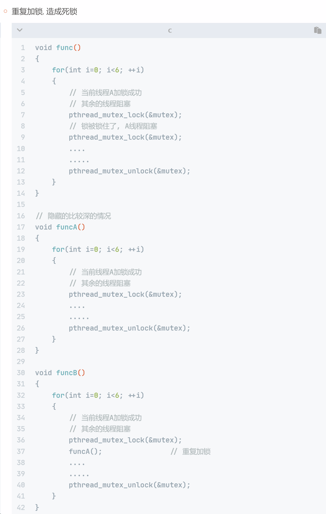
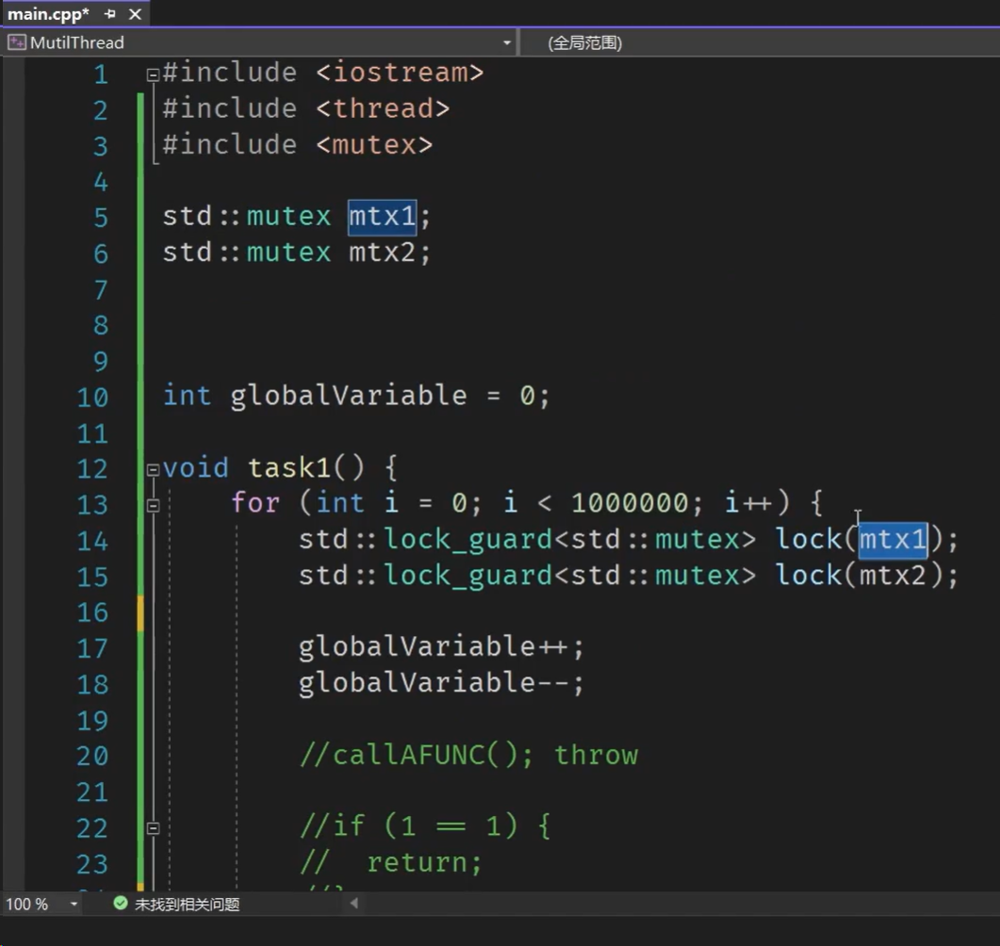

C++多线程并发


# 多线程和线程同步-C/C++

[C语言多线程](https://subingwen.cn/linux/thread/)


> **==务必==**搭配网站的教程去看！！！！
>
> 笔记里面的只是总结一些重点

## 1.多线程的特点

多线程在我们项目开发过程中使用频率是非常高的，因为使用多线程能够**提高程序的并发性**。

提高程序并发性呢其实有两种方式，一种是多线程，一种呢是多进程。**但是呢多线程对这个系统资源的消耗呢更加少一些，并且呢线程和进程他们的执行效率是差不多的。**

咱们在**执行一个应用程序的时候**，其实呢这个程序需要占用CPU资源，那么咱们这个系统的CPU呢是非常有限的，它有可能是两个，有可能是四个，有可能是八个啊，取决于咱们当前电脑的配置。那么如果说咱们电脑有八个CPU，我们电脑上执行了100个应用程序，为什么这100个应用程序都能够同时运行呢，其实这是一个假象。**CPU呢会把一个单位的时间平均分成若干份**，那么每一份就是一个**CPU的时间片**，这个时间片好像是在纳秒或者是微秒级别，反正这个时间是非常短的。**CPU时间片分好了之后呢，由系统进行调度，每个线程在执行的时候，都需要抢这个CPU的时间片**，如果抢到了，这个线程呢它就执行，如果说没有抢到这个线程呢，它就处于一个**就绪态。**

**就绪态的线程呢没有CPU的使用权，因为他没有抢到时间片**，所以说呢它又需要呢一直在这不停的去抢，抢到了之后它就可以运行了，因此呢就变成了**运行态**，时间片用完了之后呢，他就重新又恢复回了就绪态，继续和别的线程抢这个时间片，循环往复。通过这样的一个快速切换，我们看到的这个线程呢是一直在运行，其实呢这个线程也是在走走停停的，只不过呢咱们这个肉眼能够识别出来的，这个时间间隔，他这个比较长对吧，因此呢咱们看不出来。


### 1.1（扩展）windows进程与线程

> **进程是资源分配的最小单位，线程是操作系统调度执行的最小单位。**
>
> 进程就是运行中的程序，一个进程可以有多个线程
>
> 


进程有自己的独立的地址空间，线程是多个共用同一个地址空间。什么是地址空间呢，就是我们启动一个应用程序，那么就会得到这样的一个虚拟地址空间，其实就是内存四区图的一个增强版。每一个启动的进程，他都占用这样的一个地址空间，如果说我们再启动一个进程，就得到了第二个这样的一个虚拟机地址空间，如果是线程呢，这多个线程是共用同一个地址空间。


虽然啊这多个线程都住在同一个地址空间里面，在一个房子里，**但是呢不是说所有的东西都是共享的**。

每一个线程呢他们都有自己的栈区和寄存器，什么叫栈区呢（详见C++笔记），就是咱们这个内存四区图里边存储临时变量的一块区域啊，那么这个寄存器呢，它是CPU里边的资源，寄存器资源呢是由内核去来管理的，这个我们就不去额外的研究了啊。

再来看多个线程它们共享什么，他们共享这个代码段，也就是说呢这个代码区是多个线程的，他们所共同拥有，就这个`.text`段啊，这就是存储代码的一个区域。这个堆区呢就是用来存储new出来的或者说malloc出来的资源。全局数据区，就是全局变量或者静态的变量存储的一个位置，BSS段和data段啊，这些都是那个全局区域。


我们再来看第二个区别，**线程是程序最小的执行单位，进程是系统中最小的资源分配单位**。这个比较好理解，刚才说了，操作系统呢它在分配资源的时候，最小单位是什么，是一个虚拟的地址空间。那么这一个虚拟地址空间对应的是一个进程，但是呢咱们对于线程来说呢，他们是多个线程共同住在同一个地址空间里边，因此它每个线程占用的系统资源是不是更少，因为呢他们可以共用地址空间里边的某些东西啊。


### 1.2（扩展）多核CPU 与 CPU 时间片

> 在多核心 CPU 系统中，**每个核心都有其自己的时间片调度机制**，并可以独立地执行任务。**操作系统的调度器在这些核心之间分配任务，并为每个任务分配时间片**。这种机制使得多核心 CPU 能够有效地执行多任务，提高了系统的整体性能和效率。
>
> 在多核心系统中，可以实现真正的并行处理，因为多个核心可以同时执行多个任务。
>
> 
>
> “抢” CPU 时间片实际上是操作系统调度器根据预定的规则（如优先级、轮转等）在多个进程或线程之间进行切换的过程。在这个过程中，每个进程或线程获得一段时间的 CPU 使用权，然后将控制权交还给调度器，以便下一个进程或线程可以运行。这种机制确保了多任务环境中各个任务公平地共享 CPU 资源。


每个线程去抢CPU时间片的时候都是**随机的，这是一个概率问题**。这个图呢就是为了让大家看起来更加直观，更加好理解一些，所以说呢画的是一种理想状态。有可能这个线程一呢，他在前三次都抢到了CPU的时间。那么这个线程二呢，在前十次的时候一直没有抢到CPU时间片。那么这个线程三嘛，然后他在第2~5次的时候抢到了CPU的时间片，这都是有可能的。而且你每次试啊，他每次都是不一样的。

一定不能够把这个多线程运行，理解成一个有序的运行状态，它是一个**无序的运行状态**。


再来看下CPU的调度与切换，（具体见上文），因为我们这个线程退出，最终要销毁一个地址空间，就是销毁一份资源啊，如果是多个进程退出呢，那么你要销毁的是多份资源，因此所以在释放的时候，那么这个线程它释放的速度也会更快一些。


最后来看下，**在进行并发处理的时候，我们是使用多线程还是使用多进程呢**。其实还是告诉大家一般情况下我们**优先考虑多线程就行了。**

什么时候需要考虑多进程呢，就是我们有一个应用程序A，那么启动了这个程序A之后呢，需要在这个程序A里边，启动另外的一个程序B啊，就是得到另外的一个进程啊。就是这个程序A和程序B他们两个之间没有什么关系啊，那么这种情况下咱们就需要呢基于进程来完成这件事情了。

如果说呢咱们只是去执行任务，而不是去启动磁盘上的另外一个应用程序，那么我就考虑线程就可以了。


## 2. 线程的创建

我们创建出的这个线程是子线程，而不是主线程啊，因为这个主线程呢它默认是存在的，怎么来的呢，因为启动一个程序得到了一个进程吧，这个进程中呢调用了线程创建函数，得到了子线程，原来的这个进程呢，它就退化为了主线程。

因此呢从一个单进程的应用程序变成了多线程的应用程序，当咱们程序中的这个主线程退出之后，那么这个地址空间呢也就不存在了，地址空间不存在了那么这个子线程呢也就随之被销毁了，这是默认情况下，当然了，我们也可以让主线程自己推出，让子线程呢继续运行，这是后边需要调一些其他的操作函数。


## 3. 线程回收

使用`join()`来回收子线程资源

谁回收子线程资源呢，是主线程回收子线程资源，就说呢这个主线程啊它有一个义务，就是当子线程结束之后呢，回收子线程的一些资源。但是这个资源一定要注意啊，不是说所有的资源都需要由主线程来回收，**回收的是内核里边的资源**，因为呢这多个线程啊，他们共用同一个虚拟地址空间，那么对于这个用户区的所有的数据呢，子线程结束之后，它就会自动的释放，也就是说这个子线程他把这个栈区呢还回去了。

那么有主线程释放的是哪个资源呢，其实是内核区的资源啊，就是内核里边有一些资源是需要有主线程来帮助释放的，这个子线程自己干不了啊。


线程和进程一样，子线程退出的时候其内核资源主要由主线程回收，线程库中提供的线程回收函叫做`join()`，这个函数是一个阻塞函数，如果还有子线程在运行，调用该函数就会**阻塞**，子线程退出函数解除阻塞进行资源的回收，**函数被调用一次，只能回收一个子线程**，如果有多个子线程则需要循环进行回收。


## 4. 线程同步

### 4.1 线程同步概念

[Linux线程同步](https://subingwen.cn/linux/thread-sync/)

*与win的基本概念相同*

线程同步呢是在多线程编程的过程中对数据保护的一种机制，这个保护的数据呢是**共享数据**，那么共享数据又是什么呢，就是多个线程共同访问的一块资源，其实就是一块内存吧。

线程同步其实并不是说让多个线程同时去干某件事，**而是说在干某一件事的时候，让多个现场按照先后顺序依次去执行**，也就是说线程同步它并不是让线程的并行的执行，而是让这个线程**线性的执行**。什么叫做线性，咱们如果学过数据结构啊，就知道什么叫线性表，线性表呢就是首尾相接吧，也就是说呢它是按照一个**先后的顺序**来做这件事的，其实就是排队了啊。

如果做了线程同步，那么这多个线程在访问共享资源的时候呢，通过我画的这个图就能知道了，效率肯定是变低了，如果说多个线程同时访问同一块内存，那么同时访问这个刷就过去了，那肯定效率很高。如果是线性访问呢，那么就是先后顺序，但是呢这个时间的开销带来的好处呢就是**保证了数据的安全性**。那么咱们在做事的时候肯定是优先考虑最重要的那个点对吧，那么这个时间呢换来了数据的安全，这也是值得的啊。


*（教程中的两个线程同时数数例子）*


前面再给大家讲多线程操作的时候，讲到了多个线程，他们工作的时候呢是**分时复用cpu时间片**，也就是说呢这个a b线程他们需要去抢cpu的时间片，谁抢到了谁就执行，没抢到的就不执行了。那么如果说呢现在a线程他抢到了这个cpu的时间片，cpu呢就开始数数了，那么数数这个数据是从哪来的吗，这个数据其实呢是从**物理内存**里面读出来的。

这个物理内存里面的数据呢会被加载到cpu的寄存器里边，通过寄存器进行处理，cpu和物理内存之间呢还有缓存，一般情况下都是有三级缓存的，一个数据，从三级缓存、二级缓存再到一级缓存，再到cpu的寄存器啊，大概是这么一个过程。其实**为什么会有这种缓存呢**，就是为了提高速度，因为这个cpu寄存器的处理效率啊，比这个物理内存的处理速度还要快的多的多，那么有了这样一个缓存之后，它就能够**提高数据的处理效率**。


当这个cpu数数的时候，假如说呢他从一数到了二数到三数到四数到5，那么到五之后呢，cpu时间片用完了，时间片用完了之后呢，这个寄存器里面的数据呢，需要再通过这三级缓存呢，把数据写回到物理内存。

但是现在问题来了啊，因为他失去了cpu的时间片，还没有来得及把数据写回到物理内存，没来得及写回去，那么这个状态就被保存到哪了呢，保存到了cpu的寄存器里边，里面还保存着这个线程a，数数数到了五。那么我现在问啊，物理内存里边这个数现在是五吗，不是对吧，是几呢，是四。因为这个四呢已经被写回到物理内存了，这个五呢没来得及写回去，物理内存里边是四，那么这个寄存器里面的状态呢是五。因为这个a呢失去了cpu的时间片，b呢开始数数，b呢现在从物理内存里面呢加载数据，一读全局变量的值是几呢，是四。那么这个线程b啊就从四开始数，4567好，那么数到七了对吧，然后七了，同样这个七呢没来得及写回去。那么这个线程a得到cpu时间片之后，从哪开始数呢，从七开始数，现在啊通过我这个描述，是不是就有重复数数的这样一个问题了。

**为什么会重复数数呢**，就是这个**数据啊没来得及从寄存器写回到咱们的物理内存**，怎么去解决这个现象呢，其实就可以**通过线程同步的方式来解决。**

线程同步呢其实就解决了这个数据啊不能够被写回去的这个问题。如果说我们做了线程同步。他必须要保证这个数据呢从cpu同步到这个物理内存，如果同步回去了之后啊，另外一个线程才能够做后续操作，如果同步不回去，那么这个另外一个线程呢他就没有资格来接着数数。


### 4.2 同步的方式

其实同步的方式呢就是加锁，刚才也说了，同步呢是让线程按照先后顺序依次执。假设现在这个线程a呢抢到了cpu的时间片，那么在这个时间片里边呢，他就开始数数了，那么数到了这个黄色的代码中间的位置上，他失去了cpu，那么失去cpu就是时间片用完了，那么用完了之后呢，是不是他就停在这了，如果说我们不想让别的现场进来，那怎么办呢，咱们可以在这黄色的代码的上面加上一个锁。那么这个锁其实就是调用了对应的这个同步函数了啊，好那么加上锁之后呢，如果说咱们这个线程他没有出去，这把锁是锁着的，如果是锁着的，其他的线程诶一看这把锁是锁着的，这个线程呢就会被阻塞在这把锁上，那么组在这把锁上线程它被堵塞了，是不是线程就失去了cpu时间片了，那么这个线程失去cpu时间片，紧接着这个线上是不是他就抢到了cpu时间片了，抢到cpu时间片之后继续向下执行，直到数据被同步回去了。好那么这个线程呢解锁。

那么解锁完了之后，这把锁是不是打开了，打开之后呢，阻塞在这把锁上的线程呢解除阻塞，那么他得到了锁的资源，得到了这个锁资源之后呢，执行下边儿这这段黄色的代码，在黄色代码执行期间，这把锁是锁着的吧，如果还有别的线上过来，是不是就堵塞在这把锁上对吧，直到里边的这个线程呢把这个代码处理完毕出来，把这个锁呢解锁，那么阻塞在这把锁上的线程被唤醒了。唤醒之后呢，他得到这个锁的资源啊，然后呢继续向下执行，每个线程都是执行这样的操作，也就是说啊中间这个黄色区域其实就是被锁锁住的那个区域吧，那被锁锁住的区域呢，这个线程只能够独自运行，不能够和别的线程呢同时运行，那么只有他出去之后给这个锁呢解锁，其他的线程呢才能够从这个锁上的解除阻塞，继续过来，过来几个呢，**过来一个**，就是说在这个锁上如果堵塞了多个线程，他们三个是不是得抢这把锁呀，谁抢到了之后，谁进来，没抢到的呢，


## 5. 互斥锁

接下来呢给大家介绍一下我们在进行线程同步的时候的第一种方式啊，就是使用互斥锁，通过这三个字呢咱们就能明白了，首先它是一把锁，然后呢是互斥的，这个互斥体在哪呢，体现在这把锁呢只能够被一个线程使用，也就是说呢这个锁的所有权**只能够被一个线程所拥有**。

中间被框起来的这段黄色的代码呢，它就被称之为临界区，临界区的下面呢就是锁定的函数，临界区下面呢就是解锁函数，那么这个临界区是怎么找的呢。

再来给大家说一下啊，因为我们做线程同步主要是用来保护共享资源的，来看一下，首先呢咱们需要找这个共享资源，是不是就是这个全局变量number啊，这个地方标出来了，number是全局变量，找到共享资源之后呢，咱们需要看他的上下文代码，可以看到啊，这个number排和这个c o r变量进行了加法运算，因此呢咱们把cr对应的这个代码呢也把它算在内，
再往下边number是不是被操作了好，那么再往下呢，printf这个number呢也被操作了，我们把这个找到全局变量开始的上下文代码呢过一遍。如果说涉及到这个全局变量相关操作的，那么你就把它都算到临界区内部，找到临界区之后，我们呢就在上面呢加上一个锁定的函数，当这个临界区走完了，那么我们就在下面呢加上一个解锁的函数。那么在这个加锁和解锁函数之间这个代码段，只能够被这个线程独自执行，当它出了这个临界区之后，解锁了，那么其他线程才能进来。

另外呢除了这个临界区的概念，还有一个叫做临界资源，其实咱们这个共享数据呢就可以被称之为临界资源。
像这些概念啊，在看某些资料的时候有可能会遇得到，所以说呢咱们还是需要理解一下啊。临界区就是加锁和解锁函数之间这块代码啊，这块代码呢只能够被线程独自执行。另外呢，咱们是怎么找到临界区的呢，需要先找全局变量，这个全局变量就是临界资源，需要看临界资源的上下文代码，找到和这个临界资源相关的代码呢，哎把它独立出来就是一个代码块，，这样的话呢在上面加上加锁函数，下面呢加上解锁函数啊，就可以了，好那么这个线程同步呢相当于就做完了。


## 6. 死锁

死锁是怎么造成的呢，是由于我们在线程同步过程中，对这个互斥锁以及其他的线程同步锁啊，操作不当，最终呢导致了**所有的线程都被堵塞了**，那么这种现象呢就被称之为死锁。

因为所有的线程都被阻塞了，并且呢这个阻塞是解不开的，就是无解的。那么如果说所有的线程都阻塞了，那我们这个应用程序呢就没有办法继续运行了，因为所有的线程呢都被强制的处于了一个挂起态，挂起态呢就是阻塞态啊，阻塞态的线程呢必须要通过某种方式把它唤醒，唤醒了之后呢，它重新变成就绪态，变成就绪态的线程呢，它会继续的抢cpu资源啊，抢到cpu呢它就可以运行了。


### 6.1 造成死锁的场景





如果说多个共享资源要被多个线程访问，那么需要多少把锁呢，就是多少个共享资源，就需要几把锁，不要看线程的个数啊，要看这个共享资源的个数，就是这个临界资源的个数啊，如果说我们这个临界资源有两个，那么就需要两把互斥锁，每一把锁呢来保护对应的某一个资源。


### 6.2 如何避免死锁


## 7. 读写锁


### 7.1 读写锁的特点

同样是一把锁，但是呢能够给咱们提供这个锁定读的服务，也可以提供锁定写的服务啊。咱们在给别人描述的时候，绝对不能说读写锁呢是两把锁，一定要注意读写锁是一把锁，只不过呢他能够做两件事情，它分别能够做锁定读和锁定写的操作。


## 8. 条件变量

一般情况下条件变量用于**处理生产者和消费者模型**，并且和互斥锁配合使用。


条件变量呢一般情况下都会和线性同步放到一起来说，但是条件变量呢又不能够单独的进行线程的同步。因为不管是条件变量也好，还是咱们前面讲的锁也好，读写锁和互斥锁，**他们都能够阻塞线程**，但是呢阻塞完了之后再放行的过程中，这个锁呢读写锁和互斥锁，**只能给一个线程放行**吧（写数据情况下），让他们去访问临界区来操作里边的共享数据。

条件变量呢，它在放行的时候可以呢**一次给多个线程放行**，如果他给多个线程放行，那么这多个线程共同去访问临界区里边的临界资源啊，那么同时进行写操作，你想想是不是会有问题啊，如果同时读的还好一点啊。所以说呢在某些情况下，这个条件变量呢它不能够实现线程同步。也即不能够让这个线程呢按照先后顺序依次的对临界资源进行访问。

那么我们在使用条件变量进行线程同步的时候呢，还需要和前面讲过的锁呢共同使用，就是配合着用啊，那么这个锁呢一般是**使用互斥锁和条件变量呢一块搭配着用**，最终呢就能够实现进行同步了，那么为什么能够使用互斥锁进行线程同步，还需要加上一个条件变量，让这个事情变得复杂了吗，，因为它的使用场景是不一样的啊，咱们使用条件变量呢主要是用于处理这种**生产者和消费者模型**。


## ==9. 生产者和消费者模型==


来看上面这个图，假设在这个工厂里边有很多条流水线，流水线呢用来生产产品，那么每个流水线呢对应的就是线程吧，就说**生产者**啊，它是有多个线程的。生产出来这个产品之后呢，一定要放到仓库里，这个仓库呢相当于是图里边的**任务队列**。仓库里面有了数据之后，应该把这个数据给到谁呢，给到消费者，就是把产品给到消费者让他呢把这个东西消耗掉，只要这个产品被消耗了，是不是这个仓库就被腾出来了。跟咱们这个任务队列一样，任务队里边的数据被消耗了，任务队列里边的空间呢就被腾出来了。这个消费者呢，也是由很多个独立的个体组成的吧，所以说呢这个**消费者**也是由多个线程组成的。

那么现在呢那这个**生产者和消费者就可以配合着去工作了**，当这个生产者生产产品，把这个仓库放满了之后，生产者还生产吗，就不能生产了，因此呢你需要使用这个条件变量，**把所有的生产者呢都阻塞**。生产者阻塞之后呢，他们就放弃了cpu，所以说就不消耗系统资源了，那么剩下的这些资源给谁用呢，给消费者去用啊，消费者开足马力去消费，当这个仓库不满的时候呢，那么这个消费者呢就可以通知生产者呢，你继续生产，那么这个时候**生产者呢就被唤醒了**，唤醒之后呢，继续生产，往这个仓库里边呢放产品。还有一种情况，就是当这个消费者消费过程中，他把所有的产品都消费完了，仓库为空，他还能消费吗，就不能了吧，在这种情况下他就需要阻塞了，使用什么阻塞呢，使用条件变量进行阻塞。这个条件变量呢一次性把**所有的消费者全部都堵塞了**，那么生产者呢它就可以生产。当生产者把这个仓库里边又生产出来了产品之后，他就可以通知消费者去消费了吧，就是**由生产者把消费者唤醒**。另外呢当这个生产者阻塞之后，需要让这个消费者把生产者唤醒啊，**他们两个之间是这样的一种互相协作的关系，这就是生产者和消费者模型。**

至于说是谁阻塞，那么你就去看这个任务队列，或者说呢看仓库里面的产品到底是空的还是满的，如果是满的就阻塞生产者，如果是空的呢，就阻塞消费者。
	在项目开发过程中遇到了这样的场景，就可以使用全局变量来处理这个问题了。


# 线程池

[C线程池](https://subingwen.cn/linux/threadpool/)

[C++线程池](https://subingwen.cn/linux/threadpool-cpp/)

## 1. 线程池原理

线程池呢其实就是**多线程的一个拓展**，它呢对多个线程进行了管理。

如果说我们在处理并发操作的时候呢，要处理一个任务，正常的操作呢，就是遇到一个任务呢就去创建一个线程，遇到一个任务就去创建一个线程吧，那么这个线程把任务处理完毕之后呢，它就自动的结束了，结束之后这个线程呢也就被销毁了。我们就需要频繁的对线程的进行创建销毁，创建销毁，你想想这样的话效率是不是很低啊，有了这个线程池之后呢，它就能够对线程呢进行重复利用。

比如说呢我们在一开始创建了三个线程，那么这三个线程呢它就可以不停的干活，那不停干活，就说你处理完任务一之后去处理任务二，处理完任务二之后呢去处理任务三，循环的去做吧，假设这三个线程不够用了，我们还可以再去多创建几个。比如说又创建了三个，现在就六个线程了吧对吧，让这六个线程呢重复的去干活，如果说在工作过程中呢，发现这个任务的数量的骤减，空闲的线程呢又太多了，我们就可以去销毁几个线程，比如说我们在销毁三个，那么销毁三个之后，剩下的还是三个吧，那么这三个呢他们再去循环的工作啊，这是线程池它的一个好处。

那么有了线程池之后呢，关于线程的创建以及销毁呢，咱们就不需要管了，我们只需要把这个线程池呢创作出来，当用完了之后呢，把这个线程池销毁掉就行了，线程池销毁了，那么这个线程呢它也就随之销毁了。有了线程池之后呢，咱们对多线程操作呢其实就变得简单了，而且代码呢就变得更加容易维护了。

这个线程池呢是多线程编程里边，绕不过去的一个知识点，比如说我们在面试的时候啊，面试官经常会问你有没有用过线程池呢，你回答说用过，然后他会再问啊，你懂不懂线程池的原理呢，你回答懂，然后他会再会问题啊，你没有基于线程池的原理，自己手写过一个线程池，再回答写过，然后呢就通过面试了吧，由此可见呢**这个线程池的原理啊，其实比它的使用呢更加的重要**。


接下来先看，线程池它的原理，然后呢再把它实现了，用前面介绍的那个线程和线程同步的函数，把它实现出来。


如果是一个线程池呢，它主要是分为三部分，第一部分呢是任务队列，因为这个线程池啊，它主要是处理任务吧对吧，，那么你处理任务，假如说有100个任务，这个线程池里面只有三个线程，这三个线程能够马上把100个任务处理完吗，不能，那么我们既然不能够马上处理完，是不是你需要把这个任务存起来，这个任务存在哪呢，它就是存在一个任务队列里的。这个**任务队列**，，我们在实现的时候呢，它就是一块存储空间，如果是使用C++去实现呢，建议大家使用STL里边的容器去写，如果说咱们是用C语言去实现，那么我们可以使用数组，也可以使用链表。

还有一个点就是我们听到任务队列之后呢，咱们在脑海里边呢应该展现出另外的一个模型，就是生产者和消费者模型，因为只要是有任务队列的地方，他就离不开**生产者和消费者模型**。

为什么我们要有任务队列呢，就是因为它有生产者，要把生产出来的这个数据啊，或者说商品进行存储，存储起来之后干啥呢，就是让对应的某些消费者去消费吧。在我们写程序的时候呢，就是有一些生产者线程呢，是负责往这个任务队列里边放任务，然后呢有一些消费者线程呢，负责把任务呢从任务队列中取出去，并且呢把它处理掉。

在线程池里边有任务队列，也就意味着这个线程池呢，它是生产者和消费者模型里边的一部分，哪一部分呢？ **线程池**呢它主要是负责维护**一个任务队列**，然后呢再维护**若干个消费者线程**，一定要注意啊，他维护的这个线程呢都是消费者线程。那么这个**生产者**是谁呢，谁使用任务队列，谁就是生产者，那么这个生产者呢他把任务放到任务队列里边，那么怎么放呢，肯定是通过线程池提供的API接口，把这个任务呢放到任务队列。放进来之后呢，消费者线程通过一个循环，就是不停的从这个任务队列里边呢去取任务。假设说咱们这个任务队列为空了，消费者线程是不是就需要阻塞呀，怎么阻塞呢，就是使用条件变量把它阻塞掉就行了，你不能让这个消费者空轮询，如果空轮询的话，它是消耗CPU的时间片子了，就影响程序的执行效率了。如果说呢你让他去阻塞，他就放弃了CPU时间片，这个对系统的资源消耗是一点都没有的。对于生产者来说呢，假设这个任务队列已经满了，是不是你要阻塞生产者呀，当这个消费者消费了这个产品之后，任务队列就不再满了，那么任务队列不再满了之后呢，咱们就由消费者把这个生产者唤醒，让他们继续生产，是这么一个过程哈。


再来看第二部分啊，就是**工作的线程**，工作线程呢主要是负责从线程池维护的这个任务队列里边呢去取任务，取出来任务之后呢就处理掉，那么其实呢，咱们这个**线程池里边的任务**是什么呢，它并不是什么单一的数据,**而是一些处理的动作**，这个处理动作是怎么体现出来的呢？，你想想啊，你作为一个程序员，如果说你要写一个处理流程，这个处理流程是不是要基于一个函数去实现的，所以说呢咱们这个任务队列里边的任务呢，都是函数，怎么把函数存起来呢，肯定是存函数的地址吧（可调用对象包装器），唉这个啊咱们一定要搞清楚，也就是说啊，这个任务队列里边的任务都是函数的地址。工作线程在处理这个任务的时候呢，他就基于这个函数的地址对那个函数进行调用，也就是说啊，这个任务队列里边的任务都是**回调函数**吧，什么时候去回调呢，就是当线程池里边的这个消费者线程，把它取出去之后，是不是他就被调用了，如果说没有被取出来，它就不被调用了，这是任务队列里边儿这些任务啊，它调用的时机。


那么还有一个呢就是**管理者线程**，管理者线程和工作的线程啊，这是两类线程，工作线程呢他负责去任务队列里边呢取任务，相当于是消费者。这个管理者线程啊，他是不干活的，他是负责管理这个工作线程，可以理解成工头，工头一个就够了吧，如果都是工头的话，谁干活呀，所以说呢这个**管理者啊肯定是一个**。那么这个被管理的线程呢，肯定是多个的啊，这被管理的多个线程呢是可以动态的变化的。

我们在创建这个线程池的时候呢，默认肯定要创作出几个工作线程吧，比如说我们指定一个最小线程数有3个线程，那么线程池被创建出来之后呢，咱们就把这三个线程创建出来了，同时呢创建出一个管理者线程。，在这个程序运行期间呢，咱们可以让管理者呢一直不停的去监测，监测当前工作的线程的个数，，然后呢再去监测啊任务队列里边任务的个数。假设说这个任务的个数非常多，有100个任务，但是才有三个线程，我们是不是就可以适当的去添加几个线程，比如说我们又添加了十个，那么现在呢由13个线程去工作，那么这十个线程是谁创建出来的呢，**是管理者线程创建出来的**。好那么在工作了一段时间之后呢，这个任务数量呢就变成了一个，现在线程呢一共是13个吧，有一些线程他就一直阻塞着，没啥用啊，我们就可以把这些阻塞的线程呢销毁掉，怎么销毁呢，还是通过管理者线程啊，把这些阻塞的没有干活的线程呢给他销毁掉，让它退出就行了。

这个管理者线程呢，其实他的职责也是非常单一的，就是不停的去检测当前任务队列里边任务的个数，还有当前工作的线程的线程数，然后呢针对于它们的数量呢进行一个运算，那么看一看啊，现在是需要添加线程，还是要去销毁线程，主要干这个事儿。那么在干这个事的时候呢，咱们可以给它设置一个频率，就说呢你可以让他五秒钟去做一次，或者十秒钟去做一次啊，那么怎么让他五秒钟或者十秒钟去检测一次呢。你就让他sleep不就行了，那sleep睡五秒五秒钟，睡醒了之后是不是就干活，干完活之后呢再继续睡吧，所以说呢这个管理者是非常轻松的啊。

好那么这是关于这个线程池的组成，以及它的工作原理，看起来是非常简单的吧，只需要我们在实现的时候呢，把这三部分都实现出来就行了，下面呢咱们就按照这个线程池的组成，和他的工作流程呢，把这个线程池呢一点一点的写出来。


#  C++11 多线程并发

==[大丙 C++11多线程](https://subingwen.cn/cpp/thread/)==

> 搭配教程的讲义一起看！！！


我们首先要知道什么是一个线程，线程呢是操作系统能够进行CPU调度的一个最小的单位，它被包含在我们的这个进程之中呢，一个进程呢可以包含一个或者多个线程。什么是多线程并发呢，多线程并发是多个线程同时执行，一般而言呢，就是我们把一个任务呢，可以拆分为很多个子任务，然后让这些线程的同时的并行的去执行这个任务，这样呢就可以加快我们执行这个任务的速度。


当然多线程啊也分为两个，一个是伪多线程，一个是真正的多线程。什么是伪多线程啊，就比如我们在之前比较老的一些单核的CPU上，因为他们只有一个核心，所以说虽然他们上面呢也可以进行，多线程的一个编程，但是呢这多线程呢是由操作系统，通过切分时间片，也就是说让这两个线程呢轮流执行一段时间来实现的。真正的多线程呢，就我们比如我们现在CPU有很多个核心，我们可以**把每一个线程分给不同的CPU核心**，让他们分别去执行，这个是**真正的多线程**。


> 
>
> 1. **多线程并发的含义**：多线程并发指的**是在同一时间段内，有多个线程在执行**，但这些线程并不一定是在同一时刻同时执行。在单核处理器中，这意味着操作系统通过时间分片（time slicing）快速在不同线程间切换，从而创造出“同时执行”的错觉。在多核处理器中，则可以实现真正的同时执行。
>
> 2. **任务分解**：您提到的将一个大任务分解为多个小任务，然后由不同的线程并发执行，是多线程并发的常见做法。这样做可以更高效地利用资源，特别是在多核处理器上，可以在不同的核上同时处理不同的任务，从而加快整体任务的完成速度。
>
> 3. **加快任务执行速度**：确实，通过并发执行，多线程可以加快任务的执行速度。但这也取决于任务的性质。并行化对于可以被有效拆分为独立子任务的工作最为有效，比如数据处理和复杂计算。
>
> 4. **并发并非总是提速**：重要的是要注意，并发并不总是意味着更快。在某些情况下，线程管理和同步可能引入额外的开销，特别是当任务不能有效地拆分或当线程之间需要频繁的交互和通信时。
>
> 因此，您的描述大体上是正确的，但要明确并发并不总是意味着线程在同一时刻执行，特别是在单核处理器中。并且，并发的效率提升依赖于任务的性质和系统的架构。
>
> 
>
> 
>
> 在多核处理系统中，多线程并发可以更直观地理解为同时在多个核上执行不同的线程。这里的“并发”可以实现为真正的“并行”，即多个操作在物理上同时进行。让我详细解释一下：
>
> ### 多核处理系统中的多线程并发
>
> 1. **多核处理器**：多核处理器拥有多个独立的核心，每个核心能够独立处理任务。在多核处理器中，不同的线程可以被分配到不同的核上执行，从而实现真正的并行处理。
>
> 2. **任务并行化**：
>    - **任务分解**：将一个大任务分解成多个较小的子任务，这些子任务可以并行地在不同的核上运行。
>    - **独立执行**：理想情况下，这些子任务应当是相互独立的，这样它们可以并行执行而不需要频繁的相互通信。
>
> 3. **性能提升**：
>    - **并行执行**：由于每个核可以独立处理任务，多线程并发在多核处理器上可以显著提高程序的执行速度。
>    - **效率优化**：合理的任务分配和线程管理可以最大化利用处理器的每个核心，从而优化整体性能。
>
> 4. **挑战**：
>    - **线程同步**：即使在多核处理器上，线程间的同步和数据共享仍然是一个挑战。线程需要适当地同步以确保数据的一致性和防止竞态条件。
>    - **负载平衡**：确保所有核心均匀负载也是一个问题。如果任务分配不均，一些核可能空闲，而其他核过载。
>
> 5. **实际应用**：
>    - **高性能计算**：在需要大量计算的应用中（如科学计算、数据分析、图像处理等），多线程并行可以极大提高处理速度。
>    - **服务器和大型系统**：在处理大量并发请求的服务器和大型系统中，多线程并发是必不可少的。
>
> 6. **优化考虑**：
>    - **线程数量**：理想的线程数量通常与处理器核心的数量相关，但也要考虑到线程之间的交互和管理开销。
>    - **任务类型**：并行处理更适合那些可以被拆分为独立子任务的工作负载。
>
> ### 总结
>
> 在多核处理系统中，多线程并发能够实现真正的并行处理，每个核心可以独立执行不同的线程。这种方式可以显著提高程序的执行效率，尤其是对于那些可以并行化的任务。然而，要充分利用这种能力，就需要仔细考虑任务分解、线程同步和负载平衡等因素。


## 1. 创建线程 `thread`


> 
>
> 报错这个是因为，我们这个主线程的main函数在创建完我们这个子线程之后呢，后面的没有其他代码，所以主线程退出了。而我们这个子线程呢还没有执行完毕，所以说呢就出现了刚才的错误。
>
> 有两种方式 join 和 detach，注意**两者的区别**。
>
> 建议使用join


> ```c++
> #include <iostream>
> #include <thread>
> #include <mutex>
> using namespace std;
> 
> once_flag g_flag;
> void do_once(int a, string b)
> {
>     cout << "name: " << b << ", age: " << a << endl;
> }
> 
> void do_something(int age, string name)
> {
>     static int num = 1;
>     call_once(g_flag, do_once, 19, "luffy");
>     cout << "do_something() function num = " << num++ << endl;
> }
> 
> int main()
> {
>     thread t1(do_something, 20, "ace");
>     thread t2(do_something, 20, "sabo");
>     thread t3(do_something, 19, "luffy");
>     t1.join();
>     t2.join();
>     t3.join();
> 
>     return 0;
> }
> 
> ```
>
> **线程启动顺序**：虽然按照 `t1`, `t2`, `t3` 的顺序创建线程，但这并不保证线程将会按这个顺序开始执行。线程调度由操作系统控制，因此它们的实际开始执行顺序是不确定的。
>
> **线程等待**：在 `main` 函数的末尾，您调用了 `join()` 方法来等待每个线程完成。这确保了主线程（执行 `main` 函数的线程）会等待所有三个线程完成它们的执行才结束程序。


## 2. 互斥量


这里提到死锁的情况，主要是两种，参见前文 **6.死锁** 的讲解内容。


通常不直接进行使用互斥量 mutex，而是与其他搭配使用，因为他们可以自动帮我们实现加锁 解锁。


使用`lock_guard`模板类进行管理



`lock_guard`在使用上面提供的这个构造函数构造对象时，会自动锁定互斥量，而**在退出作用域后进行析构时**就会自动解锁，从而保证了互斥量的正确操作，避免忘记`unlock()`操作而导致线程死锁。`lock_guard`使用了`RAII`技术，就是**在类构造函数中分配资源，在析构函数中释放资源**，保证资源出了作用域就释放。

因为即使临界区里抛出了异常或者程序返回，这个对象也要被析构掉，在析构掉的同时，它会将他所管理的这个互斥量进行解锁，所以就避免了第一种死锁现象的发生。


第二种死锁现象，可以使用：保证上锁的顺序进行解决，比如在这两个函数中，都同时先对锁1进行上锁再对锁2进行上锁。


除此之外，也可以使用标准库中的`lock`对多个互斥量进行上锁


除了`lock_guard`，标准库还提供了`unique_lock`模板类，那么这个相对于lock guard这个有什么变化呢，一个很重要的就是lock guard这个类呢**并不灵活**。我们可以看一下他的一些成员函数，可以发现什么都没有，只有一个析构函数，而这个时候呢我们它的作用域是整个for循环，而我们如果想在中途某一时刻解锁，因为我们可能已经不需要了,要减少一个锁的力度，这个时候呢loguard这个类呢是没有办法来完成的，它只能超出它的作用域，等它自己被吸够掉的时候，才能够释放这个锁。


而unlock呢给我们提供了成员函数，unlock或者release等其他一些成员函数，能够让我们在超出这个对象作用域的之前呢，就把这个锁给可以释放掉。相比较于lock guard，它**更加灵活**。而且它还会记录当前是上锁的状态，还是解锁的状态，在析构的时候会要根据当前的状态，是否决定要解锁。


### `std::unique_lock`

> 在 C++ 中，`std::unique_lock` 是一个在 `<mutex>` 头文件中定义的类模板，用于以更灵活的方式管理互斥量（mutex）。与 `std::lock_guard` 相比，`std::unique_lock` 提供了**更多的控制权和功能**，如可以在生命周期内多次锁定和解锁互斥量，以及**与条件变量一起使用**。
>
> ### 主要特性
>
> 1. **构造和析构时的自动锁定/解锁**：当 `std::unique_lock` 对象被创建时，它可以自动锁定关联的互斥量。当该对象被销毁（如离开作用域时），它会自动解锁互斥量。
>
> 2. **可移动但不可复制**：`std::unique_lock` 支持移动语义，但不能被复制。这意味着你可以将锁的所有权从一个 `std::unique_lock` 对象转移到另一个，但不能复制锁的所有权。
>
> 3. **灵活的锁定和解锁**：与 `std::lock_guard` 不同，`std::unique_lock` 允许在其生命周期内多次显式地锁定和解锁互斥量。
>
> 4. **与条件变量兼容**：`std::unique_lock` 可以与条件变量（`std::condition_variable`）一起使用，允许在等待条件变量时解锁互斥量，并在唤醒时重新锁定。
>
> ### 基本用法
>
> ```cpp
> #include <mutex>
> #include <thread>
> 
> std::mutex mtx;
> 
> void threadFunction() {
>     std::unique_lock<std::mutex> lock(mtx); // 自动锁定
>     // 执行线程安全的操作
>     // ...
>     // 锁会在 lock 对象被销毁时自动释放
> }
> 
> int main() {
>     std::thread t(threadFunction);
>     t.join();
>     return 0;
> }
> ```
>
> 在这个例子中，当 `std::unique_lock` 对象 `lock` 被创建时，它自动锁定了互斥量 `mtx`。当函数 `threadFunction` 结束并退出作用域时，`lock` 被销毁，并自动解锁 `mtx`。
>
> ### 高级用法
>
> - **延迟锁定**：可以在创建 `std::unique_lock` 对象时延迟锁定互斥量，稍后手动调用 `lock()`。
>
>   ```cpp
>   std::unique_lock<std::mutex> lock(mtx, std::defer_lock);
>   // ...
>   lock.lock(); // 手动锁定
>   ```
>
> - **临时解锁**：可以使用 `unlock()` 临时解锁互斥量，并在需要时再次调用 `lock()`。
>
>   ```cpp
>   lock.unlock(); // 临时解锁
>   // 执行非线程安全操作
>   lock.lock(); // 重新锁定
>   ```
>
> - **与条件变量一起使用**：
>
>   ```cpp
>   std::condition_variable cv;
>   std::unique_lock<std::mutex> lock(mtx);
>   cv.wait(lock, []{ return condition; }); // 在这里，互斥量被解锁，等待条件满足
>   // 条件满足后，互斥量再次被锁定
>   ```
>
> ### 适用场景
>
> `std::unique_lock` 适用于以下场景：
>
> - 当需要更灵活的锁控制时，如需要在锁的生命周期内多次加锁和解锁。
> - 当使用**条件变量**时。
> - 当需要可移动的锁时。
>
> 总之，`std::unique_lock` 是一个功能强大的工具，提供了在管理互斥量时所需的灵活性和控制。它是多线程编程中实现精细控制线程同步的关键部件。


## 3. 原子变量

这个类型可以让我们不去使用互斥量或者锁这些东西，来实现对资源的一个原子的操作。


## 4. 条件变量 


## 5. 多线程异步


## 6. 生产者和消费者模型


