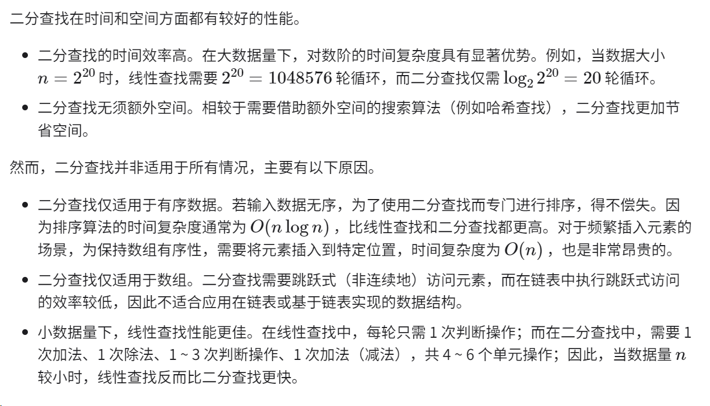
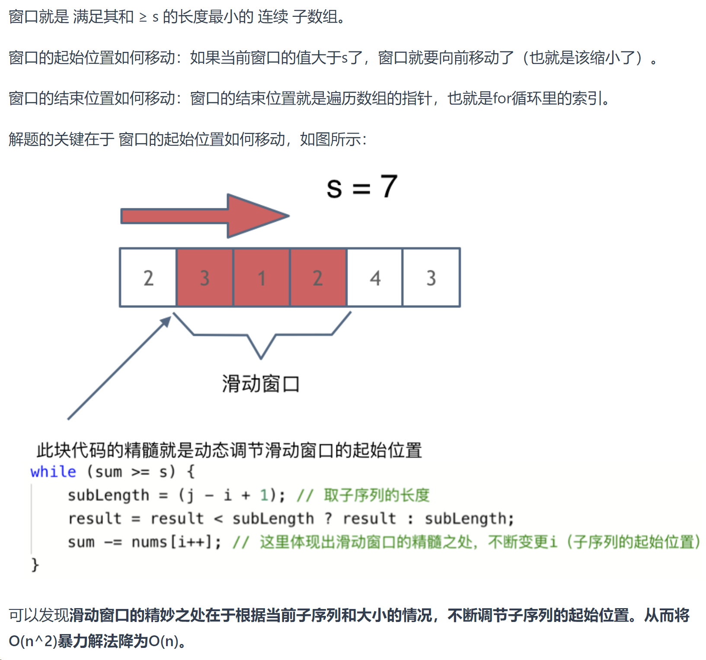
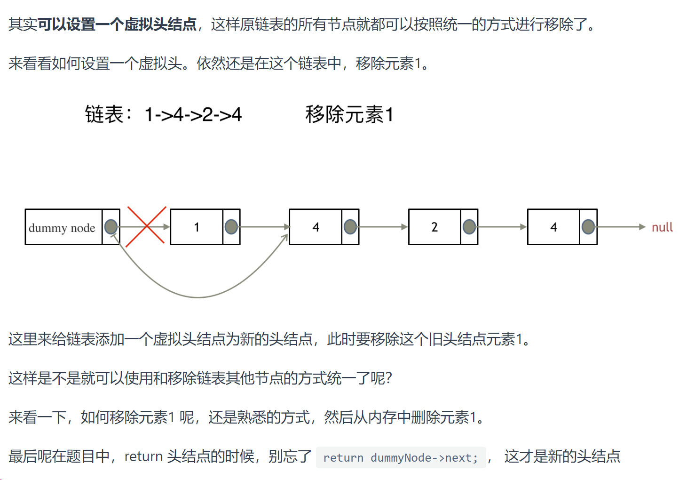

# 数据结构与算法

[Hello 算法](https://www.hello-algo.com/)


# 代码随想录刷题

[代码随想录](https://www.programmercarl.com/)

> 搭配网站教程上的代码学习，本笔记只记录重点和注释


## 0. 做题方法

> ## 重点提示
>
> - `=`是赋值 ，`==`两个等于号才是判断是否相等
>
> 
>
> 
>
> ## 在刷题的时候，使用库函数的原则。
>
> 如果题目关键的部分**直接用库函数就可以解决**，建议不要使用库函数。
>
> 如果库函数仅仅是 **解题过程中的一小部分**，并且你**已经很清楚这个库函数的内部实现原理**的话，可以考虑使用库函数。
>
> 


> ## 运算符优先级
>
> C++中的运算符优先级决定了表达式中各个运算符的计算顺序。了解这些优先级是非常重要的，因为它们影响代码的执行方式。下面我将详细解释C++中运算符的优先级。
>
> ### C++运算符优先级列表
>
> 从最高优先级到最低优先级，C++运算符的优先级顺序如下：
>
> 1. **最高优先级**:
>    - **作用域解析** (`::`)
>    - **后缀/成员访问** (`++`, `--`, `()`, `[]`, `.`)
>    - **前缀** (`++`, `--`, `+`, `-`, `!`, `~`, `*`, `&`, `(type)`, `sizeof`, `new`, `delete`)
>
> 2. **乘法与除法类运算符**:
>    - **乘法/除法/取模** (`*`, `/`, `%`)
>
> 3. **加法与减法类运算符**:
>    - **加法/减法** (`+`, `-`)
>
> 4. **位移运算符**:
>    - **位左移/位右移** (`<<`, `>>`)
>
> 5. **关系运算符**:
>    - **小于/小于等于/大于/大于等于** (`<`, `<=`, `>`, `>=`)
>
> 6. **相等性运算符**:
>    - **等于/不等于** (`==`, `!=`)
>
> 7. **位运算符**:
>    - **位与** (`&`)
>    - **位异或** (`^`)
>    - **位或** (`|`)
>
> 8. **逻辑运算符**:
>    - **逻辑与** (`&&`)
>    - **逻辑或** (`||`)
>
> 9. **条件运算符**:
>    - **条件运算符** (`? :`)
>
> 10. **赋值运算符**:
>     - **赋值** (`=`, `+=`, `-=`, `*=`, `/=`, `%=`, `<<=`, `>>=`, `&=`, `^=`, `|=`)
>
> 11. **逗号运算符**:
>     - **逗号** (`,`)
>
> 12. **最低优先级**:
>     - **throw表达式**
>
> ### 重要注意事项
>
> - **括号 (`()`) 可以改变运算的优先级**:
>   使用括号可以显式指定运算的顺序，它通常用于确保表达式以预期的方式运算。
>
> - **运算符的结合性**:
>   当具有相同优先级的运算符在表达式中相邻时，运算符的结合性决定了运算的顺序。大多数运算符是左结合的，意味着从左到右计算，但有一些例外，例如赋值运算符是右结合的。
>
> - **明确代码意图**:
>   即使熟悉运算符的优先级，也建议在可能引起混淆的情况下使用括号，以增强代码的清晰度和可读性。
>
> 理解这些优先级对于编写正确且易于理解的C++代码是非常重要的。尤其是在编写复杂表达式时，不正确的假设或误解可能导致意外的行为。

> ## 相关数学运算符
>
> 在编程中运算符可以大致分为几类：算术运算符、比较运算符、逻辑运算符、位运算符和赋值运算符。下面是这些类别中一些常见运算符的详细解释：
>
> ### 1. 算术运算符
>
> - **`+`（加法）**：加法运算符用于求两个数值的和，例如 `a + b`。
> - **`-`（减法）**：减法运算符用于计算两个数值的差，例如 `a - b`。
> - **`*`（乘法）**：乘法运算符用于计算两个数值的乘积，例如 `a * b`。
> - **`/`（除法）**：除法运算符用于计算两个数值的商，例如 `a / b`。注意，在整数除法中，结果通常向下取整。
> - **`%`（模运算）**：如前所述，模运算符用于计算两个数值相除的余数。
>
> ### 2. 比较运算符
>
> - **`==`（等于）**：检查两个值是否相等。
> - **`!=`（不等于）**：检查两个值是否不相等。
> - **`>`（大于）**：检查左侧的值是否大于右侧的值。
> - **`<`（小于）**：检查左侧的值是否小于右侧的值。
> - **`>=`（大于等于）**：检查左侧的值是否大于或等于右侧的值。
> - **`<=`（小于等于）**：检查左侧的值是否小于或等于右侧的值。
>
> ### 3. 逻辑运算符
>
> - **`&&`（逻辑与）**：当两个条件都为真时返回真。
> - **`||`（逻辑或）**：当至少一个条件为真时返回真。
> - **`!`（逻辑非）**：反转条件的布尔值。
>
> ### 4. 位运算符
>
> - **`&`（按位与）**：对两个数的二进制表示进行按位与操作。
> - **`|`（按位或）**：对两个数的二进制表示进行按位或操作。
> - **`^`（按位异或）**：对两个数的二进制表示进行按位异或操作。
> - **`~`（按位非）**：对一个数的二进制表示进行按位取反操作。
> - **`<<`（左移）**：将一个数的二进制位向左移动指定的位数。
> - **`>>`（右移）**：将一个数的二进制位向右移动指定的位数。
>
> ### 5. 赋值运算符
>
> - **`=`（赋值）**：将右侧的值赋给左侧的变量。
> - **`+=`（加后赋值）**：相当于 `a = a + b`。
> - **`-=`（减后赋值）**：相当于 `a = a - b`。
> - **`*=`（乘后赋值）**：相当于 `a = a * b`。
> - **`/=`（除后赋值）**：相当于 `a = a / b`。
> - **`%=`（模后赋值）**：相当于 `a = a % b`。
>
> 每种运算符在编程中都有特定的用途。了解并熟练使用这些运算符是成为一名有效率的程序员的重要部分。在解决LeetCode等编程问题时，根据问题的具体需求选择合适的运算符是关键。


> ## 相关方法
>
> - 坚持**循环不变量**原则


## 1. 数组

[代码随想录](https://www.programmercarl.com/%E6%95%B0%E7%BB%84%E7%90%86%E8%AE%BA%E5%9F%BA%E7%A1%80.html)

> ### 总要总结
>
> - 涉及到双向指针的相关操作，循环的条件都可以考虑写成`while(i<=j)`类型的


### 1.1 二分查找

「二分查找 binary search」是一种基于**分治策略**的高效搜索算法。它利用数据的**有序性**，每轮缩小一半搜索范围，**直至找到目标元素或搜索区间为空为止。**

> ### 题目关键词：
>
> - **有序数组**
>
> 
>
> ### 方法重点
>
> - 注意区间选择，和`while`循环的条件；
>
> 由于 “双闭区间 ”表示中的左右边界都被定义为闭区间，因此通过指针 i 和指针 j 缩小区间的操作也是对称的。这样更不容易出错，**因此一般建议采用“双闭区间”的写法**。
>
> 通常选择`闭区间 [i, j]`，此时`i = j`是有意义的，因此循环条件应写为`while (i<=j)`
>
> 
>
> 
>
> - ##### 当数组不包含 `target` 时，最终 i 和 j 会分别指向首个**大于、小于** `target` 的元素。

```c++
class Solution {
public:
    int search(vector<int>& nums, int target) {
        int i = 0;
        int j = nums.size() - 1;
        int mid = 0;
        while (i <= j){
            int mid = i + (j - i) / 2;
            if (target > nums[mid]){
                i = mid + 1;
            }
            else if (target < nums[mid]){
                j = mid - 1;
            }
            else{
                return mid;
            }
        }
        return -1;
    }
};
```

**时间复杂度 $O(log_n⁡)$** ：在二分循环中，区间每轮缩小一半，循环次数为 $log_2n$ 。

**空间复杂度 $O(1)$** ：指针 $i$ 和 $j$ 使用常数大小空间。


#### 1.1.1 二分法扩展

[hello 算法](https://www.hello-algo.com/chapter_searching/binary_search/)

##### 1.1.1.1 二分查找插入点

二分查找不仅可用于搜索目标元素，还可用于解决许多变种问题，比如**搜索目标元素的插入位置**。


又分成 不存在重复元素，与存在重复元素的情况


#### 1.1.2 二分法的 ==优点与局限性== 




### 1.2 移除元素

> ### 双指针（快慢指针）
>
> 
>
> 双指针法（快慢指针法）： **通过一个快指针和慢指针在一个for循环下完成两个for循环的工作。**
>
> 定义快慢指针
>
> - 快指针：寻找新数组的元素，新数组就是不含有目标元素的数组
> - 慢指针：指向更新新数组下标的位置
>
> 
>
> **双指针法（快慢指针法）在数组和链表的操作中是非常常见的，很多考察数组、链表、字符串等操作的面试题，都使用双指针法。**
>
> 
>
> 
>
> ### 相向双指针法
>
> 基于元素顺序可以改变的题目描述改变了元素相对位置，确保了移动最少元素
>
> 
>
> 找左边等于val的元素
>
> 找右边不等于val的元素
>
> 将右边不等于val的元素，覆盖左边等于val的元素
>
> 最后left**一定指向了最终数组末尾的下一个元素**


### 1.3 有序数组的平方

> 暴力排序
>
> 
>
> ### 双指针法


### 1.4 长度最小的子数组

#### ==滑动窗口==

> ## *滑动窗口*
>
> 也是双指针的一种，是数组中的另外一种重要的操作方法
>
> 在暴力解法中，是一个for循环滑动窗口的起始位置，一个for循环为滑动窗口的终止位置，用两个for循环 完成了一个不断搜索区间的过程。
>
> 那么**滑动窗口如何用一个for循环来完成这个操作呢**。
>
> 
>
> 实现滑动窗口，主要确定如下三点：
>
> - 窗口内是什么？
> - 如何移动窗口的起始位置？
> - 如何移动窗口的结束位置？
>
> 
>
> 
>
> 
>
> 要理解好滑动的概念，本题当滑动的时候，会发生：
>
> 1. i 向右移动 i++
> 2. 窗口内的总数减去原先的 i ，sum -= nums[i]
>
> 
>
> 
>
> ```c++
> class Solution {
> public:
>  int minSubArrayLen(int s, vector<int>& nums) {
>      int result = INT32_MAX;
>      int sum = 0; // 滑动窗口数值之和
>      int i = 0; // 滑动窗口起始位置
>      int subLength = 0; // 滑动窗口的长度
>      
>      for (int j = 0; j < nums.size(); j++) {  //注意这里 j = 0 更明确
>          sum += nums[j];
>          // 注意这里使用while，每次更新 i（起始位置），并不断比较子序列是否符合条件
>          while (sum >= s) {
>              subLength = (j - i + 1); // 取子序列的长度
>              result = result < subLength ? result : subLength;
>              sum -= nums[i++]; // 这里体现出滑动窗口的精髓之处，不断变更i（子序列的起始位置）
>          }
>      }
>      // 如果result没有被赋值的话，就返回0，说明没有符合条件的子序列
>      return result == INT32_MAX ? 0 : result;
>  }
> };
> //时间复杂度：O(n)
> //空间复杂度：O(1)
> ```
>
> 不要以为for里放一个while就以为是O(n^2)啊， 主要是看每一个元素被操作的次数，每个元素在滑动窗后进来操作一次，出去操作一次，每个元素都是被操作两次，所以时间复杂度是 2 × n 也就是O(n)


**`int result = INT32_MAX;`**

> 在您的代码中，`result` 是一个整数变量，其初始值被设置为 `INT32_MAX`。这里的 `INT32_MAX` 是一个在 C++ 标准库中定义的常量，代表 32 位整型能够表示的最大值，通常是 `2^31 - 1`，或 `2147483647`。
>
> ### 使用 `INT32_MAX` 的目的
>
> 在这段特定的代码中（寻找满足特定和条件的最小子数组长度），将 `result` 初始化为 `INT32_MAX` 有特定的目的：
>
> 1. **最大值作为初始值**：由于您的目标是找到满足条件的“最小长度”，初始时将 `result` 设置为可能的最大值可以确保任何有效的子数组长度都会小于这个初始值。
>
> 2. **更新逻辑**：在遍历数组的过程中，**每当找到一个满足条件的子数组**，您会比较其长度与当前 `result` 的值，并更新 `result` 为两者中的较小值。这样，`result` 会**逐渐减小**，直至找到实际满足条件的最小子数组长度。
>
> 3. **边界检查**：遍历结束后，如果 `result` 的值仍然是 `INT32_MAX`，这意味着没有找到任何满足条件的子数组。因此，您可以根据 `result` 是否仍为 `INT32_MAX` 来判断是否存在满足条件的子数组。
>
> ### 示例中的逻辑
>
> 在您的代码中，`result` 用于存储满足“数组的连续部分的和大于等于 `s`”这一条件的最小子数组长度。通过初始化为 `INT32_MAX` 并在找到更小的满足条件的子数组时更新它，您可以确保最终 `result` 中存储的是所有满足条件的子数组中长度最小的那一个，或者如果没有找到满足条件的子数组，则 `result` 保持为 `INT32_MAX`。


#### 时间复杂度

> 要分析这段代码的时间复杂度，我们需要考虑两个嵌套的循环：外层的 `for` 循环和内层的 `while` 循环。
>
> ### 外层 `for` 循环
>
> - 外层 `for` 循环遍历整个数组一次，因此它的时间复杂度是 O(N)，其中 N 是数组 `nums` 的长度。
>
> ### 内层 `while` 循环
>
> - 内层 `while` 循环在 `sum` 大于等于 `target` 时执行，并在每次迭代中减少 `sum` 的值并移动起始位置 `i`。
> - 关键点在于，尽管 `while` 循环嵌套在 `for` 循环内部，但任何特定的元素 `nums[i]` 最多只被访问两次：一次是在外层循环中将其加到 `sum` 中，另一次是在内层循环中从 `sum` 中减去。因此，这不是一个典型的嵌套循环，其中内层循环的迭代次数取决于外层循环的迭代变量。
>
> ### 总体时间复杂度
>
> - 由于每个元素最多被访问两次（一次加，一次减），总体时间复杂度仍然是 O(N)。
>
> ### 结论
>
> 所以，这个滑动窗口算法的总体时间复杂度是 O(N)。这是因为虽然有两层循环，但内层循环对每个元素的访问次数有限，因此总体上每个元素只被线性地处理。这使得滑动窗口算法非常高效，尤其是在处理这种连续子数组问题时，相比于传统的嵌套循环（O(N^2) 时间复杂度）来说，它的性能要好得多。


### 1.5 螺旋数组II


> - ### 注意区分好行和列，
>
> ```c++
> result[i][j] = count++;
> ```
>
> 这里的`i` 是行`j`是列，
>
> 对应到矩阵上，横着往右走的数字是列，是`j`； 竖着往下走的数字是行，是`i`。
>
> 
>
> - ### 注意 i 和 j 的更替
>
> ```c++
> i = startx;
> j = starty;
> ```
>
> 在while循环的开始，将 i 和 j 进行重新赋值是非常必要的，这样才能保证在第二轮填充的时候，j 的值是更新后的。因此实际上，在以下的这种写法里面，只需 j = starty;就够了。


## 2. 链表

[代码随想录](https://www.programmercarl.com/%E9%93%BE%E8%A1%A8%E7%90%86%E8%AE%BA%E5%9F%BA%E7%A1%80.html#%E9%93%BE%E8%A1%A8%E7%9A%84%E7%B1%BB%E5%9E%8B)


> ## 重要总结
>
> - 链表删除元素的时候，要是当前的cur指针，指向要删除节点的前一个节点；

### 2.1 移除链表元素


> ### 注意链表的初始化
>
> ```c++
>  ListNode* dummyHead = new ListNode(0); // 设置一个虚拟头结点
> dummyHead->next = head; // 将虚拟头结点指向head，这样方便后面做删除操作
> ```
>
> 注意要使用 `new` 进行初始化，然后赋值 next 的成员。
>
> 
>
> ### 虚拟头节点
>
> 在单链表中移除**头结点** 和 移除其他节点的操作方式是不一样，其实在写代码的时候也会发现，需要单独写一段逻辑来处理移除头结点的情况。
>
> 
>
> 
>
> ### 删除节点
>
> 删除结点的时候，我们需要让cur 指向**删除的节点的前一个位置**.


```c++
class Solution {
public:
    ListNode* removeElements(ListNode* head, int val) {
        ListNode* dummyHead = new ListNode(0);
        dummyHead->next = head;
        ListNode* cur = dummyHead;
        while (cur->next != nullptr){
            if (cur->next->val == val){
                ListNode* temp = cur->next;
                cur->next = cur->next->next;
                delete temp;
                temp = nullptr;
            }
            else {  // 注意这里的else的写法，当前不是要删除的链表的元素，所以往后继续遍历；如果已经删除了一个元素，不需要移动cur
                cur = cur->next;
            }
        }
        head = dummyHead->next;
        delete dummyHead;
        dummyHead = nullptr;
        return head;
    }
};
```

注意这里的循环条件 `while (cur->next != nullptr){}`，这里是遍历链表时候的循环条件，并且重点关注对 cur 的赋值，以及循环中对 cur 的递增操作，跟数组不同。


### 2.2 设计链表


> ### 获取第n个节点的值，第n个节点前插入节点，删除第n个节点
>
> ### ==链表的遍历==
>
> 以上情况下使用如下的**遍历代码**，虚拟头节点，while循环，第n个节点为cur->next，然后我们操作的是cur来进行操作。
>
> 注意其中index的值，对链表的给定index位置的增删，使用如下的循环操作
>
> ```c++
> listNode* cur = m_dummyHead;
> while (index--) {
> 	cur = cur->next;
> }
> ```
>
> 
>
> - 如果不输入index，要求遍历链表，使用如下循环
>
> ```c++
> LinkedNode* cur = _dummyHead;
> while(cur->next != nullptr){
> 	cur = cur->next;
> }
> ```
>
> 
>
> ### 链表插入元素
>
> 先进行右侧的操作，再进行左侧的操作


```c++
class MyLinkedList {
public:
    // 定义链表节点结构体
    struct LinkedNode {
        int val;
        LinkedNode* next;
        LinkedNode(int val):val(val), next(nullptr){}
    };

    // 初始化链表
    MyLinkedList() {
        _dummyHead = new LinkedNode(0); // 这里定义的头结点 是一个虚拟头结点，而不是真正的链表头结点
        _size = 0;
    }

    // 获取到第index个节点数值，如果index是非法数值直接返回-1， 注意index是从0开始的，第0个节点就是头结点
    int get(int index) {
        if (index > (_size - 1) || index < 0) {
            return -1;
        }
        LinkedNode* cur = _dummyHead->next;
        while(index--){ // 如果--index 就会陷入死循环
            cur = cur->next;
        }
        return cur->val;
    }

    // 在链表最前面插入一个节点，插入完成后，新插入的节点为链表的新的头结点
    void addAtHead(int val) {
        LinkedNode* newNode = new LinkedNode(val);
        newNode->next = _dummyHead->next;
        _dummyHead->next = newNode;
        _size++;
    }

    // 在链表最后面添加一个节点
    void addAtTail(int val) {
        LinkedNode* newNode = new LinkedNode(val);
        LinkedNode* cur = _dummyHead;
        while(cur->next != nullptr){
            cur = cur->next;
        }
        cur->next = newNode;
        _size++;
    }

    // 在第index个节点之前插入一个新节点，例如index为0，那么新插入的节点为链表的新头节点。
    // 如果index 等于链表的长度，则说明是新插入的节点为链表的尾结点
    // 如果index大于链表的长度，则返回空
    // 如果index小于0，则在头部插入节点
    void addAtIndex(int index, int val) {

        if(index > _size) return;
        if(index < 0) index = 0;        
        LinkedNode* newNode = new LinkedNode(val);
        LinkedNode* cur = _dummyHead;
        while(index--) {
            cur = cur->next;
        }
        newNode->next = cur->next;
        cur->next = newNode;
        _size++;
    }

    // 删除第index个节点，如果index 大于等于链表的长度，直接return，注意index是从0开始的
    void deleteAtIndex(int index) {
        if (index >= _size || index < 0) {
            return;
        }
        LinkedNode* cur = _dummyHead;
        while(index--) {
            cur = cur ->next;
        }
        LinkedNode* tmp = cur->next;
        cur->next = cur->next->next;
        delete tmp;
        //delete命令指示释放了tmp指针原本所指的那部分内存，
        //被delete后的指针tmp的值（地址）并非就是NULL，而是随机值。也就是被delete后，
        //如果不再加上一句tmp=nullptr,tmp会成为乱指的野指针
        //如果之后的程序不小心使用了tmp，会指向难以预想的内存空间
        tmp=nullptr;
        _size--;
    }

    // 打印链表
    void printLinkedList() {
        LinkedNode* cur = _dummyHead;
        while (cur->next != nullptr) {
            cout << cur->next->val << " ";
            cur = cur->next;
        }
        cout << endl;
    }
private:
    int _size;
    LinkedNode* _dummyHead;

};
```


> 执行 `delete temp;` 后将 `temp` **指向的内存释放掉确实是避免了内存泄漏**。
>
> 然后将 `temp` 设置为 `nullptr` 是一种编程习惯，它有几个好处：
>
> 1. **安全性**: 当 `delete` 之后，`temp` 会成为一个**悬挂指针（dangling pointer）**，**它仍然指向先前的内存地址。虽然这块内存已经被释放，但如果不小心再次使用这个指针（比如尝试访问或删除它所指向的内存）**，程序可能会崩溃或产生不可预测的行为。将 `temp` 设置为 `nullptr` 可以防止这种情况，因为对空指针（nullptr）的任何解引用操作都会被明确定义为无效，且通常会触发明显的运行时错误。
>
> 2. **调试方便**: 如果在调试时遇到了空指针，很容易判断这是一个已经被删除的对象。相比之下，悬挂指针的问题可能更难追踪。
>
> 3. **代码清晰**: 设置为 `nullptr` 表明这个指针不再指向任何有效的对象，这可以增加代码的可读性和清晰度。
>
> 4. **减少错误**: 在大型或复杂的代码库中，一个指针可能在多个地方被使用。将其设为 `nullptr` 可以减少因重复释放或错误使用未初始化的指针而造成的错误。
>
> 综上所述，虽然设置为 `nullptr` 在某些情况下可能看起来是多余的，但它是一种良好的编程习惯，有助于提高代码的安全性和稳定性。
>
> 
>
> 然而，也有一些情况下将删除的指针设置为 `nullptr` 可能不是必要的：
>
> - **如果指针的作用域即将结束**，那么重新赋值为 `nullptr` 可能没有太大意义，**因为该指针本身很快就会消失**。
> - 如果性能是一个关键因素，并且确定不会再次错误地访问该指针，则可以避免这一额外操作。
>
> 在您的例子中，`temp` 和 `dummyHead` 在 `delete` 后很快就会离开其作用域，因此将它们设置为 `nullptr` 更多的是出于编程风格的考虑，而不是绝对必要的。但这是一种良好的习惯，有助于编写更安全、更清晰的代码。


### 2.3 反转链表

> ### 双指针法，
>
> ```c++
> class Solution {
> public:
>     ListNode* reverseList(ListNode* head) {
>         ListNode* pre = nullptr;  // 注意这里不能写成 = new listnode（），因为这儿指的是结尾的空指针，并不是一个节点，
>         ListNode* cur = head;
>         while (cur != nullptr){
>             ListNode* temp = cur->next;
>             cur->next = pre;  // 反转的操作
>             pre = cur;
>             cur = temp;
>         }
>         return pre;
> 
>     }
> };
> ```
>
> 在实现链表反转的 `reverseList` 函数中，`ListNode* pre = nullptr` 表示初始化 `pre` 指针为 `nullptr`。这是因为反转链表时，新的头节点的 `next` 应该指向 `nullptr`，表示链表的结尾。
>
> 让我们看看两种情况：
>
> 1. **`ListNode* pre = nullptr;`**:
>    - 这是反转链表操作中的标准做法。开始时，`pre` 作为反转链表的新头部，它应该指向 `nullptr`，因为一开始，反转的链表是空的。
>    - 在反转过程中，`pre` 会逐步向后移动，最终指向原链表的最后一个节点，这个节点变成新链表的头部。
>
> 2. **`ListNode* pre = new ListNode();`**:
>    - 如果使用 `new ListNode()`，则 `pre` 会指向一个新的、空的节点，而不是 `nullptr`。
>    - 这会导致问题，因为在反转链表的过程中，原本应该是新链表的尾部（即原链表的头部）会指向这个新创建的空节点，而不是正确地指向 `nullptr`。
>    - 最终，这会在反转的链表末尾添加一个**不必要的、值为 0 的额外节点**，这显然不是我们想要的结果。
>
> 因此，在实现链表反转时，使用 `ListNode* pre = nullptr;` 是正确的选择，因为它确保了链表的尾部正确地指向 `nullptr`，避免了不必要的额外节点的创建**。这也是链表操作中处理指针的一个常见模式，即始终确保链表的尾部正确地终止。**


> ### 递归法
>
> ```c++
> class Solution {
> public:
>     ListNode* reverse(ListNode* cur, ListNode* pre){
>         if (cur == nullptr){
>             return pre;
>         }
>         ListNode* temp = cur->next;
>         cur->next = pre; //反转
> 
>         return reverse(temp, cur);
>     }
> 
>     ListNode* reverseList(ListNode* head) {
>         ListNode* cur = head;
>         ListNode* pre = nullptr;
>         
>         return reverse(cur, pre);
>     }
> };
> ```
>
> 注意**递归**的写法，两个函数的`return`


### 2.4 两两交换链表中的节点


> ### 遍历的终止条件
>
> 
>
> ### 交换节点的操作
>
> 
>
> ```c++
> class Solution {
> public:
>     ListNode* swapPairs(ListNode* head) {
>         ListNode* dummyHead = new ListNode();
>         dummyHead->next = head;
>         ListNode* cur = dummyHead;
>         while (cur->next != nullptr && cur->next->next != nullptr){ // 这里cur->next->next != nullptr要写在后面，避免当偶数情况下cur->next 为空，此时再cur->next->next会报空指针异常
>             ListNode* temp = cur->next;
>             ListNode* temp_1 = cur->next->next->next;
>             cur->next = cur->next->next;
>             cur->next->next = temp;
>             cur->next->next->next = temp_1;
>             cur = cur->next->next;
>         }
>         return dummyHead->next;
>     }
> };
> ```
>
> 


### 2.5 删除链表的倒数第N个节点


> ### 如何找到倒数第N个节点
>
> 
>
> 同时注意删除结点的时候，我们需要让cur 指向删除的节点的前一个位置
>
> ### 双指针法
>
> 双指针的经典应用，如果要删除倒数第n个节点，让fast移动n步，然后让fast和slow同时移动，直到fast指向链表末尾。删掉slow所指向的节点就可以了。


```c++
class Solution {
public:
    ListNode* removeNthFromEnd(ListNode* head, int n) {
        ListNode* dummyHead = new ListNode(0);
        dummyHead->next = head;
        ListNode* i = dummyHead;// slow
        ListNode* j = dummyHead;// fast
        n++;
        while (n--){
            j = j->next;
        }
        while (j != nullptr ){
            i = i->next;
            j = j->next;
        }
        ListNode* temp = i->next;
        i->next = i->next->next;
        delete temp;
        return dummyHead->next;
    }
    
};
```


### 2.6 链表相交

> ### 双指针
>
> 

```c++
class Solution {
public:
    ListNode *getIntersectionNode(ListNode *headA, ListNode *headB) {
        if (headA == nullptr || headB == nullptr) {
            return nullptr;
        }
        ListNode* curA = headA;
        ListNode* curB = headB;
        
        while (curA != curB){
            curA = curA == nullptr ? headB : curA->next;
            curB = curB == nullptr ? headA : curB->next;
        }
        return curA;
    }
};
```


### 2.7 环形链表II


> ### 快慢指针


```c++
class Solution {
public:
    ListNode *detectCycle(ListNode *head) {
        
        ListNode* slow = head;
        ListNode* fast = head;
        while (fast != nullptr && fast->next != nullptr){ //注意这里在fast需要移动两步的时候，要判断是否为空，以及它的next是否为空
            fast = fast->next->next;
            slow = slow->next;
            if (slow == fast){
                ListNode* index = head;
                ListNode* index_1 = fast;
                while (index != index_1){
                    index = index->next;
                    index_1 = index_1->next;
                }
                return index;
            }
        }

        return nullptr;
    }
};

```


## 3. 哈希表

> 如果在做面试题目的时候遇到**需要判断一个元素是否出现过的场景**也应该第一时间想到哈希法！
>
> **当我们遇到了要快速判断一个元素是否出现集合里的时候，就要考虑哈希法了。**
>
> 哈希表他最擅长于解决，就是**给你一个元素判断在这个集合里是否出现过**。你只要遇到过这种类似的场景，大家第一个条件反射，就是那这道题我可能要用到哈希表。那具体用哪个哈希表，是用数组还是用set还是用map，然后我们再去具体分析。
>
> 
>
> 当我们想使用哈希法来解决问题的时候，我们一般会选择**如下三种数据结构**。
>
> - 数组
> - set （集合）
> - map  (映射)
>
> 
>
> 至于什么时候用数组，什么时候用set，什么时候用map。在我们的这个哈希值比较小的情况下，而且范围也比较小，范围可控情况下，我们用数组就可以了。如果这个**数值很大**的话，我们就用set啊，然后呢如果我们这个key对应的value的话啊，我们就用map，这是一个大体性的判断。
>
> 还有一种情况是，数值不是很大，但是数值很分散的话，也适用set.**如果哈希值比较少、特别分散、跨度非常大，使用数组就造成空间的极大浪费。**


> ## 使用范围for循环，来遍历哈希表
>
> ```c++
> for (auto i : s){
> 	record[i - 'a']++;
> }
> ```
>
> 


### 3.1 有效的字母异位词

> 


```c++
class Solution {
public:
    bool isAnagram(string s, string t) {
        int record[26] {0};
        for (int i = 0; i < s.size(); i++){
             // 并不需要记住字符a的ASCII，只要求出一个相对数值就可以了
            record[s[i] - 'a']++;
        }
        for (int j = 0; j < t.size(); j++){
            record[t[j] - 'a']--;
        }

        for (auto k : record){ // 这里遍历数组 只需要写数组名
            if (k != 0){
                // record数组如果有的元素不为零0，说明字符串s和t 一定是谁多了字符或者谁少了字符。
                return false;
            }
        }


         return true;
    }
};
```

```c++
class Solution {
public:
    bool isAnagram(string s, string t) {
        int record[26] {0};
        for (auto i : s){
            record[i - 'a']++;
        }

        for (auto j : t){
            record[j - 'a']--;
        }

        for (auto k : record){
            if (k != 0){
                return false;
            }
        }


         return true;
    }
};
```

- 时间复杂度: O(n)
- 空间复杂度: O(1)


### 3.2 两个数组的交集


> 使用 set 来实现哈希表的话，需要注意 set 的相关使用函数 

```c++
class Solution {
public:
    vector<int> intersection(vector<int>& nums1, vector<int>& nums2) {
        unordered_set<int> result;
        unordered_set<int> nums_set (nums1.begin(), nums1.end());
        for (auto num : nums2){
            if (nums_set.find(num) != nums_set.end()){
                result.insert(num);
            }
        }
        return vector<int>(result.begin(), result.end());

    }
};

```

```c++
class Solution {
public:
    vector<int> intersection(vector<int>& nums1, vector<int>& nums2) {
        unordered_set<int> result;
        unordered_set<int> nums;
        for (const auto& i : nums1) {   // 这里没必要写成这样，因为只是插入操作，因此，直接按上面的写法就行
            nums.insert(i);
        }
        for (const auto& j : nums2) {
            if (nums.find(j) != nums.end()) {
                result.insert(j);
            }
        }
        return vector<int>(result.begin(), result.end());
    }
};
```


> 在 `unordered_set<int> nums_set` 的情况下，这个哈希表的工作机制也是类似的。`unordered_set` 是基于哈希表实现的，但它只存储唯一的键，没有单独的值。在 `unordered_set` 中，**键（key）本身就是值（value）**。在 `unordered_set` 中，每个元素既是键（key）也是值（value）。这与 `unordered_map` 不同，后者存储的是键值对。
>
> 
>
> 这里解释一下这个概念：
>
> 1. **键（Key）**：在 `unordered_set` 中，每个存储的整数都是一个键。这意味着每个整数在集合中是唯一的，并且 `unordered_set` 使用哈希函数来决定每个键在内部数据结构中的存储位置。
>
> 2. **值（Value）**：在 `unordered_set` 的情况下，存储的整数同时也是值。`unordered_set` 不是键值对的集合（这是 `unordered_map` 的工作方式），而是单一值的集合，其中每个值也充当了键的角色。
>
> 简单来说，在 `unordered_set<int> nums_set` 中：
>
> - 每个整数既是一个键，也是该键的对应值。
> - 由于 `unordered_set` 的唯一性特点，同一个数字不会在集合中重复出现。
> - 你可以认为 `unordered_set` 是一个只有键的哈希表，其中键即是我们关心的数据。


> 在这段代码中，`int hash[1005] = {0};` 实际上是使用一个整型数组来实现一个简单的哈希表。这里**的数组索引代表键（key），而数组中的值代表值（value）**。具体来说：
>
> 1. **键（Key）**：数组的索引。在这种情况下，假设 `nums1` 和 `nums2` 中的元素都在 [0, 1004] 范围内，每个索引位置（0到1004）代表一个可能的元素值。
>
> 2. **值（Value）**：数组在每个索引位置上的值。在这个例子中，值是用来标记某个元素是否出现在 `nums1` 数组中。初始化为0（表示没有出现），如果某个数出现在 `nums1` 中，相应的索引位置就被设置为1。
>
> 在这个代码片段中的逻辑是：
>
> - 遍历 `nums1` 数组，对于 `nums1` 中的每个元素 `num`，将 `hash[num]` 设置为1，表示 `num` 在 `nums1` 中出现过。
> - 然后遍历 `nums2` 数组，对于 `nums2` 中的每个元素 `num`，检查 `hash[num]` 是否为1。如果是，这意味着 `num` 同时出现在 `nums1` 和 `nums2` 中，因此将其添加到结果集 `result_set` 中。
>
> 这种方法的优势在于：
>
> - 它提供了一种简单而高效的方式来检查元素是否存在于另一个数组中。
> - 数组索引作为键，直接对应于元素值，这使得查找和更新操作非常快速。
>
> 不过，这种方法也有限制，它假设了元素值的范围是已知的且相对较小，因此可以通过数组索引直接访问。如果元素值的范围很大或者不是整数，这种方法就不太适用了。


```c++
class Solution {
public:
    vector<int> intersection(vector<int>& nums1, vector<int>& nums2) {
        unordered_set<int> result;
        int hash[1024] {0};
        for (int i = 0; i < nums1.size(); i++){
            hash[nums1[i]]++;
        }
        // 上面的代码也可写成 范围 for循环
        for (auto num : nums1){
            hash[num]++;
        }
        for (int j = 0; j < nums2.size(); j++){
            if (hash[nums2[j]] != 0){
                result.insert(nums2[j]);
            }
        }
        return vector<int>(result.begin(), result.end());
    }
};
```


### 3.3 快乐数

> 


```c++
class Solution {
public:
    // 取数值各个位上的单数之和
    int getSum (int n) {
        int sum = 0;
        while (n) {
            sum += (n % 10) * (n % 10);
            n /= 10;
        }
        return sum;
    }

    bool isHappy(int n) {
        unordered_set<int> result;
        while (1) {
            int sum = getSum(n);
            if (sum == 1) {
                return true;
            }
            // 如果这个sum曾经出现过，说明已经陷入了无限循环了，立刻return false
            if (result.find(sum) != result.end()) {
                return false;
            }
            else {
                result.insert(sum);
            }
            n = sum;
            
        }
    }
};
```


### 3.4 两数之和

> 


```c++
class Solution {
public:
    vector<int> twoSum(vector<int>& nums, int target) {
        unordered_map<int, int> result;
        for (int i = 0; i < nums.size(); i++){
            int j = target - nums[i];
            // 遍历当前元素，并在map中寻找是否有匹配的key
            auto iter = result.find(j);
            if (iter != result.end()) {
                return {i, iter->second};
            }
             // 如果没找到匹配对，就把访问过的元素和下标加入到map中
            result.insert(pair<int, int>(nums[i], i));
        }   
        return {};
    }
};
```


### 3.5 四数相加II

```c++
class Solution {
public:
    int fourSumCount(vector<int>& A, vector<int>& B, vector<int>& C, vector<int>& D) {
        unordered_map<int, int> umap; //key:a+b的数值，value:a+b数值出现的次数
        // 遍历大A和大B数组，统计两个数组元素之和，和出现的次数，放到map中
        for (int a : A) {
            for (int b : B) {
                umap[a + b]++; // C++ 的map支持这种写法的，如果没有这个元素，会自动insert进去
            }
        }
        int count = 0; // 统计a+b+c+d = 0 出现的次数
        // 在遍历大C和大D数组，找到如果 0-(c+d) 在map中出现过的话，就把map中key对应的value也就是出现次数统计出来。
        for (int c : C) {
            for (int d : D) {
                if (umap.find(0 - (c + d)) != umap.end()) {
                    count += umap[0 - (c + d)];
                }
            }
        }
        return count;
    }
};

```


> ### `umap[a + b]++;`
>
> 
>
> C++ 的map支持这种写法的，如果没有这个元素，会自动insert进去
>
> 每次计算出一个新的和 `a + b` 时，这行代码的作用如下：
>
> 1. **查找和 `a + b`**: 查找 `unordered_map` 中键为 `a + b` 的条目。如果这个和之前没有出现过，`unordered_map` 会自动创建这个键，并将对应的值初始化为 0。
> 2. **自增操作**：`umap[a + b]++` 会将键 `a + b` 对应的值增加 1。这意味着每当发现 `A` 和 `B` 中的一对元素的和时，就记录下这个和出现的次数。


### 3.6 赎金信

> 

```c++
class Solution {
public:
    bool canConstruct(string ransomNote, string magazine) {
        int hash[26] {0};
        for (auto i : magazine) {
            hash[i - 'a']++;
        }
        for (auto j : ransomNote) {
            hash[j - 'a']--;
        }
        for (int k = 0; k < 26; k++) {
            if (hash[k] < 0) {
                return false;
            }
        }
        return true;

    }
};
```


### 3.7 三数之和

> 哈希法在寻找元素的时候本身是没有什么顺序的，因此在去重的时候会比较麻烦
>
> ### 哈希法的分析
>
> 1. **无序性**: 哈希表是一种基于键值对的数据结构，它不保持元素的任何顺序。这意味着在哈希表中查找元素非常快，但在处理需要元素顺序的问题时，比如去除重复的三元组，这种无序性就成了一个挑战。
> 2. **去重难度**: 在使用哈希表时，确保不生成重复的三元组可能会变得复杂。由于三元组的元素可以以任意顺序出现，因此即使在哈希表中存储了已经发现的三元组，也很难高效地检查新发现的三元组是否与已有的三元组相同。


## 4. 字符串

### 4.1 反转字符串

> 

```c++
class Solution {
public:
    void reverseString(vector<char>& s) {
        int i = 0;
        int len = s.size();
        int j = len - 1;
        for (; i < len / 2; i++, j--) {
            char temp = s[i];
            s[i] = s[j];
            s[j] = temp;
        }
    }
};
```


> ## 时间复杂度分析
>
> 您提供的代码是用于反转一个字符数组的。这个算法的时间复杂度不是 $O(log n)$，而是 $O(n)$。让我解释为什么。
>
> ### 时间复杂度分析
>
> 时间复杂度是衡量算法运行时间随输入大小变化的一个指标。在您的代码中：
>
> - 您使用了一个单循环，其迭代次数直接与输入数组的长度（`len`）有关。
> - 循环的次数是数组长度的一半，即 `len / 2`，因为您是从两边同时向中间进行，每次迭代处理两个元素。
> - 在每次迭代中，您执行了一些常数时间的操作（如交换两个元素）。
>
> 因此，总的运行时间与数组的长度成线性关系，即 \(O(n)\)。
>
> ### 关于 \(O(log n)\) 的误解
>
> 可能存在的误解是将这种“两边向中间”的迭代方式与像二分查找这样的算法混淆。二分查找每次迭代都将搜索范围减半，因此具有 \(O(\log n)\) 的时间复杂度。然而，在您的反转字符串算法中，尽管迭代方式看起来类似（从两端向中间），但每次迭代都只处理了一个固定的步长（每次移动一个元素），而不是减半，因此是线性时间复杂度 \(O(n)\)，而不是对数时间复杂度 \(O(\log n)\)。
>
> 总结来说，您的字符数组反转算法的时间复杂度是 \(O(n)\)，这是因为其运行时间与输入数组的长度成线性关系。


> ## 在刷题的时候，使用库函数的原则。
>
> 如果题目关键的部分直接用库函数就可以解决，建议不要使用库函数。
>
> 如果库函数仅仅是 解题过程中的一小部分，并且你已经很清楚这个库函数的内部实现原理的话，可以考虑使用库函数。
>
> 本着这样的原则，我没有使用reverse库函数，而使用swap库函数。
>
> **在字符串相关的题目中，库函数对大家的诱惑力是非常大的，因为会有各种反转，切割取词之类的操作**，这也是为什么字符串的库函数这么丰富的原因。
>
> 相信大家本着我所讲述的原则来做字符串相关的题目，在选择库函数的角度上会有所原则，也会有所收获。


### 4.2 反转字符串II

> **当需要固定规律一段一段去处理字符串的时候，要想想在在for循环的表达式上做做文章。**
>
> 
>
> 这里具体反转的逻辑我们要不要使用库函数呢，其实用不用都可以，使用reverse来实现反转也没毛病，毕竟不是解题关键部分。


```c++
class Solution {
public:
    string reverseStr(string s, int k) {
        for (int i = 0; i < s.size(); i += (2 * k)) {
            // 1. 每隔 2k 个字符的前 k 个字符进行反转
            // 2. 剩余字符小于 2k 但大于或等于 k 个，则反转前 k 个字符
            if (i + k <= s.size()) {
                reverse(s.begin() + i, s.begin() + i + k );
            } else {
                // 3. 剩余字符少于 k 个，则将剩余字符全部反转。
                reverse(s.begin() + i, s.end());
            }
        }
        return s;
    }
};
```


### 4.3


### 4.4 反转字符串里面的单词


> 

```c++

```


# STL 标准模板库 容器

## 1. `string`


> 在C++中，数组的初始化有多种方式，而您提到的两种方式都是正确的。这里是它们的详细解释：
>
> ### 1. `int record[26] = {0};`
>
> 这是C和C++中常见的数组初始化方式。它创建了一个整型数组`record`，包含26个元素，并将所有元素初始化为0。在C++中，当您使用花括号（`{}`）初始化数组时，第一个元素会被设置为指定的值（在这个例子中是0），数组中的其余元素会被自动初始化为0。
>
> ### 2. `int record[26] {0};`
>
> 这是C++11及以后版本中引入的列表初始化（list initialization）语法。这种语法更简洁，具有相同的效果：创建一个包含26个整数的数组`record`，并将所有元素初始化为0。
>
> 这两种初始化方式都能达到相同的效果：创建一个包含26个元素的数组，其中所有元素都初始化为0。这在很多编程场景中都非常有用，特别是当数组用于记录或计数时，确保所有元素从0开始是很重要的。
>
> ### 总结
>
> `int record[26] = {0};` 和 `int record[26] {0};` 在功能上完全相同，都会创建一个所有元素都初始化为0的数组。前者是传统的C/C++初始化方式，而后者是C++11引入的列表初始化语法，更加简洁。您可以根据个人喜好或代码风格指南选择使用其中一种。


### 1.1 相关概念

**本质：**

* string是C++风格的字符串，而string本质上是一个类

**string和char * 区别：**

* char * 是一个指针
* string是一个类，类内部封装了char\*，管理这个字符串，是一个char*型的容器。

❗️**特点：**

**string 类内部封装了很多成员方法**

例如：查找find，拷贝copy，删除delete 替换replace，插入insert

**string管理char*所分配的内存，不用担心复制越界和取值越界等，由类内部进行负责**


## 2. `vector`


> 在 C++ 中，`nums[n]` 和 `nums(n)` 用于创建 `vector<int>` 类型的数组时有着不同的含义和效果。
>
> 1. **`vector<int> nums[n];`**:
>    - 这种语法用于创建一个固定大小的数组，其中每个元素都是 `vector<int>` 类型。
>    - 在这种情况下，`n` 必须是一个常量表达式，因为数组的大小需要在编译时确定。
>    - 示例：如果 `n` 是 5，那么 `nums` 将是一个包含 5 个 `vector<int>` 的数组。
>
> 2. **`vector<int> nums(n);`**:
>    - 这种语法创建了一个单一的 `vector<int>` 对象，其大小为 `n`。
>    - 这里的 `n` 表示向量的初始大小。向量中将包含 `n` 个初始化为零的整数（如果没有提供其他初始化值）。
>    - 示例：如果 `n` 是 5，那么 `nums` 将是一个包含 5 个初始化为零（默认初始化）的整数的向量。
>
> ### 举例说明
>
> - 使用 `vector<int> nums[n];`：
>   ```cpp
>   int n = 3;
>   vector<int> nums[3]; // 创建一个数组，包含 3 个 vector<int> 对象
>   nums[0].push_back(1); // 向第一个向量添加一个元素
>   ```
>
> - 使用 `vector<int> nums(n);`：
>   ```cpp
>   int n = 3;
>   vector<int> nums(3); // 创建一个包含 3 个整数的向量，每个整数都初始化为 0
>   nums[0] = 1; // 将第一个元素设置为 1
>   ```
>
> ### 结论
>
> - `vector<int> nums[n];` 创建了一个 `vector<int>` 类型的数组。
> - `vector<int> nums(n);` 创建了一个包含 `n` 个元素的单个 `vector<int>` 对象。
>
> 在实际使用中，选择哪一种取决于你的具体需求，是否需要多个向量（数组形式），还是一个单独的、具有多个元素的向量。


## 3. `list`


## 4. `deque`


## 5. `stack`


## 6. `queue`


## 7. `set / multiset`


## 8. `map / multimap`


## 9. 哈希表 


# 常用C++库函数


## 1. `std::sort()`

> C++标准模板库（STL）中的 `sort` 函数是一种非常高效的通用排序算法，它主要用于对数组或容器中的元素进行排序。让我们详细地探索 `sort` 函数的工作原理、用法和一些重要特性。
>
> ### 函数原型
>
> `sort` 函数定义在 `<algorithm>` 头文件中。它的基本原型如下：
>
> ```cpp
> template <class RandomAccessIterator>
> void sort(RandomAccessIterator first, RandomAccessIterator last);
> 
> template <class RandomAccessIterator, class Compare>
> void sort(RandomAccessIterator first, RandomAccessIterator last, Compare comp);
> ```
>
> 这里有两个版本：
> - 第一个版本自动以升序对元素进行排序。
> - 第二个版本允许用户提供一个自定义的比较函数或对象 `comp`，以定义排序顺序。
>
> ### 参数
>
> - `first` 和 `last` 是迭代器，分别指向要排序的序列的起始位置和结束位置的下一个位置（类似于半开区间 `[first, last)`）。
> - `comp` 是一个可选的比较函数或者函数对象，它接受两个元素作为参数，并返回一个布尔值。如果第一个参数应该在第二个参数之前，则返回 `true`。
>
> ### 工作原理
>
> - `sort` 使用的是一种称为 **快速排序** 的排序算法，但实际上**，C++标准并没有规定具体使用哪种算法。因此，不同的编译器可能会选择不同的算法，例如快速排序、堆排序、或者其他高效的排序算法。**
> - 快速排序的平均时间复杂度是 \(O(n \log n)\)，其中 \(n\) 是序列中元素的数量。
>
> ### 使用示例
>
> 1. **基本用法**：
>
>    对整数数组进行排序：
>
>    ```cpp
>    #include <algorithm>
>    #include <vector>
>
>    int main() {
>        std::vector<int> v = {4, 1, 3, 5, 2};
>        std::sort(v.begin(), v.end());
>        // v 现在是 {1, 2, 3, 4, 5}
>    }
>    ```
>
> 2. **使用自定义比较函数**：
>
>    按降序对数组进行排序：
>
>    ```cpp
>    #include <algorithm>
>    #include <vector>
>       
>    bool greaterThan(int a, int b) {
>        return a > b;
>    }
>       
>    int main() {
>        std::vector<int> v = {4, 1, 3, 5, 2};
>        std::sort(v.begin(), v.end(), greaterThan);
>        // v 现在是 {5, 4, 3, 2, 1}
>    }
>    ```
>
>    或者使用 lambda 表达式：
>
>    ```cpp
>    std::sort(v.begin(), v.end(), [](int a, int b) {
>        return a > b;
>    });
>    ```
>
> ### 注意事项
>
> - 被排序的**元素类型需要支持比较操作**（`<` 或自定义比较）。
> - 如果序列中的元素类型不支持比较操作，或者比较操作没有定义得很好（例如，不满足严格弱序），`sort` 函数的行为是未定义的。
> - 对于**非随机访问迭代器**（例如，标准库中的 `list` 或 `forward_list`），不能直接使用 `sort` 函数。**这些容器通常提供了自己的排序方法。**
>
> `sort` 函数是处理排序问题时非常有用的工具，因为它提供了一种快速、可靠且易于使用的方式来排序几乎任何类型的数据。


## 其他库函数

### 1. `std::min`

> `std::min` 是C++标准库中的一个函数，用于比较两个值并返回较小的那个。它是一个非常简单且高效的函数，其**时间复杂度为 O(1)，即常数时间复杂度，**因为它只进行了一次比较操作。
>
> ### `std::min` 函数的基本实现
>
> `std::min` 函数的一种基本实现可以是这样的：
>
> ```cpp
> template <typename T>
> const T& min(const T& a, const T& b) {
> return (b < a) ? b : a;
> }
> ```
>
> 在这个实现中：
>
> - 函数接受两个同类型的参数 `a` 和 `b`。
> - 使用条件运算符（`? :`）来比较这两个值。
> - 如果 `b` 小于 `a`，则返回 `b`；否则，返回 `a`。
>
> ### 特性
>
> - **类型泛化**：`std::min` 是一个模板函数，可以用于任何提供了 `<` 运算符的类型。
> - **引用返回**：为了避免不必要的拷贝，`std::min` 返回一个对参数的引用。
> - **常数时间复杂度**：由于函数只进行一次比较操作，因此其时间复杂度为 O(1)。
>
> 
>
> ### 标准库版本
>
> 在实际的标准库实现中，`std::min` 可能还包含一些额外的特性，例如处理自定义比较函数。但是，基本的逻辑和性能特性是相同的。
>
> ```cpp
> template <class T, class Compare>
> const T& min(const T& a, const T& b, Compare comp) {
>     return comp(b, a) ? b : a;
> }
> ```
>
> 这个重载版本允许用户提供自己的比较函数 `comp`。
>
> 总的来说，`std::min` 是一个简单而高效的函数，适用于需要比较两个值并获取较小值的各种场景。由于其简单性，它在各种编译器中的实现都非常类似，并且具有很高的效率。
>
> 


### 2. `std::swap`

> 在 C++ 中，`std::swap` 是一个标准库函数，用于交换两个同类型对象的值。这个函数定义在 `<algorithm>` 头文件中，并且是 C++ 标准模板库（STL）的一部分。`std::swap` 能够**高效地交换两个对象的值，而不需要手动编写临时变量来存储中间值。**
>
> ### 函数原型
>
> `std::swap` 的基本原型如下：
>
> ```cpp
> template <class T>
> void swap(T& a, T& b);
> ```
>
> 这里 `T` 是模板参数，代表了参与交换的对象的类型。`a` 和 `b` 是对这两个对象的引用。
>
> ### 工作原理
>
> 当你调用 `std::swap(a, b)` 时，函数会交换 `a` 和 `b` 的值。在内部，这通常是通过**移动语义**实现的，尤其**是对于支持移动语义的类型（例如，C++11 引入的移动构造函数和移动赋值运算符）**。对于**基本数据类型（如整数和浮点数），这个操作相当于使用一个临时变量来交换两个值。**
>
> ### 使用示例
>
> 以下是 `std::swap` 的一些常见用法：
>
> 1. **交换基本数据类型的值**：
>    ```cpp
>    #include <algorithm>
>    #include <iostream>
>       
>    int main() {
>        int a = 5, b = 10;
>        std::swap(a, b);
>        std::cout << "a: " << a << ", b: " << b << std::endl;  // 输出 a: 10, b: 5
>        return 0;
>    }
>    ```
>
> 2. **交换容器或复杂对象**：
>    
>    ```cpp
>    #include <algorithm>
>    #include <vector>
>    #include <iostream>
>       
>    int main() {
>        std::vector<int> v1 = {1, 2, 3};
>        std::vector<int> v2 = {4, 5, 6};
>        std::swap(v1, v2);
>        // 现在 v1 包含 4, 5, 6，而 v2 包含 1, 2, 3
>        return 0;
>    }
>    ```
>
> ### 优点
>
> - **简洁性**：使用 `std::swap` 可以使代码更简洁，易于理解。
> - **效率**：对于**支持移动语义的类型**，`std::swap` 可以**非常高效**。
> - **通用性**：`std::swap` 可以用于几乎任何类型的对象，包括基本类型、指针、STL 容器等。
>
> ### 注意事项
>
> - 确保在使用 `std::swap` 前包含了 `<algorithm>` 头文件。
> - 使用 `std::swap` 时，需要确保交换的对象类型完全相同。
> - 对于自定义类型，如果有特殊的交换逻辑，可以考虑重载 `std::swap` 或提供自己的交换函数。
>
> `std::swap` 是 C++ 中一个非常实用的工具，可以帮助程序员以一种简洁且高效的方式交换两个对象的值。


# ACM模式输入输出攻略

> ## 参考链接
>
> [牛客网ACM模式输入输出攻略](https://www.nowcoder.com/discuss/460145181203931136)

## 1. 核心代码模式与ACM模式


## 2. C++常用的输入输出方法


### 2.1 `cin()`


> ## 相关细节
>
> 然而，`cin >> num` 这种输入方式会**自动忽略空白字符**，包括空格和换行符。这意味着在输入过程中，不管您在数字之间或之后**输入了多少个空格或换行符**，`cin >> num` 都会**跳过它们，继续等待下一个整数输入。**


### 2.2 `getline()`


### 2.3 `getchar()`


### 2.4 `cout()`


# 


# 其他


