# 计算机网络

# ---计算机网络微课堂---

# 第一章 概述

## 1.2 因特网概述

## 1.3 分组交换

## 1.4 计算机网络的定义和分类

## 1.5 计算机网络的性能指标

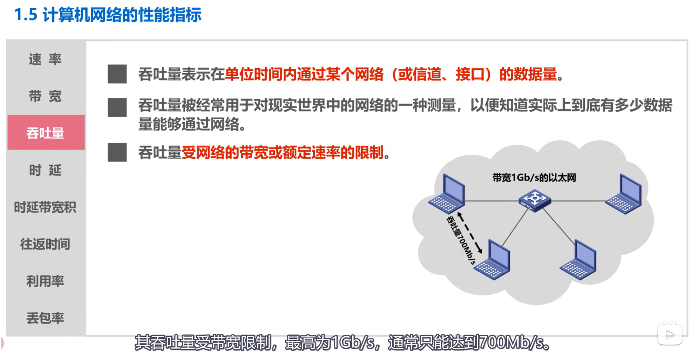

*******

 

## ==1.6 计算机网络体系结构==

### 计算机网络体系结构分层的必要性

前三位十进制数标识网络，后一位十进制数标识自身

 

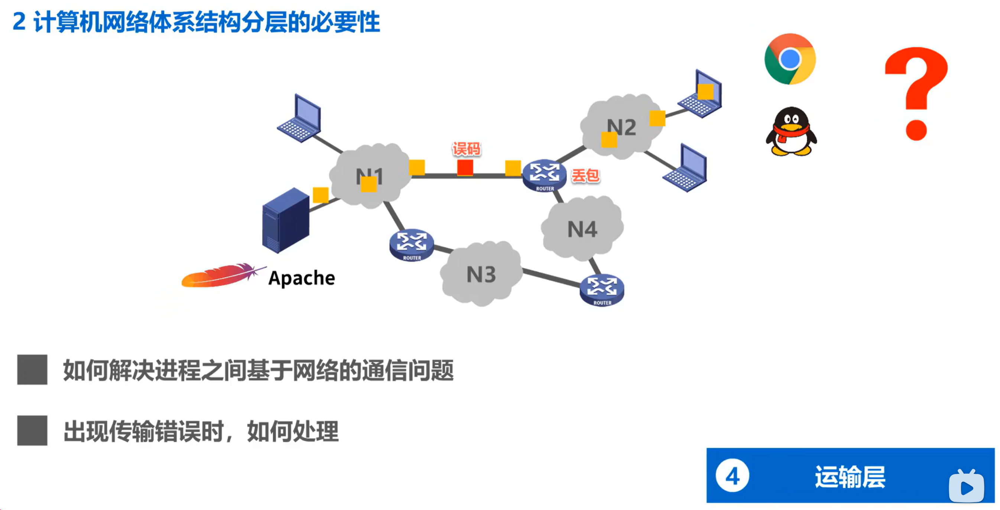

### 分层举例

应用层按 http 协议的规定构建一个**http请求报文**，应用层将http报文交付给运输层处理

运输层给http请求报文添加**一个tcp首部，使之成为tcp报文段**，该首部的作用主要是为了**区分应用进程以及实现可靠传输**，运输层将tcp报文段交付给网络层处理

网络层给tcp报文段添加一**个ip首部，使之成为ip数据报**，该首部的作用主要是为了**使ip数据报可以在互联网上传输，也就是被路由器转发**，网络层将ip数据报交付给数据链路层处理。

数据链路层给ip数据报添加**一个首部和一个尾部，使之成为帧**，假设网络N 1是以太网，这是以太网帧首部的格式，该首部的作用主**要是为了让帧能够在一段链路上或一个网络上传输，能够被相应的目的主机接收**。这是以太网帧尾部的格式，其作用是为了让目的主机检查所接收到的帧是否有误码，数据链路层将帧交付给物理层。

物理层**将帧看作是比特流**，由于网络N 1是以太网，因此物理层还会给该比特留前面添加**前导码**，这是前导码的内容，**其作用是为了让目的主机做好接收帧的准备**。**物理层将添加有前导码的比特流变换成相应的信号**，发送到**传输媒体**，信号通过传输媒体到达路由器。

**路由器的处理过程**

物理层**将信号变换为比特流**，然后**去掉前导码**后将其交付给数据链路层，这实际上交付的是**帧数据**。链路层将帧的首部和尾部去掉后，将其交付给网络层，这实际上交付的是ip数据报。网络层**解析ip数据报的首部，从中提取出目的网络地址**，然后查找自身的路由表确定转发端口，以便进行转发。网络层将ip数据报交付给数据链路层，数据链路层给ip数据报添加一个首部和一个尾部，使之成为帧数据。链路层将帧交付给物理层，物理层将帧看作是比特流，由于网络N 2是以太网。因此物理层还会给该比特流前面添加前导码，物理层将添加有前导码的比特流变换成相应的信号，发送到**传输媒体**，**信号通过传输媒体到达web服务器**。

**web服务器的处理过程**

物理层将信号变换为比特流，然后去掉前导码后，将其交付给数据链路层，这实际上交付的是帧数据。链路层将帧的首部和尾部去掉后，将其交付给网络层，这实际上交付的是ip数据报。网络层将ip数据报的首部去掉后，将其交付给运输层，这实际上交付的是tcp报文段。运输层将tcp报文段的首部去掉后，将其交付给应用层，这实际上交付的是http请求报文。

应用层对http请求报文进行解析，然后给主机发回http响应报文。与之前的过程类似，**http响应报文需要在外部服务器层层封装，然后通过物理层变换成相应的信号，再通过传输媒体传输到路由器**。路由器转发该响应报文给主机，主机通过物理层将收到的信号转换为比特流之后，通过逐层解封，最终取出http响应报文。

### 计算机网络体系结构中的专用术语

这些专用术语来源于osi的七层协议体系结构，但也适用于tcp ip的四层体系结构和五层协议原理体系结构。我们将这些专用术语中最具代表性的三个作为分类名称，它们分别是 **实体、协议、服务。**

这是通信双方的五层原理体系结构，我们在他们的各层中用**标有字母的小方格来表示实体**，例如图中实体a与实体f为对等实体，实体b与实体g为对等实体，以此类推。通信双方的网卡是对等实体，通信双方中的正在进行通信的应用进程是对等实体。

协议是控制两个对等实体进行逻辑通信的规则的集合，例如应用层对等实体在应用层协议的控制下进行逻辑通信，运输层对等实体在运输层协议的控制下进行逻辑通信，网络层对等实体在网络层协议的控制下进行逻辑通信，以此类推。

需要注意的是，之所以称为**逻辑通信**，是因为这种通信其实并不存在。它只是我们假设出来的一种通信，目的在于方便我们单独研究体系结构某一层，而不用考虑其他层。例如当我们研究运输层时，我们可以假设运输层的对等实体在进行逻辑通信，而不用顾及其他层。

计算机网络协议有三个要素，它们是**语法、语义、同步**

**语法定义通信双方所交换信息的格式**，例如这是ip数据报的格式，其中的小格子称为字段或域，数字表示字段的长度，单位是位也就是比特。语法就是定义了这些小格子的长度和先后顺序，换句话说，语法定义了所交换信息有哪些字段，以及何种顺序构成。没有必要记住每种分组的格式，只要我们能看懂他们的格式说明就可以了。

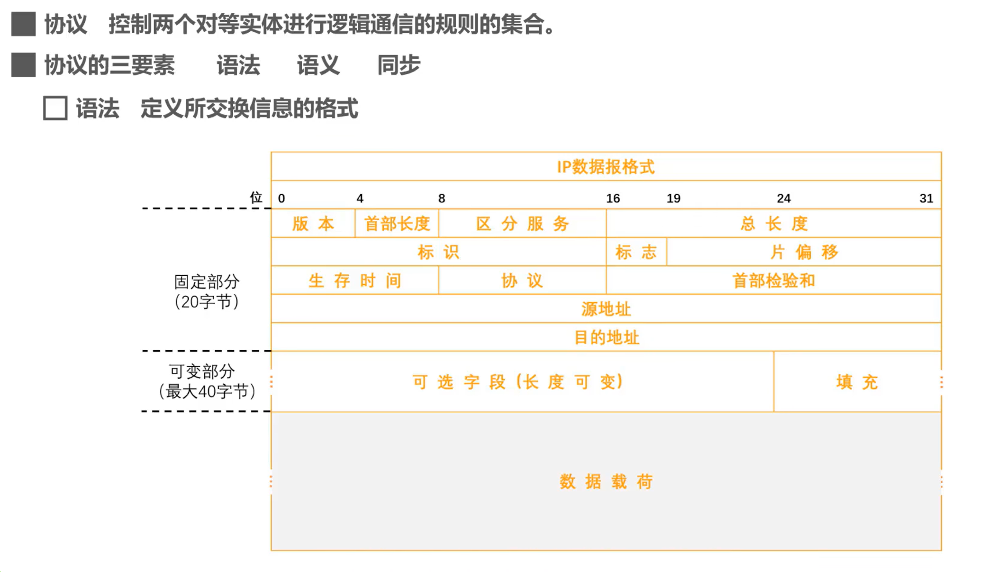

**语义定义通信双方所要完成的操作**。这是我们上节课举过的应用实例，主机要访问远程web服务器，它会构建一个http的get请求报文，然后将其发送给web服务器，web服务器收到该报文并进行解析，知道这是一个http的get请求报文，于是就在自身内部查找所请求的内容，并将所找到的内容封装在一个http响应报文中发回给主机。主机收到http响应报文后，对其进行解析，取出所请求的内容，并由浏览器解析显示。

这个例子就可以体现出通信双方收到分组后完成怎样的操作，这是http协议的语义所规定的

**同步定义通信双方的时序关系，**请注意并不是指时钟频率同步。例如这是**tcp采用三报文握手建立连接的过程**，要想进行运输层tcp实体间的逻辑通信，首先必须建立连接，从连接建立的过程就可以看出，tcp客户端和tcp服务器之间的时序关系以及各自的状态转换。只有双方建立连接后才能进行tcp数据传输，这个例子可以充分体现计算机网络协议三要素中的同步。

有了协议的概念，我们再来介绍服务

在协议的控制下，两个对等实体间的逻辑通信，使得本层能够**向上一层提供服务**。例如物理层对等实体**在物理层协议的控制下，向数据链路层提供服务**。**要实现本层协议，还需要使用下面一层所提供的服务**。例如数据链路层对等实体享受物理层提供的服务，并在数据链路层协议的控制下进行逻辑通信，给网络层提供服务。网络层对等实体享受数据链路层提供的服务，并在网络层协议的控制下进行逻辑通信，给运输层提供服务。运输层对等实体享受网络层提供的服务，并在运输层协议的控制下进行逻辑通信，给应用层提供服务。应用层对等实体享受运输层提供的服务，并在应用层协议的控制下进行逻辑通信给其上层，也就是用户提供服务。

再来看服务访问点的概念

在计算机网络体系结构中，对通信双方所交互的数据包有专门的术语。

# 第二章 物理层

## 2.1 物理层的基本概念

## 2.2 物理层下面的传输媒体

传输媒体，**不属于计算机网络体系结构的任何一层**，如果非要将它添加到体系结构中，那只能将其放在物理层之下。

## 2.3 传输方式

我们首先来看串行传输和并行传输，串行传输是指数据是一个比特一个比特依次发送的，因此在发送端和接收端之间只需要一条数据传输线路即可**。并行传输是指一次发送n个比特，而不是一个比特**，为此在发送端和接收端之间需要有n条传输线路。并行传输的优点是速度为串行传输的n倍，但也存在一个严重的缺点，成本高。

在计算机网络中，数据在传输线路上的传输采用的是串行传输还是并行传输，答案是串行传输。计算机内部的数据传输常采用并行传输方式，例如cpu与内存之间通过总线进行数据传输，常见的数据总线宽度有8位，16位，32位和64位。

## ==2.4 编码与调制==

在计算机网络中,计算机需要处理和传输用户的文字图片,音频和视频,他们可以统称为。**数据是运送消息的实体**，我们人类比较熟悉的是十进制数据，而计算机只能处理二进制数据，也就是比特0和比特1。

计算机中的网卡，将比特0和比特1变换成相应的电信号发送到网线，也就是说信号是数据的电磁表现。由信源发出的原始电信号称为基带信号。基带信号又可分为两类，一类是数字基带信号，例如计算机内部cpu与内存之间传输的信号；另一类是模拟基带信号，例如麦克风收到声音后产生的音频信号。

信号需要在信道中进行传输，信道可分为数字信道和模拟信道两种。**在不改变信号性质的前提下，仅对数字基带信号的波形进行变换，称为编码**。编码后产生的信号仍为数字信号，可以在数字信道中传输。例如以太网使用曼彻斯特编码4b5 b8 b 10 b等编码。**把数字基带信号的频率范围搬移到较高的频段，并转换为模拟信号，称为调制**。调制后产生的信号是模拟信号，可以在模拟信道中传输，例如wifi使用补码监控，直接序列扩频，正交频分复用等调制方法。

对于模拟基带信号的处理也有编码和调制两种方法。对模拟基带信号进行编码的典型应用是对音频信号进行编码的，脉码调制pcm，也就是将模拟**音频信号通过采样、量化、编码这三个步骤进行数字化**。对模拟信号进行调制的典型应用是，将语音数据加载到模拟的载波信号中传输。例如传统的电话，另一个是频分复用fdm技术，可以充分利用带宽资源。

### 编码与调制

在计算机网络中，编码（Encoding）和调制（Modulation）是信号处理的两个关键概念，它们有着不同的含义和作用，但也存在联系。

**编码（Encoding）**

- **含义**：编码是将数据转换成特定格式的过程，以便于传输或存储。在计算机网络中，这通常涉及将数字数据（比如二进制）转换成适合在物理媒介上传输的信号。
- **目的**：**确保数据的有效传输，最大限度地减少错误，并提高数据传输的效率**。
- **例子**：二进制数据转换成电信号或光信号。

**调制（Modulation）**

- **含义**：调制是改变载波信号的某些属性（如**幅度、频率或相位**），以便于在物理媒介（如无线电波、电话线或光纤）上传输信息的过程。
- **目的**：**在不同频率上有效地传输信号，允许多个信号同时通过一个媒介（如频分复用），并适应特定的传输媒介特性。**
- **例子**：AM（幅度调制）和FM（频率调制）在无线广播中的应用。

**区别和联系**

- **区别**：**编码主要关注数据到信号的转换，而调制则更多地关注信号属性的改变以适应传输媒介**。
- **联系**：在实际的数据传输过程中，编码和调制通常是紧密相连的。编码后的数据需要通过调制来适配特定的传输媒介。例如，在数字电视广播中，数字数据首先被编码，然后通过调制技术转换成无线电波进行传输。

总的来说，编码和调制是计算机网络中数据传输的两个重要环节，它们各自承担着不同的角色，但共同确保了数据有效、高效地从一个地方传输到另一个地方。

接下来我们介绍码元的概念，在使用时间域的波形表示数字信号时，代表不同离散数值的基本波形称为码元。简单来说，码元就是构成信号的一段波形，例如这是一个调频信号，这一段波形是构成该信号的一个基本波形，我们可称其为码元。它可以表示比特零，当然也可以表示比特一，这一段波形是构成该信号的另一个基本波形，也称为码元，它可以表示比特一，可见该信号由两种码元构成。

顺便提一下传输媒体与信道的关系。严格来说，传输媒体和信道不能直接划等号，对于单工传输传输媒体中只包含一个信道，要么是发送信道，要么是接收信道。而对于半双工和全双工传输，传输媒体中要包含两个信道，一个是发送信道，另一个是接收信道。如果使用信道复用技术，一条传输媒体还可以包含多个信道

**在计算机网络中，常见的是将数字基带信号通过编码或调制的方法在相应信道进行传输。**

### 常用编码

下面我们介绍几种常用编码，

这是曼彻斯特编码，如图所示，在每个码元时间的中间时刻信号都会发生跳变。例如负跳变表示比特一正跳变表示比特零码元中间时刻的跳变，既表示时钟，又表示数据。传统以太网使用的就是曼彻斯特编码。

这是差分曼彻斯特编码，如图所示，在每个码元时间的中间时刻信号都会发生跳变。与曼彻斯特编码不同，跳变仅表示时钟，而用码元开始处电瓶是否发生变化来表示数据，如图所示，这是每个码元的开始处，这是每个码元的结束处，依据码元开始处电瓶是否发生变化来表示比特零或比特一。

### 基本调制方法

下面我们介绍基本调制方法.

这是待传输的数字基带信号，也就是来自信源的原始数字信号，**我们要使用模拟信号来传输，因此需要将数字基带信号通过调制方法，调制成可以在模拟信道中传输的模拟信号。**

这是调幅所产生的模拟信号，无载波输出表示比特零，有载波输出表示比特一。这是调频所产生的模拟信号，频率f1的波形表示比特零频率f2 的波形表示比特一。这是调相所产生的模拟信号，初相位0度的波形表示比特零，初相位180度的波形表示比特一。

很明显，使用基本调制方法，一个码元只能表示或者说包含一个比特信息。

那么如何能使一个码元包含更多的比特呢，可以采用混合调制的方法。

因为频率和相位是相关的，也就是说频率是相位随时间的变化率，所以一次只能调制频率和相位两个中的一个。通常情况下，**相位和振幅可以结合起来一起调制，称为正交振幅调制。**

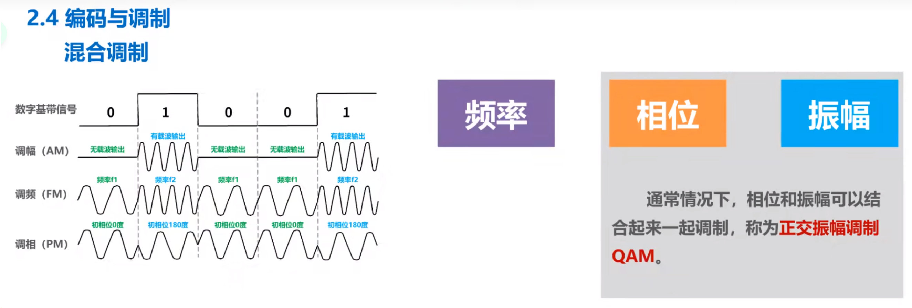

我们来看属于正交振幅调制的QAM-16，这种调制方法所调制出的波形可以有12种相位，每种相位有一或两种振幅可选。

我们可在星座图中画出该调制方法所产生的码元，该点就表示其中的一个码元，它与圆心连线的距离可看作是振幅。连线与横坐标的夹角可看作是相位。这是QAM-16可调制出的16种码元，由于QAM-16可以调制出16种码元，也就是16种波形，则每种码元可以对应表示四个比特。

每个码元与四个比特的对应关系不能随便定义，每个码元与四个比特的对应关系应该采用格雷码，也就是任意两个相邻码元只有一个比特不同。

## 2.5 信道的极限容量

信号在传输过程中会受到各种因素的影响，如图所示，这是一个数字信号，当它通过实际的信道后，波形会产生失真，当失真不严重时，在输出端还可根据已失真的波形还原出发送的码元。但当失真严重时，在输出端就很难判断这个信号在什么时候是一和，在什么时候是零信号，波形失去了码元之间的清晰界限，这种现象叫做码间串扰。

产生失真的原因主要有码元传输速率，信号传输距离，噪声干扰、传输媒体质量等

上节课中介绍的调幅、调频、以及调相，这三种基本调制方法，它们属于二元调制，只能产生两种不同的码元，也就是两种不同的基本波形。因此每个码元只能携带一比特的信息量，而混合调制属于多元调制，例如qm 16可以调制出16种不同的码元，因此每个码元可以携带四比特的信息量。

# ---串口通信使用 RS-485 协议

串口通信使用 RS-485 协议发送 16 进制指令进行电机控制，涉及到计算机网络的多个层次，主要是物理层和数据链路层。

### 物理层

1. **RS-485 协议**:
   - RS-485 是一种物理层协议，定义了电气特性如电压水平、连线标准、最大传输距离和最大连接节点数等。
   - 它是一种差分信号传输方式，允许在噪声环境下进行长距离通信，常用于工业控制系统。

2. **串口通信**:
   - 串口（Serial Port）通信是一种常见的物理层通信方式。串口通信使用 RS-485 标准进行数据传输时，数据是通过串行方式在两点间（或多点）传输的。

### 数据链路层

1. **Modbus 协议**:
   - 在您的应用中，Modbus RTU 协议可能被用于串口通信。Modbus 是应用于数据链路层和部分应用层的通信协议。
   - 它定义了消息结构、数据封装方式和错误检测机制（如 CRC 校验）。

2. **数据封装和帧结构**:
   - 数据链路层负责将原始比特流组织成有意义的数据单元（帧）。在 Modbus RTU 中，一个帧包含地址域、功能码、数据和校验码。

3. **错误检测**:
   - 数据链路层通常包含错误检测和可能的纠错机制。在 Modbus RTU 中，CRC 校验用于检测数据传输过程中的错误。

### 与 OSI 模型的关系

- 在 OSI（Open Systems Interconnection）模型中，**物理层负责传输原始比特流，而数据链路层则负责在这些比特流上创建一个可靠的链路。**
- RS-485 属于物理层，负责定义电气特性和物理连接。
- Modbus RTU 属于数据链路层（并部分涉及到应用层），负责定义如何在物理层传输的原始比特流中封装、传输和校验数据。

在您的应用场景中，通过 RS-485 使用串口发送的 16 进制 Modbus RTU 指令，实际上是在物理层和数据链路层上实现的。物理层提供了基础的数据传输能力，而数据链路层则提供了数据的封装、传输和校验机制，确保电机可以正确理解和响应这些指令。

# 第三章 数据链路层

## 3.1 数据链路层概述

## 3.2 封装成帧

封装成帧就是指,数据链路层给上层交付下来的协议数据单元,添加帧头和帧尾,使之成为帧。帧头和帧尾中包含有重要的控制信息。

发送方的数据链路层，将上层交付下来的协议数据单元封装成帧后，还要通过物理层将构成帧的各比特转换成电信号发送到传输媒体，那么接收方的数据链路层，如何从物理层交付的比特流中提取出一个个的帧呢？

以太网版本二的mac格式，在其帧头和帧伪中并没有包含帧定界标志。那么接收方又是如何，从物理层交付的比特流中提取出一个个的以太网帧呢。实际上以太网的数据链路层封装好mac帧后，将其交付给物理层，物理层会在mac前面添加八字节的前导码，然后再将比特流转换成电信号发送前导码中的前七个字节为前同步码，作用是使接收方的时钟同步之后的一字节为帧。开始定界符，表明其后面紧跟着的就是mac帧，另外以太网还规定了中间间隔时间为96比特的发送时间，因此mac帧并不需要真结束定界符。

## 3.2 差错检测

由于奇偶校验的漏检率比较高，因此计算机网络的数据链路层一般不会采用这种检测方法。

## 3.4 可靠传输

## 3.5 点对点协议PPP

## 3.6 媒体接入控制 MAC

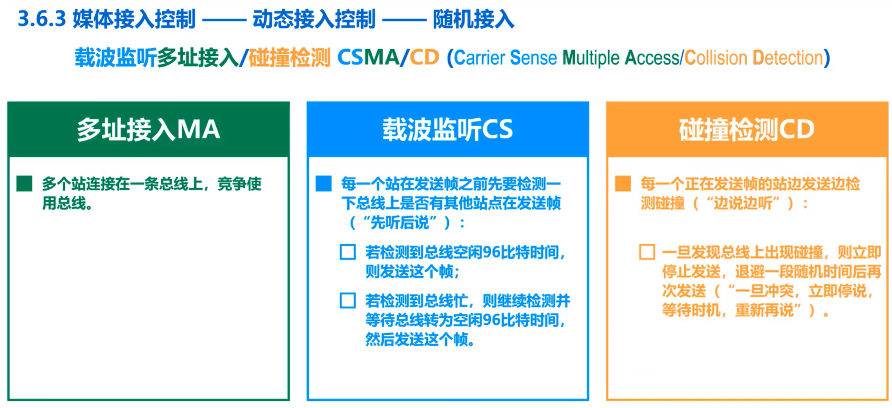

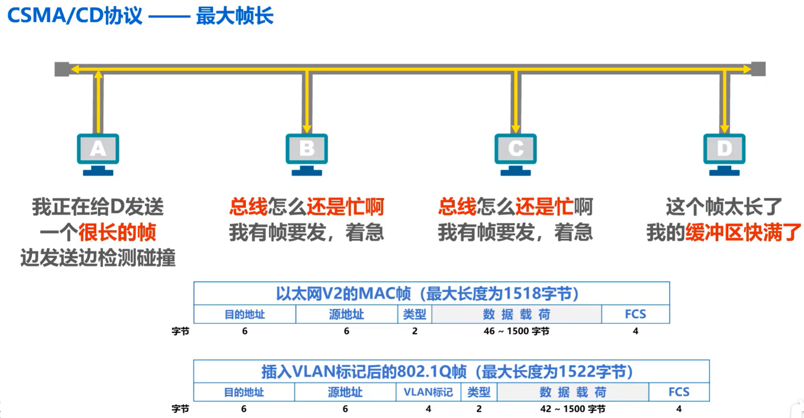

## ==3.7 MAC地址、IP地址以及ARP协议==

还有随机MAC地址

 

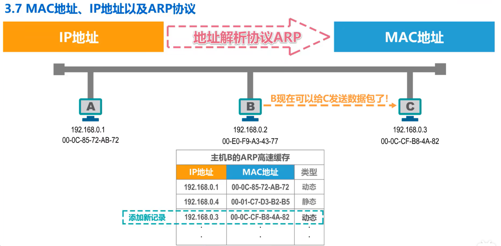

## 3.8 集线器与交换机的区别

## 3.9 以太网交换机自学习和转发帧的流程

## 3.10 以太网交换机的生成树协议STP

## 3.11 虚拟局域网VLAN

这是一个由多个以太网交换机互联而成的交换式以太网，每个以太网交换机上都连接了多个主机，形成了一个巨大的广播域，然而巨大的广播域会带来很多弊端。例如广播风暴，难以管理和维护潜在的安全问题等。
	我们来举例说明广播风暴的问题，假设网络中的某个主机要给另一个主机发送一个数据帧，但是在自己的arp高速缓存表中无法查到目的主机的mac地址。，于是首先要发送arp广播请求来获取目的主机的mac地址，该arp广播请求会传遍整个网络，网络中的其他所有主机都可以收到该广播这种情况就是所谓的广播风暴。广播风暴会浪费网络资源和网络中各主机的cpu资源，因此除非应用需求必须要使用广播，否则网络中的主机应尽量不使用广播。

事实上网络中会频繁出现广播信息。

使用路由器就可以隔离广播域，如图所示，这是由两台以太网交换机互联而成的。交换式以太网网络中的各主机同属于一个广播域，使用路由器可以将该广播域分割成两个较小的广播域。路由器工作在网络体系结构的第三层，也就是网络层，由于路由器默认情况下不对广播数据包进行转发，因此路由器很自然的就可以隔离广播域。
	然而路由器的成本较高，局域网内部全部使用路由器来隔离广播域是不现实的，在这种情况下，虚拟局域网技术应运而生。

# 第四章 网络层

## 4.1 网络层概述

网络层的主要任务是实现网络互联，进而实现数据包在各网络之间的传输，如图所示，这些异构型网络如果只是需要各自内部通信，那他们只要实现各自的物理层和数据链路层即可，但是如果需要将这些异构型网络互联起来，形成一个更大的互联网，就需要使用网络层互联设备，路由器。

为了简单起见，有时我们可以不用画出这些网络，而将他们看作是一条链路即可。对于互联网而言，仅实现计算机网络体系结构中的物理层和数据链路层，是不能实现数据包在互联网中各网络之间传输的，要实现该功能就必须实现网络层。

## 4.2 网络层提供的两种服务

由于tcp/ip体系结构的英特网的网际层提供的是简单灵活的、无连接的、尽最大努力交付的数据报服务，因此本章主要围绕**网际层如何传送ip数据报**这个主题进行讨论。

## 4.3 IPv4地址

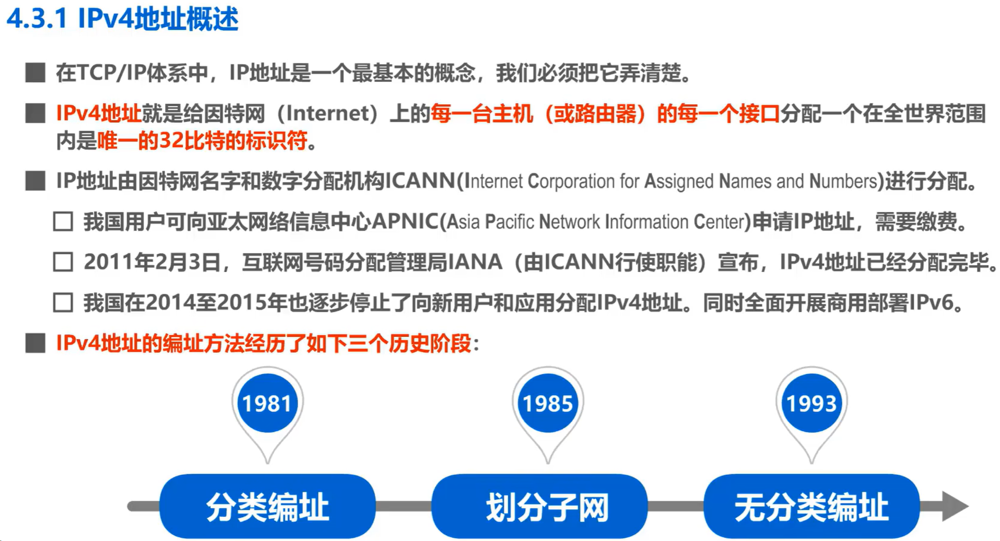

假设某单位有一个大型的局域网，需要连接到因特网，如果申请一个c类网络地址即可分配的ip地址数量只有254个，不够使用。因此该单位申请了一个b类网络地址，即可分配的ip地址数量达到了65534个，给每台计算机和路由器的接口分配一个ip地址后，还有大量的ip地址剩余，这些剩余的ip地址只能由该单位的同一个网络使用，而其他单位的网络不能使用。

随着该单位计算机网络的发展和建设，该单位又新增了一些计算机，并且需要将原来的网络划分成三个独立的网络，我们称其为子网一，子网二和子网三。假设子网一仍然使用原先申请到的b类网络地址，那么就需要为子网二和子网三各自申请一个网络地址，但这样会存在一些弊端，申请新的网络地址需要等待很长的时间，并且要花费更多的费用，即便申请到了两个新的网络地址，这也会使其他路由器的路由表新增针对这两个新的网络的路由记录，另外这样还会浪费原有网络中剩余的大量ip地址。

如果可以从ip地址的主机号部分**借用一些位作为子网号，来区分不同的子网**，就可以利用原有网络中剩余的大量ip地址，而不用申请新的网络地址。例如对于本例，我们可以借用16位主机号中的八位作为子网号，假设我们给子网一分配的子网号为0，给子网二分配的子网号为1，给子网三分配的子网号为2，之后就可以给各子网中的主机和路由器接口分配ip地址了。

## 4.4 IP数据报的发送和转发过程

## 4.6 路由选择协议

# 第五章 运输层

## 5.1 运输层简介

在运输层使用不同的端口来对应不同的应用进程，然后通过网络层及其下层来传输应用层报文。

## 5.2 运输层端口号、复用与分用的概念

## **==5.3 UDP 和 TCP 的对比==**

udp和tcp是tcp ip体系结构运输层中的两个重要协议，如图所示，这是我们之前课程中介绍过的tcp ip体系结构。它的运输层有两个非常重要的协议，udp和tcp，在使用tcp ip体系结构的网络通信中，这两个协议的使用频率仅次于网际层的ip协议。tcp ip体系结构应用层中的某些协议需要使用运输层的tcp提供的服务，而另一些协议需要使用运输层的udp提供的服务。

这里的连接，是逻辑连接，而不是物理连接

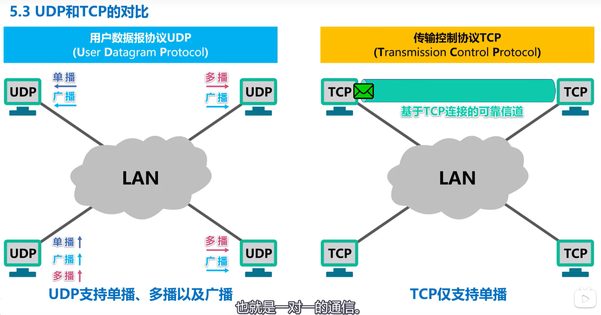

**接下来我们来对比这两个协议对应用报文的处理**

先来看使用udp协议的情况，发送方的应用进程将应用层报文交付给运输层的udp，udp直接给应用层报文添加一个udp首部，使之成为udp用户数据报，然后进行发送。需要说明的是，为了简单起见，我们忽略运输层下面的各层处理。接收方的udp收到该udp用户数据报后，去掉udp首部将应用层报文交付给应用进程，也就是说，udp对应用进程交下来的报文既不合并也不拆分，而是保留这些报文的边界。换句话说，udp是面向应用报文的。

**再来看使用tcp协议的情况**，发送方的tcp把应用进程交付下来的数据块，仅仅看作**是一连串的无结构的字节流**，tcp并不知道这些带传送的字节流的含义，仅将它们编号并存储在自己的发送缓存中。tcp根据**发送策略**，从发送缓存中提取一定数量的字节，构建tcp报文段并发送。

接收方的tcp，一方面从所接收到的tcp报文段中取出数据载荷部分，并存储在接收缓存中。一方面将接收缓存中的一些字节交付给应用进程，tcp不保证接收方应用进程所收到的数据块，与发送方应用进程所发出的数据块具有对应大小的关系。例如发送方应用进程交给发送方的tcp共十个数据块，但接收方的tcp可能只用了四个数据块，就把收到的字节流交付给了上层的应用进程，但接收方应用进程收到的字节流，必须和发送方应用进程发出的字节流完全一样。当然接收方的应用进程必须有能力识别收到的字节流，把它还原成有意义的应用层数据，也就是说**tcp是面向字节流的**。这正是tcp实现可靠传输流量控制以及拥塞控制的基础

需要说明的是，为了突出示意图的要点，我们只画出了一个方向的数据流。在实际网络中，基于tcp连接的两端可以同时进行tcp报文段的发送和接收，也就是**全双工通信**。

> TCP（传输控制协议）是一种面向连接的、可靠的、基于字节流的传输层通信协议。在TCP/IP协议族中，它负责在两个网络应用之间提供可靠的数据传输。理解TCP的数据传输特性，尤其是它如何处理数据块和字节流，对于理解网络通信至关重要。让我们逐步分析并通过一个例子来解释这个概念。
>
> ### TCP的数据流传输特性
>
> 1. **面向字节流**：TCP将应用层数据视为一个连续的字节流，而不是独立的消息或数据块。这意味着，当应用层向TCP层发送数据时，TCP并不关心这些数据被分成多少块或消息。它仅仅将这些数据作为一连串的字节来处理。
>
> 2. **发送和接收数据块的不对应关系**：发送方的TCP层可能将数据分为多个段（数据块）进行发送。这些段的大小可能受到多种因素的影响，如网络拥塞、数据缓冲区大小等。而在接收方，TCP层可能以不同的方式重新组合这些数据段。例如，发送方可能将数据分为十个段发送，但接收方的TCP可能将它们组合成四个较大的段来处理。
>
> 3. **数据的完整性和顺序**：虽然接收方的TCP可以自由地重组数据块，但它必须确保最终传递给接收方应用程序的数据流与发送方应用程序发送的数据流完全相同。这包括数据的内容和顺序。
>
> ### 例子说明
>
> 假设有一个文件传输应用，客户端（发送方）要向服务器端（接收方）传输一个文件。
>
> 1. **发送过程**：客户端应用程序将文件分成多个数据块（例如，每个块100字节）。它将这些数据块逐一发送给客户端的TCP层。客户端的TCP层将这些数据块封装进一系列TCP段中，并发送出去。这些段可能不会完全对应于应用层的数据块。例如，两个连续的100字节数据块可能被合并为一个200字节的TCP段。
>
> 2. **接收过程**：服务器端的TCP层接收到这些TCP段，并可能以不同的方式重新组合它们。例如，它可能将两个200字节的TCP段组合成一个400字节的段。然后，服务器端的TCP层将这个连续的字节流传递给服务器应用程序。
>
> 3. **应用层处理**：尽管服务器端的TCP层在内部处理数据时的组合方式与客户端不同，但它确保传递给服务器应用程序的数据内容和顺序与客户端应用程序发送的完全相同。服务器应用程序接收到这个字节流，并能够正确地重构出原始文件。
>
> ### 结论
>
> 这个过程展示了TCP如何处理数据：它关注的是字节流的完整性和顺序，而不是数据块的大小或界限。这种设计使TCP能够灵活地处理各种网络条件，同时确保数据传输的可靠性和顺序性。

我们再来对比一下udp用户数据报的首部与tcp报文段的首部，一个udp用户数据报由首部和数据载荷两部分构成，其首部格式如图所示，仅有四个字段，每个字段长度为两个字节。由于udp不提供可靠传输服务，它仅仅在网际层的基础上添加了用于区分应用进程的端口，因此它的首部非常简单，仅有八个字节。
	一个tcp报文段由首部和数据载荷两部分构成，其首部格式如图所示，这比udp用户数据报的首部复杂得多，其最小长度为20字节，最大长度为60字节。这是因为tcp要实现可靠传输流量控制，拥塞控制等服务，其首部自然会比较复杂，首部中的字段比较多，首部长度也比较长。

## 5.4 TCP的流量控制

我们来举例说明，假设主机a和b是英特网上的两台主机，他们之间已经建立了tcp连接，a给b发送数据，b对a进行流量控制。

这是主机a装待发送数据的字节序号，假设主机a发送的每个tcp报文段可携带100字节数据，因此图中每个小格子表示100个字节数据的序号，在主机a和b建立tcp连接时，b告诉a我的接收窗口为400，因此主机a将自己的发送窗口也设置为400，这意味着主机a在未收到主机b发来的确认时，可将序号落入发送窗口中的全部数据发送出去。

接下来我们举例说明主机b对a的流量控制，主机a将发送窗口内序号1~100的数据封装成一个tcp报文段发送出去，发送窗口内还有300字节可以发送，这里的s e q是tcp报文段首部中的序号字段，取值一表示tcp报文段数据载荷的第一个字节的序号是一，这里的data表示这是tcp数据报文段。主机a将发送窗口内序号101~ 200的数据封装成一个tcp报文段发送出去，发送窗口内还有200字节可以发送，主机a将发送窗口内序号201~300的数据封装成一个tcp报文段，发送出去，但该报文段在传输过程中丢失了。

主机a发送窗口内还有100字节可以发送，主机b对主机a所发送的201号以前的数据进行累计确认，并在该累计确认中将窗口字段的值调整为300，也就是对主机a进行流量控制。这里的大写a c k是tcp报文段首部中的标志位，取值一表示这是一个tcp确认报文段，小写a c k是tcp报文段首部中的确认号字段取值201表示序号201之前的数据已全部正确接收，现在希望收到序号201及其后续数据rwnd是tcp报文段首部中的窗口字段，取值300，表示自己的接收窗口大小为300。

主机a收到该累计确认后，将发送窗口向前滑动，使已发送并收到确认的这些数据的序号移出发送窗口，由于主机b在该累计确认中将自己的接收窗口调整为了300，因此主机a相应地将自己的发送窗口调整为300，目前主机a发送窗口内的序号为201~500，也就是主机a还可以发送这300字节。其中201 ~300号字节是已发送的数据，若重传计时器超时它们会被重传。

301~400号字节，以及401号到5号字节还未被发送，可被分别封装在一个tcp报文段中，发送主机a现在可将发送缓存中序号1 ~200的字节数据全部删除了，因为已经收到了主机币对他们的累计确认。 主机a将发送窗口内序号301 ~400的数据封装成一个tcp报文段，发送出去，发送窗口内还有100字节可以发送。主机a将发送窗口内序号401 ~500的数据封装成一个tcp报文段，发送出去，至此序号落在发送窗口内的数据已经全部发送出去了，不能再发送新数据了。现在发送窗口内序号201 ~300这100个字节数据的重传计时器超时了，主机a将它们重新封装成一个tcp报文段发送出去，暂时不能发送其他数据。

主机b收到该重传的tcp报文段后，对主机a所发送的501号以前的数据进行累计确认，并在该累计确认中将窗口字段的值调整为100，这是主机b对主机a进行的第二次流量控制。

主机a收到该累计确认后，将发送窗口向前滑动，使已发送并收到确认的这些数据的序号移出发送窗口，由于主题b在该累计确认中将自己的接收窗口调整为了100，因此主机a相应地将自己的发送窗口调整为100。目前主机a发动窗口那个序号为501~600，也就是主机a还可以发送这100字节。主机a现在可将发送缓存中，序号201 ~500的字节数据全部删除了，因为已经收到了主机地对他们的累计确认。主机a将发送窗口内序号501 ~600的数据封装成一个tcp报文段，发送出去，至此序号落在发送窗口内的数据已经全部发送出去了，不能再发送新数据了。

主机b对主机a所发送的601号以前的数据进行累计确认，并在该累计确认中将窗口字段的值调整为零，这是主机b对主机a进行的第三次流量控制，主机a收到该累计确认后，将发送窗口向前滑动，使已发送并收到确认的这些数据的序号移出发送窗口。由于主机b在该累计确认中将自己的接收窗口调整为了零，因此主机a相应的将自己的发送窗口调整为零。目前主机a不能再发送一般的tcp报文段了，主机a现在可将发送缓存中序号501~600的字节数据全部删除了，因为已经收到了主机b对他们的累计确认。

假设主机b向主机a发送了零窗口的报文段后不久，主机b的接收缓存又有了一些存储空间，于是主机b向主机a发送了接收窗口等于300的报文段，然而这个报文段在传输过程中丢失了。主机a一直等待主机b发送的非零窗口的通知，而主机b也一直等待主机a发送的数据，如果不采取措施，这种互相等待而形成的思索局面将一直持续下去。

为了解决这个问题，tcp为每一个连接设有一个持续计时器，只要tcp连接了一方收到对方的零窗口通知，就要启动持续计时器,若持续计时器超时，就要发送一个零窗口探测报文，仅携带一字节的数据，而对方在确认这个探测报文段时，**给出自己现在的接收窗口值**，如果接收窗口仍然是零，那么收到这个报文段的一方就要重新启动持续计时器，如果接收窗口不是零，那么死锁的截面就可以被打破了。

在本例中主机a收到零窗口通知时，就要启动一个持续计时器，当持续计时器超时，主机a立刻发送一个仅携带一字节数据的零窗口探测报文段，假设主机b此时的接收窗口又为零了，主机b就在确认这个零窗口探测报文段时，给出自己现在的接收窗口值为零，主机a再次收到零窗口通知，就再次启动一个持续计时器，当持续计时器超时，主机a立刻发送一个零窗口探测报文段。假设主机b此时的接收缓存又有了一些存储空间，于是将自己的接收窗口调整为了300，主机b就在确认这个零窗口探测报文段时，给出自己现在的接收窗口值为300，这样就打破了死锁的局面。

同学们可能会有这样的疑问，主机a所发送的零窗口探测报文段到达主机b时，如果主机b此时的接收窗口仍然为零，那么主机b根本就无法接受该报文段，又怎么会针对该报文段给主机a发回确认。实际上tcp规定，即使接收窗口为零，**也必须接受零窗口探测报文段，确认报文段以及携带有紧急数据的报文段**。请大家再来思考一下这个问题，如果零窗口探测报文段丢失了，会出现怎样的问题呢，还能否打破死锁的局面呢。回答是肯定的，因为**零窗口探测报文段也有重传计时器**，当重传计时器超时后，零窗口探测报文段会被重传。

## 5.5 TCP的拥塞控制

tcp发送方一开始使用慢开始算法，让拥塞窗口值从一开始按指数规律增大。当拥塞窗口值增大到慢开始门限值时，停止使用慢开始算法，转而执行拥塞避免算法，让拥塞窗口值按线性加1的规律增大当发生超时重传时，就判断网络很可能出现了拥塞，采取相应的措施。一方面将慢开始门限值更新为发生拥塞时拥塞窗口值的一半，另一方面将拥塞窗口值减小为1，并重新开始执行慢开始算法拥塞窗口值又从一开始按指数规律增大，当增大到了新的慢开始门限值时停止使用慢开始算法，转而执行用塞避免算法让拥塞窗口值按线性加1的规律增大。

## 5.6 TCP超时重传时间的选择

超时重传时间的选择是tcp最复杂的问题之一，我们来举例说明。

假设主机a和b是英特网上的两台主机，它们之间已经建立了tcp连接，纵坐标为时间，现在主机a给主机b发送tcp数据报文段零，并记录下当前的时间，主机b收到后给主机a发送相应的确认报文段，主机a收到确认报文段后，记录下当前的时间，那么主机a记录下的这两个时间，它们的差值就是报文段的往返时间rtt，由于这是第零个报文段的rtt，我们就用rtt 0来表示。试想一下，如果我们将超时重传时间rt的值设置的比rtt 0的值小，会出现怎样的情况呢，很显然这会引起报文段不必要的重传时，网络负荷增大。那么如果将超时重传时间rt的值设置的远大于rtt 0的值，又会出现怎样的情况呢，很显然，这会使重传推迟的时间太长，使网络的空闲时间增大，降低了传输效率。综合上述两种情况，我们可以得出这样的结论，超时重传时间rt的值应该设置为略大于报文段往返时间rtt的值。

至此同学们可能会觉得超时重传时间的选择也并不是很复杂嘛，然而tcp下层是复杂的互联网环境，主机a所发送的报文段可能只经过一个高速率的局域网，也有可能经过多个低速率的网络，并且每个ip数据报的转发路由还可能不同，例如现在主机a给主机b发送tcp数据报文段一，主机b收到后给主机a发送相应的确认报文段，主机a这次测得的报文段往返时间rtt 1，如图所示，显然rtt一远大于rtt 0。如果超时重传时间，rt o还是我们之前所确定的，略大于rtt 0的话，这对于数据报文段一是不合适的，会造成该报文段不必要的重传，这样看来，超时重传时间的选择确实不那么简单了。

## 5.7 TCP可靠传输的实现

## ==5.8 TCP的运输连接管理==

### ==5.8.1 TCP的连接建立==

接下来我们就来看看tcp使用三报文握手建立连接的具体过程，这是两台要基于tcp进行通信的主机，其中一台主题中的某个应用进程主动发起tcp连接建立，称为tcp客户。另一台主机中被动等待tcp连接建立的应用进程称为tcp服务器，我们可以将tcp建立连接的过程比喻为**握手**，握手需要在tcp客户和服务器之间交换三个tcp报文段。

最初两端的tcp进程都处于关闭状态，一开始tcp服务器进程首先创建传输控制块，用来存储tcp连接中的一些重要信息，例如tcp连接表指向发送和接收缓存的指针，指向重传队列的指针，当前发送和接收序号等。

之后就准备接受tcp客户进程的连接请求，此时tcp服务器进程就要进入监听状态等待tcp客户进程的连接请求，tcp服务器进程是被动等待来自tcp客户进程的连接请求，而不是主动发起，因此称为被动打开连接。

tcp客户进程也是首先创建传输控制块，然后在打算建立tcp连接时，向tcp服务器进程发送tcp连接请求报文段，并进入同步已发送状态。

tcp连接请求报文段首部中的同步位s y n被设置为一，表明这是一个**tcp连接请求报文段**，序号字段s e q被设置了一个初始值x，作为tcp客户进程所选择的初始序号。请注意tcp规定x y n被设置为一的报文段不能携带数据，但要消耗掉一个序号。由于tcp连接建立是由tcp客户进程主动发起的，因此称为主动打开连接。

tcp服务器进程收到**tcp连接请求报文段**后，如果同意建立连接，则向tcp客户进程发送**tcp连接请求**
**确认报文段并**进入同步已接收状态。该报文段首部中的同步位s yn和确认为a c k都设置为一，表明这是一个tcp连接请求确认报文段，序号字段s e q被设置了一个初始y，作为tcp服务器进程所选择的初始序号。确认号字段a c k的值被设置成了x+1，这是对tcp客户进程所选择的初始序号的确认。请注意，这个报文段也不能携带数据，因为它是xyn被设置为一的报文段，但同样要消耗掉一个序号。

tcp客户进程收到**tcp连接请求确认报文段**后，还要向tcp服务器进程发送一个**普通的tcp确认报文段**
并进入连接已建立状态，该报文段首部中的确认问a c k被设置为一，表明这是一个普通的tcp确认报文段
序号字段s e q被设置为x加一，这是因为tcp客户进程发送的第一个tcp报文段的序号为x，并且不携带数据，因此第二个报文段的序号为x加一。**请注意tcp规定，普通的tcp确认报文段可以携带数据**，**但如果不携带数据，则不消耗序号**，在这种情况下所发送的下一个数据报文段的序号仍是x加一，确认号字段a c k被设置为y加一，这是对tcp服务器进程所选择的初始序号的确认。

tcp服务器进程收到该确认报文段后也进入连接已建立状态，现在tcp双方都进入了连接已建立状态，他们可以基于已建立好的tcp连接进行可靠的数据传输了。

为什么tcp客户进程最后还要发送一个普通的tcp确认报文段呢，这是否多余，换句话说，能否使用两报文握手建立连接呢。答案是并不多余，**不能简化为两报文握手。**

我们来举例说明，考虑这样一种情况，

tcp客户进程发出一个tcp连接请求报文段，但该报文段在某些网络节点长时间**滞留了**，这必然会造成该报文段的**超时重传**。假设重传的报文段被tcp服务器进程正常接收，tcp服务器进程给tcp客户进程发送一个tcp连接请求确认报文段，并进入连接已建立状态。请注意，由于我们改为两报文握手，因此tcp服务器进程发送完tcp连接请求确认报文段后，进入的是连接已建立状态，而不像三报文握手那样进入同步已接收状态，并等待tcp客户进程发来针对tcp连接请求确认报文段的普通确认报文段。

tcp客户进程收到tcp连接请求确认报文段后，进入tcp连接已建立状态，但不会给tcp服务器进程发送针对该报文段的普通确认报文段，现在tcp双方都处于连接已建立状态，他们可以相互传输数据之后可以通过四报文挥手来释放连接，tcp双方都进入了关闭状态。

一段时间后，之前滞留在网络中的那个失效的tcp连接请求报文段到达了tcp服务器进程，tcp服务器进程会误认为这是tcp客户进程又发起了一个新的tcp连接请求，于是给tcp客户进程发送tcp连接请求，确认报文段并进入连接已建立状态。该报文段到达tcp客户进程，由于tcp客户进程并没有发起新的tcp连接请求，并且处于关闭状态，因此不会理会该报文段。但tcp服务器进程已进入了连接已建立状态，他认为新的tcp连接已建立好了，并一直等待tcp客户进程发来数据，这将白白浪费tcp服务器进程所在主机的很多资源。

综上所述，采用三报文握手，而不是两报文握手来建立tcp连接，**是为了防止以失效的连接请求报文段突然又传送到了tcp服务器进程，因而导致错误**。

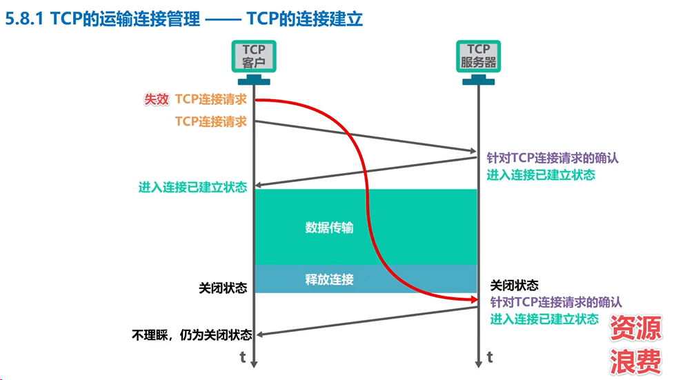

### ==5.8.2 TCP的连接释放==

本节课我们介绍tcp连接释放，tcp通过四报文挥手来释放连接。

我们来举例说明，数据传输结束后，tcp通信双方都可以释放连接，现在tcp客户进程和tcp服务器进程都处于连接已建立状态。假设是用tcp客户进程的应用进程通知其主动关闭tcp连接，tcp客户进程会发送**tcp连接释放报文段**，并进入终止等待一状态。该报文段首部中的终止位f i n和确认为a c k的值都被设置为一，表明这是一个tcp连接释放报文段。同时也对之前收到的报文段进行确认，序号seq字段的值设置为u，它等于tcp客户进程之前已传送过的数据的，最后一个字节的序号加一。请注意tcp规定终止位fn等于1的报文段即使不携带数据，也要消耗掉一个序号。确认号a c k字段的值设置为v，它等于tcp客户进程之前已收到的数据的，最后一个字节的序号加一。

tcp服务器进程收到tcp连接释放报文段后，会发送一个**普通的tcp确认报文段**，并进入关闭等待状态
该报文段首部中的确认为ack的值被设置为一，表明这是一个普通的tcp确认报文段。序号s e q字段的值设置为v，它等于tcp服务器进程之前以传送过的数据的最后一个字节的序号加一，这也与之前收到的tcp连接释放报文段中的确认号匹配。确认号ack字段的值设置为u加一，这是对tcp连接释放报文段的确认。

tcp服务器进程这时应通知高层应用进程，tcp客户进程要断开与自己的tcp连接，此时从tcp客户进程到tcp服务器进程，这个方向的连接就释放了，这时的tcp连接属于半关闭状态。

也就是tcp客户进程已经没有数据要发送了，但tcp服务器进程如果还有数据要发送，tcp客户进程仍要接收。也就是说，从tcp服务器进程到tcp客户进程，这个方向的连接并未关闭，这个状态可能会持续一段时间。

tcp客户进程收到tcp确认报文段后，就进入终止等待2状态。等待tcp服务器进程发出的tcp连接释放报文段，若使用tcp服务器进程的应用进程已经没有数据要发送了，应进程就通知其tcp服务器进程释放连接。

由于tcp连接释放，是由tcp客户进程主动发起的，因此tcp服务器进程对tcp连接的释放称为被动关闭连接。tcp服务器进程发送**tcp连接释放报文段**，并进入最后确认状态，该报文段首部中的终止位fin和确认为a c k的值都被设置为一，表明这是一个tcp连接释放报文段，同时也对之前收到的报文段进行确认，现在假定序号seq字段的值为w，这是因为在半关闭状态下，tcp服务器进程可能又发送了一些数据，确认好a c k字段的值为u加一，，这是对之前收到的tcp连接释放报文段的重复确认。

tcp客户进程收到**tcp连接释放报文段**后，必须针对该报文段发送普通的tcp确认报文段，之后进入时间等待状态，该报文段首部中的确认位ack的值被设置为一，表明这是一个普通的tcp确认报文段，序号s e q字段的值设置为u加一，这是因为tcp客户进程之前发送的tcp连接释放报文段，虽然不携带数据，但要消耗掉一个序号，确认号ack字段的值设置为w加一，这是对所收到的tcp连接释放报文段的确认。

tcp服务器进程收到该报文段后，就要进入关闭状态，而tcp客户进程还要经过两倍的msl后才能进入关闭状态，msl的意思是最长报文段寿命，rfc 793文档建议为两分钟，也就是说tcp客户进程进入时间等待状态后还要经过四分钟才能进入关闭状态，这完全是从工程上来考虑的，对于现在的网络，msl取为两分钟可能太长了，因此tcp允许不同的实现，可根据具体情况使用更小的msl值。

那么tcp客户进程，在发送完最后一个确认报文段后，为什么不直接进入关闭状态，而是要进入时间等待状态两倍msl号才进入关闭状态，这是否有必要呢，来看这种情况。

tcp服务器进程发送tcp连接释放报文段后，进入最后确认状态，tcp客户进程收到该报文段后，发送普通的tcp确认报文段，并进入关闭状态，而不是时间等待状态，然而该tcp确认报文段丢失了，这必然会造成tcp服务器进程对之前所发送的tcp连接释放报文段的超时重传，并仍处于最后确认状态，重传的tcp连接释放报文段，到达tcp客户进程，由于tcp客户进程属于关闭状态，因此不理睬该报文段，这必然会造成tcp服务器进程反复重传tcp连接释放报文段，并一直处于最后确认状态，而无法进入关闭状态。因此时间等待状态，以及处于该状态两倍msl的时长，可以确保tcp服务器进程可以收到最后一个tcp确认报文段而进入关闭状态。另外tcp客户进程，在发送完最后一个tcp确认报文段后，再经过两倍msl时长，就可以使本次连接持续时间内所产生的所有报文段都从网络中消失，这样就可以使下一个新的tcp连接中，不会出现旧连接中的报文段。**以上就是tcp通过四报文挥手释放连接的过程。**

最后我们再来看看tcp中饱和计时器的作用，设想这样一种情况。tcp双方已经建立了连接，后来tcp客户进程所在的主机突然出现了故障，显然tcp服务器进程以后就不能再收到tcp客户进程发来的数据，因此应当有措施，使tcp服务器进程不要再白白等待下去，换句话说，tcp服务器进程应该如何发现这种情况呢，方法就是使用饱和计时器。

tcp服务器进程，每收到一次tcp客户进程的数据，就重新设置并启动饱和计时器，若饱和计时器定时周期内未收到tcp客户进程发来的数据，则当保和计时器到时后，tcp服务器进程就像tcp客户进程发送一个探测报文段以后，每隔75秒钟发送一次，若一连发送十个探测报文段后，仍无tcp客户进程的响应。tcp服务器进程，就认为tcp客户进程所在主机出了故障，接着就要关闭这个链接。

## 5.9 TCP报文段的首部格式

我们来举例说明源端口和目的端口的作用，假设主机中的浏览器进程要访问web服务器中的web服务器进程，为了简单起见，我们仅从运输层端口号这个角度来举例说明，而不考虑其他细节，例如arp域名解析，tcp连接建立等。

当在浏览器地址栏中输入了web服务器的域名后，浏览器进程会构建一个封装有http请求报文的tcp报文段，该报文段首部中的原端口字段会填写一个短暂端口号，例如49152，用来标识发送该报文段的浏览器进程，目的端口字段会填写**熟知端口号80**，因为使用http协议的web服务器进程默认监听该端口。web服务器收到该tcp报文段后，从中解封出http请求报文，并根据tcp报文段首部中目的端口字段的值80，将http请求报文上交给web服务器进程，web服务器进程根据http请求报文的内容进行相应处理，并构建一个http响应报文，http响应报文需要封装成tcp报文段进行发送，该报文段首部中的原端口字段会填写熟知端口号80，用来标识发送该tcp报文段的web服务器进程，而目的端口字段会填写49152，这是主机中需要接收该tcp报文段的浏览器进程所对应的端口号。主机收到该tcp报文段后，从中解封出http响应报文，并根据tcp报文段首部中目的端口字段的值49152，将http响应报文上交给浏览器进程，浏览器进程对http响应报文的内容进行解析并显示。

接下来我们再来看看与tcp实现可靠传输相关的序号字段、确认号字段以及确认标志位。

序号字段占32比特，因此取值范围是0~2的32次减一，当序号增加到最后一个后，下一个序号就又回到零。序号字段的值用来指出本tcp报文段数据载荷的第一个字节的序号，例如这是一个tcp报文段，它有首部数据载荷两部分构成，数据载荷中的每个字节数据都有序号，如图所示，请注意它们是字节数据的序号，而不是内容。对于本例首部中序号字段应填入的**十进制值为166**，用来指出数据载荷的第一个字节的序号为166。

窗口字段,该字段占16比特,以字节为单位,该字段指出的是发送本报文段的一方的接收窗口,窗口值作为接收方,让发送方设置其发送窗口的依据，这是以接收方的接收能力来控制发送方的发送能力，也就是所谓的流量控制。需要注意的是，发送窗口的大小**还取决于拥塞窗口的大小**，也就是应该从接收窗口和拥塞窗口中取小者。

 

接下来我们来看同步标志为syn，该标志位在tcp连接建立时用来同步序号。如图所示，这是我们之前课程中曾介绍过的，tcp通过三报文握手建立连接的过程，tcp客户进程发送的tcp连接请求，报文段首部中的同步标志位s yn被置1，表明这是一个tcp连接请求报文段，tcp服务器进程发送的tcp连接请求，确认报文段首部中的同，步标志为s y n被制一确认为a c k也被置1，表明这是一个tcp连接请求确认报文段。

 

接收方收到紧急标志为1的报文段，会按照紧急指针字段的值从报文段数据载荷部分取出紧急数据
并直接上交应用进程，而不必在接收缓存中排队。

# 第六章 应用层

## 6.1 应用层概述

例如我们在浏览器的地址栏中输入某个网站的域名号，就可以访问该网站的内容，这就是推动英特网飞速发展的万维网应用，其相关的应用层协议为超文本传送协议HTTP。

用户在浏览器地址栏中输入的是域名，而tcp ip体系的网际层是由ip地址来标识目的主机，从域名到ip地址的转换工作，由属于应用层范畴的域名系统dns，在后台帮用户自动完成，以方便用户的使用。

除了万维网应用和域名系统外，常见的应用还有动态主机配置，电子邮件文件传送，和p two p文件共享，多媒体网络应用等，我们将在本章的后续课程中，分别介绍这些网络应用的相关协议和基本工作原理

## 6.2 客户--服务器方式（C/S）和对等方式（P2P）

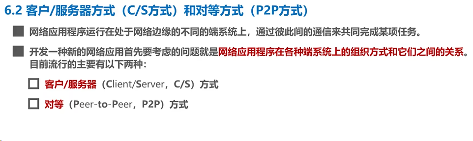

## 6.3 动态主机配置协议DHCP

接下来我们举例说明dhcp的工作过程，假设网络中有两台dhcp服务器和多台用户主机，为了简单而有效地描述dhcp的工作过程，我们画出网络中的这两台dhcp服务器和一台用户主机，d h c p使用客户服务器方式在d h c p服务器上运行，d h c p服务器进程也可简称为dh cp服务器，在用户主机上运行d h c p客户进程也可简称为d h c p客户。

d h c p是tcp ip协议体系应用程中的协议，它使用运输层的udp所提供的服务，也就是说dh cp报文在运输层会被封装成为udp用户数据报，d h c p服务器使用的udp端口是67，dh cp客户使用的udp端口是68，这两个udp端口都是熟知端口封装有dh cp报文的udp用户数据报，在网络层会被封装成ip数据报
然后再根据所使用的网络接口封装成相应的数据链路层的帧进行发送，例如封装成以太网帧。为了简单起见，在后续描述过程中，除非有特别需要，否则我们将不再每次描述d h c p报文逐层封装的过程。

下面我们来看看dh cp客户与dh cp服务器的交互过程

## 6.4 域名系统DNS

我们首先来举例说明域名系统的作用，当我们在浏览器地址栏中输入某个web服务器的域名时，用户主机会首先在自己的dns高速缓存中查找该域名所对应的ip地址。如果没有找到，则会向网络中的某台dns服务器查询，dns服务器中有域名和ip地址映射关系的数据库，当dns服务器收到dns查询报文号，在其数据库中进行查询之后，将查询结果发送给用户主机，现在用户主机中的浏览器可以通过web服务器的ip地址对其进行访问了。

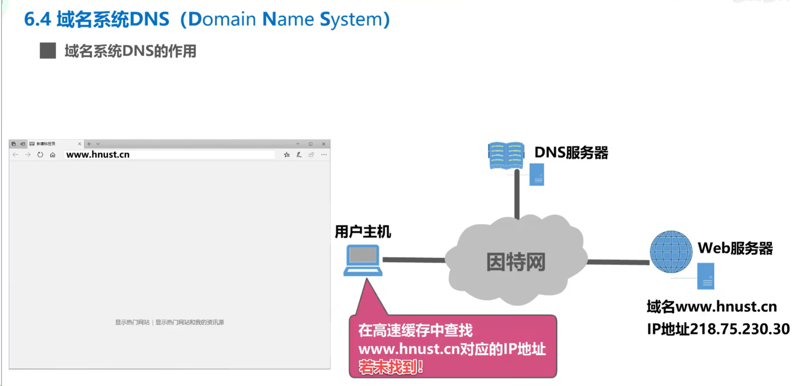

如图，这是我校网络信息中心的域名，cn是顶级域名，表示中国；edu是在其下注册的二级域名，标配是教育机构；hnust表示湖南科技大学；nsa是由我校自行管理的四级域名，表示网络信息中心。

## 6.5 文件传送协议FTP

## 6.6 电子邮件

 

## 6.7 万维网WWW

接下来我们举例说明万维网应用，我们在用户主机中使用浏览器来访问湖南科技大学的万维网服务器，也就是访问湖南科技大学的官方网站，我们在浏览器的地址栏中输入湖南科技大学官方网站的域名，并按下回车键后，浏览器将发送请求报文给服务器，服务器收到请求报文后执行相应操作，然后给浏览器发回响应报文，浏览器解析并渲染响应报文中的内容，这样我们就可以看到网站首页了。

由html css javascript编写的万维网文档，由浏览器内核负责解释和渲染。

tcp ip体系应用层中的一个非常重要的协议，即超文本传输协议http，http定义了浏览器及万维网客户进程怎样向万维网服务器请求万维网文档，以及万维网服务器怎样把万维网文档传送给浏览器。

我们来举例说明，我们使用用户主机来访问湖南科技大学的万维网服务器，可以看成是用户主机中的浏览器进程及客户进程，与服务器中的服务器进程，基于英特网的通信。浏览器进程首先发起与服务器进程的tcp连接，使用熟知端口号80，基于这条已建立好的tcp连接，浏览器进程向服务器进程发送http请求报文。服务器进程收到后执行相应操作，然后给浏览器进程发回http响应报文

一般来说，浏览器并不会直接显示出服务器发来的这些状态行信息，而是以更友好的形式向用户告知服务器所返回的状态信息，例如当我们访问某些网站时，浏览器可能会显示类似该图所示的提示信息，其背后的本质是浏览器收到了包含这条状态行的响应报文。

# ---相关知识---

